## TAM 분석: '하루 동선 맞춤 동네 궁합 진단기'

이 서비스는 단독 카테고리로 집계된 시장은 존재하지 않습니다. 따라서 TAM은 **상위 시장(프롭테크) → 관련 세부 시장(라이프스타일 기반 부동산 추천/하이퍼로컬) → 교육·컨설팅 시장**의 3단계로 추정해야 합니다.

---

### 1. 글로벌 프롭테크 TAM (상위 시장)

글로벌 프롭테크 시장은 2025년 약 **470억 달러(약 65조 원)** 규모이며, 2035년까지 약 2,090억 달러로 성장할 것으로 전망됩니다 — CAGR 약 16%. [Precedence Research](https://www.precedenceresearch.com/proptech-market)

아시아태평양 지역이 2024년 기준 글로벌 시장의 45% 점유율을 차지하며, 중국이 CAGR 19.8%, 인도 18.2%로 가장 빠른 성장세를 보이고 있습니다. [Future Market Insights](https://www.futuremarketinsights.com/reports/proptech-market)

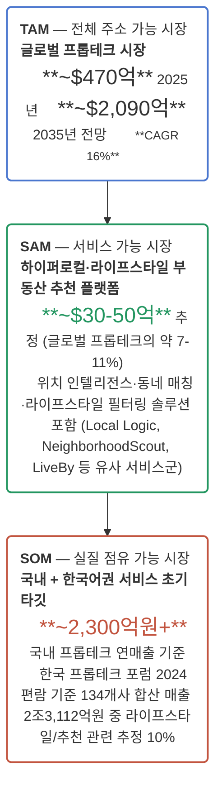
```mermaid
flowchart TD
    %% 기본 텍스트 정렬 설정
    classDef default text-align:left;
    
    TAM("`**TAM** — 전체 주소 가능 시장
    **글로벌 프롭테크 시장**
    
    <span style='font-size:1.5em; color:#4A76CE;'>**~$470억**</span> 2025년 &nbsp;&nbsp;&nbsp; <span style='font-size:1.5em; color:#4A76CE;'>**~$2,090억**</span> 2035년 전망 &nbsp;&nbsp;&nbsp; <span style='background:#EAF0FB; color:#1C52A2; padding:3px 10px; border-radius:12px; font-size:0.85em;'>**CAGR 16%**</span>`")
    
    SAM("`**SAM** — 서비스 가능 시장
    **하이퍼로컬·라이프스타일 부동산 추천 플랫폼**
    
    <span style='font-size:1.5em; color:#239660;'>**~$30-50억**</span> 추정 (글로벌 프롭테크의 약 7-11%)
    <span style='color:#555; font-size:0.9em;'>위치 인텔리전스·동네 매칭·라이프스타일 필터링 솔루션 포함 (Local Logic, NeighborhoodScout, LiveBy 등 유사 서비스군)</span>`")
    
    SOM("`**SOM** — 실질 점유 가능 시장
    **국내 + 한국어권 서비스 초기 타깃**
    
    <span style='font-size:1.5em; color:#C2543F;'>**~2,300억원+**</span> 국내 프롭테크 연매출 기준
    <span style='color:#555; font-size:0.9em;'>한국 프롭테크 포럼 2024 편람 기준 134개사 합산 매출 2조3,112억원 중 라이프스타일/추천 관련 추정 10%</span>`")

    %% 화살표 연결
    TAM --> SAM
    SAM --> SOM

    %% 각 블록의 테두리 및 배경 스타일 (좌측 컬러 바 느낌을 테두리 색상으로 대체)
    style TAM fill:#ffffff,stroke:#4A76CE,stroke-width:2px
    style SAM fill:#ffffff,stroke:#239660,stroke-width:2px
    style SOM fill:#ffffff,stroke:#C2543F,stroke-width:2px
```

### 2. 국내 프롭테크 시장 현황

한국프롭테크포럼이 발간한 2024 편람에 따르면, 국내 프롭테크 기업들의 2023년 총 매출은 전년 대비 9.1% 증가한 **약 2조 3,112억 원**(134개사 기준)으로 3년 연속 성장을 기록했습니다. [ET News](https://www.etnews.com/20240911000292) 국내에는 약 368개의 프롭테크 기업이 있으며, 주요 성공 사례로는 직방의 AI 빅데이터 솔루션 '직방RED'가 있습니다. [Goover](https://seo.goover.ai/report/202408/go-public-report-ko-c37ffe86-70fe-4a4b-8a23-8192f0b131bf-0-0.html)

---

### 3. 스타트업·소상공인 대상 교육·컨설팅 시장

이 부분은 두 개의 시장이 교차합니다.

**① 글로벌 비즈니스 컨설팅** 글로벌 비즈니스 컨설팅 시장은 2025년 약 **3,140억 달러** 규모이며, 2034년까지 약 4,500억 달러로 성장할 것으로 예상됩니다 (CAGR 약 4.7%). [Business Research Insights](https://www.businessresearchinsights.com/ko/market-reports/business-consulting-market-120200) 다만 이 시장에서 소상공인·스타트업 초기 창업 대상 비중은 상대적으로 작습니다.

**② 국내 에듀테크 시장** 마크앤텔 어드바이저에 따르면, 한국 에듀테크 시장 규모는 약 **62억 달러(한화 약 8조 6,000억 원)** 규모이며, 연평균 성장률 약 9%로 2030년에는 약 13조 5,200억 원까지 성장할 것으로 전망됩니다. [M-i](https://www.m-i.kr/news/articleView.html?idxno=1254761)

**③ 한국 전략 컨설팅** 한국 전략 컨설팅 시장 규모는 2035년까지 **약 13.5억 달러(약 2조 원)**에 도달할 것으로 예상되며, 2025~2035년 CAGR 약 5.88%로 성장이 전망됩니다. [Spherical Insights](https://www.sphericalinsights.com/ko/reports/south-korea-strategy-consulting-market)

### **4. 투자자에게 제시할 시장 규모 스토리라인 (요약)**

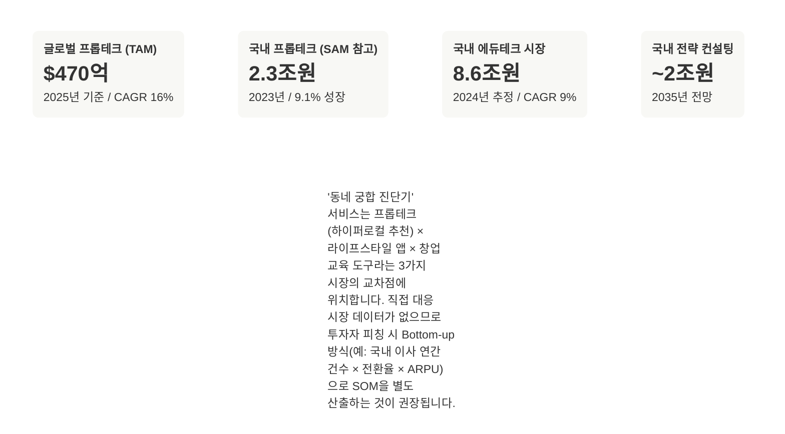
```mermaid
flowchart TD
    %% 스타일 정의
    classDef card fill:#F8F8F5,stroke:none,rx:8,ry:8,text-align:left,color:#333
    classDef desc fill:none,stroke:none,text-align:left

    %% 상단 4개 시장 데이터 카드
    subgraph Cards [" "]
        direction LR
        A("`**글로벌 프롭테크 (TAM)**
        <span style='font-size:1.8em; color:#111;'>**$470억**</span>
        <span style='color:#555; font-size:0.9em;'>2025년 기준 / CAGR 16%</span>`"):::card

        B("`**국내 프롭테크 (SAM 참고)**
        <span style='font-size:1.8em; color:#111;'>**2.3조원**</span>
        <span style='color:#555; font-size:0.9em;'>2023년 / 9.1% 성장</span>`"):::card

        C("`**국내 에듀테크 시장**
        <span style='font-size:1.8em; color:#111;'>**8.6조원**</span>
        <span style='color:#555; font-size:0.9em;'>2024년 추정 / CAGR 9%</span>`"):::card

        D("`**국내 전략 컨설팅**
        <span style='font-size:1.8em; color:#111;'>**~2조원**</span>
        <span style='color:#555; font-size:0.9em;'>2035년 전망</span>`"):::card

        A ~~~ B ~~~ C ~~~ D
    end

    %% 하단 설명 텍스트 (좌측 회색 테두리 효과 포함)
    E("`<div style='border-left: 4px solid #D9D9D9; padding-left: 15px; color: #444; line-height: 1.6; word-break: keep-all;'>'동네 궁합 진단기' 서비스는 프롭테크(하이퍼로컬 추천) × 라이프스타일 앱 × 창업 교육 도구라는 3가지 시장의 교차점에 위치합니다. 직접 대응 시장 데이터가 없으므로 투자자 피칭 시 Bottom-up 방식(예: 국내 이사 연간 건수 × 전환율 × ARPU)으로 SOM을 별도 산출하는 것이 권장됩니다.</div>`"):::desc

    %% 레이아웃 연결
    Cards ~~~ E

    %% 서브그래프 테두리 제거
    style Cards fill:none,stroke:none
```

### 5. 핵심 해석 및 주의사항

**이 서비스의 시장 포지셔닝 특수성**: '하루 동선 맞춤 동네 궁합 진단기'는 기존 어떤 리서치 보고서에도 독립 카테고리로 잡히지 않는 틈새 카테고리입니다. 이는 장점(경쟁자 희박)이자 단점(시장 검증 어려움)입니다.

**스타트업·소상공인 교육 컨설팅 특이점**: 한국은 중소벤처기업부·창업진흥원이 연간 수천억 원 규모의 창업 교육 예산을 운용하고 있어, **B2G(정부 납품형) 교육 도구**로 포지셔닝하면 별도의 공공 조달 시장이 열립니다. 이 루트는 일반 B2C 시장보다 초기 수익화에 유리할 수 있습니다.

**Bottom-up TAM 추정 권고**: 글로벌·국내 숫자는 모두 상위 시장 데이터입니다. 투자자나 과제 심사용이라면 "국내 연간 이사 가구 수 약 800만 건 × 주거지 탐색 전환율 5% × 월 구독료 3,000원" 같은 Bottom-up 계산식을 함께 제시하는 것이 훨씬 설득력 있습니다.

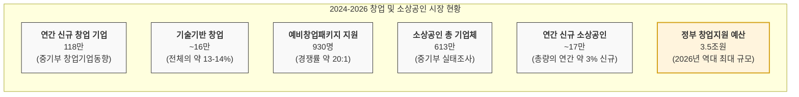
```mermaid
graph TD
    subgraph Market_Stats [2024-2026 창업 및 소상공인 시장 현황]
        direction TB
        A["<b>연간 신규 창업 기업</b><br/>118만<br/>(중기부 창업기업동향)"]
        B["<b>기술기반 창업</b><br/>~16만<br/>(전체의 약 13-14%)"]
        C["<b>예비창업패키지 지원</b><br/>930명<br/>(경쟁률 약 20:1)"]
        D["<b>소상공인 총 기업체</b><br/>613만<br/>(중기부 실태조사)"]
        E["<b>연간 신규 소상공인</b><br/>~17만<br/>(총량의 연간 약 3% 신규)"]
        F["<b>정부 창업지원 예산</b><br/>3.5조원<br/>(2026년 역대 최대 규모)"]
    end

    style A fill:#f9f9f9,stroke:#333,stroke-width:1px
    style B fill:#f9f9f9,stroke:#333,stroke-width:1px
    style C fill:#f9f9f9,stroke:#333,stroke-width:1px
    style D fill:#f9f9f9,stroke:#333,stroke-width:1px
    style E fill:#f9f9f9,stroke:#333,stroke-width:1px
    style F fill:#fff4dd,stroke:#d4a017,stroke-width:2px
```

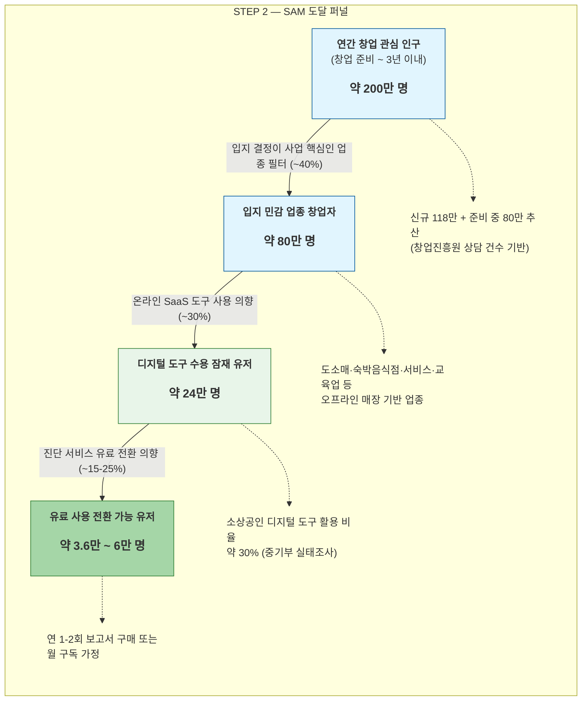
```mermaid
flowchart TD
    subgraph Step2 [STEP 2 — SAM 도달 퍼널]
        direction TB
        
        P1["<b>연간 창업 관심 인구</b><br/>(창업 준비 ~ 3년 이내)<br/><h3>약 200만 명</h3>"]
        P1 -- "입지 결정이 사업 핵심인 업종 필터 (~40%)" --> P2
        
        P2["<b>입지 민감 업종 창업자</b><br/><h3>약 80만 명</h3>"]
        P2 -- "온라인 SaaS 도구 사용 의향 (~30%)" --> P3
        
        P3["<b>디지털 도구 수용 잠재 유저</b><br/><h3>약 24만 명</h3>"]
        P3 -- "진단 서비스 유료 전환 의향 (~15-25%)" --> P4
        
        P4["<b>유료 사용 전환 가능 유저</b><br/><h3>약 3.6만 ~ 6만 명</h3>"]

        %% 비고/근거 섹션
        Note1["신규 118만 + 준비 중 80만 추산<br/>(창업진흥원 상담 건수 기반)"]
        Note2["도소매·숙박음식점·서비스·교육업 등<br/>오프라인 매장 기반 업종"]
        Note3["소상공인 디지털 도구 활용 비율<br/>약 30% (중기부 실태조사)"]
        Note4["연 1-2회 보고서 구매 또는<br/>월 구독 가정"]

        P1 -.-> Note1
        P2 -.-> Note2
        P3 -.-> Note3
        P4 -.-> Note4
    end

    style P1 fill:#e1f5fe,stroke:#01579b
    style P2 fill:#e1f5fe,stroke:#01579b
    style P3 fill:#e8f5e9,stroke:#2e7d32
    style P4 fill:#a5d6a7,stroke:#2e7d32
    style Note1 fill:none,stroke:none,text-align:left
    style Note2 fill:none,stroke:none,text-align:left
    style Note3 fill:none,stroke:none,text-align:left
    style Note4 fill:none,stroke:none,text-align:left
```

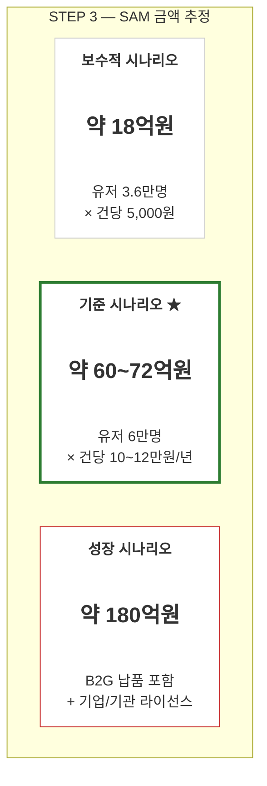
```mermaid
graph LR
    subgraph Step3 [STEP 3 — SAM 금액 추정]
        direction LR
        
        S1["<b>보수적 시나리오</b><br/><br/><h2>약 18억원</h2><br/>유저 3.6만명<br/>× 건당 5,000원"]
        
        S2["<b>기준 시나리오 ★</b><br/><br/><h2>약 60~72억원</h2><br/>유저 6만명<br/>× 건당 10~12만원/년"]
        
        S3["<b>성장 시나리오</b><br/><br/><h2>약 180억원</h2><br/>B2G 납품 포함<br/>+ 기업/기관 라이선스"]
    end

    style S1 fill:#fff,stroke:#ccc
    style S2 fill:#fff,stroke:#2e7d32,stroke-width:3px
    style S3 fill:#fff,stroke:#c62828
```

```mermaid
SAM 요약 (Summary)
현실적 SAM 규모: 연간 60~180억 원 수준

비즈니스 구조: * 하단(Bottom): 순수 B2C 모델로 시작 시

상단(Top): B2G(창업진흥원, 지자체 센터 등) 납품 루트 포함 시
```

## 결론 및 해석

### SAM 직접 데이터 존재 여부

'하루 동선 맞춤 동네 궁합 SaaS 진단' 카테고리에 해당하는 SAM 공식 통계는 존재하지 않습니다. 따라서 공식 통계를 입력값 삼아 Bottom-up으로 추정했습니다.

### 모집단 입력값 요약

2024년 연간 신규 창업 기업 수는 **약 118만 2,905개**로, 전년 대비 4.5% 감소했습니다. [KDI 경제교육·정보센터](https://eiec.kdi.re.kr/policy/materialView.do?num=263926)

예비창업패키지 선정 인원 기준으로는 2024년 **930명 내외**, 2023년 **992명 내외**이며, 경쟁률을 감안하면 실제 지원자 수는 약 2만 명 규모입니다. [Namu Wiki](https://namu.wiki/w/%EC%98%88%EB%B9%84%EC%B0%BD%EC%97%85%ED%8C%A8%ED%82%A4%EC%A7%80)

2024년 기준 소상공인 기업체 수는 **613만 4,000개**로 전년(596만 1,000개) 대비 2.9% 증가했습니다. 디지털·스마트 기술을 활용하는 소상공인은 10곳 중 약 3곳으로 조사됐습니다. [Sisa Journal](https://www.sisajournal.com/news/articleView.html?idxno=365675)

2026년 정부 창업지원 예산은 **3조 4,645억 원**으로 역대 최대 규모이며, 예비→초기→도약→초격차의 단계별 패키지 체계로 정교화되어 있습니다. [Venturesquare](https://www.venturesquare.net/1021015/)

### 추정의 핵심 전제와 한계

퍼널에서 가장 불확실한 변수는 두 가지입니다. 첫째, '입지 민감 업종 창업자 비율 40%'는 중기부 소상공인 업종 구성(도소매 34% + 숙박음식점 13% 등)에서 역산한 보수적 추정이고, 둘째, '유료 전환율 15~25%'는 국내 SaaS 업계 평균 freemium 전환율(약 2~5%)보다 높게 설정한 낙관적 값입니다. 실제 초기 전환율은 5~10% 수준에서 시작할 가능성이 더 높기 때문에, 현실적인 초기 SOM은 **연간 10~30억 원** 수준이 더 보수적인 시작점입니다.

B2G 경로(창업진흥원, 지자체 창업지원센터, 소상공인진흥공단 연계)를 초기부터 개척하면 SAM 자체를 상향할 수 있고, 단가 협상력도 B2C보다 유리합니다.

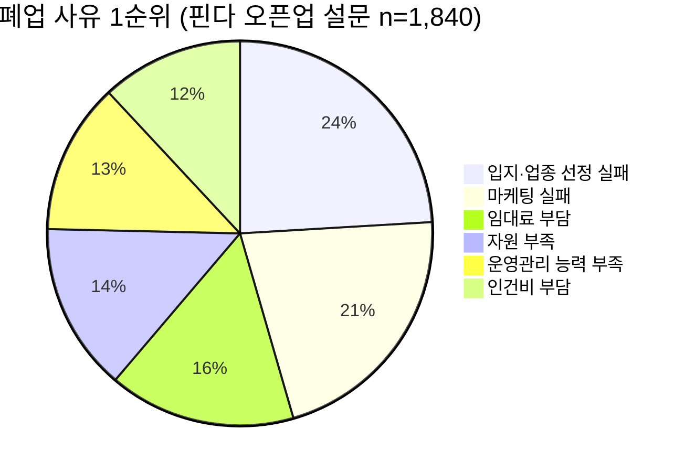
```mermaid
pie title 폐업 사유 1순위 (핀다 오픈업 설문 n=1,840)
    "입지·업종 선정 실패" : 25.0
    "마케팅 실패" : 22.3
    "임대료 부담" : 16.3
    "자원 부족" : 14.7
    "운영관리 능력 부족" : 13.2
    "인건비 부담" : 12.4
```

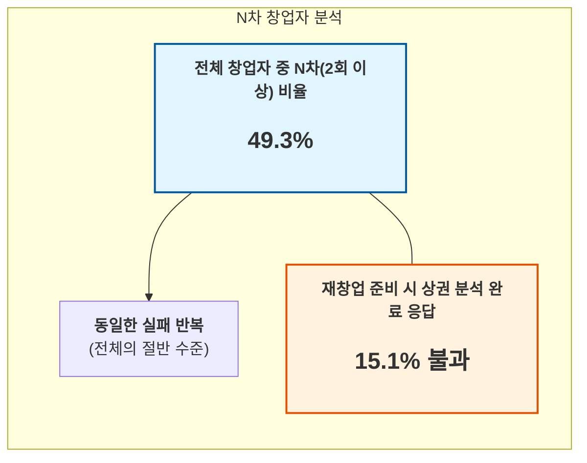
```mermaid
graph TD
    subgraph Serial_Entrepreneur [N차 창업자 분석]
        direction TB
        A["<b>전체 창업자 중 N차(2회 이상) 비율</b><br/><h2>49.3%</h2>"]
        A --> B["<b>동일한 실패 반복</b><br/>(전체의 절반 수준)"]
        
        A --- C["<b>재창업 준비 시 상권 분석 완료 응답</b><br/><h2>15.1% 불과</h2>"]
    end

    style A fill:#e1f5fe,stroke:#01579b,stroke-width:2px
    style C fill:#fff3e0,stroke:#e65100,stroke-width:2px
```

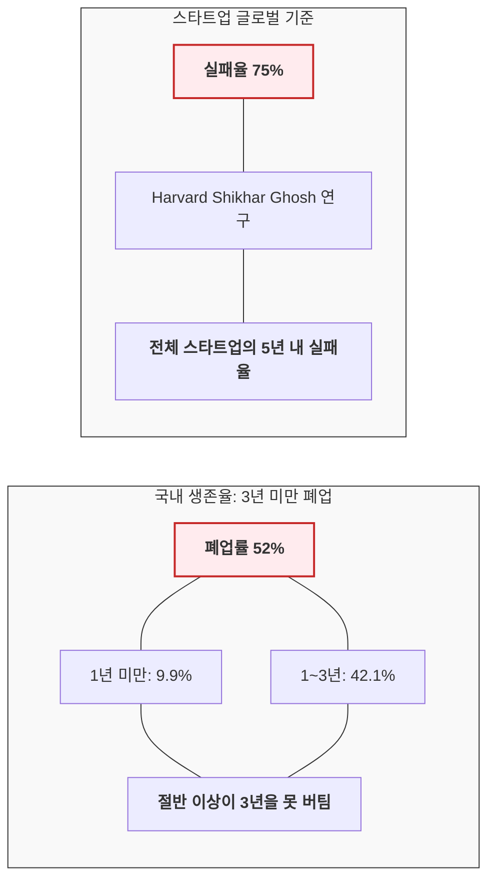
```mermaid
flowchart LR
    subgraph Domestic [국내 생존율: 3년 미만 폐업]
        direction TB
        D1["<b>폐업률 52%</b>"]
        D2["1년 미만: 9.9%"]
        D3["1~3년: 42.1%"]
        D4["<b>절반 이상이 3년을 못 버팀</b>"]
        
        D1 --- D2 & D3 --- D4
    end

    subgraph Global [스타트업 글로벌 기준]
        direction TB
        G1["<b>실패율 75%</b>"]
        G2["Harvard Shikhar Ghosh 연구"]
        G3["<b>전체 스타트업의 5년 내 실패율</b>"]
        
        G1 --- G2 --- G3
    end

    style D1 fill:#ffebee,stroke:#c62828,stroke-width:2px
    style G1 fill:#ffebee,stroke:#c62828,stroke-width:2px
    style Domestic fill:#f9f9f9,stroke:#333
    style Global fill:#f9f9f9,stroke:#333
```

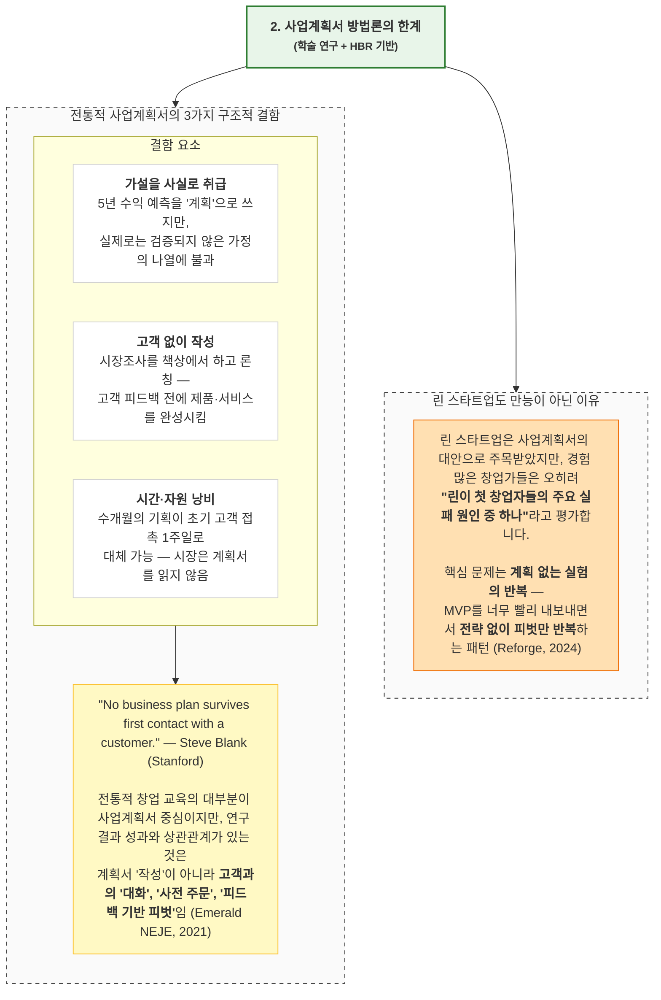
```mermaid
flowchart TD
    %% Global Style
    classDef title fill:#e8f5e9,stroke:#2e7d32,stroke-width:2px,font-weight:bold;
    classDef subTitle fill:#f5f5f5,stroke:#616161,stroke-width:1px,font-weight:bold;
    classDef box fill:#ffffff,stroke:#d1d1d1,stroke-width:1px;
    classDef highlight fill:#fff9c4,stroke:#fbc02d,stroke-width:1px;
    classDef alert fill:#ffe0b2,stroke:#ef6c00,stroke-width:1px;

    %% Main Title
    Title["2. 사업계획서 방법론의 한계 <br/> <small>(학술 연구 + HBR 기반)</small>"]:::title

    %% Section 1
    subgraph Section1 ["전통적 사업계획서의 3가지 구조적 결함"]
        direction TB
        
        subgraph Defects ["결함 요소"]
            direction LR
            D1["<b>가설을 사실로 취급</b><br/>5년 수익 예측을 '계획'으로 쓰지만,<br/>실제로는 검증되지 않은 가정의 나열에 불과"]:::box
            D2["<b>고객 없이 작성</b><br/>시장조사를 책상에서 하고 론칭 —<br/>고객 피드백 전에 제품·서비스를 완성시킴"]:::box
            D3["<b>시간·자원 낭비</b><br/>수개월의 기획이 초기 고객 접촉 1주일로<br/>대체 가능 — 시장은 계획서를 읽지 않음"]:::box
        end

        Quote["&quot;No business plan survives first contact with a customer.&quot; — Steve Blank (Stanford)<br/><br/>전통적 창업 교육의 대부분이 사업계획서 중심이지만, 연구 결과 성과와 상관관계가 있는 것은<br/>계획서 '작성'이 아니라 <b>고객과의 '대화', '사전 주문', '피드백 기반 피벗'</b>임 (Emerald NEJE, 2021)"]:::highlight
        
        Defects --> Quote
    end

    %% Section 2
    subgraph Section2 ["린 스타트업도 만능이 아닌 이유"]
        LS["린 스타트업은 사업계획서의 대안으로 주목받았지만, 경험 많은 창업가들은 오히려<br/><b>&quot;린이 첫 창업자들의 주요 실패 원인 중 하나&quot;</b>라고 평가합니다.<br/><br/>핵심 문제는 <b>계획 없는 실험의 반복</b> —<br/>MVP를 너무 빨리 내보내면서 <b>전략 없이 피벗만 반복</b>하는 패턴 (Reforge, 2024)"]:::alert
    end

    %% Connections
    Title --> Section1
    Title --> Section2

    %% Adjusting layout
    style Section1 fill:#fafafa,stroke:#333,stroke-dasharray: 5 5
    style Section2 fill:#fafafa,stroke:#333,stroke-dasharray: 5 5
```

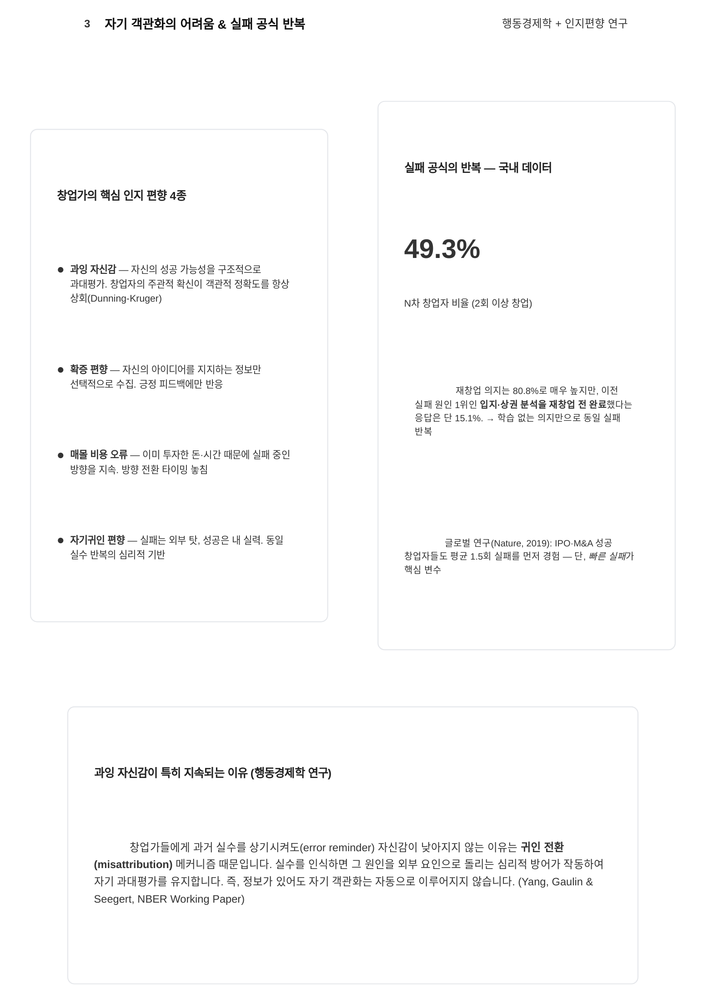
```mermaid
flowchart TD
    %% 스타일 정의
    classDef noBorder fill:none,stroke:none
    classDef outlineBox fill:#ffffff,stroke:#E5E7EB,stroke-width:1.5px,rx:10,ry:10,color:#333

    %% 헤더 영역
    Header("`<div style='display:flex; justify-content:space-between; width:820px; text-align:left; align-items:center; padding: 0 10px;'>
        <div style='display:flex; align-items:center;'>
            <span style='background-color:#FAECEB; color:#A63A36; width:28px; height:28px; border-radius:50%; display:inline-flex; align-items:center; justify-content:center; font-weight:bold; margin-right:12px;'>3</span>
            <strong style='font-size:1.15em; color:#111;'>자기 객관화의 어려움 & 실패 공식 반복</strong>
        </div>
        <div style='color:#555; font-size:0.9em; font-weight:500;'>행동경제학 + 인지편향 연구</div>
    </div>`"):::noBorder

    %% 중앙 2단 카드 영역
    subgraph TopRow [" "]
        direction LR
        
        %% 좌측 카드 (창업가의 핵심 인지 편향 4종)
        CardLeft("`<div style='padding:24px; width:365px; text-align:left;'>
            <div style='font-weight:bold; margin-bottom:16px; font-size:1.05em; color:#222;'>창업가의 핵심 인지 편향 4종</div>
            
            <div style='margin-bottom:12px; display:flex;'>
                <span style='color:#D44B47; font-size:1.2em; margin-right:8px; line-height:1;'>●</span>
                <div style='font-size:0.9em; color:#444; line-height:1.5; word-break:keep-all;'><strong>과잉 자신감</strong> — 자신의 성공 가능성을 구조적으로 과대평가. 창업자의 주관적 확신이 객관적 정확도를 항상 상회(Dunning-Kruger)</div>
            </div>
            
            <div style='margin-bottom:12px; display:flex;'>
                <span style='color:#D44B47; font-size:1.2em; margin-right:8px; line-height:1;'>●</span>
                <div style='font-size:0.9em; color:#444; line-height:1.5; word-break:keep-all;'><strong>확증 편향</strong> — 자신의 아이디어를 지지하는 정보만 선택적으로 수집. 긍정 피드백에만 반응</div>
            </div>
            
            <div style='margin-bottom:12px; display:flex;'>
                <span style='color:#B8860B; font-size:1.2em; margin-right:8px; line-height:1;'>●</span>
                <div style='font-size:0.9em; color:#444; line-height:1.5; word-break:keep-all;'><strong>매몰 비용 오류</strong> — 이미 투자한 돈·시간 때문에 실패 중인 방향을 지속. 방향 전환 타이밍 놓침</div>
            </div>
            
            <div style='display:flex;'>
                <span style='color:#B8860B; font-size:1.2em; margin-right:8px; line-height:1;'>●</span>
                <div style='font-size:0.9em; color:#444; line-height:1.5; word-break:keep-all;'><strong>자기귀인 편향</strong> — 실패는 외부 탓, 성공은 내 실력. 동일 실수 반복의 심리적 기반</div>
            </div>
        </div>`"):::outlineBox

        %% 우측 카드 (실패 공식의 반복)
        CardRight("`<div style='padding:24px; width:365px; text-align:left;'>
            <div style='font-weight:bold; margin-bottom:16px; font-size:1.05em; color:#222;'>실패 공식의 반복 — 국내 데이터</div>
            
            <div style='font-size:2.5em; color:#DD5A44; font-weight:bold; line-height:1; margin-bottom:4px;'>49.3%</div>
            <div style='font-size:0.9em; color:#555; margin-bottom:16px; font-weight:500;'>N차 창업자 비율 (2회 이상 창업)</div>
            
            <div style='background-color:#F5F6F3; padding:16px; border-radius:8px; margin-bottom:16px; font-size:0.85em; color:#333; line-height:1.6; word-break:keep-all;'>
                재창업 의지는 80.8%로 매우 높지만, 이전 실패 원인 1위인 <strong>입지·상권 분석을 재창업 전 완료</strong>했다는 응답은 단 15.1%. → 학습 없는 의지만으로 동일 실패 반복
            </div>
            
            <div style='font-size:0.85em; color:#666; line-height:1.5; word-break:keep-all;'>
                글로벌 연구(Nature, 2019): IPO·M&A 성공 창업자들도 평균 1.5회 실패를 먼저 경험 — 단, <em>빠른 실패</em>가 핵심 변수
            </div>
        </div>`"):::outlineBox

        CardLeft ~~~ CardRight
    end

    %% 하단 통합 카드 영역
    BottomCard("`<div style='padding:24px; width:772px; text-align:left;'>
        <div style='font-weight:bold; margin-bottom:12px; font-size:1.05em; color:#222;'>과잉 자신감이 특히 지속되는 이유 (행동경제학 연구)</div>
        <div style='color:#444; font-size:0.95em; line-height:1.6; word-break:keep-all;'>
            창업가들에게 과거 실수를 상기시켜도(error reminder) 자신감이 낮아지지 않는 이유는 <strong>귀인 전환(misattribution)</strong> 메커니즘 때문입니다. 실수를 인식하면 그 원인을 외부 요인으로 돌리는 심리적 방어가 작동하여 자기 과대평가를 유지합니다. 즉, 정보가 있어도 자기 객관화는 자동으로 이루어지지 않습니다. (Yang, Gaulin & Seegert, NBER Working Paper)
        </div>
    </div>`"):::outlineBox

    %% 전체 수직 흐름 연결
    Header ~~~ TopRow ~~~ BottomCard

    %% 서브그래프 테두리 숨김
    style TopRow fill:none,stroke:none
```

## 핵심 발견 요약

### 테마 ①: 실패 원인 통계

핀다 오픈업 사용자 1,840명 설문(2025년 5월) 결과, 폐업 사유 1위는 **입지·업종 선정 실패(25.0%)**였고, 마케팅 실패(22.3%), 임대료 부담(16.3%), 자원 부족(14.7%), 운영관리 능력 부족(13.2%) 순이었습니다. 또한 영업 기간이 3년을 넘지 못한 응답자가 절반 이상이었고, 응답자의 49.3%가 2회 이상 창업한 N차 창업자였습니다. [Ekn](https://m.ekn.kr/view.php?key=20250512023425726)

국내 창업기업 20개 실패 사례를 분석한 연구(디지털융복합연구, 2013)는 창업 실패 패턴을 '사업준비 부족형', '자원획득 실패형', '전략부재형', '마케팅 실패형' 4가지로 유형화했습니다. [Korea Citation Index](https://www.kci.go.kr/kciportal/ci/sereArticleSearch/ciSereArtiView.kci?sereArticleSearchBean.artiId=ART001773190)

### 테마 ②: 사업계획서 방법론의 한계

Harvard Business School 연구에 따르면 전체 스타트업의 **75%가 실패**하는데, 전통적 방법론은 사업계획서 작성 → 투자 유치 → 스텔스 개발 → 출시 순서를 따르면서 정작 고객 피드백을 거의 반영하지 않는 구조적 문제를 지닙니다. [Harvard Business Review](https://hbr.org/2013/05/why-the-lean-start-up-changes-everything)

120명의 창업자를 대상으로 한 학술 연구에서, 실제 성과와 상관관계가 있는 활동은 사업계획서 '작성' 자체가 아니라 고객 인터뷰, 사전 주문 수집, 피드백 기반 피벗이었습니다. [Emerald](https://www.emerald.com/neje/article/24/1/21/306232/The-road-to-entrepreneurial-success-business-plans)

린 스타트업에 대한 비판도 존재합니다. 경험 많은 창업가들 사이에서는 린 방법론이 오히려 "계획 없는 실험 반복"을 유도해 첫 창업자들이 전략 없이 피벗만 반복하게 만든다는 평가가 나옵니다. [Reforge](https://www.reforge.com/blog/lean-startup-methodology-problems)

### 테마 ③: 자기 객관화의 어려움 & 실패 공식 반복

창업 과정을 지배하는 핵심 행동 편향은 **과잉낙관주의**로, 이는 창업자가 아이디어의 매력은 과대평가하고 미래 도전은 과소평가하게 만듭니다. 심지어 성공적인 론칭 이후에도 과잉낙관주의는 사업의 결함을 인식하지 못하게 하고 적시에 방향 전환을 막습니다. [B.BIAS](https://bbiasblog.com/2021/04/09/failing-to-fail-behavioral-insights-behind-startup-failure/)

학술 연구에 따르면, 창업가들은 긍정적 결과는 내 능력 덕분으로, 부정적 결과는 외부 요인 탓으로 돌리는 '자기귀인 편향(self-serving bias)'을 구조적으로 보입니다. 이것이 동일한 실수를 반복하는 심리적 기반입니다. [Taylor & Francis Online](https://www.tandfonline.com/doi/full/10.1080/14783363.2022.2043739)

재창업을 고려하는 자영업자의 80.8%가 재창업 의지가 있다고 응답했지만, 이전 폐업의 1위 원인인 '최적의 상권 및 입지 선정'을 완료했다는 응답은 **15.1%에 불과**했습니다. 의지는 높지만 실질적 준비 없이 동일 패턴이 반복됩니다. [Mt](https://www.mt.co.kr/finance/2025/05/12/2025051209145068138)

---

이 세 가지 발견은 '동선 맞춤 동네 진단 서비스'의 **문제 정의(Problem Statement)** 로 직결됩니다. 즉, "창업가는 입지 실패가 1위인 걸 알면서도, 자기 객관화 도구 없이 감에 의존해 같은 실수를 반복한다"는 서사가 명확하게 성립합니다.

```mermaid
flowchart TD
    %% 스타일 정의
    classDef header fill:#f8fdf9,stroke:#2e7d32,stroke-width:2px,color:#333
    classDef stepBox fill:#fff,stroke:#ddd,stroke-width:1px,color:#333
    classDef blueBox fill:#f0f7ff,stroke:#2196f3,stroke-width:1px
    classDef tealBox fill:#f1fdfa,stroke:#00bfa5,stroke-width:1px
    classDef roseBox fill:#fff9f6,stroke:#ffab91,stroke-width:1px
    classDef analysisBox fill:#fff,stroke:#90caf9,stroke-width:2px
    classDef mechanism fill:#f5f5f5,stroke:#ccc,stroke-dasharray: 2 2

    %% 상단 헤더 섹션
    Title["<b>가설 검증 결과: 조건부 타당 — '시장 니즈는 실재하지만, 설계 방식이 성패를 가른다'</b><br/><br/><small>3단계 진단 컨설팅은 심리적 안정감·시간 효율화 수요에 근거 있게 대응할 수 있습니다.<br/>단, 단순 정보 제공을 넘어 행동 변화 유도 설계가 있어야 효과가 발생합니다.</small>"]:::header

    %% 중간 섹션: 3단계 실패 원인
    subgraph Steps ["가설 — 3단계 진단이 해결하는 실패 원인"]
        direction LR
        
        S1["<b>STEP 1: 관점의 부재</b><br/><small>시장 관점(고객·데이터) 훈련 부족</small><hr/>• 확증 편향 + 과잉낙관 (행동경제학)<br/>• 가설을 사실로 취급 (Steve Blank)<br/><br/><b>[진단 제공] 외부 시각의 데이터 거울</b>"]:::blueBox
        
        S2["<b>STEP 2: 실행의 부재</b><br/><small>구체적 실행 경로(언제, 어디서, 어떻게) 부재</small><hr/>• 폐업 사유 1위: 입지 선정 실패 (25%)<br/>• 매몰 비용 오류로 실패 지속 (타이밍 놓침)<br/><br/><b>[진단 제공] 데이터 기반 실행 로드맵</b>"]:::tealBox
        
        S3["<b>STEP 3: 창업가 진단의 부재</b><br/><small>강점·역량·성향 적합성 미점검</small><hr/>• 자기효능감/스트레스 내성 등 영향<br/>• 동종업 경험 10년 이상 생존율 우위<br/><br/><b>[진단 제공] 창업가-업종 적합도 매핑</b>"]:::roseBox
    end

    %% 하단 섹션: 시장 니즈 충족 분석
    subgraph Analysis ["시장 니즈 충족 분석 — '심리적 안정감' vs '시간 자원 효율화'"]
        direction LR
        
        A1["<b>① 심리적 안정감</b><hr/>• <b>수요 근거:</b> 자기효능감이 창업의지에 직결.<br/>외부 진단이 불확실성을 줄여 효능감 높임<br/>• 진단 과정 자체가 '탐구 경험'으로 작동<br/>• 전문가 설계 리스크 관리 = 심리적 안전판<br/><br/><b>핵심 메커니즘:</b> 진단 → 모호성 감소 →<br/>자기효능감 상승 → 심리적 안정 → 실행력 향상"]:::analysisBox

        A2["<b>② 시간·자원 효율화</b><hr/>• <b>수요 근거:</b> 전통 기획(수개월) vs 초기 접촉(1~2주).<br/>창업가는 '시간 > 돈' 인식 보편화<br/>• AI 진단 도구의 전략적 의사결정 지원<br/>• 자원 부족(14.7%) 해소를 위한 낭비 절감<br/><br/><b>핵심 메커니즘:</b> 30분 진단 → 잘못된 방향<br/>3개월 절약 = 자원 효율 극대화"]:::analysisBox
    end

    %% 전체 흐름 연결
    Title --> Steps
    Steps --> Analysis
```

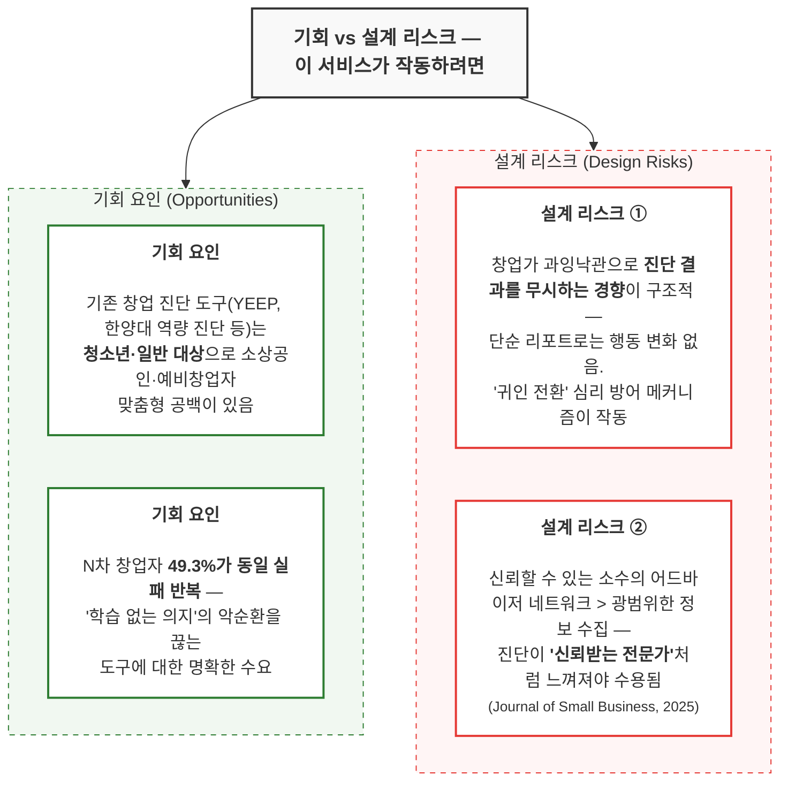
```mermaid
flowchart TD
    %% Global Style
    classDef title fill:#f9f9f9,stroke:#333,stroke-width:2px,font-weight:bold,font-size:18px;
    classDef oppBox fill:#ffffff,stroke:#2e7d32,stroke-width:2px;
    classDef riskBox fill:#ffffff,stroke:#e53935,stroke-width:2px;
    classDef oppLabel fill:#e8f5e9,stroke:#2e7d32,color:#2e7d32,font-weight:bold;
    classDef riskLabel fill:#ffeeb3,stroke:#e53935,color:#e53935,font-weight:bold;

    %% Title Section
    Title["기회 vs 설계 리스크 — 이 서비스가 작동하려면"]:::title

    %% Layout Grid
    subgraph Opportunities ["기회 요인 (Opportunities)"]
        direction LR
        O1["<b>기회 요인</b><br/><br/>기존 창업 진단 도구(YEEP, 한양대 역량 진단 등)는<br/><b>청소년·일반 대상</b>으로 소상공인·예비창업자<br/>맞춤형 공백이 있음"]:::oppBox
        O2["<b>기회 요인</b><br/><br/>N차 창업자 <b>49.3%가 동일 실패 반복</b> —<br/>'학습 없는 의지'의 악순환을 끊는<br/>도구에 대한 명확한 수요"]:::oppBox
    end

    subgraph Risks ["설계 리스크 (Design Risks)"]
        direction LR
        R1["<b>설계 리스크 ①</b><br/><br/>창업가 과잉낙관으로 <b>진단 결과를 무시하는 경향</b>이 구조적 —<br/>단순 리포트로는 행동 변화 없음.<br/>'귀인 전환' 심리 방어 메커니즘이 작동"]:::riskBox
        R2["<b>설계 리스크 ②</b><br/><br/>신뢰할 수 있는 소수의 어드바이저 네트워크 > 광범위한 정보 수집 —<br/>진단이 <b>'신뢰받는 전문가'</b>처럼 느껴져야 수용됨<br/><small>(Journal of Small Business, 2025)</small>"]:::riskBox
    end

    %% Connections
    Title --> Opportunities
    Title --> Risks

    %% Styling Subgraphs
    style Opportunities fill:#f1f8f1,stroke:#2e7d32,stroke-dasharray: 5 5
    style Risks fill:#fff5f5,stroke:#e53935,stroke-dasharray: 5 5
```

## 종합 판단

### 가설은 타당합니다 — 단, 조건이 있습니다

**시장 니즈의 실재성**: 수요는 분명히 존재합니다. 창업가의 스트레스 내성 연구에 따르면, 예비창업가의 심리적 안정은 사회적 호기심, 유희적 탐구, 경쟁추구성에 의해 형성되며, 이는 창업가들에게 적절한 스트레스 관리 프로그램 개발의 필요성을 시사합니다. [earticle](https://m.earticle.net/Article/A392888)

**자기효능감 경로**: 잠재 창업가의 자신감 즉 자기효능감으로 정의되는 주관적 환경인식이 창업의지에 유의한 영향을 미치며, 객관적 창업환경보다 주관적 환경인식이 창업의지에 더 큰 영향을 미칩니다. [ScienceON](https://scienceon.kisti.re.kr/srch/selectPORSrchArticle.do?cn=JAKO201329438852466&dbt=NART) 즉 진단 도구가 모호성을 줄여주면 자기효능감이 올라가고, 이것이 심리적 안정감으로 이어지는 경로가 연구로 입증돼 있습니다.

**AI 기반 의사결정 지원의 근거**: AI 기반 전략적 의사결정 연구에서, AI가 증강된 전략 생성과 평가를 통해 실험적으로 창업가들의 사업계획과 벤처캐피털 투자자들의 평가를 비교했을 때 유의미한 지원 효과가 확인됐습니다. [INFORMS](https://pubsonline.informs.org/doi/10.1287/stsc.2024.0190)

### 설계에서 반드시 극복해야 할 장벽

창업가의 의사결정 품질은 광범위한 정보 수집보다 신뢰할 수 있는 소수의 어드바이저 네트워크에 의존하는 경향이 있습니다. 이 창업가들은 정보의 폭보다 신뢰할 수 있는 관계에서 오는 신호의 명확성과 정밀성에 의존합니다. [Taylor & Francis Online](https://www.tandfonline.com/doi/full/10.1080/00472778.2025.2517212?autoplay=1)

이 연구가 이 서비스 설계에 주는 핵심 함의는 하나입니다. **진단 결과가 '정보 리포트'가 아닌 '신뢰받는 조언자의 목소리'처럼 전달되어야** 수용됩니다. 과잉낙관 편향이 있는 창업가는 단순 데이터를 자기 귀인으로 비틀어 무시할 수 있기 때문에, 진단의 언어 설계와 결과 전달 방식이 기술만큼 중요합니다.

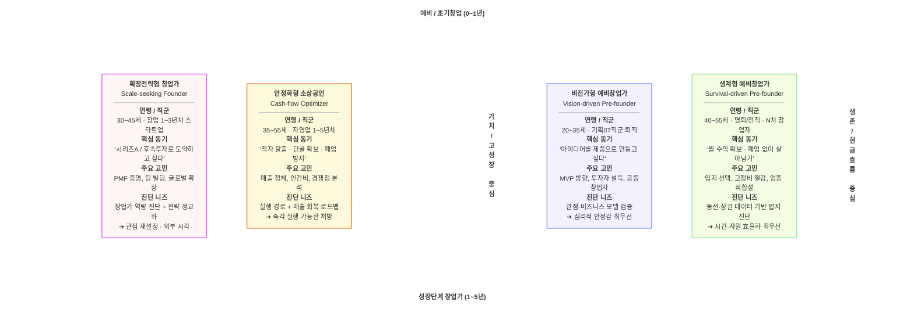
```mermaid
flowchart TD
    %% Global Styles
    classDef purple fill:#f3f0ff,stroke:#748ffc,stroke-width:2px;
    classDef green fill:#f4fce3,stroke:#8ce99a,stroke-width:2px;
    classDef pink fill:#fff5f5,stroke:#e056fd,stroke-width:2px;
    classDef orange fill:#fff9db,stroke:#e67e22,stroke-width:2px;
    classDef axis fill:none,stroke:none,font-weight:bold,font-size:16px;
    classDef transparent fill:none,stroke:none;

    %% --- 상단 축 라벨 ---
    TopLabel["<b>예비 / 초기창업 (0~1년)</b>"]:::axis

    %% --- 메인 매트릭스 영역 ---
    subgraph Matrix [" "]
        direction TB
        style Matrix fill:none,stroke:none
        
        %% 첫 번째 줄 (비전가형 & 생계형)
        subgraph Row1 [" "]
            direction LR
            style Row1 fill:none,stroke:none
            
            %% 좌측 축 라벨 (가로형 배치 위해 노드로 삽입)
            L_Axis["가<br/>치<br/>/<br/>고<br/>성<br/>장<br/><br/>중<br/>심"]:::axis
            
            Q1["<b>비전가형 예비창업가</b><br/>Vision-driven Pre-founder<hr/><b>연령 / 직군</b><br/>20~35세 · 기획/IT직군 퇴직<br/><b>핵심 동기</b><br/>'아이디어를 제품으로 만들고 싶다'<br/><b>주요 고민</b><br/>MVP 방향, 투자자 설득, 공동창업자<br/><b>진단 니즈</b><br/>관점·비즈니스 모델 검증<br/>➔ 심리적 안정감 최우선"]:::purple
            
            Q2["<b>생계형 예비창업가</b><br/>Survival-driven Pre-founder<hr/><b>연령 / 직군</b><br/>40~55세 · 명퇴/전직 · N차 창업자<br/><b>핵심 동기</b><br/>'월 수익 확보 · 폐업 없이 살아남기'<br/><b>주요 고민</b><br/>입지 선택, 고정비 절감, 업종 적합성<br/><b>진단 니즈</b><br/>동선·상권 데이터 기반 입지 진단<br/>➔ 시간·자원 효율화 최우선"]:::green
            
            %% 우측 축 라벨
            R_Axis["생<br/>존<br/>/<br/>현<br/>금<br/>흐<br/>름<br/><br/>중<br/>심"]:::axis
            
            L_Axis --- Q1 --- Q2 --- R_Axis
        end

        %% 두 번째 줄 (확장전략형 & 안정화형)
        subgraph Row2 [" "]
            direction LR
            style Row2 fill:none,stroke:none
            
            %% 더미 노드로 좌우 간격 유지
            DummyL[" "]:::transparent
            
            Q3["<b>확장전략형 창업가</b><br/>Scale-seeking Founder<hr/><b>연령 / 직군</b><br/>30~45세 · 창업 1~3년차 스타트업<br/><b>핵심 동기</b><br/>'시리즈A / 후속투자로 도약하고 싶다'<br/><b>주요 고민</b><br/>PMF 증명, 팀 빌딩, 글로벌 확장<br/><b>진단 니즈</b><br/>창업가 역량 진단 + 전략 정교화<br/>➔ 관점 재설정 · 외부 시각"]:::pink
            
            Q4["<b>안정화형 소상공인</b><br/>Cash-flow Optimizer<hr/><b>연령 / 직군</b><br/>35~55세 · 자영업 1~5년차<br/><b>핵심 동기</b><br/>'적자 탈출 · 단골 확보 · 폐업 방지'<br/><b>주요 고민</b><br/>매출 정체, 인건비, 경쟁점 분석<br/><b>진단 니즈</b><br/>실행 경로 + 매출 회복 로드맵<br/>➔ 즉각 실행 가능한 처방"]:::orange
            
            DummyR[" "]:::transparent
            
            DummyL --- Q3 --- Q4 --- DummyR
        end
    end

    %% --- 하단 축 라벨 ---
    BottomLabel["<b>성장단계 창업가 (1~5년)</b>"]:::axis

    %% --- 전체 배치 연결 (선은 투명하게) ---
    TopLabel --- Matrix
    Matrix --- BottomLabel
    
    %% 연결선 투명 처리
    linkStyle default stroke:none, stroke-width:0px;
```

## 4개 세그먼트 상세 해설

### Q2 (좌상): 비전가형 예비창업가 — 핵심 타깃 A

20~35세 기획·IT 직군 출신이 많고, 아직 사업자 등록 전이거나 1년 미만 단계입니다. 아이디어와 열정은 있지만 현실 검증 없는 과잉낙관이 가장 큰 리스크입니다. '내 아이디어가 맞는지' 확인받고 싶은 심리적 안정감 욕구가 강하고, 비즈니스 모델·관점 진단에 가장 먼저 반응합니다. 이 세그먼트에게 서비스의 가치 언어는 "당신의 방향이 맞는지 데이터로 확인해 드립니다"입니다.

### Q1 (우상): 생계형 예비창업가 — 핵심 타깃 B (볼륨 최대)

40~55세 명예퇴직자·N차 창업자가 중심입니다. 이전 세션의 분석처럼, 폐업 사유 1위(입지 선정 실패 25%)와 N차 창업자 49.3%가 이 구간에 몰려 있습니다. 시간과 자금 여유가 부족해 '빠르고 정확한 답'을 원합니다. 동선·상권 데이터 기반 입지 진단이 직접적인 해결책이므로 서비스와의 적합도가 가장 높습니다. 이 세그먼트에게 가치 언어는 "한 달 낭비 없이, 30분 안에 옳은 동네를 찾아드립니다"입니다.

### Q3 (좌하): 확장전략형 창업가 — 2차 타깃

창업 1~3년차로 PMF 검증이나 시리즈A를 고민하는 스타트업 대표입니다. 이들에게 '동네 궁합' 진단보다 창업가 역량 진단과 전략 정교화 컨설팅이 더 맞습니다. B2B 또는 팀 단위 진단 패키지로 업셀링할 수 있는 세그먼트이며, 서비스의 관점·진단 레이어를 확장할 때 공략 대상이 됩니다.

### Q4 (우하): 안정화형 소상공인 — 3차 타깃 (B2G 접점)

자영업 1~5년차로 적자 탈출과 단골 확보가 최우선입니다. 이미 운영 중이라 '예방'보다 '처방'을 원하므로, 경영진단 + 실행 로드맵형 서비스가 맞습니다. 소상공인진흥공단·희망리턴패키지 등 B2G 채널과 연결할 때 이 세그먼트를 통해 정책 사업 수주가 가능합니다.

---

이 매트릭스에서 초기 자원을 집중해야 할 순서를 한 줄로 정리하면, Q1(생존형 예비창업가) → Q2(비전가형 예비창업가) → Q4(안정화형 소상공인, B2G) → Q3(확장전략형, 프리미엄)입니다. Q1이 볼륨과 긴급성이 가장 높고, 서비스의 입지·동선 진단과 직접 맞닿아 있기 때문입니다.

<aside>
💡

그러면 혹시 아이의 학군과 내 직장 사이에서 고민하는 3040 부부를 타겟으로 하는건 어때보이나요? 위에서 말한 타겟들과 비교해주세요

</aside>

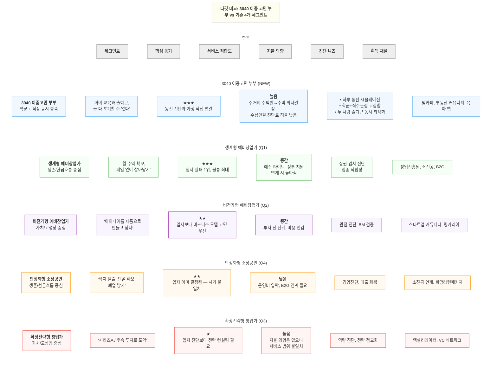
```mermaid
flowchart TD
    %% 스타일 정의
    classDef header fill:#fdfdf0,stroke:#d4d4d4,stroke-width:1px,font-weight:bold;
    classDef blueRow fill:#f0f7ff,stroke:#2196f3,stroke-width:1px;
    classDef greenRow fill:#f6fff6,stroke:#4caf50,stroke-width:1px;
    classDef purpleRow fill:#f9f5ff,stroke:#9c27b0,stroke-width:1px;
    classDef orangeRow fill:#fff9f0,stroke:#ff9800,stroke-width:1px;
    classDef redRow fill:#fff5f5,stroke:#f44336,stroke-width:1px;
    classDef tableHeader fill:#eee,stroke:#999,stroke-width:1px,font-weight:bold;

    Title["<b>타깃 비교: 3040 이중 고민 부부 vs 기존 4개 세그먼트</b>"]:::header

    %% 헤더 영역
    subgraph H ["항목"]
        direction LR
        h1[세그먼트]:::tableHeader --- h2[핵심 동기]:::tableHeader --- h3[서비스 적합도]:::tableHeader --- h4[지불 의향]:::tableHeader --- h5[진단 니즈]:::tableHeader --- h6[획득 채널]:::tableHeader
    end

    %% 1행: 3040 이중고민 부부
    subgraph R1 ["3040 이중고민 부부 (NEW)"]
        direction LR
        s1["<b>3040 이중고민 부부</b><br/>학군 + 직장 동시 충족"]:::blueRow
        m1["'아이 교육과 출퇴근,<br/>둘 다 포기할 수 없다'"]:::blueRow
        f1["★★★<br/>동선 진단과 가장 직접 연결"]:::blueRow
        p1["<b>높음</b><br/>주거비 수백만→수익 의사결정.<br/>수십만원 진단료 허들 낮음"]:::blueRow
        n1["• 하루 동선 시뮬레이션<br/>• 학군+직주근접 교집합<br/>• 두 사람 출퇴근 동시 최적화"]:::blueRow
        c1["맘카페, 부동산 커뮤니티, 육아 앱"]:::blueRow
        s1 --- m1 --- f1 --- p1 --- n1 --- c1
    end

    %% 2행: 생계형 예비창업가
    subgraph R2 ["생계형 예비창업가 (Q1)"]
        direction LR
        s2["<b>생계형 예비창업가</b><br/>생존/현금흐름 중심"]:::greenRow
        m2["'월 수익 확보,<br/>폐업 없이 살아남기'"]:::greenRow
        f2["★★★<br/>입지 실패 1위, 볼륨 최대"]:::greenRow
        p2["<b>중간</b><br/>예산 타이트. 정부 지원<br/>연계 시 높아짐"]:::greenRow
        n2["상권·입지 진단<br/>업종 적합성"]:::greenRow
        c2["창업진흥원, 소진공, B2G"]:::greenRow
        s2 --- m2 --- f2 --- p2 --- n2 --- c2
    end

    %% 3행: 비전가형 예비창업가
    subgraph R3 ["비전가형 예비창업가 (Q2)"]
        direction LR
        s3["<b>비전가형 예비창업가</b><br/>가치/고성장 중심"]:::purpleRow
        m3["'아이디어를 제품으로<br/>만들고 싶다'"]:::purpleRow
        f3["★★<br/>입지보다 비즈니스 모델 고민 우선"]:::purpleRow
        p3["<b>중간</b><br/>투자 전 단계, 비용 민감"]:::purpleRow
        n3["관점 진단, BM 검증"]:::purpleRow
        c3["스타트업 커뮤니티, 링커리어"]:::purpleRow
        s3 --- m3 --- f3 --- p3 --- n3 --- c3
    end

    %% 4행: 안정화형 소상공인
    subgraph R4 ["안정화형 소상공인 (Q4)"]
        direction LR
        s4["<b>안정화형 소상공인</b><br/>생존/현금흐름 중심"]:::orangeRow
        m4["'적자 탈출, 단골 확보,<br/>폐업 방지'"]:::orangeRow
        f4["★★<br/>입지 이미 결정됨 — 시기 불일치"]:::orangeRow
        p4["<b>낮음</b><br/>운영비 압박, B2G 연계 필요"]:::orangeRow
        n4["경영진단, 매출 회복"]:::orangeRow
        c4["소진공 연계, 희망리턴패키지"]:::orangeRow
        s4 --- m4 --- f4 --- p4 --- n4 --- c4
    end

    %% 5행: 확장전략형 창업가
    subgraph R5 ["확장전략형 창업가 (Q3)"]
        direction LR
        s5["<b>확장전략형 창업가</b><br/>가치/고성장 중심"]:::redRow
        m5["'시리즈A / 후속 투자로 도약'"]:::redRow
        f5["★<br/>입지 진단보다 전략 컨설팅 필요"]:::redRow
        p5["<b>높음</b><br/>지불 의향은 있으나<br/>서비스 범위 불일치"]:::redRow
        n5["역량 진단, 전략 정교화"]:::redRow
        c5["액셀러레이터, VC 네트워크"]:::redRow
        s5 --- m5 --- f5 --- p5 --- n5 --- c5
    end

    %% 수직 연결
    Title --> H
    H --> R1
    R1 --> R2
    R2 --> R3
    R3 --> R4
    R4 --> R5

    %% 스타일 적용 및 연결선 숨김
    linkStyle default stroke:none;
    style H fill:none,stroke:none;
    style R1 fill:none,stroke:none;
    style R2 fill:none,stroke:none;
    style R3 fill:none,stroke:none;
    style R4 fill:none,stroke:none;
    style R5 fill:none,stroke:none;
```

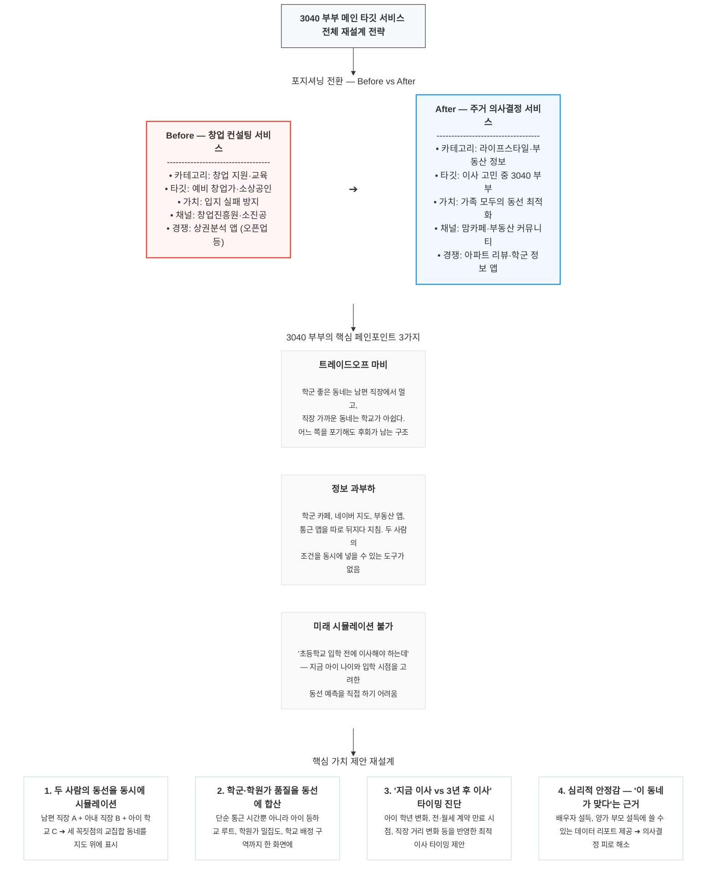
```mermaid
flowchart TD
    %% Global Styles
    classDef title fill:#f8f9fa,stroke:#333,stroke-width:1px,font-weight:bold,font-size:16px;
    classDef before fill:#fff5f5,stroke:#f44336,stroke-width:2px;
    classDef after fill:#f0f7ff,stroke:#2196f3,stroke-width:2px;
    classDef pain fill:#fafafa,stroke:#e0e0e0,stroke-width:1px;
    classDef value fill:#ffffff,stroke:#cfd8dc,stroke-width:1px;
    classDef transparent fill:none,stroke:none;

    Header["<b>3040 부부 메인 타깃 서비스 전체 재설계 전략</b>"]:::title

    %% Section 1: Positioning Shift
    subgraph Section1 ["포지셔닝 전환 — Before vs After"]
        direction LR
        B["<b>Before — 창업 컨설팅 서비스</b><br/>-----------------------------------<br/>• 카테고리: 창업 지원·교육<br/>• 타깃: 예비 창업가·소상공인<br/>• 가치: 입지 실패 방지<br/>• 채널: 창업진흥원·소진공<br/>• 경쟁: 상권분석 앱 (오픈업 등)"]:::before
        
        Arrow["<span style='font-size:20px'>➔</span>"]:::transparent
        
        A["<b>After — 주거 의사결정 서비스</b><br/>-----------------------------------<br/>• 카테고리: 라이프스타일·부동산 정보<br/>• 타깃: 이사 고민 중 3040 부부<br/>• 가치: 가족 모두의 동선 최적화<br/>• 채널: 맘카페·부동산 커뮤니티<br/>• 경쟁: 아파트 리뷰·학군 정보 앱"]:::after
        
        B --- Arrow --- A
    end

    %% Section 2: Pain Points
    subgraph Section2 ["3040 부부의 핵심 페인포인트 3가지"]
        direction LR
        P1["<b>트레이드오프 마비</b><br/><br/><small>학군 좋은 동네는 남편 직장에서 멀고,<br/>직장 가까운 동네는 학교가 아쉽다.<br/>어느 쪽을 포기해도 후회가 남는 구조</small>"]:::pain
        P2["<b>정보 과부하</b><br/><br/><small>학군 카페, 네이버 지도, 부동산 앱,<br/>통근 앱을 따로 뒤지다 지침. 두 사람의<br/>조건을 동시에 넣을 수 있는 도구가 없음</small>"]:::pain
        P3["<b>미래 시뮬레이션 불가</b><br/><br/><small>'초등학교 입학 전에 이사해야 하는데'<br/>— 지금 아이 나이와 입학 시점을 고려한<br/>동선 예측을 직접 하기 어려움</small>"]:::pain
    end

    %% Section 3: Value Proposition
    subgraph Section3 ["핵심 가치 제안 재설계"]
        direction TB
        V1["<b>1. 두 사람의 동선을 동시에 시뮬레이션</b><br/><small>남편 직장 A + 아내 직장 B + 아이 학교 C ➔ 세 꼭짓점의 교집합 동네를 지도 위에 표시</small>"]:::value
        V2["<b>2. 학군·학원가 품질을 동선에 합산</b><br/><small>단순 통근 시간뿐 아니라 아이 등하교 루트, 학원가 밀집도, 학교 배정 구역까지 한 화면에</small>"]:::value
        V3["<b>3. '지금 이사 vs 3년 후 이사' 타이밍 진단</b><br/><small>아이 학년 변화, 전·월세 계약 만료 시점, 직장 거리 변화 등을 반영한 최적 이사 타이밍 제안</small>"]:::value
        V4["<b>4. 심리적 안정감 — '이 동네가 맞다'는 근거</b><br/><small>배우자 설득, 양가 부모 설득에 쓸 수 있는 데이터 리포트 제공 ➔ 의사결정 피로 해소</small>"]:::value
    end

    %% Layout Connections
    Header --> Section1
    Section1 --> Section2
    Section2 --> Section3

    %% Styling Subgraphs & Links
    style Section1 fill:none,stroke:none
    style Section2 fill:none,stroke:none
    style Section3 fill:none,stroke:none
    linkStyle 0,1 stroke:none;
```

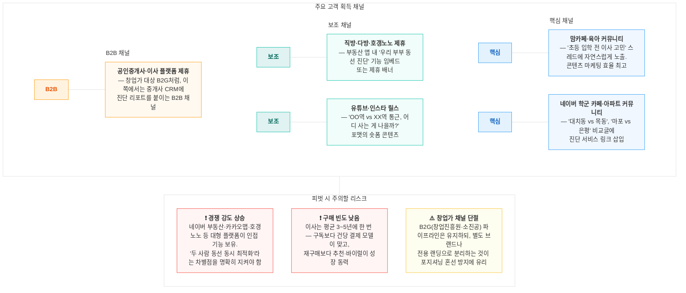
```mermaid
flowchart TD
    %% Global Styles
    classDef title fill:#f8f9fa,stroke:#333,stroke-width:1px,font-weight:bold,font-size:16px;
    classDef core fill:#f0f7ff,stroke:#2196f3,stroke-width:1px;
    classDef sub fill:#f1fdfa,stroke:#00bfa5,stroke-width:1px;
    classDef b2b fill:#fff9f0,stroke:#ff9800,stroke-width:1px;
    classDef risk fill:#fff5f5,stroke:#f44336,stroke-width:1px;
    classDef riskLow fill:#fdfdf0,stroke:#fbc02d,stroke-width:1px;
    classDef labelCore fill:#e3f2fd,stroke:#2196f3,color:#1565c0,font-weight:bold;
    classDef labelSub fill:#e0f2f1,stroke:#00bfa5,color:#00695c,font-weight:bold;
    classDef labelB2B fill:#fff3e0,stroke:#ff9800,color:#e65100,font-weight:bold;

    %% --- Section 1: 주요 고객 획득 채널 ---
    subgraph Channels ["주요 고객 획득 채널"]
        direction TB

        subgraph CoreGrp ["핵심 채널"]
            direction LR
            C1["<b>핵심</b>"]:::labelCore --- C1_D["<b>맘카페·육아 커뮤니티</b><br/>— '초등 입학 전 이사 고민' 스레드에 자연스럽게 노출.<br/>콘텐츠 마케팅 효율 최고"]:::core
            C2["<b>핵심</b>"]:::labelCore --- C2_D["<b>네이버 학군 카페·아파트 커뮤니티</b><br/>— '대치동 vs 목동', '마포 vs 은평' 비교글에<br/>진단 서비스 링크 삽입"]:::core
        end

        subgraph SubGrp ["보조 채널"]
            direction LR
            S1["<b>보조</b>"]:::labelSub --- S1_D["<b>직방·다방·호갱노노 제휴</b><br/>— 부동산 앱 내 '우리 부부 동선 진단' 기능 임베드<br/>또는 제휴 배너"]:::sub
            S2["<b>보조</b>"]:::labelSub --- S2_D["<b>유튜브·인스타 릴스</b><br/>— 'OO역 vs XX역 통근, 어디 사는 게 나을까?'<br/>포맷의 숏폼 콘텐츠"]:::sub
        end

        subgraph B2BGrp ["B2B 채널"]
            direction LR
            B1["<b>B2B</b>"]:::labelB2B --- B1_D["<b>공인중개사·이사 플랫폼 제휴</b><br/>— 창업가 대상 B2G처럼, 이쪽에서는 중개사 CRM에<br/>진단 리포트를 붙이는 B2B 채널"]:::b2b
        end
    end

    %% --- Section 2: 피벗 시 주의할 리스크 ---
    subgraph Risks ["피벗 시 주의할 리스크"]
        direction TB
        
        R1["<b>❗ 경쟁 강도 상승</b><br/>네이버 부동산·카카오맵·호갱노노 등 대형 플랫폼이 인접 기능 보유.<br/>'두 사람 동선 동시 최적화'라는 차별점을 명확히 지켜야 함"]:::risk
        
        R2["<b>❗ 구매 빈도 낮음</b><br/>이사는 평균 3~5년에 한 번 — 구독보다 건당 결제 모델이 맞고,<br/>재구매보다 추천·바이럴이 성장 동력"]:::risk
        
        R3["<b>⚠️ 창업가 채널 단절</b><br/>B2G(창업진흥원·소진공) 파이프라인은 유지하되, 별도 브랜드나<br/>전용 랜딩으로 분리하는 것이 포지셔닝 혼선 방지에 유리"]:::riskLow
    end

    %% Layout Links
    Channels === Risks

    %% Styling Subgraphs
    style Channels fill:#ffffff,stroke:#eee,stroke-width:2px;
    style Risks fill:#ffffff,stroke:#eee,stroke-width:2px;
    style CoreGrp fill:none,stroke:none;
    style SubGrp fill:none,stroke:none;
    style B2BGrp fill:none,stroke:none;
    linkStyle default stroke:#ddd,stroke-width:1px;
```

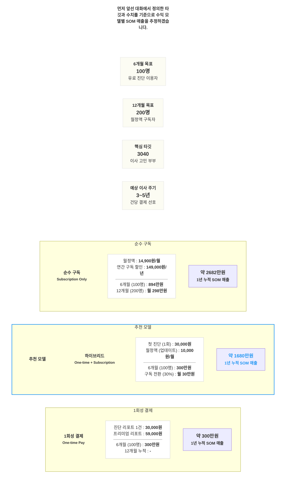
```mermaid
flowchart TD
    %% Global Styles
    classDef kpi fill:#fcfcf3,stroke:#e0e0e0,stroke-width:1px;
    classDef modelBox fill:#ffffff,stroke:#d1d1d1,stroke-width:1px;
    classDef hybridBox fill:#ffffff,stroke:#2196f3,stroke-width:2px;
    classDef title fill:none,stroke:none,font-weight:bold,font-size:16px;
    classDef blueText color:#2196f3,font-weight:bold,font-size:18px;
    classDef totalText font-weight:bold,font-size:18px;

    MainTitle["먼저 앞선 대화에서 정의한 타깃과 수치를 기준으로 수익 모델별 SOM 매출을 추정하겠습니다."]:::title

    %% --- 상단 KPI 섹션 ---
    subgraph KPI_Section [" "]
        direction LR
        style KPI_Section fill:none,stroke:none
        K1["<b>6개월 목표</b><br/><span style='font-size:20px'><b>100명</b></span><br/>유료 진단 이용자"]:::kpi
        K2["<b>12개월 목표</b><br/><span style='font-size:20px'><b>200명</b></span><br/>월정액 구독자"]:::kpi
        K3["<b>핵심 타깃</b><br/><span style='font-size:20px'><b>3040</b></span><br/>이사 고민 부부"]:::kpi
        K4["<b>예상 이사 주기</b><br/><span style='font-size:20px'><b>3~5년</b></span><br/>건당 결제 선호"]:::kpi
    end

    %% --- 하단 수익 모델 섹션 ---
    subgraph Models [" "]
        direction LR
        style Models fill:none,stroke:none

        %% 1. 1회성 결제
        subgraph M1_Box ["1회성 결제"]
            direction TB
            M1_Title["<b>1회성 결제</b><br/><small>One-time Pay</small>"]:::title
            M1_Content["진단 리포트 1건 : <b>30,000원</b><br/>프리미엄 리포트 : <b>59,000원</b><hr/>6개월 (100명) : <b>300만원</b><br/>12개월 누적 : <b>-</b>"]:::modelBox
            M1_Total["약 300만원<br/><small>1년 누적 SOM 매출</small>"]:::totalText
        end

        %% 2. 하이브리드 (추천)
        subgraph M2_Box ["추천 모델"]
            direction TB
            M2_Rec["<span style='color:#2196f3; font-size:12px;'>추천 모델</span>"]:::title
            M2_Title["<b>하이브리드</b><br/><small>One-time + Subscription</small>"]:::title
            M2_Content["첫 진단 (1회) : <b>30,000원</b><br/>월정액 (업데이트) : <b>10,000원/월</b><hr/>6개월 (100명) : <b>300만원</b><br/>구독 전환 (30%) : <b>월 30만원</b>"]:::modelBox
            M2_Total["약 1680만원<br/><small>1년 누적 SOM 매출</small>"]:::blueText
        end

        %% 3. 순수 구독
        subgraph M3_Box ["순수 구독"]
            direction TB
            M3_Title["<b>순수 구독</b><br/><small>Subscription Only</small>"]:::title
            M3_Content["월정액 : <b>14,900원/월</b><br/>연간 구독 할인 : <b>149,000원/년</b><hr/>6개월 (100명) : <b>894만원</b><br/>12개월 (200명) : <b>월 298만원</b>"]:::modelBox
            M3_Total["약 2682만원<br/><small>1년 누적 SOM 매출</small>"]:::totalText
        end
    end

    %% 레이아웃 연결
    MainTitle --> KPI_Section
    KPI_Section --> Models

    %% 하이라이트 스타일 적용
    style M2_Box stroke:#2196f3,stroke-width:2px
    linkStyle default stroke:none
```

전제 조건 — 6개월 이용자 100명 전원은 1회성 결제로 진입. 이 중 구독 전환율(기본값 30%)만큼 월정액 전환. 12개월 구독자 200명은 신규 구독 가입자 기준. 모든 수치는 세전·수수료 제외 기준이며, 결제 플랫폼 수수료(약 3~5%) 별도.

## 3가지 수익 모델 핵심 비교

### 모델 A — 1회성 결제

구조가 가장 단순하고 3040 부부의 이용 패턴(이사는 3~5년에 한 번)과 솔직히 잘 맞습니다. 진입 허들이 낮아 초반 100명 달성은 가장 쉽지만, 재방문 없이 매출이 평탄해집니다. 1년 누적 기준 약 299만 원으로 세 모델 중 가장 낮고, 수익 예측도 어렵습니다.

### 모델 B — 하이브리드 (권장)

첫 진단은 1회성 결제로 진입 허들을 낮추고, 이후 "학군 변화 알림 / 신규 동선 업데이트 / 이사 타이밍 재진단" 명목으로 월정액 구독을 유도하는 구조입니다. 기본값(전환율 30%)에서 약 1,019만 원으로 추정되며, 구독자가 쌓일수록 MRR이 선형 증가합니다. 3040 부부는 학교 배정, 전셋값 변동 등으로 최소 1~2년간 정보 업데이트 니즈가 지속되기 때문에 구독 명분이 충분합니다.

### 모델 C — 순수 구독

월 14,900원 기준으로 6개월부터 구독료를 받기 시작하면 수치상 가장 높은 약 1,192만 원이 나옵니다. 하지만 이사 고민이 없는 기간에도 구독료를 내야 하는 구조라 이탈률이 높고, 첫 진입 허들이 세 모델 중 가장 높습니다. 콘텐츠나 커뮤니티가 붙어야 구독 유지 명분이 생깁니다.

---

## 수치의 맥락 — 솔직한 해석

계산기의 기본값 기준으로 1년 SOM 매출은 최소 299만 원에서 최대 1,192만 원 사이입니다. 이 구간은 "서비스 가능성을 증명하는 단계"이지 수익화 완성 단계가 아닙니다. 의미 있는 매출 레벨(월 MRR 500만 원 이상)에 도달하려면 구독자 약 500명 이상이 필요하고, 이는 1년 목표치(200명)의 2.5배입니다.

따라서 1년 차 SOM의 실질 목표는 매출 규모보다 세 가지 지표로 관리하는 것이 현실적입니다. 첫째, 유료 전환율(무료 체험 → 첫 결제)이 얼마인지, 둘째 구독 전환율(1회성 → 월정액)이 30%를 넘는지, 셋째 NPS 또는 추천 비율이 이사 커뮤니티에서 바이럴로 연결되는지입니다. 슬라이더에서 전환율을 50%로 올려보시면 같은 이용자 수에서 매출이 거의 두 배로 달라지는 것을 확인하실 수 있습니다.

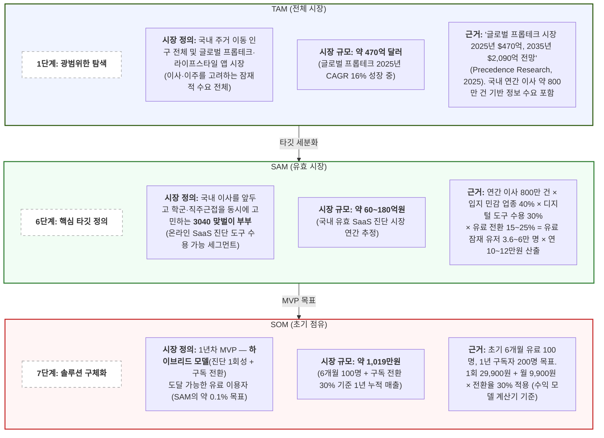
```mermaid
flowchart TD
    %% Global Styles
    classDef tam fill:#f0f4ff,stroke:#2b580c,stroke-width:2px,color:#333;
    classDef sam fill:#f1fdf4,stroke:#2e7d32,stroke-width:2px,color:#333;
    classDef som fill:#fff5f5,stroke:#c62828,stroke-width:2px,color:#333;
    classDef stage fill:#ffffff,stroke:#999,stroke-dasharray: 5 5;

    %% TAM Section
    subgraph TAM_Section ["TAM (전체 시장)"]
        direction TB
        TAM_Title["<b>1단계: 광범위한 탐색</b>"]:::stage
        TAM_Info["<b>시장 정의:</b> 국내 주거 이동 인구 전체 및 글로벌 프롭테크·라이프스타일 앱 시장<br/>(이사·이주를 고려하는 잠재적 수요 전체)"]
        TAM_Size["<b>시장 규모: 약 470억 달러</b><br/>(글로벌 프롭테크 2025년 CAGR 16% 성장 중)"]
        TAM_Basis["<b>근거:</b> '글로벌 프롭테크 시장 2025년 $470억, 2035년 $2,090억 전망'<br/>(Precedence Research, 2025). 국내 연간 이사 약 800만 건 기반 정보 수요 포함"]
    end
    TAM_Section:::tam

    %% SAM Section
    subgraph SAM_Section ["SAM (유효 시장)"]
        direction TB
        SAM_Title["<b>6단계: 핵심 타깃 정의</b>"]:::stage
        SAM_Info["<b>시장 정의:</b> 국내 이사를 앞두고 학군·직주근접을 동시에 고민하는 <b>3040 맞벌이 부부</b><br/>(온라인 SaaS 진단 도구 수용 가능 세그먼트)"]
        SAM_Size["<b>시장 규모: 약 60~180억원</b><br/>(국내 유효 SaaS 진단 시장 연간 추정)"]
        SAM_Basis["<b>근거:</b> 연간 이사 800만 건 × 입지 민감 업종 40% × 디지털 도구 수용 30%<br/>× 유료 전환 15~25% = 유료 잠재 유저 3.6~6만 명 × 연 10~12만원 산출"]
    end
    SAM_Section:::sam

    %% SOM Section
    subgraph SOM_Section ["SOM (초기 점유)"]
        direction TB
        SOM_Title["<b>7단계: 솔루션 구체화</b>"]:::stage
        SOM_Info["<b>시장 정의:</b> 1년차 MVP — <b>하이브리드 모델</b>(진단 1회성 + 구독 전환)<br/>도달 가능한 유료 이용자 (SAM의 약 0.1% 목표)"]
        SOM_Size["<b>시장 규모: 약 1,019만원</b><br/>(6개월 100명 + 구독 전환 30% 기준 1년 누적 매출)"]
        SOM_Basis["<b>근거:</b> 초기 6개월 유료 100명, 1년 구독자 200명 목표.<br/>1회 29,900원 + 월 9,900원 × 전환율 30% 적용 (수익 모델 계산기 기준)"]
    end
    SOM_Section:::som

    %% Connections
    TAM_Section --> |타깃 세분화| SAM_Section
    SAM_Section --> |MVP 목표| SOM_Section
```

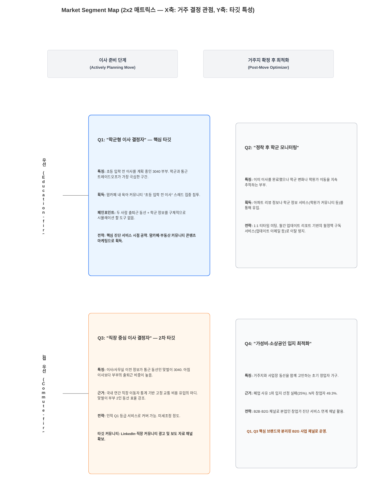
```mermaid
flowchart TD
    %% 스타일 정의
    classDef noBorder fill:none,stroke:none;
    classDef axisTitle fill:#F3F4F6,stroke:#D1D5DB,stroke-width:1px,font-weight:bold,color:#374151;
    classDef q1Card fill:#EBF5FF,stroke:#3B82F6,stroke-width:2px,rx:10,ry:10;
    classDef q2Card fill:#F9FAFB,stroke:#9CA3AF,stroke-width:1px,rx:10,ry:10;
    classDef q3Card fill:#FFF7ED,stroke:#F97316,stroke-width:1px,rx:10,ry:10;
    classDef q4Card fill:#F9FAFB,stroke:#9CA3AF,stroke-width:1px,rx:10,ry:10;

    %% 메인 타이틀
    MainTitle("`<div style='width:1000px; text-align:left; font-size:1.4em; font-weight:bold; color:#111; margin-bottom:10px;'>Market Segment Map (2x2 매트릭스 — X축: 거주 결정 관점, Y축: 타깃 특성)</div>`"):::noBorder

    %% 매트릭스 컨테이너
    subgraph Matrix [" "]
        direction TB

        %% 상단 X축 헤더
        subgraph XHeaders [" "]
            direction LR
            X1("`<div style='width:450px; padding:12px; font-size:1.1em;'>이사 준비 단계<br><span style='font-size:0.85em; font-weight:normal;'>(Actively Planning Move)</span></div>`"):::axisTitle
            X2("`<div style='width:450px; padding:12px; font-size:1.1em;'>거주지 확정 후 최적화<br><span style='font-size:0.85em; font-weight:normal;'>(Post-Move Optimizer)</span></div>`"):::axisTitle
            X1 ~~~ X2
        end

        %% 상단행 (Q1, Q2)
        subgraph Row1 [" "]
            direction LR
            
            %% Y축 헤더 1
            Y1("`<div style='width:100px; height:280px; display:flex; align-items:center; justify-content:center; background:#F8FAFC; border:1px solid #CBD5E1; font-weight:bold; writing-mode:vertical-rl; text-orientation:upright; padding:10px;'>학군 우선 (Education-first)</div>`"):::noBorder
            
            %% Q1 카드
            Q1("`<div style='width:400px; text-align:left; padding:20px;'>
                <div style='color:#2563EB; font-weight:bold; font-size:1.1em; margin-bottom:12px;'>Q1: &quot;학군형 이사 결정자&quot; — 핵심 타깃</div>
                <div style='font-size:0.85em; color:#444; line-height:1.6; word-break:keep-all;'>
                    <div style='margin-bottom:8px;'><strong>특징:</strong> 초등 입학 전 이사를 계획 중인 3040 부부. 학군과 통근 트레이드오프가 가장 극심한 구간.</div>
                    <div style='margin-bottom:8px;'><strong>획득:</strong> 맘카페 내 육아 커뮤니티 &quot;초등 입학 전 이사&quot; 스레드 집중 침투.</div>
                    <div style='margin-bottom:8px;'><strong>페인포인트:</strong> 두 사람 출퇴근 동선 + 학군 정보를 구체적으로 시뮬레이션 할 도구 없음.</div>
                    <div style='color:#2563EB; font-weight:bold;'>전략: 핵심 진단 서비스 시점 공략. 맘카페·부동산 커뮤니티 콘텐츠 마케팅으로 획득.</div>
                </div>
            </div>`"):::q1Card

            %% Q2 카드
            Q2("`<div style='width:400px; text-align:left; padding:20px;'>
                <div style='color:#4B5563; font-weight:bold; font-size:1.1em; margin-bottom:12px;'>Q2: &quot;정착 후 학군 모니터링&quot;</div>
                <div style='font-size:0.85em; color:#444; line-height:1.6; word-break:keep-all;'>
                    <div style='margin-bottom:8px;'><strong>특징:</strong> 이미 이사를 완료했으나 학군 변화나 학원가 이동을 지속 추적하는 부부.</div>
                    <div style='margin-bottom:8px;'><strong>획득:</strong> 아파트 리뷰 정보나 학군 정보 서비스(학원가 커뮤니티 등)를 통해 유입.</div>
                    <div style='margin-bottom:8px;'><strong>전략:</strong> 1:1 티타임 미팅, 월간 업데이트 리포트 기반의 월정액 구독 서비스(업데이트 이메일 등)로 이탈 방지.</div>
                </div>
            </div>`"):::q2Card

            Y1 --- Q1 ~~~ Q2
        end

        %% 하단행 (Q3, Q4)
        subgraph Row2 [" "]
            direction LR
            
            %% Y축 헤더 2
            Y2("`<div style='width:100px; height:280px; display:flex; align-items:center; justify-content:center; background:#F8FAFC; border:1px solid #CBD5E1; font-weight:bold; writing-mode:vertical-rl; text-orientation:upright; padding:10px;'>직주근접 우선 (Commute-first)</div>`"):::noBorder

            %% Q3 카드
            Q3("`<div style='width:400px; text-align:left; padding:20px;'>
                <div style='color:#EA580C; font-weight:bold; font-size:1.1em; margin-bottom:12px;'>Q3: &quot;직장 중심 이사 결정자&quot; — 2차 타깃</div>
                <div style='font-size:0.85em; color:#444; line-height:1.6; word-break:keep-all;'>
                    <div style='margin-bottom:8px;'><strong>특징:</strong> 이사/사무실 이전 정보가 통근 동선인 맞벌이 3040. 아침 이사보다 부부의 출퇴근 비중이 높음.</div>
                    <div style='margin-bottom:8px;'><strong>근거:</strong> 국내 연간 직장 이동자 통계 기반 고정 교통 비용 유입의 마디. 맞벌이 부부 2인 동선 효율 강조.</div>
                    <div style='margin-bottom:8px;'><strong>전략:</strong> 인적 Q1 등급 서비스로 커버 가능. 미세조정 정도.</div>
                    <div style='color:#EA580C; font-weight:bold;'>타깃 커뮤니티: LinkedIn·직장 커뮤니티 광고 및 보도 자료 채널 확보.</div>
                </div>
            </div>`"):::q3Card

            %% Q4 카드
            Q4("`<div style='width:400px; text-align:left; padding:20px;'>
                <div style='color:#4B5563; font-weight:bold; font-size:1.1em; margin-bottom:12px;'>Q4: &quot;가성비-소상공인 입지 최적화&quot;</div>
                <div style='font-size:0.85em; color:#444; line-height:1.6; word-break:keep-all;'>
                    <div style='margin-bottom:8px;'><strong>특징:</strong> 거주지와 사업장 동선을 함께 고민하는 초기 창업자 가구.</div>
                    <div style='margin-bottom:8px;'><strong>근거:</strong> 폐업 사유 1위 입지 선정 실패(25%). N차 창업자 49.3%.</div>
                    <div style='margin-bottom:8px;'><strong>전략:</strong> B2B·B2G 채널로 본업인 창업가 진단 서비스 연계 채널 활용.</div>
                    <div style='background:#FEF3C7; padding:8px; border-radius:4px; font-weight:bold; color:#92400E;'>Q1, Q3 핵심 브랜드와 분리된 B2G 사업 채널로 운영.</div>
                </div>
            </div>`"):::q4Card

            Y2 --- Q3 ~~~ Q4
        end

        XHeaders ~~~ Row1 ~~~ Row2
    end

    %% 전체 레이아웃 연결 및 화살표
    MainTitle ~~~ Matrix

    %% 서브그래프 테두리 숨김
    style Matrix fill:none,stroke:none
    style XHeaders fill:none,stroke:none
    style Row1 fill:none,stroke:none
    style Row2 fill:none,stroke:none
```

```mermaid
flowchart TD
    classDef noBorder fill:none,stroke:none;

    Matrix("`<div style='display:flex; flex-direction:column; align-items:center; width:1040px; font-family:sans-serif; background:#ffffff; padding:20px;'>
        
        <div style='font-weight:bold; font-size:1.15em; color:#1E293B; margin-bottom:16px; letter-spacing:0.5px;'>이사 결정 여유 있음 (Planned)</div>
        
        <div style='display:flex; align-items:stretch; width:100%; justify-content:center;'>
            
            <div style='display:flex; align-items:center; justify-content:center; width:50px; margin-right:10px;'>
                <div style='writing-mode:vertical-rl; font-weight:bold; font-size:1.15em; color:#1E293B; transform:rotate(180deg); letter-spacing:0.5px;'>가족 동반 이사</div>
            </div>
            
            <div style='display:grid; grid-template-columns: 1fr 1fr; grid-template-rows: 1fr 1fr; gap: 24px; position: relative; flex-grow: 1; padding: 24px; background:#F8FAFC; border-radius:16px;'>
                
                <div style='position:absolute; top:12px; bottom:12px; left:50%; border-left:2px dashed #CBD5E1; transform:translateX(-50%); z-index:0;'></div>
                <div style='position:absolute; left:12px; right:12px; top:50%; border-top:2px dashed #CBD5E1; transform:translateY(-50%); z-index:0;'></div>
                <div style='position:absolute; top:50%; left:50%; width:16px; height:16px; background-color:#94A3B8; border-radius:50%; transform:translate(-50%, -50%); z-index:0; border:3px solid #F8FAFC;'></div>
                
                <div style='background-color:#F0F5FF; border: 1px solid #D6E4FF; border-radius:12px; padding:24px; text-align:left; z-index:1; box-shadow: 0 2px 4px rgba(37,99,235,0.05);'>
                    <div style='text-align:center; margin-bottom:20px; padding-bottom:16px; border-bottom:1px solid #D6E4FF;'>
                        <div style='font-weight:bold; font-size:1.15em; color:#1E40AF; margin-bottom:4px;'>계획형 가족 이사자</div>
                        <div style='color:#60A5FA; font-size:0.85em; font-weight:600;'>Planned Family Mover</div>
                    </div>
                    <div style='display:flex; flex-direction:column; gap:14px; font-size:0.9em; color:#334155; line-height:1.5;'>
                        <div style='display:flex;'><div style='width:90px; color:#64748B; font-weight:600;'>대표 프로필</div><div style='flex:1;'>자녀 초등 입학 전 3040 부부</div></div>
                        <div style='display:flex;'><div style='width:90px; color:#64748B; font-weight:600;'>이사 동기</div><div style='flex:1;'>학군 + 직주근접 동시 충족</div></div>
                        <div style='display:flex;'><div style='width:90px; color:#64748B; font-weight:600;'>의사결정 특성</div><div style='flex:1;'>6개월~1년 전부터 준비, 신중</div></div>
                        <div style='display:flex;'><div style='width:90px; color:#64748B; font-weight:600;'>핵심 니즈</div><div style='flex:1;'>두 사람 동선 + 학교 배정 구역<br/>동시 시뮬레이션</div></div>
                        <div style='display:flex;'><div style='width:90px; color:#64748B; font-weight:600;'>지불 의향</div><div style='flex:1;'><strong style='color:#1E40AF;'>★★★ 높음</strong> — 수억짜리 결정 앞둠</div></div>
                    </div>
                </div>
                
                <div style='background-color:#F0FDF4; border: 1px solid #DCFCE7; border-radius:12px; padding:24px; text-align:left; z-index:1; box-shadow: 0 2px 4px rgba(22,163,74,0.05);'>
                    <div style='text-align:center; margin-bottom:20px; padding-bottom:16px; border-bottom:1px solid #DCFCE7;'>
                        <div style='font-weight:bold; font-size:1.15em; color:#166534; margin-bottom:4px;'>생존형 긴급 이사자</div>
                        <div style='color:#4ADE80; font-size:0.85em; font-weight:600;'>Urgent / Forced Mover</div>
                    </div>
                    <div style='display:flex; flex-direction:column; gap:14px; font-size:0.9em; color:#334155; line-height:1.5;'>
                        <div style='display:flex;'><div style='width:90px; color:#64748B; font-weight:600;'>대표 프로필</div><div style='flex:1;'>전세 만료·직장 이전·이혼 등</div></div>
                        <div style='display:flex;'><div style='width:90px; color:#64748B; font-weight:600;'>이사 동기</div><div style='flex:1;'>어쩔 수 없는 외부 이벤트 발생</div></div>
                        <div style='display:flex;'><div style='width:90px; color:#64748B; font-weight:600;'>의사결정 특성</div><div style='flex:1;'>1~3개월 이내 빠른 결정 필요</div></div>
                        <div style='display:flex;'><div style='width:90px; color:#64748B; font-weight:600;'>핵심 니즈</div><div style='flex:1;'>빠른 동네 후보군 추출<br/>예산 내 현실적 선택지</div></div>
                        <div style='display:flex;'><div style='width:90px; color:#64748B; font-weight:600;'>지불 의향</div><div style='flex:1;'><strong style='color:#166534;'>★★ 중간</strong> — 시간 절약 가치 높음</div></div>
                    </div>
                </div>
                
                <div style='background-color:#FFF7ED; border: 1px solid #FFEDD5; border-radius:12px; padding:24px; text-align:left; z-index:1; box-shadow: 0 2px 4px rgba(234,88,12,0.05);'>
                    <div style='text-align:center; margin-bottom:20px; padding-bottom:16px; border-bottom:1px solid #FFEDD5;'>
                        <div style='font-weight:bold; font-size:1.15em; color:#9A3412; margin-bottom:4px;'>라이프스타일 업그레이더</div>
                        <div style='color:#FB923C; font-size:0.85em; font-weight:600;'>Lifestyle Upgrader</div>
                    </div>
                    <div style='display:flex; flex-direction:column; gap:14px; font-size:0.9em; color:#334155; line-height:1.5;'>
                        <div style='display:flex;'><div style='width:90px; color:#64748B; font-weight:600;'>대표 프로필</div><div style='flex:1;'>소득 상승 후 환경 개선 원하는 30대</div></div>
                        <div style='display:flex;'><div style='width:90px; color:#64748B; font-weight:600;'>이사 동기</div><div style='flex:1;'>더 좋은 동네·더 넓은 집으로 이동</div></div>
                        <div style='display:flex;'><div style='width:90px; color:#64748B; font-weight:600;'>의사결정 특성</div><div style='flex:1;'>막연한 이사 욕구, 구체적 계기 부재</div></div>
                        <div style='display:flex;'><div style='width:90px; color:#64748B; font-weight:600;'>핵심 니즈</div><div style='flex:1;'>동네 분위기·인프라 비교<br/>&quot;나에게 맞는 동네&quot; 발견</div></div>
                        <div style='display:flex;'><div style='width:90px; color:#64748B; font-weight:600;'>지불 의향</div><div style='flex:1;'><strong style='color:#9A3412;'>★★ 중간</strong> — 탐색 단계라 낮을 수 있음</div></div>
                    </div>
                </div>
                
                <div style='background-color:#FAFAFA; border: 1px solid #E5E7EB; border-radius:12px; padding:24px; text-align:left; z-index:1; box-shadow: 0 2px 4px rgba(0,0,0,0.02);'>
                    <div style='text-align:center; margin-bottom:20px; padding-bottom:16px; border-bottom:1px solid #E5E7EB;'>
                        <div style='font-weight:bold; font-size:1.15em; color:#4B5563; margin-bottom:4px;'>현실 타협형 이사자</div>
                        <div style='color:#9CA3AF; font-size:0.85em; font-weight:600;'>Budget-constrained Mover</div>
                    </div>
                    <div style='display:flex; flex-direction:column; gap:14px; font-size:0.9em; color:#334155; line-height:1.5;'>
                        <div style='display:flex;'><div style='width:90px; color:#64748B; font-weight:600;'>대표 프로필</div><div style='flex:1;'>2030 1~2인 가구, 전월세 예산 제한</div></div>
                        <div style='display:flex;'><div style='width:90px; color:#64748B; font-weight:600;'>이사 동기</div><div style='flex:1;'>계약 만료 또는 독립·상경</div></div>
                        <div style='display:flex;'><div style='width:90px; color:#64748B; font-weight:600;'>의사결정 특성</div><div style='flex:1;'>예산 최우선, 원하는 것 포기하며 선택</div></div>
                        <div style='display:flex;'><div style='width:90px; color:#64748B; font-weight:600;'>핵심 니즈</div><div style='flex:1;'>예산 내 최선의 동선 조건 탐색<br/>손실 최소화 의사결정</div></div>
                        <div style='display:flex;'><div style='width:90px; color:#64748B; font-weight:600;'>지불 의향</div><div style='flex:1;'><strong style='color:#4B5563;'>★ 낮음</strong> — 무료 대안 먼저 탐색</div></div>
                    </div>
                </div>
                
            </div>
            
            <div style='display:flex; align-items:center; justify-content:center; width:50px; margin-left:10px;'>
                <div style='writing-mode:vertical-rl; font-weight:bold; font-size:1.15em; color:#1E293B; text-align:center; letter-spacing:0.5px;'>1~2인 단독 이사</div>
            </div>
            
        </div>
        
        <div style='font-weight:bold; font-size:1.15em; color:#1E293B; margin-top:16px; letter-spacing:0.5px;'>이사 결정 여유 없음 (Urgent)</div>
        
    </div>`"):::noBorder
```

## 축 선택 이유

이사 타깃에게 의미 있는 분류 기준은 두 가지였습니다. 하나는 "얼마나 급한가(의사결정 여유)"이고, 다른 하나는 "누구와 이사하는가(가족 구성)"입니다. 이 두 축이 니즈, 지불 의향, 채널을 가장 명확하게 갈라냅니다.

**Q2 계획형 가족 이사자**가 앞서 우리가 핵심 타깃으로 정한 세그먼트입니다. 여유 있게 준비하고, 가족 동선이 복잡하며, 지불 의향이 가장 높습니다. 서비스의 "두 사람 동선 + 학군 동시 시뮬레이션" 기능이 이 사분면에 가장 직접적으로 꽂힙니다.

**Q1 생존형 긴급 이사자**는 볼륨이 크고 "시간 절약"이라는 명확한 가치를 팔 수 있어서 2차 공략 세그먼트로 적합합니다. 전세 만료나 직장 이전처럼 외부 이벤트가 트리거가 되기 때문에 부동산 앱 제휴나 이사 플랫폼 연동으로 유입시키기 좋습니다.

**Q3 라이프스타일 업그레이더**는 잠재 수요는 있지만 아직 이사를 결심하지 않은 탐색 단계라 전환율이 불안정합니다. 콘텐츠 마케팅으로 인지도를 쌓고, 이사 결심이 생겼을 때 Q2나 Q1으로 자연스럽게 넘어오게 하는 깔때기 역할입니다.

**Q4 현실 타협형**은 예산이 빠듯해 유료 전환이 어렵습니다. 지금 단계에서는 무료 체험 유도 후 데이터 확보 용도로만 활용하는 것이 현실적입니다.