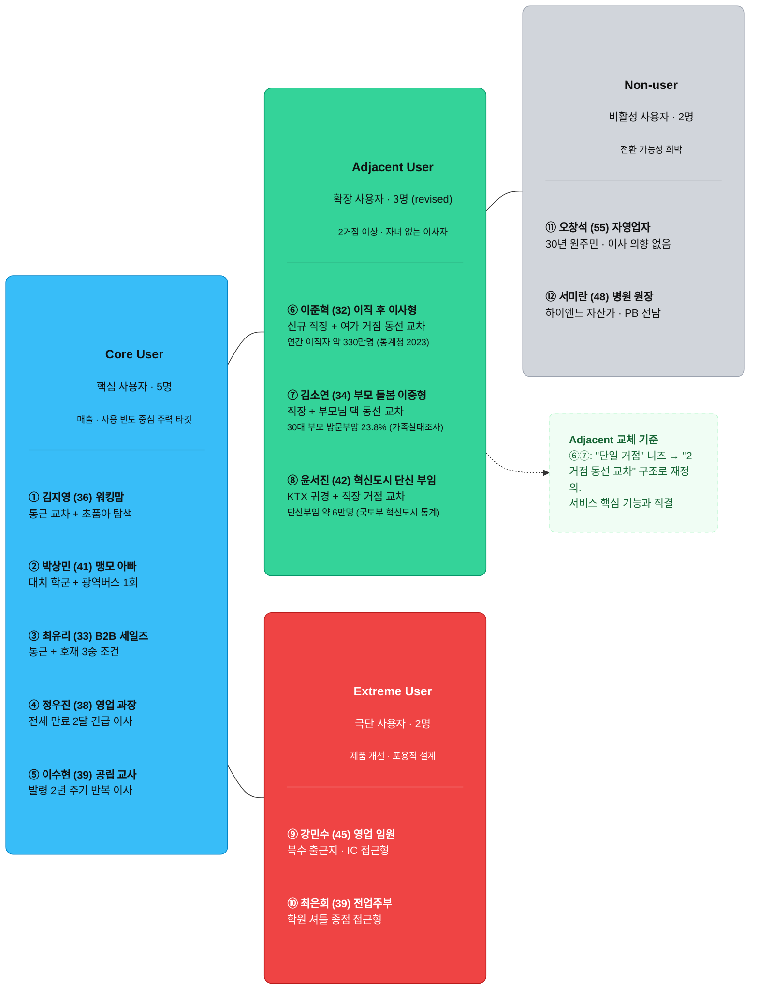

### 확장 페르소나 ⑥, ⑦, ⑧ 설계 의도

**⑥ 이준혁(이직 후 이사형)** — 단일 거점(학교)의 한계를 극복하고, "새 직장(마포) + 주말 여가 거점(홍대·합정)" 두 거점의 교집합을 찾는 시나리오입니다. 연간 이직자 약 330만 명(통계청 2023) 중 이직 후 거주지 이동을 고려하는 비율을 포함해 수십만 명 수준의 잠재 시장으로 연결됩니다.

**⑦ 김소연(부모 돌봄 이중형)** — 재택근무 대신 직장(여의도) + 부모님 댁(노원) 두 거점을 오가는 구조를 채택했습니다. 30대 부모 방문 부양 경험률 23.8%(여성가족부 가족실태조사, 2020)에 기반해, 향후 고령화 심화 시 커지는 세그먼트입니다.

**⑧ 윤서진(혁신도시 단신 부임)** — 혁신도시 이전 기관 재직자 약 15만 명 중 단신 부임 비율 약 40%를 적용하여 약 6만 명의 명확한 타깃 규모를 도출했습니다.

결과적으로 확장 페르소나 3명 모두 "두 거점 이상의 동선을 동시에 최적화해야 하는 사용자"라는 공통 논리로 설정되어, 핵심 타깃(Core)과 기능적 연속성을 갖춥니다.

## 고객 여정 지도 (Customer Journey Map)

도출된 각 페르소나에 대해 다음 5단계(문제 인식, 탐색, 의사결정, 사용, 유지)를 기준으로 정리한 고객 여정 지도입니다.

**Core User — 핵심 사용자 5명**① 김지영  ② 박상민  ③ 최유리  ④ 정우진  ⑤ 이수현

| **단계** | **페르소나** | **고객 행동** | **고객 생각** | **감정** | **Pain Point** | **개선 기회** |
| --- | --- | --- | --- | --- | --- | --- |
| **문제인식** | **① 김지영**워킹맘 | 복직 후 첫 주, 지도 앱으로 남편·본인 직장 출퇴근 시간을 따로 검색해봄 | "둘 다 만족하는 동네가 진짜 있을까?" | 번아웃 | 두 동선을 동시에 계산해 주는 도구가 없음 | "부부 직장 입력 → 교차 동선 지도 즉시 시각화" 온보딩 훅 |
|  | **② 박상민**맹모 아빠 | 대치동 임장 후 왕복 3시간 실측. 엑셀에 후보 단지별 시간 정리 시작 | "학군과 출퇴근, 둘 다 잡을 수 있는 단지가 있나?" | 압박감 | 학원가·광역버스 환승 정보를 한 번에 비교할 수 없음 | 학원가 반경 + 대중교통 환승 횟수를 합산한 단지 스코어 제공 |
|  | **③ 최유리**예비신부 | 유튜브 부동산 채널·호재 카페 수십 개 북마크, 정보가 쌓일수록 결정이 어려워짐 | "조건이 많을수록 어디도 100점이 아니네" | 정보 과부하 | 통근·학군·호재 세 조건을 동시에 필터링하는 도구 부재 | 우선순위 가중치 슬라이더로 조건 조합 → 후보지 자동 순위 정렬 |
|  | **④ 정우진**긴급 이사 | 집주인 실거주 통보 당일, 직방·피터팬·네이버 부동산 동시 탭 열기 | "2달 안에 못 구하면 비상이다" | 극도 조급 | 새 직장 동선 + 아이 유치원 배정 구역을 동시에 만족하는 매물 탐색 불가 | "데드라인 모드" — 조건 입력 즉시 오늘 나온 급매 매물과 연동 |
|  | **⑤ 이수현**교사 | 발령지 변경 공문 수령 후 인디스쿨 선배 교사 DM으로 거주지 물어봄 | "또 이사인데, 이번엔 변수를 최소화하고 싶다" | 피로 누적 | 2년 후 발령 변수를 감안한 탈출 용이성까지 고려하는 도구 없음 | "미래 발령 시뮬레이션" — 2년 후 동선 변경 시 재사용 리마인더 설계 |
| **탐색** | **① 김지영** | 맘카페에서 "판교 + 여의도 부부 어디 살아요?" 검색, 추천글 10개 이상 저장 | "카페 후기는 내 상황이랑 달라 적용이 어렵네" | 기대 반 회의 | 타인 경험담은 직장 주소가 달라 직접 적용 불가 | 맘카페·커뮤니티 연동 — 유사 동선 선배 이사자의 후기 자동 매칭 |
|  | **② 박상민** | 호갱노노 학원가 필터 + 카카오맵 길찾기를 교차 검색, 주말 직접 임장 | "이 앱들이 각각 잘하는데 합쳐주는 데가 없네" | 분산 피로 | 학원 정보·교통 정보·매물 정보가 서로 다른 앱에 분산 | 학원가 밀집도 + 대중교통 + 매물 링크를 단일 화면에 통합 제공 |
|  | **③ 최유리** | GTX 노선 호재 지도 + 직방 통근 시간 기능 동시 사용 | "호재 지역 중에 통근 1시간 이내인 곳이 어딘지 모르겠어" | 기대 | 교통 호재 + 통근 시간 조건 교집합 시각화 도구 없음 | 교통 개발 호재 레이어 + 현재 통근 시간 오버레이 지도 제공 |
|  | **④ 정우진** | 부동산 앱 3개 탭 동시 열람, 조건 필터 다시 설정하기 반복 | "빠른데 내 조건을 전부 넣을 수가 없어" | 초조 | 긴급 이사 조건(마감 기한)을 고려한 매물 우선순위 정렬 기능 없음 | 마감 기한 입력 → 계약 가능 매물만 필터링 + 이사 일정 역산 알림 |
|  | **⑤ 이수현** | 인디스쿨 카페·지역 부동산 카페에서 발령지별 거주지 스레드 검색 | "선배들 경험이 내 상황과 다 다르네" | 막막 | 발령지 변수와 남편 직장을 동시에 고려한 탐색 도구 부재 | 교사 커뮤니티 연동 + 발령 후보 지역 복수 입력 시뮬레이션 |
| **의사결정** | **① 김지영** | 남편과 주말 임장 일정 조율, 최종 후보 3곳 리스트업 | "데이터로 보여주면 남편 설득이 쉬울 텐데" | 설득 피로 | 배우자 설득에 쓸 수 있는 객관적 비교 리포트 부재 | 후보지 비교 리포트 PDF 다운로드 — 배우자·부모 설득용 공유 기능 |
|  | **② 박상민** | 부동산 중개사 3곳 상담, 서로 다른 추천에 혼란 | "중개사마다 말이 달라서 누구 말을 믿어야 하지?" | 신뢰 부족 | 중개사 정보의 편향성, 객관적 제3자 데이터 부재 | 공공 실거래가 + 교통 데이터 기반 중립적 스코어 제공으로 신뢰 확보 |
|  | **③ 최유리** | 가족 단톡방에 후보지 공유 → 의견 분분해 결정 지연 | "모두를 만족시키는 선택이 없으니 누군가는 포기해야 해" | 죄책감 | 다중 조건 우선순위 타협안을 도출해주는 도구 없음 | "트레이드오프 시각화" — 조건별 손실·이득을 수치로 제시 |
|  | **④ 정우진** | 2곳 추린 뒤 허겁지겁 계약 결정, 계약 당일까지도 확신 없음 | "틀려도 어쩔 수 없어, 시간이 없으니까" | 체념 | 충분한 비교 없이 시간 압박에 의한 묻지마 계약 위험 | 긴급 결정 전 "30분 빠른 검토" 패키지 — 핵심 지표만 즉시 요약 제공 |
|  | **⑤ 이수현** | 서울 중심축 단지 2곳으로 좁힌 뒤 남편과 최종 협의 | "2년 후 또 이사하면 이 선택이 맞을까?" | 불안 반 안도 | 미래 발령 변수가 현재 결정에 미치는 영향 예측 불가 | 발령 시나리오별 동선 변화 미리보기 + 재사용 알림 서비스 설계 |
| **사용** | **① 김지영** | 서비스 접속, 두 직장 주소 입력 → 교차 동선 지도 확인 | "이게 내가 원하던 거야, 근데 학교 정보가 더 있으면 좋겠어" | 만족 + 더 원함 | 학교 배정 구역 데이터가 동선 지도와 통합되지 않음 | 초등학교 학군 배정 구역 레이어 on/off 기능 추가 |
|  | **② 박상민** | 후보 단지 스코어 열람, 광역버스 환승 정보 확인 | "환승 정보는 좋은데 학원 셔틀 정보가 없네" | 부분 만족 | 사립 학원 셔틀 버스 정류장 데이터 미제공 | 학원 셔틀 노선 데이터 파트너십 (학원 연합회 API 연동) |
|  | **③ 최유리** | 가중치 조정 후 후보지 TOP 3 열람, 남편과 화면 공유 | "이 수치 근거가 뭔지 알고 싶어, 믿어도 되는 건지" | 신뢰 의구심 | 스코어 산출 근거(데이터 출처)가 불투명하게 느껴짐 | 각 지표별 데이터 출처 한 줄 표기 + "이 수치는 국토부 실거래가 기반" 배지 |
|  | **④ 정우진** | 급매 매물 연동 탭에서 오늘 올라온 매물 확인, 즉시 중개사 연락 | "이 정도면 빠른데, 계약 후에도 변수가 생기면?" | 안도 + 잔불안 | 계약 완료 후 추가 변수(계약 파기 등) 대응 가이드 없음 | 계약 후 체크리스트 + "이런 상황엔 이렇게" 비상 가이드 콘텐츠 |
|  | **⑤ 이수현** | 발령 시나리오 2가지 입력 후 동선 변화 비교 열람 | "이 화면을 남편에게 보여주면 설득될 것 같아" | 안도 | 시나리오 비교 화면을 공유·저장하는 기능 부재 | 시나리오 공유 링크 생성 + PDF 저장 기능 |
| **유지** | **① 김지영** | 이사 완료 3개월 후 학교 배정 결과 확인, 앱 재접속 | "맞게 고른 것 같아. 다음엔 초등 전학 전에 또 써야겠다" | 확신 + 재사용 의향 | 이사 후 결과 피드백(실제 만족도) 수집 루프 없음 | 이사 후 3개월 만족도 설문 → 서비스 정확도 개선 + 후기 UGC 확보 |
|  | **② 박상민** | 대치동 입주 후 학원 등록, 출퇴근 실측치와 예측치 비교 | "예측보다 15분 더 걸리네, 다음엔 더 정확했으면" | 소소한 아쉬움 | 예측 vs 실제 괴리에 대한 피드백 채널 없음 | 실거주자 "예측 vs 실제" 후기 수집 → 알고리즘 보정 데이터 피드백 루프 |
|  | **③ 최유리** | 입주 후 GTX 개통 뉴스 확인, 호재 적중 여부 체크 | "호재 예측이 맞았네, 다음 이사 때도 써야겠어" | 만족 + 충성 | 호재 실현 여부 알림·업데이트 서비스 없음 | 관심 지역 교통 호재 알림 구독 기능 → 구독 유지 명분 확보 |
|  | **④ 정우진** | 안착 후 지인에게 서비스 추천, 맘카페에 후기 작성 | "급할 때 이런 게 있어서 다행이었어, 알려줘야겠다" | 감사 + 전도 | 추천 인센티브 구조 없어 자발적 바이럴에 의존 | 추천 리워드 프로그램 설계 → 맘카페 바이럴 공식 채널화 |
|  | **⑤ 이수현** | 1년 후 새 발령 공문 수령, 서비스 즉시 재접속 | "이번엔 처음부터 이걸 써야지" | 능동 재사용 | 재방문 시 이전 설정값 저장 안 됨 (재입력 필요) | 이전 이사 시 입력값 자동 저장 + "발령 알림 연동" 구독 기능 |

**Adjacent User — 확장 사용자 3명**⑥ 이준혁  ⑦ 김소연  ⑧ 윤서진

| **단계** | **페르소나** | **고객 행동** | **고객 생각** | **감정** | **Pain Point** | **개선 기회** |
| --- | --- | --- | --- | --- | --- | --- |
| **문제인식** | **⑥ 이준혁**이직 후 이사 | 이직 확정 후 새 직장(마포)까지 현재 집(성남)에서 시간 측정 — 1시간 40분 | "이 거리로는 야근하면 새벽에 귀가하겠다" | 현실 충격 | 새 직장 + 기존 인간관계 거점(홍대) 두 조건을 동시에 고려하는 기준 없음 | 이직자 특화 온보딩 — "이전 직장→신규 직장 동선 변화" 입력 플로우 |
|  | **⑦ 김소연**부모 돌봄 | 부모님 건강 악화 후 노원 방문 횟수 주 2~3회로 증가, 여의도 출퇴근과 충돌 | "직장이랑 부모님 댁, 둘 다 가까운 동네가 있을 리가 없는데" | 죄책감·탈진 | 직장·부모님 댁 두 거점의 교집합 동네를 계산해주는 도구 없음 | 돌봄 거점 입력 기능 추가 — "부모님 댁 주소" 필드 지원 |
|  | **⑧ 윤서진**혁신도시 단신 | 세종 발령 통보 후 카카오내비로 정부세종청사→서울역 소요시간 반복 검색 | "금요일 퇴근 후 KTX 타는 루트가 핵심인데 정보가 없어" | 막막 | 직장(세종)→KTX역 접근성 + 서울 본가 동선을 통합하는 도구 없음 | 두 도시 간 거점 교차 지원 — 지방 도시 데이터 커버리지 확장 |
| **탐색** | **⑥ 이준혁** | 직방 통근 시간 기능 + 카카오맵 길찾기로 마포 근처 원룸 탐색 | "근처 원룸은 많은데 친구들 모이는 홍대랑 멀면 주말이 괴로울 것 같아" | 절충 고민 | 직장 + 여가 거점 두 조건의 교집합 탐색 지원 없음 | "두 번째 거점 추가" 기능 — 여가·모임 장소를 제2 목적지로 입력 |
|  | **⑦ 김소연** | 네이버 지도로 여의도-노원 중간 지점 수동 탐색, 지하철 환승 정보 일일이 확인 | "지도 중간쯤인 동네가 실제로 살기 좋은지 모르겠어" | 불확실 | 지리적 중간점과 실제 거주 쾌적도는 다름, 통합 탐색 도구 없음 | 두 거점 교차점 후보지 + 해당 동네 거주 적합성 지표 함께 제공 |
|  | **⑧ 윤서진** | 네이버 부동산에서 세종시 오피스텔 매물 탐색, 교통편은 따로 검색 | "오피스텔 위치가 KTX역이랑 얼마나 가까운지 한 번에 보고 싶어" | 번거로움 | 매물 검색 + 대중교통 접근성 정보가 분리돼 있음 | KTX·SRT역 접근 시간 레이어를 매물 지도에 오버레이 |
| **의사결정** | **⑥ 이준혁** | 아현동·공덕동 2곳 임장 후 동선 시뮬레이션 결과 비교 | "어차피 싱글인데 너무 오래 고민하는 게 아닌가?" | 결정 피로 + 수용 | 핵심 타깃(가족)에 맞춰진 리포트라 싱글 사용자에겐 불필요 항목 과다 | "싱글 모드" 간소화 리포트 — 학군 항목 숨기고 여가·편의 중심 재편 |
|  | **⑦ 김소연** | 후보지 2곳 추린 뒤 부모님께 공유, 부모님 의견도 반영해야 함 | "나만의 결정이 아니라서 더 어렵다" | 갈등 | 복수 이해관계자(부모님 포함) 설득 자료 생성 기능 없음 | 공유 리포트에 "보호자 방문 거리" 지표 추가 옵션 |
|  | **⑧ 윤서진** | 세종 1곳 임장 후 배우자와 화상통화로 결정, 본인 최종 결정 | "가족이 없는 곳에서 혼자 살 집이니까 기준이 단순해야 해" | 단호한 수용 | 단신 거주 특화(가성비·치안·KTX 접근) 기준 리포트 부재 | 단신 부임 특화 리포트 템플릿 — 치안·KTX접근·편의시설 3요소 중심 |
| **사용** | **⑥ 이준혁** | 직장 + 홍대 두 거점 교차 지도 확인, 추천 동네 TOP 3 열람 | "이게 내가 직접 검색해서 찾은 것보다 훨씬 빠른데" | 시간 절약 만족 | 야간 귀가 치안 정보, 자전거 출퇴근 루트 등 라이프스타일 세부 데이터 부족 | 야간 조도·치안 레이어, 자전거 도로 레이어 추가 |
|  | **⑦ 김소연** | 직장 + 노원(부모님) 교차 동네 지도 확인 | "생각보다 교집합이 있네, 이 동네들은 몰랐던 곳이야" | 발견의 기쁨 | 요양병원·재활시설 인접 정보 등 돌봄 특화 인프라 데이터 없음 | 시니어 케어 시설 레이어 선택 옵션 추가 |
|  | **⑧ 윤서진** | 세종청사→KTX 접근 동선 + 후보 오피스텔 2곳 비교 | "세종 데이터가 서울만큼 정확한지 모르겠어" | 신뢰 의구심 | 지방 도시 데이터 품질이 수도권보다 낮을 수 있다는 우려 | 지방 데이터 커버리지 배지 + 데이터 최신 업데이트 날짜 표시 |
| **유지** | **⑥ 이준혁** | 이사 완료 2개월 후 직장 동료에게 서비스 링크 공유 | "이직할 때 이거 쓰면 편해, 알려줘야지" | 전도 | 이직자 네트워크 내 자연 바이럴 유도 구조 없음 | 이직자 커뮤니티(블라인드·링커리어) 연동 공유 기능 |
|  | **⑦ 김소연** | 부모님 상태 변화 시 재방문, 조건 재입력 고려 | "상황이 바뀌면 또 써야 할 것 같아" | 잠재 재사용 | 이전 설정 저장 안 됨, 상황 변화 감지 알림 없음 | 저장된 거점 정보 자동 보관 + "돌봄 거점 이동 시 재진단 알림" |
|  | **⑧ 윤서진** | 다음 발령 때 서비스 재사용 의향, 동료 단신 부임자에게 공유 | "혁신도시 가는 동료들한테 알려줘야겠다" | 커뮤니티 전도 | 혁신도시 이전 공무원·공기업 커뮤니티 채널 연동 없음 | 혁신도시 재직자 커뮤니티 제휴 채널 개설 + B2G 연계 고려 |

**Extreme User — 극단 사용자 2명**

⑨ 강민수  ⑩ 최은희

| **단계** | **페르소나** | **고객 행동** | **고객 생각** | **감정** | **Pain Point** | **개선 기회** |
| --- | --- | --- | --- | --- | --- | --- |
| **문제인식** | **⑨ 강민수**전국구 영업 임원 | 매일 다른 출근지 일정을 캘린더로 확인, 고속도로 IC별 최악 정체 구간 메모 | "모든 도로에서 동시에 가깝다는 게 가능한가?" | 완벽주의 강박 | 단일 직장이 아닌 복수 목적지 교집합 계산 기능 없음 | "복수 목적지 모드" — 최대 5개 거점 입력 후 최적 중심지 산출 기능 |
|  | **⑩ 최은희**하이퍼 맹모 | 대치동 학원 셔틀 노선표를 학원 연합 카페에서 수집, 종점 정류장 수동 지도 표시 | "종점 정류장 반경 도보 5분 안에 우리 예산으로 살 수 있는 빌라가 있나?" | 절박한 집착 | 학원 셔틀 노선 데이터 디지털화 없음, 수동 임장 외 방법 없음 | 학원 셔틀 종점 좌표 DB 구축 + 예산 필터 연동 — 서비스 고도화 로드맵 항목 |
| **탐색~의사결정** | **⑨ 강민수** | 카카오내비 즐겨찾기에 주요 고객사 10곳 등록, 매일 아침 혼잡도 실시간 체크 | "이 패턴을 한 번에 분석해주는 서비스가 있으면 좋겠는데" | 잠재 수요 | 현재 서비스는 단일·이중 거점만 지원, 다중 거점 분석 불가 | 다중 거점 모드는 MVP 이후 v2 로드맵 — 현재는 "3거점까지 지원" 중간단계 목표 |
|  | **⑩ 최은희** | 대치동 영세 중개사 10곳 워크인, 셔틀 종점 근처 빌라 대기 명단 작성 | "디지털로 해결이 안 되니까 발로 뛰는 수밖에" | 체념적 행동 | 초극단 조건은 현재 서비스 범위 초과, 중개사 의존 불가피 | 셔틀 노선 데이터 파트너십 로드맵 수립 + 지금은 "대치동 특화 필터" 제한 제공 |
| **사용~유지** | **⑨ 강민수** | 서비스 접속 후 2거점 입력 → "3거점 이상은 지원 안 됨" 안내 문구 확인 | "아, 내 케이스는 아직 안 되는구나" | 아쉬움 | 기능 한계 안내 후 대안 제시 없이 이탈 | "다중 거점 출시 예정" 사전 알림 신청 → 대기자 명단 수집 + 출시 시 재유입 |
|  | **⑩ 최은희** | 셔틀 데이터 없음을 확인, 대치동 학원 정보만 열람 후 이탈 | "학원가 정보는 나왔는데 내가 원하는 건 그게 아닌데" | 불만족 이탈 | 니즈와 제공 기능 간 기대 불일치 | 이탈 시 "원하는 기능 요청" 1클릭 수집 → 셔틀 데이터 우선순위 결정 근거로 활용 |

**Non-user — 비활성 사용자 2명**

⑪ 오창석  ⑫ 서미란

| **단계** | **페르소나** | **고객 행동** | **고객 생각** | **감정** | **Pain Point** | **개선 기회** |
| --- | --- | --- | --- | --- | --- | --- |
| **문제인식 없음** | **⑪ 오창석**30년 원주민 | 재건축 조합 회의 참석, 단골 부동산 소장에게 시세 확인 | "여기가 최고야, 떠날 이유가 없어" | 완전한 안도 | 이동 의향 자체가 없어 서비스 진입 트리거 없음 | 비활성 — 접근 불필요. 단, 재건축 이주 시점에 자동 재진입 가능성 있음 |
|  | **⑫ 서미란**하이엔드 자산가 | 강남 프라이빗 PB로부터 비공개 매물 리스트 수령, 현장 투어 예약 | "이 가격대 매물은 데이터로 찾는 게 아니야" | 희소성 자부심 | 서비스의 데이터 기반 접근 자체가 이 타깃의 선호 방식과 불일치 | 비활성 — 접근 불필요. 서비스 포지셔닝 명확화에 역으로 활용 가능 (타깃 외 명시) |
|  |  |  |  |  |  |  |

**⑪⑫ 공통 인사이트 — 이 두 페르소나가 서비스를 쓰지 않는 이유는 기능 부족이 아니라 "이동 의향" 또는 "가격대 미스매치"입니다. 마케팅 예산을 이 그룹에 집행하는 것은 낭비이며, 오히려 이들의 특성을 반면 교사 삼아 "우리 서비스가 누구를 위한 것인지"를 선명히 하는 포지셔닝 자료로 활용하는 것이 적합합니다.**

