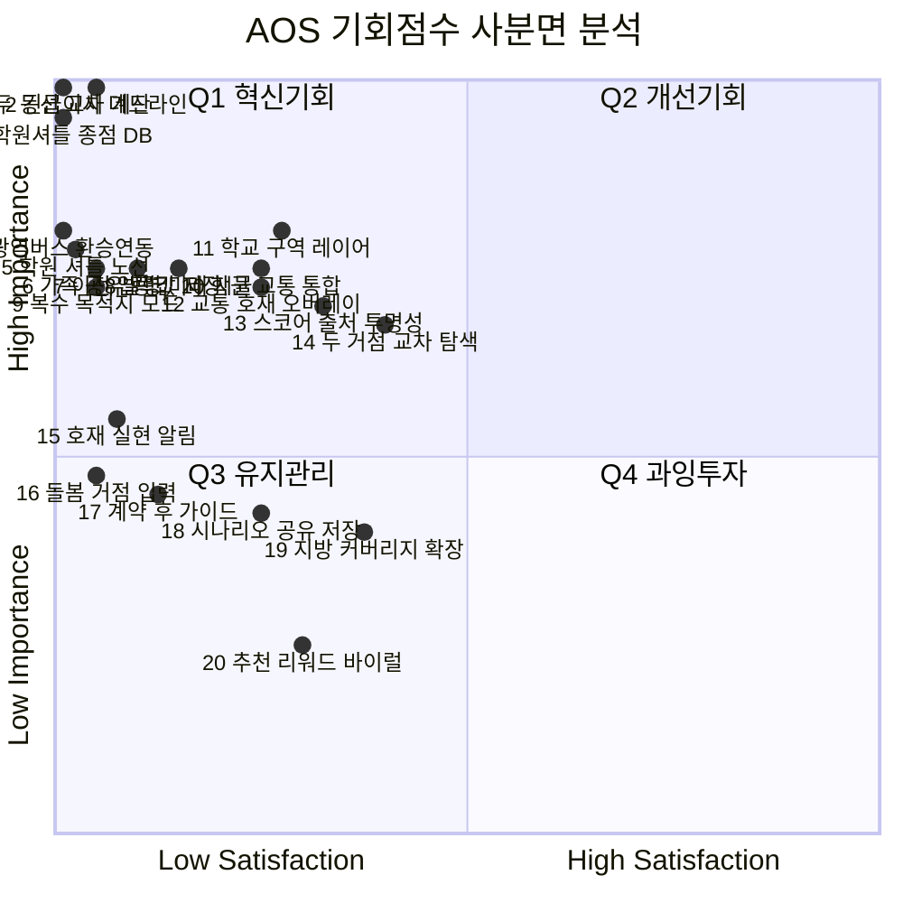

```mermaid
graph TD
    classDef q1 fill:#FFF1F2,stroke:#E11D48,stroke-width:2px;
    classDef q3 fill:#F8FAFC,stroke:#94A3B8,stroke-width:1px;
    classDef badge1 fill:#E24B4A,color:#fff,font-weight:bold;
    classDef badge2 fill:#D85A30,color:#fff,font-weight:bold;

    subgraph Q1_Innovation [Q1 핵심 혁신 기회 — AOS 3.0 이상]
        direction TB
        I1("`**1. 두 동선 동시 교차 계산 (AOS 4.00)**
        중요도: 5.0 / 만족도: 1.0`"):::badge1
        I2("`**3. 학원 셔틀 종점 DB 구축 (AOS 4.00)**
        중요도: 5.0 / 만족도: 1.0`"):::badge1
        I3("`**2. 긴급 이사 데드라인 모드 (AOS 3.80)**
        중요도: 5.0 / 만족도: 1.2`"):::badge1
        I4("`**4. 광역버스 착석·환승 데이터 (AOS 3.36)**
        중요도: 4.2 / 만족도: 1.0`"):::badge2
        I5("`**5. 학원 셔틀 노선 데이터 (AOS 3.20)**
        중요도: 4.1 / 만족도: 1.1`"):::badge2
        I6("`**6. 배우자·가족 공유 링크 (AOS 3.04)**
        중요도: 4.0 / 만족도: 1.2`"):::badge2
    end

    subgraph Q1_Next [Q1 개선 및 로드맵 기회 — AOS 2.0 ~ 2.99]
        direction TB
        N1("9. 복수 목적지 모드 (AOS 2.96)")
        N2("7. 입력값 저장 & 재방문 트리거 (AOS 2.88)")
        N3("8. 발령 시나리오 미래 시뮬레이션 (AOS 2.72)")
        N4("11. 학교 배정 구역 레이어 통합 (AOS 2.44)")
        N5("10. 학군+교통+매물 통합 화면 (AOS 2.40)")
    end

    subgraph Q3_Maintenance [Q3 유지 관리 및 보완 — AOS 2.0 미만]
        direction TB
        M1("16. 돌봄 거점(부모님 댁) 입력 (AOS 2.20)")
        M2("17. 계약 후 대응 가이드 (AOS 1.96)")
        M3("19. 지방 도시 데이터 확장 (AOS 1.30)")
        M4("20. 추천 리워드 프로그램 (AOS 1.12)")
    end

    style Q1_Innovation fill:#FFF1F2,stroke:#E11D48
    style Q1_Next fill:#FFF7ED,stroke:#F97316
    style Q3_Maintenance fill:#F1F5F9,stroke:#94A3B8
```

[aos_quadrant.html](attachment:bb4c1ec0-e1af-4bda-91b1-e9a4ab8c4a71:aos_quadrant.html)

## 📌 핵심 인사이트 — Q2·Q4가 완전히 비어있다

20개 Pain Point 중 충족도(S)가 3.0을 넘는 항목이 단 하나도 없습니다. 현재 시장의 어떤 도구도 이사 고민 고객의 주요 Pain을 제대로 해결하지 못하고 있다는 뜻입니다. 이것이 이 서비스의 진입 공백 근거입니다.

---

## 🔥 Q1 혁신기회 — 전략 행동별 분류

### MVP 즉시 구현 (AOS ≥ 3.5 · 3개)

| # | Pain Point | AOS | 전략 행동 |
| --- | --- | --- | --- |
| 1·3 | 두 동선 교차 계산 | 4.00 | 랜딩 첫 화면 핵심 훅. 두 주소 입력 → 교집합 지도 즉시 시각화. 이게 없으면 서비스 정체성 없음 |
| 2 | 긴급 데드라인 모드 | 3.80 | 입력 폼에 "이사 기한" 필드 추가 → 급매 우선 필터 + 계약 역산 타임라인 노출 |

### v1 핵심 기능 (AOS 2.5–3.4 · 6개)

| # | Pain Point | AOS | 전략 행동 |
| --- | --- | --- | --- |
| 4 | 광역버스 착석·환승 데이터 | 3.36 | 카카오 모빌리티 API 연동. 환승 횟수·출근 시간대 착석 가능 노선 표시 |
| 5 | 학원 셔틀 노선 데이터 | 3.20 | 학원 연합회 협력 또는 크라우드소싱으로 셔틀 정류장 DB 선구축 |
| 6 | 배우자·가족 공유 링크 | 3.04 | 결과 페이지에 "배우자에게 공유" 버튼 + 무료 미리보기 1곳 — 결제 전환율 직결 |
| 7 | 이전 입력값 저장 | 2.88 | 로그인 시 조건 자동 저장 → 재발령·재이사 시 원클릭 재탐색 |
| 8 | 발령 시나리오 시뮬레이션 | 2.72 | 발령 후보지 2~3곳 입력 → 시나리오별 동선 변화 비교 화면 |
| 9 | 복수 목적지 모드 | 2.96 | v1 후반 or v2 초입 — Extreme 페르소나 수요 검증 후 개발 여부 결정 |

### v1.5 개선 기능 (AOS 2.0–2.4 · 5개)

| # | Pain Point | AOS | 전략 행동 |
| --- | --- | --- | --- |
| 10·11 | 학군+교통+매물 통합 / 학교 배정 구역 | 2.40·2.44 | 학교 배정 구역 레이어 on/off 토글 + 학원가 히트맵 통합 |
| 12·15 | 교통 호재 오버레이 / 호재 알림 | 2.34·2.37 | 철도 개발 노선 레이어 추가 + 관심 지역 호재 실현 푸시 알림 |
| 13 | 스코어 출처 투명성 | 2.05 | 각 지표 옆 데이터 출처 배지 표시 (국토부·카카오 등) — 신뢰 확보 + 배우자 설득 자료 |

---

## ⚫ Q3 유지관리 — 자원 배분 재검토 대상

| # | Pain Point | AOS | 판단 |
| --- | --- | --- | --- |
| 14 | 이직자 두 거점 탐색 | 1.78 | Adjacent 세그먼트. Core 타깃 완성 후 확장 여부 검토 |
| 16 | 돌봄 거점 입력 | 2.20 | 아직 Q3이지만 고령화 추세상 중장기 잠재력 있음 |
| 17 | 계약 후 대응 가이드 | 1.96 | 콘텐츠 마케팅으로 해결 가능. 개발 리소스 불필요 |
| 18 | 시나리오 공유 PDF | 1.62 | 공유 링크(#6)로 대체 가능. 별도 개발 우선순위 낮음 |
| 19 | 지방 도시 커버리지 | 1.30 | Adjacent(윤서진⑧) 전용. MVP 범위 밖 |
| 20 | 추천 리워드 | 1.12 | 바이럴 자체는 정우진④처럼 자발적으로 발생. 공식화는 MAU 확보 후 |

---

## 🗺 로드맵 요약

`MVP (0~3개월)       v1 (3~6개월)         v1.5 (6~12개월)     v2 (12개월+)
─────────────────   ──────────────────   ─────────────────   ─────────────────
두 동선 교차 지도   광역버스 착석 데이터  학교 배정 구역 레이어 복수 목적지 모드
긴급 데드라인 모드  학원 셔틀 노선 DB     교통 호재 오버레이   학원 셔틀 완전체
배우자 공유 링크    입력값 저장           호재 알림 구독       돌봄 거점 입력
                    발령 시나리오 비교    스코어 출처 투명성`

AOS 기준으로 보면 **MVP 3개 → v1 6개 → v1.5 5개 → v2 이후**로 단계적 자원 배분이 자연스럽게 정렬됩니다. Q3 항목들은 콘텐츠 마케팅이나 외부 파트너십으로 해결할 수 있어 직접 개발 투자가 불필요합니다.

AOS와 같은 Pain Point 목록에 DOS를 적용했습니다. **Market Relevance(MR)** 산정 근거는 TAM 규모, 데이터 확보 난이도, 채택 용이성, 맘카페·SNS 확산 가능성을 기준으로 했습니다.

---

## DOS 결과표 (내림차순)

| Pain / Goal | Importance | Satisfaction | Market Relevance | DOS | Insight |
| --- | --- | --- | --- | --- | --- |
| 두 동선 동시 교차 계산 | 5.0 | 1.0 | 1.0 | **4.00** | 서비스 정체성 그 자체. TAM·확산성·채택 용이성 모두 최고 등급. 이게 없으면 서비스가 아님 |
| 긴급 이사 데드라인 모드 | 5.0 | 1.2 | 0.7 | **2.66** | 전체 이사 수요의 약 30%가 비자발적 긴급 이사. 고통 강도 최대, 단 전체 TAM의 일부라 MR 0.7 |
| 배우자·가족 공유 링크 | 4.0 | 1.2 | 0.9 | **2.52** | 구현 단순, 결제 전환율에 직결, 맘카페 바이럴 트리거. AOS보다 DOS 순위가 오름 — 실행 가성비 최고 |
| 광역버스 착석·환승 데이터 | 4.2 | 1.0 | 0.7 | **2.24** | 카카오 모빌리티 API 연동으로 구현 가능. 수도권 한정이라 MR 0.7. 박상민 페르소나 핵심 |
| 이전 입력값 저장·재방문 트리거 | 4.0 | 1.4 | 0.8 | **2.08** | 재구매율·LTV 직결. 구현 비용 낮고 반복 이사 세그먼트(이수현) 전체에 해당. 로그인 기능만 있으면 됨 |
| 학교 배정 구역 레이어 통합 | 4.2 | 2.1 | 0.85 | **1.79** | 공개 데이터로 구현 가능. Core 타깃 전원 해당. 충족도(S=2.1)가 조금 있어 DOS는 중간권 |
| 학군+교통+매물 통합 화면 | 4.0 | 2.0 | 0.85 | **1.70** | 수요 넓고 확산성 높으나 직방·호갱노노가 부분 해결 중. 차별화 포인트는 "두 동선과의 연동" |
| 학원 셔틀 종점 DB 구축 | 5.0 | 1.0 | 0.40 | **1.60** | 중요도·불만족은 최고지만 데이터 확보 비용이 매우 높고 타깃이 Extreme 페르소나에 집중. MR 0.4로 하락 |
| 복수 목적지 모드 (v2) | 3.9 | 1.2 | 0.55 | **1.49** | 강민수 Extreme 케이스. 수요는 있으나 MVP 타깃 밖. 데이터 구조 복잡도도 높아 MR 낮음 |
| 학원 셔틀 노선 데이터 | 4.1 | 1.1 | 0.45 | **1.35** | 셔틀 DB 미구축 상태에서 노선 레이어는 종점 DB 이후 단계. 선행 조건이 있어 MR 페널티 |
| 교통 호재 레이어 오버레이 | 3.9 | 2.0 | 0.70 | **1.33** | 국토부 공개 데이터 활용 가능. 최유리 페르소나의 핵심 트리거. 구독 모델 연결점 |
| 발령 시나리오 미래 시뮬레이션 | 4.0 | 1.6 | 0.55 | **1.32** | 교사·공무원 특수 세그먼트에 집중. TAM 작아 MR 0.55. 이수현 전용 기능이라 로드맵 후순위 |
| 스코어 데이터 출처 투명성 | 3.8 | 2.3 | 0.80 | **1.20** | 신뢰 자산이라 MR 높음. 하지만 충족도가 상대적으로 높고(S=2.3) 차별화 강도 낮아 중간권 |
| 호재 실현 알림 구독 | 3.2 | 1.3 | 0.60 | **1.14** | 구독 모델 유지 명분. 단 중요도(I=3.2) 자체가 낮고 니치해서 MR 0.6 |
| 돌봄 거점(부모님 댁) 입력 | 2.9 | 1.2 | 0.45 | **0.77** | 고령화 추세상 중장기 잠재력 있으나 현재 TAM 작음. v2 이후 확장 검토 대상 |
| 계약 후 대응 가이드 콘텐츠 | 2.8 | 1.5 | 0.55 | **0.72** | 콘텐츠 마케팅으로 해결 가능. 개발 리소스 투입 불필요. 블로그·유튜브 대체 가능 |
| 이직자 두 거점 교차 탐색 | 3.7 | 2.6 | 0.65 | **0.72** | Adjacent 세그먼트. 수요는 있으나 Core 완성 전 확장은 집중도 분산 위험 |
| 시나리오 공유 링크·PDF 저장 | 2.7 | 2.0 | 0.50 | **0.35** | 공유 링크(DOS 2.52)로 대체 가능. 별도 PDF 개발 ROI 낮음 |
| 지방 도시 데이터 커버리지 | 2.6 | 2.5 | 0.35 | **0.04** | I≈S라 불만족 자체가 거의 없음. 윤서진⑧ 전용, MVP 범위 완전 밖 |
| 추천 리워드·바이럴 프로그램 | 2.0 | 2.2 | 0.65 | **-0.13** | I < S — 현재 수준으로도 충분히 만족. 자원 투입 시 과잉투자. 자발적 바이럴에 맡길 것 |

---

## AOS vs DOS — 달라진 순위에서 읽히는 것

DOS가 Market Relevance를 곱하면서 **AOS와 순위가 크게 달라진 항목이 두 가지**입니다.

**학원 셔틀 DB**는 AOS 공동 1위(4.00)였지만 DOS에서는 8위(1.60)로 내려왔습니다. 불만족은 극심하지만 데이터 확보 난이도가 너무 높아 실행 기회로 보기 어렵다는 뜻입니다. 로드맵 후순위로 미루는 판단이 수치로 뒷받침됩니다.

반대로 **배우자 공유 링크**는 AOS 6위였지만 DOS에서는 3위(2.52)로 올라왔습니다. 구현이 단순하고 결제 전환·바이럴 모두에 직결되기 때문입니다. 가장 빠르게 실행해야 할 기능이라는 게 DOS로 더 선명해집니다.

**추천 리워드**는 DOS가 유일하게 음수(-0.13)입니다. 만족도가 중요도보다 높다는 뜻으로, 지금 이미 자발적 추천이 일어나고 있으니 공식 리워드 프로그램에 자원을 쓸 이유가 없습니다.

`
```