# Software Requirements Specification (SRS)

**Document ID:** SRS-001
**Revision:** 1.0
**Date:** 2026-04-15
**Standard:** ISO/IEC/IEEE 29148:2018

| 항목 | 내용 |
| --- | --- |
| **제품명** | 내 하루 동선 맞춤 동네 궁합 진단기 |
| **Owner 팀** | Product Squad (PM + Design + Engineering) |
| **Source PRD** | PRD v0.1-rev.2 (2026-04-12) |
| **승인 상태** | Draft |

---

## 1. Introduction

### 1.1 Purpose

본 SRS는 **"내 하루 동선 맞춤 동네 궁합 진단기"** 서비스의 소프트웨어 요구사항을 정의한다.

이사를 앞둔 3040 맞벌이 부부·긴급 이사자·반복 이사자가 **두 사람의 출퇴근 동선을 동시에 만족하는 동네를 찾을 도구가 시장에 존재하지 않아** 발생하는 다음 문제를 해결한다:

- **주거 미스매치:** 대형 플랫폼(네이버부동산·직방)은 정량적 매물 데이터(가격·평수)만 제공하며, 개인 라이프스타일 맥락 반영 체감 데이터(오르막 경사, 야간 소음, 출퇴근 체감 피로도) 결핍
- **탐색 비용 낭비:** 수작업 동네 탐색 평균 4.2개월, 오프라인 임장 평균 12회/건
- **심리적 고립감:** 부부 합의 실패율 70%(1차 합의), 개인 성향 기반 동네 선택 B2C 서비스 부재

본 문서는 개발팀·QA팀·운영팀이 시스템을 구현·검증·운영하기 위한 유일한 기술 요구사항 원천(Single Source of Truth)으로 사용된다.

### 1.2 Scope

#### 1.2.1 In-Scope (MVP)

| # | 포함 범위 | 상세 |
| --- | --- | --- |
| IS-01 | 두 동선 교차 진단 | 주소 2개 입력 → 교집합 후보 동네 지도 시각화 + 출퇴근 시간 표시 |
| IS-02 | 배우자 공유 링크 | URL 공유 + 무료 미리보기 1곳 + 데이터 출처 배지 |
| IS-03 | 데드라인 모드 | 이사 기한 입력 → 급매 우선 필터 + 계약 역산 타임라인 |
| IS-04 | 싱글 모드 | 학군 숨김 + 야간 치안·라이프스타일 레이어 기본 활성화 간소화 리포트 |
| IS-05 | 서비스 커버리지 | 수도권(서울·경기·인천) 한정 (ADR-003) |
| IS-06 | 인증 | OAuth 2.0 (카카오·네이버 소셜 로그인) |
| IS-07 | 과금 모델 | 하이브리드 — 1회 진단 30,000원 + 월정액 10,000원/월 (ADR-002) |

#### 1.2.2 Out-of-Scope (MVP)

| # | 제외 범위 | 사유 | 예정 Phase |
| --- | --- | --- | --- |
| OS-01 | 매물 중개 / 계약 체결 | 부동산 중개업 라이선스 필요 | v1+ |
| OS-02 | 학원 셔틀 종점 DB | TAM 0.4 협소, 학원 연합회 파트너십 필수 | v2 |
| OS-03 | 지방(비수도권) 커버리지 | 교통 API·매물 데이터 커버리지 부족 | v1.5+ |
| OS-04 | 복수 목적지 모드 (최대 5개) | 교차 계산 알고리즘 복잡도 O(n²) 증가 | v2 |
| OS-05 | 추천 리워드 프로그램 | DOS -0.20, 자발적 바이럴 저해 위험 | 삭제 확정 |

#### 1.2.3 Constraints (제약사항)

| # | 제약 유형 | 내용 | 근거 |
| --- | --- | --- | --- |
| CON-01 | 기술 | 1차 교통 데이터 소스: 카카오 모빌리티 API, 장애 시 네이버 지도 API 자동 전환 | ADR-001 |
| CON-02 | 사업 | 하이브리드 과금 모델: 1회 30,000원 + 월정액 10,000원/월 | ADR-002 |
| CON-03 | 지역 | MVP 수도권(서울·경기·인천) 한정 | ADR-003 |
| CON-04 | 규제 | 부동산 중개업법에 따라 매물 중개·계약 체결 기능 제외 | OS-01 |
| CON-05 | 비용 | 월 API 호출 비용 ≤ 500만원, 월 서버 비용 ≤ 300만원 | PRD §5-3 |
| CON-06 | 데이터 | 급매 크롤링 시 robots.txt 준수 + 법률 검토 필수 | R2 |
| CON-07 | 기술 | 교통 데이터 다중 백업 체계: 카카오 → 네이버 → ODsay Lab API → 사전 캐시 DB(24h TTL). 3차 API까지 실패 시 내부 캐시 DB로 우회하고 "⚠ 실시간 데이터 아님" 배지 표시 | ADR-001 확장 |
| CON-08 | 마케팅 | 핵심 획득 채널(맘카페·부동산 커뮤니티) 변경·차단 시 대체 채널(SEO, SEM, 인플루언서, 오프라인 제휴) 14일 내 전환 운영 계획 수립 필수 | ASM-02 |

#### 1.2.4 Assumptions (가정)

| # | 가정 | 검증 방법 |
| --- | --- | --- |
| ASM-01 | 카카오 모빌리티 API 무료 tier(일 50만 건)로 MVP 트래픽 감당 가능 | MVP 출시 전 예상 트래픽 시뮬레이션 |
| ASM-02 | 맘카페·부동산 커뮤니티가 유효한 핵심 획득 채널. **채널 변경·불가 시 우회 전략:** ① 네이버 카페·블로그 SEO 콘텐츠 마케팅, ② Instagram·YouTube 부동산 인플루언서 협업, ③ 카카오톡 오픈채팅방 타겟 커뮤니티 운영, ④ Google/Naver 검색 광고(SEM), ⑤ 부동산 중개소 제휴 리플릿 배포 | 베타 기간 채널별 CAC 측정. 핵심 채널 차단 시 14일 내 대체 채널 전환. 대체 채널 CAC ≤ 핵심 채널 CAC × 1.5 목표 |
| ASM-03 | 3040 부부의 WTP 3~5만원이 유효 | 베타 유저 결제 데이터 실측 |
| ASM-04 | 데이터 출처 배지가 신뢰도 향상에 유의미한 영향 | A/B 테스트: 배지 유/무 → NPS 차이 (EXP-4) |
| ASM-05 | 모든 외부 API의 사전 캐시/수집 DB가 서비스 품질 저하를 최소화한 우회 운영을 지원 | 분기별 캐시 DB 정합성 검증 (실제 API 응답 대비 오차율 ≤ 15%). 캐시 히트율 모니터링 |

### 1.3 Definitions, Acronyms, Abbreviations

| 용어 | 정의 |
| --- | --- |
| **페르소나 (Persona)** | 제품의 핵심 사용자 유형을 대표하는 가상 인물 프로필 |
| **JTBD (Jobs to be Done)** | 사용자가 특정 상황에서 완수하고자 하는 과업 |
| **AOS (Adjusted Opportunity Score)** | Pain Point의 중요도와 불만족도를 결합한 기회 점수 (1~5 척도) |
| **DOS (Discovered Opportunity Score)** | 솔루션 구현 시 기대되는 효과를 반영한 발견 기회 점수 |
| **MoSCoW** | Must / Should / Could / Won't 우선순위 분류 체계 |
| **교집합 후보 동네** | 두 출퇴근 거점에서 설정 조건(최대 통근 시간·예산) 내 동시 도달 가능한 행정동 |
| **데드라인 모드** | 이사 마감 기한을 입력하면 급매 매물 우선 필터링 + 계약 역산 타임라인을 제공하는 모드 |
| **싱글 모드** | 1인 가구 대상으로 학군·가족 항목을 숨기고 야간 치안·편의시설·카페 밀집도 레이어를 기본 활성화하는 모드 |
| **공유 링크** | 진단 결과를 비회원 배우자에게 전달하기 위한 고유 URL (유효기간 30일) |
| **WTP (Willingness to Pay)** | 사용자의 서비스 지불 의향 금액 |
| **북극성 KPI** | 서비스의 핵심 성공을 판단하는 단일 최상위 지표 (유료 진단 리포트 완료 수/주) |
| **CJM (Customer Journey Map)** | 고객 여정 지도 — 사용자의 서비스 이용 단계별 경험 매핑 |
| **SUS (System Usability Scale)** | 시스템 사용성 척도 — 표준화된 사용성 평가 점수 |
| **K-factor** | 바이럴 계수 — 기존 사용자 1명이 유입시키는 신규 사용자 수 |
| **NPS (Net Promoter Score)** | 순추천 고객 지수 — 서비스 추천 의향을 -100~100으로 측정 |
| **RPO (Recovery Point Objective)** | 재해 복구 시 허용 가능한 최대 데이터 손실 시간 |
| **RTO (Recovery Time Objective)** | 재해 발생 후 서비스 복구까지 허용 가능한 최대 시간 |
| **ADR (Architecture Decision Record)** | 아키텍처 설계 결정 사항과 근거를 기록한 문서 |

### 1.4 References

| ID | 문서명 | 버전/일자 | 비고 |
| --- | --- | --- | --- |
| REF-01 | PRD: 내 하루 동선 맞춤 동네 궁합 진단기 | v0.1-rev.2 (2026-04-12) | 본 SRS의 유일한 비즈니스·기능 요구 원천. JTBD 인터뷰 14건(PRD §9-1), AOS/DOS 분석 20개 Pain Point(PRD §9-1), CJM 5세그먼트×5단계(PRD §2-3), TAM-SAM-SOM(PRD §9-2), WTP 검증(PRD §9-3), 벤치마크(PRD §9-4) 등 모든 근거 데이터를 직접 포함 |
| REF-02 | ISO/IEC/IEEE 29148:2018 | 2018 | 본 SRS 작성 표준 |

> **참고:** 아래 시장 데이터는 PRD §9-2에 직접 수록되어 있으며, 원출처를 부기한다.

| 원출처 | 데이터 | PRD 인용 위치 |
| --- | --- | --- |
| Precedence Research (2025) | 글로벌 프롭테크 TAM $470억 → $2,090억 (CAGR 16%) | PRD §9-2 |
| 한국프롭테크포럼 (2025) | 국내 약 2조 3,112억원 (134개사) | PRD §9-2 |
| 국토교통부 전·월세 통계 (2023) | SAM 750억+ 산출 근거 | PRD §9-2 |
| 통계청 — 1인 가구 전월세 비율 (2023) | 34%, 싱글 모드 근거 | PRD §9-2 |
| 여성가족부 가족실태조사 (2023) | 30대 부모 방문부양 비율 23.8% | PRD §9-2 |
| 통계청 — 연간 이직자 수 (2023) | 약 330만 명 | PRD §9-2 |

---

## 2. Stakeholders

| # | 역할 (Role) | 대표 페르소나 | 책임 (Responsibility) | 관심사 (Interest) |
| --- | --- | --- | --- | --- |
| STK-01 | **맞벌이 부부 사용자 (C-01)** | ①김지영 (36, 워킹맘) | 두 직장 주소를 입력하고 교집합 후보 동네를 확인, 배우자와 결과를 공유하여 합의 도출 | 수작업 탐색 시간 2~3h→10분 단축, 부부 합의 기간 4.2개월→2주, 오프라인 임장 12회→3회 |
| STK-02 | **맹모삼천지교 사용자 (C-02)** | ②박상민 (41, IT기획자) | 학군 + 광역버스 착석 통합 조건으로 진단 수행, 리포트 기반 의사결정 | 학군+교통 동시 계산, 착석 가능 노선 정보, 객관적 제3자 스코어 |
| STK-03 | **긴급 이사 사용자 (C-03)** | ④정우진 (38, 영업과장) | 이사 마감 기한 입력 후 데드라인 모드로 급매 필터링, 계약 역산 타임라인 활용 | 일일 앱 탐색 시간 2h→30분, D-2개월 내 계약 완료, 급매 실시간 연동 |
| STK-04 | **반복 이사 사용자 (C-04)** | ⑤이수현 (39, 공립교사) | 이전 탐색 결과 저장 후 발령 시 원클릭 재탐색, 시나리오 비교 | 매 이사 건 원점 재시작(3주) → 3일, 입력값 자동 저장·복원 |
| STK-05 | **이직 후 이사 사용자 (A-01)** | ⑥이준혁 (32, 이직자) | 싱글 모드로 학군 없이 야간 치안·라이프스타일 중심 추천 확인 | 불필요 항목(학군) 제거, 3일 내 후보 5곳 추림, 혼자 결정 불안감 60% 감소 |
| STK-06 | **배우자 (2nd User)** | 공유 링크 수신자 | 공유 링크를 통해 진단 결과 열람, 무료 미리보기 확인 후 유료 전환 의사결정 참여 | 앱 설치 없이 모바일 웹 열람, 동일 데이터 기반 합의 |
| STK-07 | **Product Manager** | — | PRD 기반 기능 정의, 실험 설계, KPI 모니터링, 우선순위 조정 | 북극성 KPI 달성, 유료 전환율 ≥ 8%, NPS ≥ 50 |
| STK-08 | **Engineering Team** | — | 시스템 설계·구현·배포, API 연동, 성능 최적화 | 기술 제약 준수, p95 응답 목표 달성, 코드 품질 |
| STK-09 | **QA Team** | — | 기능·비기능 요구사항 검증, AC 기반 테스트 케이스 작성·실행 | 테스트 커버리지, 크리티컬 버그 0건 출시 |
| STK-10 | **운영/DevOps Team** | — | 인프라 운영, 모니터링, 장애 대응, FinOps | SLA ≥ 99.5%, RTO ≤ 4h, 월 비용 한도 준수 |

---

## 3. System Context and Interfaces

### 3.1 External Systems

| # | 외부 시스템 | 유형 | 용도 | 입력 | 출력 | 제약 |
| --- | --- | --- | --- | --- | --- | --- |
| EXT-01 | 카카오 모빌리티 API | 외부 API (1차) | 대중교통 경로·환승·소요시간 | 출발/도착 좌표, 출발 시각 | 경로·소요시간·환승 횟수·도보 거리 | 일 50만 건 (무료 tier), 초과 시 종량제 |
| EXT-02 | 네이버 지도 API | 외부 API (백업) | 카카오 장애 시 자동 전환 백업 | 출발/도착 좌표, 출발 시각 | 경로·소요시간 | ADR-001에 따른 장애 시 전환 |
| EXT-03 | 국토교통부 실거래가 API | 공공 API | 전·월세 실거래가 | 법정동 코드, 기간 | 거래일·보증금·월세·면적 | 일 1,000건 (OpenAPI) |
| EXT-04 | 경찰청 범죄 통계 API | 공공 API | 야간 치안 데이터 | 관할서 코드, 기간 | 범죄 유형별 발생 건수 | 분기 갱신 |
| EXT-05 | 교육부 학교 배정 구역 | 공공 API | 초등 배정 구역 좌표 | 시도교육청 코드 | 학교별 배정 구역 폴리곤 | 연 1회 갱신 |
| EXT-06 | 결제 PG사 (토스페이먼츠) | 외부 서비스 | 유료 리포트 결제 처리 | 결제 요청 정보 | 결제 결과·트랜잭션 ID | PCI-DSS 준수 |
| EXT-07 | OAuth Provider (카카오/네이버) | 외부 서비스 | 소셜 로그인 인증 | OAuth 인증 요청 | 액세스 토큰·사용자 프로필 | OAuth 2.0 표준 |
| EXT-08 | 매물 데이터 소스 (직방/피터팬) | 외부 API/크롤링 | 급매 매물 데이터 | 지역 코드, 필터 조건 | 매물 정보(가격·면적·등록일) | robots.txt 준수, 법률 검토 필수 (R2) |
| EXT-09 | ODsay Lab API | 외부 API (3차 백업) | 대중교통 경로·환승·소요시간 | 출발/도착 좌표 | 경로·소요시간·환승 횟수 | 대중교통 전문. 자차 경로 미지원. 카카오·네이버 모두 장애 시 전환 |
| EXT-10 | TAGO (전국 대중교통 정보) | 공공 API (4차 백업) | 버스·지하철 노선·시간표 | 노선 번호, 정류소 ID | 노선 정보·도착 예정 시간 | 국토교통부 공공데이터 포털. 실시간성 제한 (배치 갱신) |

#### 3.1.1 외부 시스템 장애 시 우회 전략

> 모든 외부 API는 장애·정책 변경·서비스 종료 가능성이 존재한다. 아래 표는 각 외부 시스템별 우회 전략과 **사전 확보 데이터(내부 DB)** 활용 방안을 정의한다.

| # | 외부 시스템 | 1차 우회 | 2차 우회 | 최종 폴백 (내부 DB) | 캐시/DB 갱신 주기 | 허용 지연 |
| --- | --- | --- | --- | --- | --- | --- |
| EXT-01 | 카카오 모빌리티 API | 네이버 지도 (EXT-02) 자동 전환 | ODsay Lab (EXT-09) | **사전 캐시 DB**: 최근 24h 경로 계산 결과. 캐시 히트 시 데이터 반환 + "⚠ 실시간 데이터 아님" 배지 표시 | API 호출 시 실시간 적재 | ≤ 24h |
| EXT-02 | 네이버 지도 API | 카카오 (EXT-01) | ODsay Lab (EXT-09) | 사전 캐시 DB (EXT-01 공유) | 실시간 | ≤ 24h |
| EXT-03 | 국토교통부 실거래가 | — | — | **사전 수집 DB**: 일 1회 배치 적재 (새벽 03:00). 최근 6개월 실거래가 보유. 장애 시 DB + "최종 갱신: YYYY-MM-DD" 표시 | 일 1회 | ≤ 24h |
| EXT-04 | 경찰청 범죄 통계 | — | — | **사전 수집 DB**: 분기 1회 배치 적재. 최근 4분기 통계 보유. 정적 데이터 특성상 장애 영향 최소 | 분기 1회 | ≤ 1분기 |
| EXT-05 | 교육부 학교 배정 구역 | — | — | **사전 수집 DB**: 연 1회 적재 (매년 2월). 배정 구역 폴리곤 정적 데이터. API 무관하게 내부 DB 우선 사용 | 연 1회 | ≤ 1년 (정적) |
| EXT-06 | 결제 PG사 (토스페이먼츠) | — | — | **결제 보류 큐**: PG 장애 시 결제 요청을 내부 큐에 저장. "결제 처리 중" 안내 → 복구 후 자동 재시도. 30분 초과 시 재결제 안내 | — | ≤ 30분 |
| EXT-07 | OAuth Provider | — | — | **게스트 모드**: OAuth 장애 시 이메일 인증 기반 임시 계정 생성 허용. 복구 후 소셜 계정 병합 안내. 비인증 체험 모드 제공 | — | 즉시 전환 |
| EXT-08 | 매물 데이터 소스 | — | — | **사전 크롤링 DB**: 4h 주기 크롤링 결과 보유. 크롤링 차단 시 국토교통부 실거래가 DB(EXT-03)만으로 가격 정보 제공 + "실시간 매물 일시 불가" 안내 | 4시간 | ≤ 4h |
| EXT-09 | ODsay Lab API | 카카오 (EXT-01) | 네이버 (EXT-02) | 사전 캐시 DB (EXT-01 공유) | 실시간 | ≤ 24h |
| EXT-10 | TAGO 공공 API | — | — | **사전 수집 DB**: 노선·시간표 정적 데이터 주 1회 배치 적재 | 주 1회 | ≤ 1주 |

> **우회 설계 원칙:**
> 1. **Graceful Degradation**: 외부 API 장애 시 서비스 전체 중단이 아닌, 데이터 신선도를 낮추되 핵심 기능은 유지
> 2. **투명한 표시**: 캐시/사전수집 데이터 사용 시 "⚠ 데이터 갱신 지연" 배지를 UI에 표시하여 사용자 신뢰 유지
> 3. **사전 적재 의무**: 공공 데이터(EXT-03~05)는 API 가용 여부와 무관하게 배치 파이프라인으로 내부 DB에 사전 적재하며, 이를 기본 데이터 소스로 활용
> 4. **자동 폴백**: Datadog 헬스체크로 각 외부 시스템 가용성을 모니터링하고, 장애 감지 시 30초 이내에 자동 폴백 트리거 (REQ-NF-035, 036 연동)

### 3.2 Client Applications

| # | 클라이언트 | 플랫폼 | 설명 |
| --- | --- | --- | --- |
| CLT-01 | 웹 애플리케이션 (SPA) | 모바일 웹 + 데스크톱 웹 | 회원용 메인 서비스. 진단·리포트·저장·결제 전체 기능 |
| CLT-02 | 공유 링크 페이지 | 모바일 웹 (비회원) | 비회원 배우자 대상. 앱 설치 없이 리포트 열람 + 무료 미리보기 1곳 |

### 3.3 API Overview

| # | Endpoint | Method | 용도 | 인증 필요 |
| --- | --- | --- | --- | --- |
| API-01 | `/api/v1/diagnosis` | POST | 진단 생성 (두 동선 교차 계산) | Yes (JWT) |
| API-02 | `/api/v1/diagnosis/{id}` | GET | 진단 결과 조회 | Yes (JWT) |
| API-03 | `/api/v1/diagnosis/{id}/share` | POST | 공유 링크 생성 | Yes (JWT) |
| API-04 | `/api/v1/diagnosis/{id}/report` | GET | 리포트 조회 (공유 링크 포함) | Conditional (JWT 또는 공유 토큰) |
| API-05 | `/api/v1/search/save` | POST | 입력값 저장 | Yes (JWT) |
| API-06 | `/api/v1/search/replay` | POST | 과거 조건 재탐색 | Yes (JWT) |
| API-07 | `/api/v1/auth/login` | POST | OAuth 소셜 로그인 | No |
| API-08 | `/api/v1/auth/refresh` | POST | JWT 토큰 갱신 | Yes (Refresh Token) |
| API-09 | `/api/v1/payment/checkout` | POST | 결제 요청 | Yes (JWT) |
| API-10 | `/api/v1/payment/webhook` | POST | PG사 결제 결과 콜백 | No (서명 검증) |

### 3.4 Interaction Sequences (핵심 시퀀스 다이어그램)

#### 3.4.1 두 동선 교차 진단 핵심 플로우

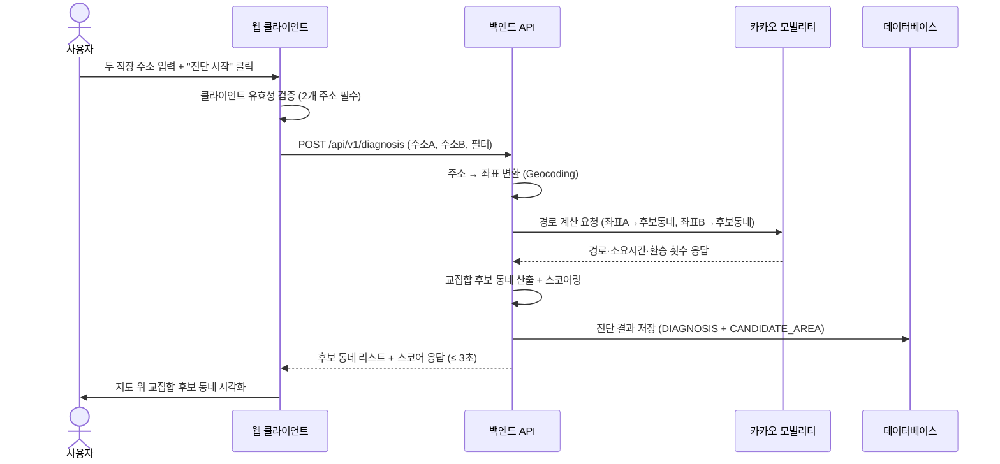

#### 3.4.2 배우자 공유 링크 핵심 플로우

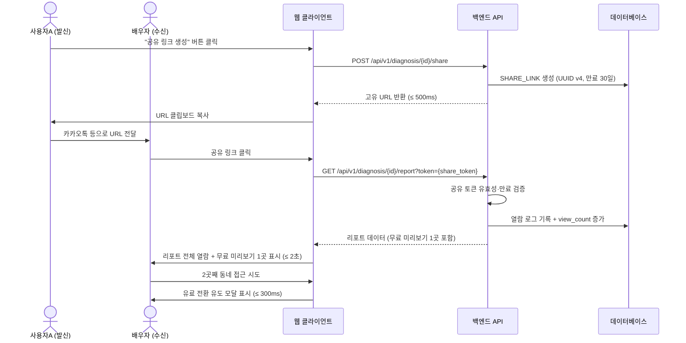

#### 3.4.3 데드라인 모드 핵심 플로우

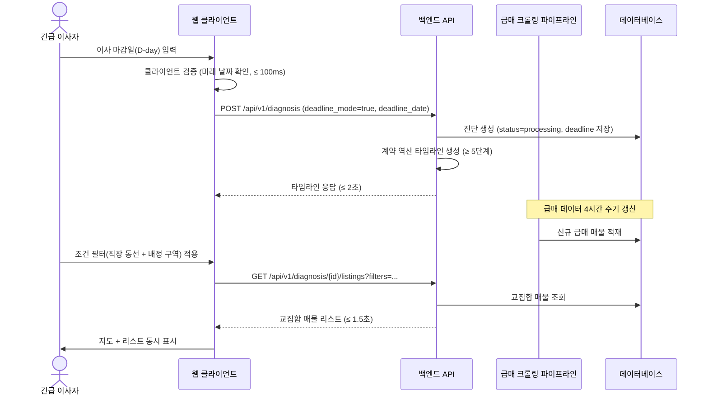

---

## 4. Specific Requirements

### 4.1 Functional Requirements

> **범례:** Source = PRD 사용자 스토리/기능 번호, Priority = MoSCoW, AC = Acceptance Criteria (Given/When/Then)

#### 4.1.1 F1: 두 동선 교차 진단 (Source: Story 3-1, F1)

| ID | 요구사항 | Priority | Source |
| --- | --- | --- | --- |
| **REQ-FUNC-001** | 시스템은 사용자가 두 개의 직장 주소를 입력할 수 있는 인터페이스를 제공해야 한다. 각 주소 입력 필드는 자동완성(Geocoding) 기능을 포함해야 한다. | Must | Story 3-1 |
| **REQ-FUNC-002** | 시스템은 두 개의 직장 주소가 모두 입력된 경우에만 "진단 시작" 버튼을 활성화해야 한다. 주소가 1개만 입력된 상태에서 "진단 시작" 클릭 시 "두 번째 주소를 입력해 주세요" 인라인 에러를 200ms 이내에 표시하고, 진단 API 호출을 차단해야 한다. 불완전 요청의 서버 도달률은 0%여야 한다. | Must | Story 3-1, AC-N1 |
| **REQ-FUNC-003** | 시스템은 두 직장 주소를 기반으로 교집합 후보 동네를 3곳 이상 산출하고, 지도 위에 시각화해야 한다. 교통 API 호출 포함 총 응답 시간은 p95 ≤ 3,000ms이며, 실패율은 1% 미만이어야 한다. | Must | Story 3-1, AC-1 |
| **REQ-FUNC-004** | 시스템은 각 후보 동네를 탭했을 때 양쪽 직장까지의 예상 출퇴근 시간(대중교통·자차)을 표시해야 한다. 카카오맵 API 대비 시간 오차는 ±10% 이내여야 한다. | Must | Story 3-1, AC-2 |
| **REQ-FUNC-005** | 시스템은 출근 시간대(오전 7~9시 범위)를 변경했을 때 해당 시간대 평균 소요시간으로 출퇴근 시뮬레이션을 재계산해야 한다. 재계산 응답은 p95 ≤ 2,000ms이며, 시간대별 데이터 커버리지는 수도권 85% 이상이어야 한다. | Must | Story 3-1, AC-3 |
| **REQ-FUNC-006** | 시스템은 조건 필터(최대 통근 시간, 예산)를 적용했을 때 조건에 맞지 않는 후보를 실시간 필터링하고 지도를 갱신해야 한다. 필터 적용 응답은 p95 ≤ 1,000ms여야 한다. | Must | Story 3-1, AC-4 |
| **REQ-FUNC-007** | 시스템은 교통 API 타임아웃(5초 이상 무응답) 발생 시 "일시적 오류" 토스트를 표시하고 자동 재시도 1회를 수행해야 한다. 재시도 실패 시 "잠시 후 다시 시도해 주세요" 안내를 표시하고 실패 로그를 전송해야 한다. 재시도 포함 총 응답은 10초 이내이며, 무한 로딩 노출은 0건이어야 한다. | Must | Story 3-1, AC-N2 |
| **REQ-FUNC-008** | 시스템은 두 직장 간 거리로 인해 교집합 후보가 0곳인 경우 "조건을 만족하는 동네가 없습니다. 최대 통근 시간을 늘려보세요" 안내를 1초 이내에 표시하고, 조건 완화 제안을 2개 이상 제공해야 한다. | Must | Story 3-1, AC-N3 |

**REQ-FUNC-003 Acceptance Criteria:**

| AC | Given | When | Then |
| --- | --- | --- | --- |
| AC-1 | 사용자가 두 개의 직장 주소(수도권 내)를 입력 완료 | "진단 시작" 버튼 클릭 | 교집합 후보 동네 ≥ 3곳이 지도 위에 시각화된다. 응답 시간 ≤ 3초, 실패율 < 1% |
| AC-2 | 교집합 결과가 지도에 표시된 상태 | 각 후보 동네를 탭 | 양쪽 직장까지 예상 출퇴근 시간(대중교통·자차) 표시. 시간 오차 ≤ ±10% |
| AC-3 | 출근 시간대를 오전 7~9시로 설정 | 시간대 변경 | 해당 시간대 평균 소요시간으로 재계산. 재계산 응답 ≤ 2초 |

---

#### 4.1.2 F2: 배우자 공유 링크 (Source: Story 3-2, F2)

| ID | 요구사항 | Priority | Source |
| --- | --- | --- | --- |
| **REQ-FUNC-009** | 시스템은 진단 리포트 생성 완료 후 "공유 링크 생성" 버튼을 제공해야 하며, 클릭 시 고유 URL(UUID v4, entropy ≥ 128bit)을 생성하여 클립보드에 복사해야 한다. 링크 생성 응답 시간은 500ms 이내여야 한다. | Must | Story 3-2, AC-1 |
| **REQ-FUNC-010** | 공유 링크의 유효기간은 생성일로부터 30일 이상이어야 한다. 만료된 링크 접근 시 "이 링크는 만료되었습니다" 안내 페이지를 1초 이내에 로딩하고, 원 사용자에게 재생성 알림 푸시를 발송해야 한다. 만료된 링크에서 개인정보 노출은 0건이어야 한다. | Must | Story 3-2, AC-N1 |
| **REQ-FUNC-011** | 배우자(비회원)가 공유 링크를 클릭하면 앱 설치 없이 모바일 웹에서 리포트 전체를 열람하고 무료 미리보기 1곳을 확인할 수 있어야 한다. 3G 환경 기준 페이지 로딩 시간은 p95 ≤ 2,000ms여야 한다. | Must | Story 3-2, AC-2 |
| **REQ-FUNC-012** | 시스템은 리포트 내 모든 데이터 항목에 출처 배지(공공데이터·API명)와 최종 업데이트 일자를 표시해야 한다. 출처 투명도는 100%(모든 수치에 출처 배지 부착)여야 한다. | Must | Story 3-2, AC-3 |
| **REQ-FUNC-013** | 비회원이 무료 미리보기 1곳을 소진한 후 추가 동네 상세 조회를 시도하면, 유료 전환 유도 화면을 표시해야 한다. 전환 유도부터 결제 완료까지 단계 수는 3단계 이하여야 한다. | Must | Story 3-2, AC-4 |
| **REQ-FUNC-014** | 비회원이 무료 미리보기 소진 후 2곳째 동네 접근 시도 시, 유료 전환 유도 모달을 300ms 이내에 표시해야 한다. 뒤로가기 시 원래 리포트로 복귀하며, 강제 이탈을 방지해야 한다. 모달 노출 후 이탈률은 50% 이하를 목표로 모니터링해야 한다. | Must | Story 3-2, AC-N2 |

**REQ-FUNC-009 Acceptance Criteria:**

| AC | Given | When | Then |
| --- | --- | --- | --- |
| AC-1 | 진단 리포트가 생성 완료된 상태 | "공유 링크 생성" 버튼 클릭 | 고유 URL이 생성되어 클립보드에 복사. 생성 ≤ 500ms, 유효기간 ≥ 30일 |
| AC-2 | 배우자가 공유 링크를 수신 | 링크 클릭 | 앱 설치 없이 모바일 웹에서 리포트 열람 + 무료 미리보기 1곳. 로딩 ≤ 2초 (3G) |
| AC-3 | 배우자가 리포트 열람 중 | 데이터 출처 배지 탭 | 출처(공공데이터·API명) + 최종 업데이트 일자 표시. 출처 투명도 100% |

---

#### 4.1.3 F3: 데드라인 모드 (Source: Story 3-3, F3)

| ID | 요구사항 | Priority | Source |
| --- | --- | --- | --- |
| **REQ-FUNC-015** | 시스템은 사용자가 이사 마감일(D-day)을 입력하고 "데드라인 모드"를 활성화할 수 있는 인터페이스를 제공해야 한다. 활성화 시 계약 역산 타임라인(서류 준비·잔금 일정 등 5단계 이상)을 2초 이내에 자동 생성해야 한다. | Must | Story 3-3, AC-1 |
| **REQ-FUNC-016** | 시스템은 데드라인 모드에서 매물 목록 조회 시 당일 신규 등록 급매 매물을 최상단에 표시하고, 등록 후 경과 시간을 표기해야 한다. 급매 데이터 갱신 지연은 4시간 이내여야 한다. | Must | Story 3-3, AC-2 |
| **REQ-FUNC-017** | 시스템은 데드라인 모드에서 사용자 조건 필터(직장 동선 + 배정 구역)를 적용하면 교집합 매물만 필터링하여 지도와 리스트에 동시 표시해야 한다. 교집합 연산 응답 시간은 p95 ≤ 1,500ms여야 한다. 매물 0건 시 인근 동 반경 확장을 자동 제안해야 한다. | Must | Story 3-3, AC-3 |
| **REQ-FUNC-018** | 시스템은 "30분 요약" 버튼 클릭 시 Top 3 매물의 핵심 정보(통근 시간·가격·배정 학교 등)를 카드 형태로 요약해야 한다. 요약 카드당 정보 항목은 6개 이상이어야 한다. | Must | Story 3-3, AC-4 |
| **REQ-FUNC-019** | 시스템은 데드라인 모드에서 교집합 급매 매물이 0건인 경우, "현재 조건의 급매가 없습니다" 안내와 함께 ① 인근 동 반경 확장 제안, ② 조건 완화 슬라이더, ③ 신규 급매 푸시 알림 구독 옵션을 1초 이내에 표시해야 한다. 알림 구독 전환율을 Mixpanel로 추적해야 한다. | Must | Story 3-3, AC-N1 |
| **REQ-FUNC-020** | 시스템은 사용자가 이사 마감일을 과거 날짜로 입력한 경우, 달력 UI에서 과거 날짜 선택을 차단하고 "마감일은 오늘 이후여야 합니다" 인라인 에러를 100ms 이내에 표시해야 한다. 잘못된 날짜의 서버 도달률은 0%여야 한다. | Must | Story 3-3, AC-N2 |

**REQ-FUNC-015 Acceptance Criteria:**

| AC | Given | When | Then |
| --- | --- | --- | --- |
| AC-1 | 사용자가 이사 마감일(미래 날짜) 입력 완료 | "데드라인 모드" 활성화 | 계약 역산 타임라인 자동 생성 (≥ 5단계). 생성 ≤ 2초 |
| AC-2 | 데드라인 모드 활성화 상태 | 매물 목록 조회 | 당일 신규 급매 최상단 + 경과 시간 표기. 데이터 지연 ≤ 4시간 |
| AC-3 | 급매 목록 표시 상태 | 조건 필터(직장 동선 + 배정 구역) 적용 | 교집합 매물만 지도 + 리스트 동시 표시. 연산 ≤ 1.5초 |

---

#### 4.1.4 F4: 싱글 모드 간소화 리포트 (Source: Story 3-4, F4)

| ID | 요구사항 | Priority | Source |
| --- | --- | --- | --- |
| **REQ-FUNC-021** | 시스템은 "싱글 모드" 선택 시 직장 + 여가 거점 2곳을 입력할 수 있는 인터페이스를 제공해야 한다. 입력 완료 시 학군·가족 관련 항목을 결과에서 자동 숨김 처리하고, 야간 치안·편의시설·카페 밀집도 레이어를 기본 활성화해야 한다. 불필요 항목 노출은 0건이어야 한다. | Must | Story 3-4, AC-1 |
| **REQ-FUNC-022** | 시스템은 싱글 모드 후보 동네 탭 시 야간(22~06시) 범죄 발생 건수 기반 안전 등급(A~D)을 표시해야 한다. 치안 데이터 커버리지는 수도권 90% 이상이며, 데이터 지연은 분기 이내여야 한다. | Must | Story 3-4, AC-2 |
| **REQ-FUNC-023** | 시스템은 싱글 모드 리포트 "리포트 저장" 클릭 시 간소화된 리포트(A4 1~2쪽 분량)를 PDF로 다운로드해야 한다. PDF 생성 시간은 3초 이내여야 하며, 포함 항목은 통근·치안·편의시설·월세 범위여야 한다. | Must | Story 3-4, AC-3 |
| **REQ-FUNC-024** | 시스템은 싱글 모드에서 여가 거점 주소가 서비스 커버리지 밖(비수도권)인 경우, "해당 지역은 현재 수도권만 지원됩니다" 안내를 500ms 이내에 표시하고 지원 지역 목록을 제공해야 한다. 커버리지 밖 주소로의 진단 실행은 0건이어야 한다. | Must | Story 3-4, AC-N1 |

**REQ-FUNC-021 Acceptance Criteria:**

| AC | Given | When | Then |
| --- | --- | --- | --- |
| AC-1 | 사용자가 "싱글 모드" 선택 | 직장 + 여가 거점 2곳 입력 완료 | 학군·가족 항목 자동 숨김, 야간 치안·편의시설·카페 밀집도 레이어 기본 활성화. 불필요 항목 노출 0건 |
| AC-2 | 싱글 모드 결과 표시 상태 | 후보 동네 탭 | 야간 안전 등급(A~D) 표시. 커버리지 ≥ 수도권 90% |
| AC-3 | 리포트 생성 완료 | "리포트 저장" 클릭 | PDF 다운로드 (A4 1~2쪽). 생성 ≤ 3초 |

---

#### 4.1.5 F5: 이전 입력값 저장·재탐색 (Source: Story 3-5, F5)

| ID | 요구사항 | Priority | Source |
| --- | --- | --- | --- |
| **REQ-FUNC-025** | 시스템은 사용자가 진단을 완료하고 세션 종료 또는 앱 종료 시 입력 조건(주소·필터·시간대)을 자동 저장해야 한다. 저장 성공률은 99.9% 이상이며, 다음 방문 시 복원 시간은 1초 이내여야 한다. | Should | Story 3-5, AC-1 |
| **REQ-FUNC-026** | 시스템은 이전 탐색 기록이 존재할 때 "이전 조건으로 재탐색" 버튼을 제공해야 한다. 클릭 시 현재 시점의 매물·교통 데이터로 재계산된 결과를 과거 결과와 비교 뷰로 표시해야 한다. 재탐색 응답 시간은 5초 이내이며, 비교 뷰 항목은 5개 이상이어야 한다. | Should | Story 3-5, AC-2 |
| **REQ-FUNC-027** | 시스템은 재탐색 결과 표시 상태에서 발령 후보지(2~3곳)를 추가 입력하면, 시나리오별 동선 변화 비교 화면을 생성해야 한다. 동시 비교 가능한 시나리오는 최대 3개이며, 응답 시간은 3초 이내여야 한다. | Should | Story 3-5, AC-3 |
| **REQ-FUNC-028** | 시스템은 저장된 주소가 행정 구역 변경으로 무효한 경우, "저장된 주소 '○○동'이 변경되었습니다" 안내를 표시하고, 변경된 행정동 자동 매핑 제안 또는 수동 수정을 유도해야 한다. 행정동 변경 감지 정확도는 95% 이상이어야 한다 (법정동 코드 매핑 테이블 분기 갱신). | Should | Story 3-5, AC-N1 |

**REQ-FUNC-025 Acceptance Criteria:**

| AC | Given | When | Then |
| --- | --- | --- | --- |
| AC-1 | 사용자가 진단 완료 상태 | 세션 종료 또는 앱 종료 | 입력 조건 자동 저장. 저장 성공률 ≥ 99.9%, 복원 ≤ 1초 |
| AC-2 | 이전 탐색 기록 존재 (2년 전) | "이전 조건으로 재탐색" 클릭 | 현재 데이터 기반 재계산 + 과거 비교 뷰. 응답 ≤ 5초, 비교 항목 ≥ 5개 |
| AC-3 | 재탐색 결과 표시 상태 | 발령 후보지 2~3곳 추가 입력 | 시나리오별 비교 화면 (최대 3개). 응답 ≤ 3초 |

---

#### 4.1.6 F6: 추가 Must 기능 — 인증·결제

| ID | 요구사항 | Priority | Source |
| --- | --- | --- | --- |
| **REQ-FUNC-029** | 시스템은 OAuth 2.0 기반 카카오·네이버 소셜 로그인을 지원해야 한다. JWT 액세스 토큰 만료는 15분, 리프레시 토큰 유효기간은 7일이어야 한다. | Must | PRD §5-3 |
| **REQ-FUNC-030** | 시스템은 유료 리포트 결제를 처리해야 한다. 1회 진단 30,000원 결제와 월정액 10,000원/월 구독을 지원해야 한다. 결제 PG사(토스페이먼츠) 연동으로 결제 성공/실패를 처리해야 한다. | Must | ADR-002 |
| **REQ-FUNC-031** | 시스템은 수도권(서울·경기·인천) 외 주소 입력 시 서비스 커버리지 안내 UI를 표시하고 진단 실행을 차단해야 한다. | Must | ADR-003 |

---

#### 4.1.7 Should/Could 기능 요약

| ID | 요구사항 | Priority | Source |
| --- | --- | --- | --- |
| **REQ-FUNC-032** | 시스템은 광역버스 착석 가능 노선 및 환승 횟수를 후보 동네 상세 정보에 표시해야 한다. | Should | PRD §4-1 (S) |
| **REQ-FUNC-033** | 시스템은 야간 치안 등급 외 조도 레이어를 지도에 오버레이해야 한다. 경찰청 공공데이터 기반으로 분기 갱신해야 한다. | Should | PRD §4-1 (S) |
| **REQ-FUNC-034** | 시스템은 계약 후 비상 가이드 콘텐츠(체크리스트·긴급 연락처)를 긴급 이사 세그먼트에게 제공해야 한다. | Should | PRD §4-1 (S) |
| **REQ-FUNC-035** | 시스템은 학교 배정 구역 레이어와 학원가 밀집도 히트맵을 지도에 오버레이해야 한다. 교육부 공공데이터 폴리곤 기반으로 렌더링해야 한다. | Could | PRD §4-1 (C) |
| **REQ-FUNC-036** | 시스템은 교통 호재 오버레이(철도 개발 노선)를 지도에 표시해야 한다. 국토부 노선 데이터 정적 JSON 기반이어야 한다. | Could | PRD §4-1 (C) |
| **REQ-FUNC-037** | 시스템은 발령 시나리오를 복수 입력하여 미래 시뮬레이션 비교를 수행할 수 있어야 한다. 기존 교차 계산 로직 확장 + 비교 뷰 UI를 포함해야 한다. | Could | PRD §4-1 (C) |

---

### 4.2 Non-Functional Requirements

#### 4.2.1 성능 (Performance)

| ID | 요구사항 | 측정 기준 | 측정 방법 | Source |
| --- | --- | --- | --- | --- |
| **REQ-NF-001** | 두 동선 교차 계산 응답 시간 | p95 ≤ 3,000ms (교통 API 2회 호출 포함) | Datadog APM p95 메트릭 | PRD §5-1, Story 3-1 AC-1 |
| **REQ-NF-002** | 일반 페이지 로딩 시간 | p95 ≤ 1,500ms (3G 모바일 환경 기준) | Lighthouse/WebPageTest | PRD §5-1 |
| **REQ-NF-003** | 공유 링크 페이지 로딩 시간 | p95 ≤ 2,000ms (비회원·비설치 환경, 3G) | Lighthouse/WebPageTest | PRD §5-1, Story 3-2 AC-2 |
| **REQ-NF-004** | 필터 적용 / 재계산 응답 시간 | p95 ≤ 1,000ms (클라이언트 사이드 캐싱 활용) | Datadog APM + 클라이언트 로그 | PRD §5-1, Story 3-1 AC-4 |
| **REQ-NF-005** | 급매 데이터 갱신 주기 | ≤ 4시간 (크롤링 + 알림 파이프라인) | 크롤링 파이프라인 실행 로그 | PRD §5-1, Story 3-3 AC-2 |
| **REQ-NF-006** | 공유 링크 생성 응답 시간 | ≤ 500ms | Datadog APM | Story 3-2 AC-1 |
| **REQ-NF-007** | 교집합 매물 연산 응답 시간 (데드라인 모드) | p95 ≤ 1,500ms | Datadog APM | Story 3-3 AC-3 |
| **REQ-NF-008** | 평균 탐색 완료 시간 | p50 ≤ 10분 (`diagnosis_started` → `diagnosis_completed`) | Mixpanel 이벤트 타임스탬프 차이 | PRD §1-3, 보조 KPI 6 |
| **REQ-NF-009** | 재탐색 응답 시간 | ≤ 5초 (`search_replay` → `diagnosis_completed`) | Datadog APM | Story 3-5 AC-2 |
| **REQ-NF-010** | PDF 리포트 생성 시간 | ≤ 3초 | 서버 로그 | Story 3-4 AC-3 |

#### 4.2.2 가용성 및 신뢰성 (Availability & Reliability)

| ID | 요구사항 | 측정 기준 | 측정 방법 | Source |
| --- | --- | --- | --- | --- |
| **REQ-NF-011** | 월간 서비스 가용성 (Uptime) | ≥ 99.5% (월 다운타임 ≤ 3.65시간) | 모니터링 도구 (Datadog) 가용성 메트릭 | PRD §5-2 |
| **REQ-NF-012** | 서버 오류율 (5xx 응답) | ≤ 0.5% | Sentry / Datadog 에러 비율 | PRD §5-2 |
| **REQ-NF-013** | 데이터 정합성 (교통 시간 오차) | ≤ ±10% (카카오맵 기준 교차 검증) | 주간 샘플링 교차 검증 (100건) | PRD §5-2, Story 3-1 AC-2 |
| **REQ-NF-014** | 재해 복구 시간 (RTO) | ≤ 4시간 | DR Drill 결과 | PRD §5-2 |
| **REQ-NF-015** | 데이터 백업 복구 지점 (RPO) | ≤ 1시간 | 백업 로그 타임스탬프 | PRD §5-2 |
| **REQ-NF-016** | 입력값 자동 저장 성공률 | ≥ 99.9% | 서버 로그 저장 실패 비율 | Story 3-5 AC-1 |

#### 4.2.3 보안 (Security)

| ID | 요구사항 | 측정 기준 | 측정 방법 | Source |
| --- | --- | --- | --- | --- |
| **REQ-NF-017** | 개인정보(직장 주소·이사 기한) 암호화 저장 | AES-256 암호화, ISMS-P 가이드 준수 | GA 전 외부 보안 감사 1회, 연 1회 갱신 | PRD §5-3 |
| **REQ-NF-018** | 인증 토큰 보안 | JWT 액세스 토큰 만료 15분, 리프레시 토큰 7일 | 인증 플로우 QA, Closed Beta 전 완료 | PRD §5-3 |
| **REQ-NF-019** | 취약점 스캔 | OWASP Top 10 기준 Critical·High 0건 | Open Beta 전 DAST 스캔 1회, GA 이후 분기 1회 (ZAP/Burp) | PRD §5-3 |
| **REQ-NF-020** | 공유 링크 보안 | URL entropy ≥ 128bit (UUID v4), 열람 비밀번호 옵션, 열람 로그 실시간 알림 | 보안 감사 체크리스트 | PRD §5-3 |
| **REQ-NF-021** | 비인가 제3자 공유 링크 개인정보 접근 차단 | 비인가 접근 시 개인정보 노출 0건 | 침투 테스트 | PRD §5-3, Story 3-2 AC-N1 |
| **REQ-NF-022** | 악성 트래픽 차단 | IP당 분당 60req 초과 시 자동 차단 (WAF + Rate Limiter) | WAF 로그 분석 | PRD §5-4 |

#### 4.2.4 비용 (Cost)

| ID | 요구사항 | 측정 기준 | 측정 방법 | Source |
| --- | --- | --- | --- | --- |
| **REQ-NF-023** | 월 API 호출 비용 | ≤ 500만원 | CloudWatch 일간 비용 대시보드. 일 예산 80% 초과 시 슬랙 알림 | PRD §5-3 |
| **REQ-NF-024** | 월 서버 비용 (MVP 기준) | ≤ 300만원 | 월간 FinOps 리뷰 | PRD §5-3 |
| **REQ-NF-025** | 유료 리포트 단위 처리 비용 | ≤ 3,000원/건 | 비용/유료리포트 수 산출 | PRD §5-3 |

#### 4.2.5 비즈니스 지표 (KPI-Driven NFR)

| ID | 요구사항 | 측정 기준 | 측정 주기 | 측정 도구 | Source |
| --- | --- | --- | --- | --- | --- |
| **REQ-NF-026** | 북극성 KPI — 유료 진단 리포트 완료 수 | 50건/주 (3개월) → 200건/주 (6개월) | 주간 | Amplitude `report_paid_completed` | PRD §1-4 |
| **REQ-NF-027** | 무료 체험 → 유료 전환율 | ≥ 8% | 주간 | Amplitude Funnel `diagnosis_free_completed` → `payment_success` | PRD §1-4 보조 1 |
| **REQ-NF-028** | 배우자 공유 링크 클릭률 | ≥ 40% (`share_link_clicked` / `report_generated`) | 주간 | Mixpanel | PRD §1-4 보조 2 |
| **REQ-NF-029** | 공유 링크 → 2nd 유저 전환율 | ≥ 15% (`share_link_signup` / `share_link_clicked`) | 주간 | Amplitude | PRD §1-4 보조 3 |
| **REQ-NF-030** | D+7 리텐션 | ≥ 25% | 월간 | Amplitude Retention `session_start` D+7 코호트 | PRD §1-4 보조 4 |
| **REQ-NF-031** | NPS | ≥ 50 | 분기 | Delighted / 인앱 설문 (리포트 완료 D+3 트리거) | PRD §1-4 보조 5 |
| **REQ-NF-032** | 긴급 이사 계약 완료율 | ≥ 60% | 월간 | `deadline_mode_activated` 사용자 D+60 설문 (응답률 ≥ 30% 확보 시 유효) | PRD §1-4 보조 7 |
| **REQ-NF-033** | 후보 동네 압축 | ≤ 3곳 자동 추천 | 주간 | 서버 로그 `candidate_area_count` 필드 평균값 | PRD §1-3 |
| **REQ-NF-034** | 긴급 이사 일일 탐색 시간 | ≤ 30분/일 (데드라인 모드 사용자) | 주간 | Mixpanel `daily_session_duration` 세그먼트 평균 | PRD §1-3 |

#### 4.2.6 운영·모니터링 (Operational Monitoring)

| ID | 요구사항 | 측정 기준 | 도구 | Source |
| --- | --- | --- | --- | --- |
| **REQ-NF-035** | 에러 로그 알림 | 5xx 에러 5분간 ≥ 10건 → 슬랙 알림 | Sentry / Datadog | PRD §5-4 |
| **REQ-NF-036** | 응답 시간 경고 | p95 > 목표치 120% → 슬랙 경고 | Datadog APM | PRD §5-4 |
| **REQ-NF-037** | API 호출량/비용 경고 | 일일 호출량 > 예산 80% → 슬랙 경고 | CloudWatch + 커스텀 대시보드 | PRD §5-4 |
| **REQ-NF-038** | 전환 퍼널 이상 감지 | 유료 전환율 주간 하락 > 20%p → PM 알림 | Mixpanel / Amplitude | PRD §5-4 |

#### 4.2.7 Scalability & Maintainability

| ID | 요구사항 | 측정 기준 | Source |
| --- | --- | --- | --- |
| **REQ-NF-039** | 시스템은 MVP(목표 1,000명/월) 대비 10배 트래픽(10,000명/월)까지 수평 확장 가능해야 한다. | 부하 테스트에서 p95 응답 시간 목표치 초과 없이 10x 처리 | PRD §8-1 GA |
| **REQ-NF-040** | 시스템은 교통 API 공급자를 카카오 → 네이버 또는 기타로 24시간 이내에 전환할 수 있는 어댑터 패턴을 적용해야 한다. | API 전환 리드타임 ≤ 24시간 | ADR-001, R1 |
| **REQ-NF-041** | 시스템은 v1.5 지방 확장 시 지역 코드 추가만으로 커버리지를 확장할 수 있는 설계여야 한다. | 신규 지역 추가 시 코드 변경 ≤ 설정 파일 + 데이터 적재 | ADR-003 |

---

## 5. Traceability Matrix

### 5.1 Story ↔ Requirement ID ↔ Test Case ID

| Story ID | Story 요약 | Requirement IDs | Test Case IDs |
| --- | --- | --- | --- |
| **Story 3-1** | 두 동선 동시 교차 진단 | REQ-FUNC-001 ~ REQ-FUNC-008 | TC-001 ~ TC-008 |
| **Story 3-2** | 배우자 설득·공유 링크 | REQ-FUNC-009 ~ REQ-FUNC-014 | TC-009 ~ TC-014 |
| **Story 3-3** | 긴급 데드라인 탐색 | REQ-FUNC-015 ~ REQ-FUNC-020 | TC-015 ~ TC-020 |
| **Story 3-4** | 싱글 모드 간소화 리포트 | REQ-FUNC-021 ~ REQ-FUNC-024 | TC-021 ~ TC-024 |
| **Story 3-5** | 반복 이사 입력값 저장·재탐색 | REQ-FUNC-025 ~ REQ-FUNC-028 | TC-025 ~ TC-028 |
| — | 인증·결제 | REQ-FUNC-029 ~ REQ-FUNC-031 | TC-029 ~ TC-031 |
| — | Should/Could 기능 | REQ-FUNC-032 ~ REQ-FUNC-037 | TC-032 ~ TC-037 |

### 5.2 PRD 기능(F) ↔ Requirement ID 상세 매핑

| PRD 기능 | MoSCoW | Requirement IDs |
| --- | --- | --- |
| F1: 두 주소 입력 → 교집합 지도 시각화 | Must | REQ-FUNC-001 ~ 008, REQ-NF-001, 004, 008 |
| F2: 배우자 공유 링크 + 무료 미리보기 1곳 | Must | REQ-FUNC-009 ~ 014, REQ-NF-003, 006, 020, 021, 028, 029 |
| F3: 데드라인 모드 | Must | REQ-FUNC-015 ~ 020, REQ-NF-005, 007, 034 |
| F4: 싱글 모드 간소화 리포트 | Must | REQ-FUNC-021 ~ 024, REQ-NF-010 |
| F5: 이전 입력값 저장 + 재탐색 | Should | REQ-FUNC-025 ~ 028, REQ-NF-009, 016 |
| F6: 광역버스 착석 가능 노선 | Should | REQ-FUNC-032 |
| F7: 야간 치안·조도 레이어 | Should | REQ-FUNC-033 |
| F8: 계약 후 비상 가이드 | Should | REQ-FUNC-034 |
| F9: 학교 배정 구역 레이어 | Could | REQ-FUNC-035 |
| F10: 교통 호재 오버레이 | Could | REQ-FUNC-036 |
| F11: 발령 시나리오 복수 입력 | Could | REQ-FUNC-037 |

### 5.3 KPI ↔ Requirement ID 매핑

| KPI | Requirement IDs |
| --- | --- |
| 🌟 유료 진단 리포트 완료 수/주 | REQ-NF-026, REQ-FUNC-030 |
| 무료→유료 전환율 ≥ 8% | REQ-NF-027, REQ-FUNC-013, 014 |
| 배우자 공유 링크 클릭률 ≥ 40% | REQ-NF-028, REQ-FUNC-009, 011 |
| 2nd 유저 전환율 ≥ 15% | REQ-NF-029, REQ-FUNC-011, 013 |
| D+7 리텐션 ≥ 25% | REQ-NF-030 |
| NPS ≥ 50 | REQ-NF-031, REQ-FUNC-012 |
| 탐색 완료 시간 p50 ≤ 10분 | REQ-NF-008, REQ-FUNC-003 ~ 006 |
| 긴급 이사 계약 완료율 ≥ 60% | REQ-NF-032, REQ-FUNC-015 ~ 019 |

### 5.4 Risk ↔ Requirement ID 매핑

| Risk ID | Risk 요약 | 관련 Requirement IDs |
| --- | --- | --- |
| R1 | 교통 API 정책 변경/요금 인상 | REQ-NF-040, REQ-NF-023 |
| R2 | 급매 크롤링 법적 리스크 | REQ-FUNC-016, CON-06 |
| R3 | 수도권 외 데이터 커버리지 부족 | REQ-FUNC-024, 031, REQ-NF-041 |
| R4 | 공유 링크 프라이버시 이슈 | REQ-NF-020, 021, REQ-FUNC-010 |
| R5 | 초기 유료 전환율 미달 | REQ-NF-027, REQ-FUNC-013, 014 |

---

## 6. Appendix

### 6.1 API Endpoint List

| # | Method | Endpoint | 설명 | 요청 Body (주요 필드) | 응답 Body (주요 필드) | 인증 | 응답 시간 목표 |
| --- | --- | --- | --- | --- | --- | --- | --- |
| API-01 | POST | `/api/v1/diagnosis` | 진단 생성 (두 동선 교차 계산) | `address_a`: string, `address_b`: string, `filters`: object, `mode`: enum(couple\|single), `deadline_date`: date(nullable) | `diagnosis_id`: uuid, `candidates`: array[CandidateArea], `timeline`: object(nullable) | JWT | p95 ≤ 3,000ms |
| API-02 | GET | `/api/v1/diagnosis/{id}` | 진단 결과 조회 | — | `diagnosis`: Diagnosis, `candidates`: array[CandidateArea] | JWT | p95 ≤ 1,500ms |
| API-03 | POST | `/api/v1/diagnosis/{id}/share` | 공유 링크 생성 | `password`: string(optional) | `share_url`: string, `expires_at`: date | JWT | ≤ 500ms |
| API-04 | GET | `/api/v1/diagnosis/{id}/report` | 리포트 조회 | Query: `token`: string(공유 토큰) | `report`: Report, `sources`: array[DataSource] | JWT 또는 공유 토큰 | p95 ≤ 2,000ms |
| API-05 | POST | `/api/v1/search/save` | 입력값 저장 | `user_id`: uuid, `search_params`: object | `saved_search_id`: uuid, `saved_at`: timestamp | JWT | ≤ 500ms |
| API-06 | POST | `/api/v1/search/replay` | 과거 조건 재탐색 | `saved_search_id`: uuid | `current_result`: DiagnosisResult, `previous_result`: DiagnosisResult, `diff`: ComparisonView | JWT | ≤ 5,000ms |
| API-07 | POST | `/api/v1/auth/login` | OAuth 소셜 로그인 | `provider`: enum(kakao\|naver), `auth_code`: string | `access_token`: string, `refresh_token`: string, `user`: UserProfile | No | ≤ 1,000ms |
| API-08 | POST | `/api/v1/auth/refresh` | JWT 토큰 갱신 | `refresh_token`: string | `access_token`: string, `refresh_token`: string | Refresh Token | ≤ 500ms |
| API-09 | POST | `/api/v1/payment/checkout` | 결제 요청 | `diagnosis_id`: uuid, `plan`: enum(one_time\|subscription), `amount`: int | `payment_id`: string, `checkout_url`: string | JWT | ≤ 1,000ms |
| API-10 | POST | `/api/v1/payment/webhook` | PG사 결제 콜백 | `transaction_id`: string, `status`: enum(success\|fail), `signature`: string | `ack`: boolean | 서명 검증 | ≤ 500ms |
| API-11 | GET | `/api/v1/diagnosis/{id}/report.pdf` | PDF 리포트 다운로드 | — | Binary (application/pdf) | JWT | ≤ 3,000ms |

### 6.2 Entity & Data Model

#### 6.2.0 ERD (Entity Relationship Diagram)

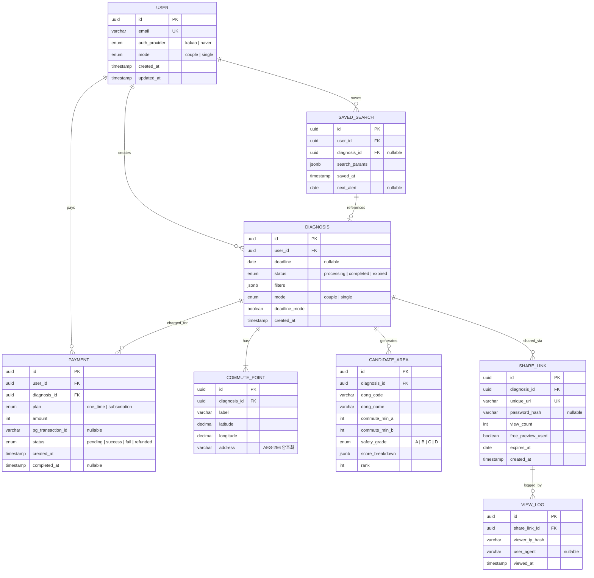

#### 6.2.1 USER

| 필드명 | 타입 | 제약조건 | 설명 |
| --- | --- | --- | --- |
| `id` | UUID | PK, NOT NULL | 사용자 고유 식별자 |
| `email` | VARCHAR(255) | UNIQUE, NOT NULL | 사용자 이메일 |
| `auth_provider` | ENUM('kakao', 'naver') | NOT NULL | OAuth 인증 제공자 |
| `mode` | ENUM('couple', 'single') | NOT NULL, DEFAULT 'couple' | 서비스 모드 (커플/싱글) |
| `created_at` | TIMESTAMP | NOT NULL, DEFAULT NOW() | 계정 생성일시 |
| `updated_at` | TIMESTAMP | NOT NULL | 최종 수정일시 |

#### 6.2.2 DIAGNOSIS

| 필드명 | 타입 | 제약조건 | 설명 |
| --- | --- | --- | --- |
| `id` | UUID | PK, NOT NULL | 진단 고유 식별자 |
| `user_id` | UUID | FK → USER.id, NOT NULL | 진단 수행 사용자 |
| `deadline` | DATE | NULLABLE | 이사 마감 기한 (데드라인 모드 시 필수) |
| `status` | ENUM('processing', 'completed', 'expired') | NOT NULL, DEFAULT 'processing' | 진단 상태 |
| `filters` | JSONB | NOT NULL | 적용된 필터 조건 (최대 통근 시간, 예산, 시간대 등) |
| `mode` | ENUM('couple', 'single') | NOT NULL | 진단 모드 |
| `deadline_mode` | BOOLEAN | NOT NULL, DEFAULT FALSE | 데드라인 모드 활성화 여부 |
| `created_at` | TIMESTAMP | NOT NULL, DEFAULT NOW() | 진단 생성일시 |

#### 6.2.3 COMMUTE_POINT

| 필드명 | 타입 | 제약조건 | 설명 |
| --- | --- | --- | --- |
| `id` | UUID | PK, NOT NULL | 출퇴근 거점 고유 식별자 |
| `diagnosis_id` | UUID | FK → DIAGNOSIS.id, NOT NULL | 소속 진단 |
| `label` | VARCHAR(50) | NOT NULL | 거점 레이블 (예: "직장A", "직장B", "여가 거점") |
| `latitude` | DECIMAL(10,7) | NOT NULL | 위도 |
| `longitude` | DECIMAL(10,7) | NOT NULL | 경도 |
| `address` | VARCHAR(500) | NOT NULL | 입력 주소 (AES-256 암호화 저장) |

#### 6.2.4 CANDIDATE_AREA

| 필드명 | 타입 | 제약조건 | 설명 |
| --- | --- | --- | --- |
| `id` | UUID | PK, NOT NULL | 후보 동네 고유 식별자 |
| `diagnosis_id` | UUID | FK → DIAGNOSIS.id, NOT NULL | 소속 진단 |
| `dong_code` | VARCHAR(10) | NOT NULL | 법정동 코드 |
| `dong_name` | VARCHAR(100) | NOT NULL | 행정동 이름 |
| `commute_min_a` | INTEGER | NOT NULL | 거점 A까지 출퇴근 시간 (분) |
| `commute_min_b` | INTEGER | NOT NULL | 거점 B까지 출퇴근 시간 (분) |
| `safety_grade` | ENUM('A', 'B', 'C', 'D') | NULLABLE | 야간 치안 안전 등급 |
| `score_breakdown` | JSONB | NOT NULL | 스코어 상세 (교통·치안·편의시설·교육 등) |
| `rank` | INTEGER | NOT NULL | 추천 순위 |

#### 6.2.5 SHARE_LINK

| 필드명 | 타입 | 제약조건 | 설명 |
| --- | --- | --- | --- |
| `id` | UUID | PK, NOT NULL | 공유 링크 고유 식별자 |
| `diagnosis_id` | UUID | FK → DIAGNOSIS.id, NOT NULL | 공유 대상 진단 |
| `unique_url` | VARCHAR(255) | UNIQUE, NOT NULL | 고유 URL (UUID v4, entropy ≥ 128bit) |
| `password_hash` | VARCHAR(255) | NULLABLE | 열람 비밀번호 해시 (선택 설정) |
| `view_count` | INTEGER | NOT NULL, DEFAULT 0 | 열람 횟수 |
| `free_preview_used` | BOOLEAN | NOT NULL, DEFAULT FALSE | 무료 미리보기 사용 여부 |
| `expires_at` | DATE | NOT NULL | 만료일 (생성일 + 30일) |
| `created_at` | TIMESTAMP | NOT NULL, DEFAULT NOW() | 생성일시 |

#### 6.2.6 SAVED_SEARCH

| 필드명 | 타입 | 제약조건 | 설명 |
| --- | --- | --- | --- |
| `id` | UUID | PK, NOT NULL | 저장된 검색 고유 식별자 |
| `user_id` | UUID | FK → USER.id, NOT NULL | 소유 사용자 |
| `diagnosis_id` | UUID | FK → DIAGNOSIS.id, NULLABLE | 원본 진단 참조 |
| `search_params` | JSONB | NOT NULL | 저장된 검색 조건 (주소·필터·시간대) |
| `saved_at` | TIMESTAMP | NOT NULL, DEFAULT NOW() | 저장 일시 |
| `next_alert` | DATE | NULLABLE | 다음 재탐색 알림 일자 |

#### 6.2.7 PAYMENT

| 필드명 | 타입 | 제약조건 | 설명 |
| --- | --- | --- | --- |
| `id` | UUID | PK, NOT NULL | 결제 고유 식별자 |
| `user_id` | UUID | FK → USER.id, NOT NULL | 결제 사용자 |
| `diagnosis_id` | UUID | FK → DIAGNOSIS.id, NOT NULL | 결제 대상 진단 |
| `plan` | ENUM('one_time', 'subscription') | NOT NULL | 결제 플랜 |
| `amount` | INTEGER | NOT NULL | 결제 금액 (원) |
| `pg_transaction_id` | VARCHAR(100) | NULLABLE | PG사 트랜잭션 ID |
| `status` | ENUM('pending', 'success', 'fail', 'refunded') | NOT NULL, DEFAULT 'pending' | 결제 상태 |
| `created_at` | TIMESTAMP | NOT NULL, DEFAULT NOW() | 결제 요청일시 |
| `completed_at` | TIMESTAMP | NULLABLE | 결제 완료일시 |

#### 6.2.8 VIEW_LOG (공유 링크 열람 로그)

| 필드명 | 타입 | 제약조건 | 설명 |
| --- | --- | --- | --- |
| `id` | UUID | PK, NOT NULL | 열람 로그 고유 식별자 |
| `share_link_id` | UUID | FK → SHARE_LINK.id, NOT NULL | 열람 대상 공유 링크 |
| `viewer_ip_hash` | VARCHAR(64) | NOT NULL | 열람자 IP 해시 (개인정보 비식별화) |
| `user_agent` | VARCHAR(500) | NULLABLE | 브라우저 User-Agent |
| `viewed_at` | TIMESTAMP | NOT NULL, DEFAULT NOW() | 열람 일시 |

### 6.3 Detailed Interaction Models (상세 시퀀스 다이어그램)

#### 6.3.1 두 동선 교차 진단 — 상세 플로우 (정상 + 에러 핸들링)

```mermaid
sequenceDiagram
    actor User as 사용자
    participant Web as 웹 클라이언트
    participant API as 백엔드 API
    participant Geo as Geocoding 서비스
    participant Kakao as 카카오 모빌리티 (1차)
    participant Naver as 네이버 지도 (백업)
    participant Score as 스코어링 엔진
    participant DB as 데이터베이스
    participant Sentry as Sentry (에러 로그)

    User->>Web: 주소A 입력 (자동완성)
    Web->>Geo: Geocoding 요청 (주소A)
    Geo-->>Web: 좌표A 반환

    User->>Web: 주소B 입력 (자동완성)
    Web->>Geo: Geocoding 요청 (주소B)
    Geo-->>Web: 좌표B 반환

    User->>Web: "진단 시작" 클릭

    alt 주소 1개만 입력
        Web->>User: 인라인 에러 "두 번째 주소를 입력해 주세요" (≤ 200ms)
        Note over Web: API 호출 차단
    else 주소 2개 입력 (수도권 확인)
        Web->>API: POST /api/v1/diagnosis (좌표A, 좌표B, filters)
        API->>API: 수도권 커버리지 검증

        alt 비수도권 주소 포함
            API-->>Web: 400 "수도권만 지원" 에러
            Web->>User: 커버리지 안내 UI (≤ 500ms)
        else 수도권 내
            API->>Kakao: 경로 계산 요청 (좌표A→후보동네들)
            API->>Kakao: 경로 계산 요청 (좌표B→후보동네들)

            alt 카카오 API 타임아웃 (5초)
                API->>Kakao: 자동 재시도 1회
                alt 재시도 성공
                    Kakao-->>API: 경로 응답
                else 재시도 실패
                    API->>Naver: Failover → 네이버 지도 API
                    alt 네이버도 실패
                        API->>Sentry: 실패 로그 전송
                        API-->>Web: 503 "일시적 오류"
                        Web->>User: "잠시 후 다시 시도" 안내 (재시도 포함 ≤ 10초)
                    else 네이버 성공
                        Naver-->>API: 경로 응답
                    end
                end
            else 카카오 정상 응답
                Kakao-->>API: 경로·소요시간·환승 횟수 응답
            end

            API->>Score: 교집합 후보 동네 산출 + 스코어링
            Score-->>API: 후보 동네 리스트 (랭킹 포함)

            alt 교집합 0곳
                API-->>Web: 200 (candidates: [], suggestions: [조건 완화 제안 ≥ 2개])
                Web->>User: "조건을 만족하는 동네가 없습니다" + 조건 완화 제안 (≤ 1초)
            else 교집합 ≥ 1곳
                API->>DB: DIAGNOSIS + CANDIDATE_AREA 저장
                API-->>Web: 200 (candidates: [...], scores: [...])
                Web->>User: 지도 위 교집합 후보 동네 시각화 (총 ≤ 3초)
            end
        end
    end
```

#### 6.3.2 배우자 공유 링크 — 상세 플로우

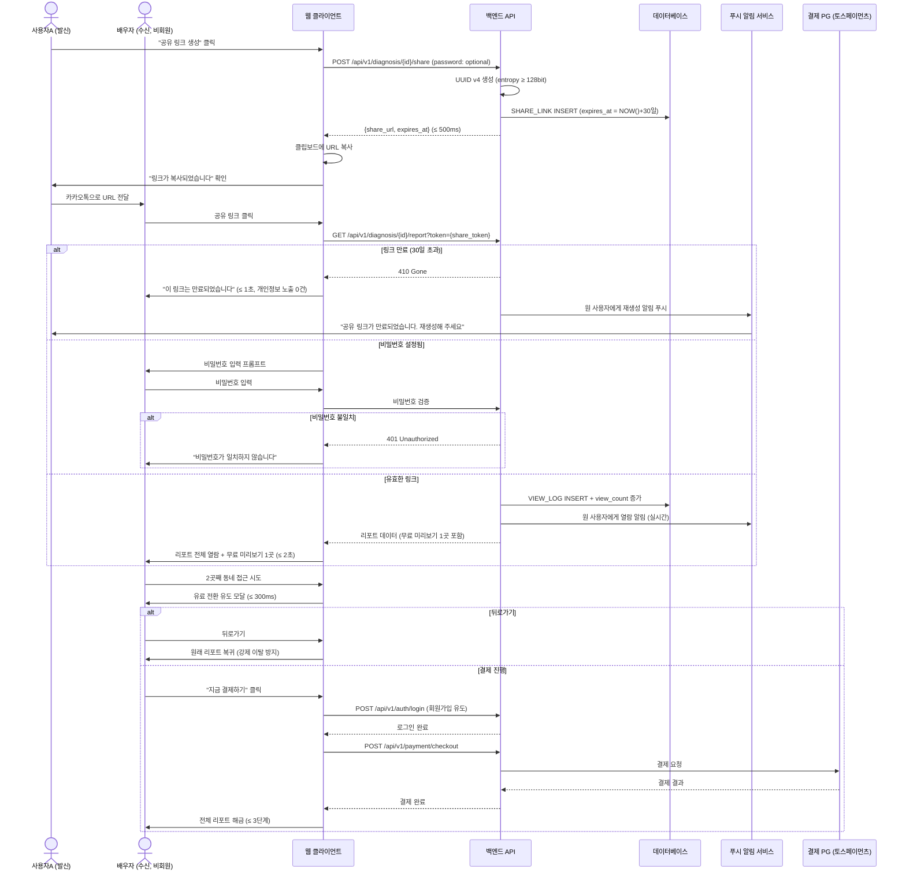

#### 6.3.3 데드라인 모드 — 상세 플로우

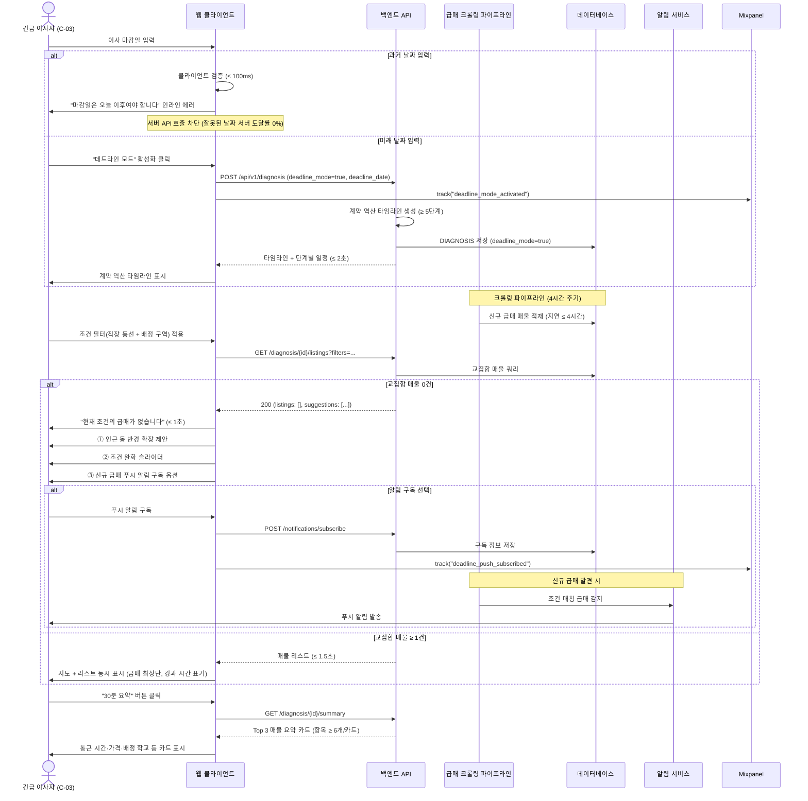

#### 6.3.4 싱글 모드 — 상세 플로우

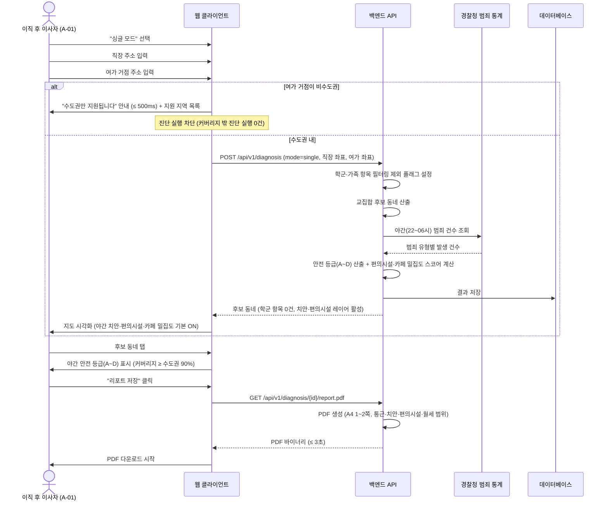

#### 6.3.5 입력값 저장·재탐색 — 상세 플로우

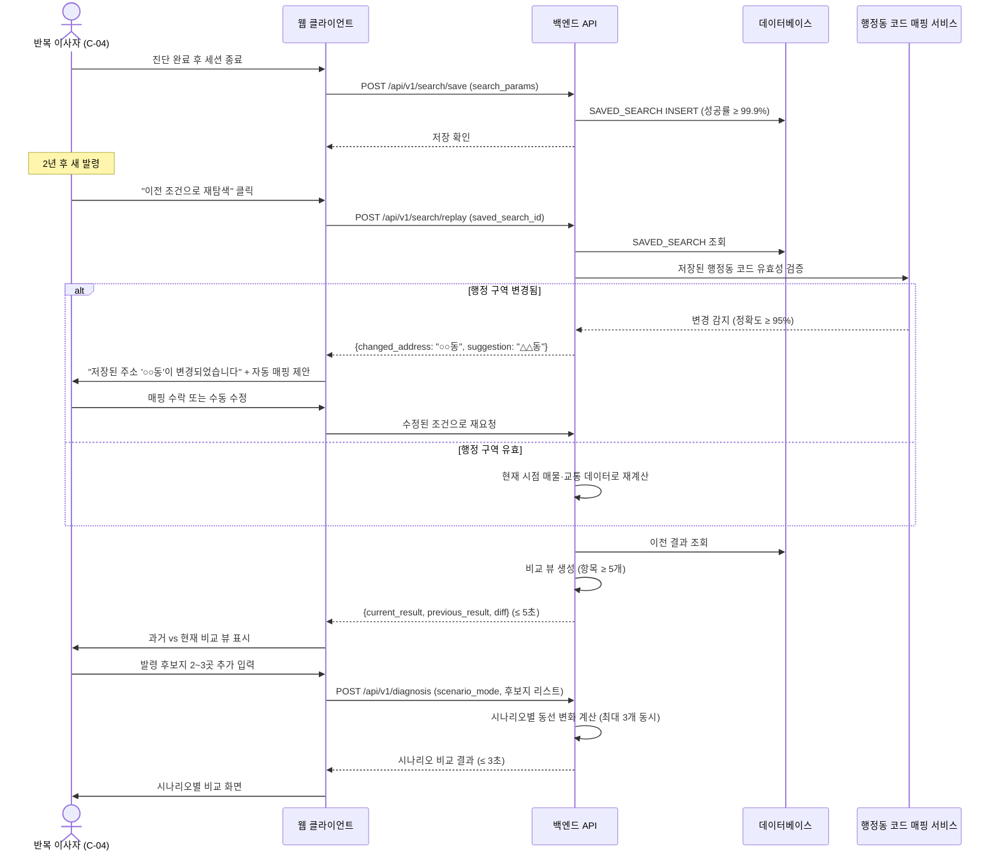

#### 6.3.6 인증·결제 — 상세 플로우

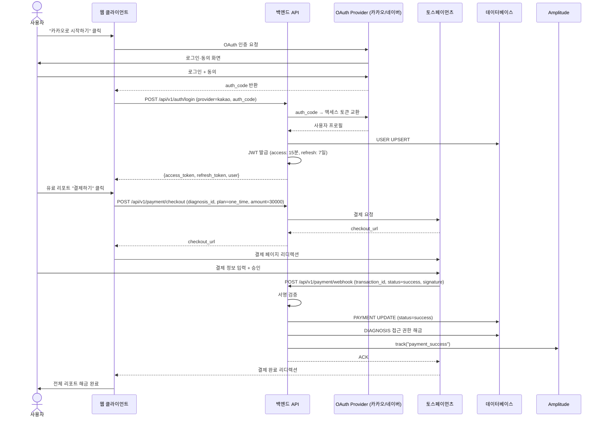

### 6.4 Validation Plan (검증 계획)

> PRD §8 실험·롤아웃·측정에서 파생

#### 6.4.1 롤아웃 단계

| Phase | 대상 | 규모 | 기간 | 핵심 측정 항목 |
| --- | --- | --- | --- | --- |
| **Alpha** | 내부 팀 + 지인 | 10명 | 1개월 (2026-07) | 기능 완성도, 크리티컬 버그 수 |
| **Closed Beta** | 맘카페 선발 사용자 | 30명 | 1개월 (2026-08) | 과업 완료율, 평균 탐색 시간, NPS, WTP 실측 |
| **Open Beta** | 수도권 3040 부부 | 300명 | 2개월 (2026-09~10) | 유료 전환율, 공유 링크 바이럴 계수, D+7 리텐션 |
| **GA** | 전체 오픈 | 목표 1,000명/월 | 2026-11~ | 북극성 KPI, 보조 KPI 전체 |

#### 6.4.2 A/B 실험 설계

| 실험 ID | 가설 | 그룹 | 측정 KPI | 성공 기준 | α | 1−β | MDE | 기간 |
| --- | --- | --- | --- | --- | --- | --- | --- | --- |
| **EXP-1** | 공유 링크 → 유료 전환율 ↑ | A: 공유 링크 활성 / B: 결과만 조회 | 유료 전환율, 2nd 유저 가입률 | A ≥ B × 1.5 | 0.05 | 0.80 | +4%p | 4주 (n=200, 그룹당 110명) |
| **EXP-2** | 타임라인 → 과업 완료율 ↑ | A: 타임라인 포함 / B: 필터만 | D-2개월 계약 완료율, 일일 사용 시간 | A ≥ 60% | 0.05 | 0.80 | +15%p | 4주 (n=100) |
| **EXP-3** | 미리보기 1곳 vs 3곳 → 전환율 차이 | A: 1곳 / B: 3곳 | 유료 전환율, NPS | A ≥ B × 1.2 | 0.05 | 0.80 | +3%p | 4주 (n=200) |
| **EXP-4** | 출처 배지 → NPS ↑ | A: 배지 O / B: 배지 X | NPS, 리포트 공유율 | A NPS ≥ B + 10p | 0.05 | 0.80 | +10p | 4주 (n=200) |

### 6.5 UseCase Diagram

> 시스템의 핵심 액터와 기능(UseCase) 간 관계를 시각화한다. 각 UseCase는 Section 4.1의 REQ-FUNC에 대응된다.

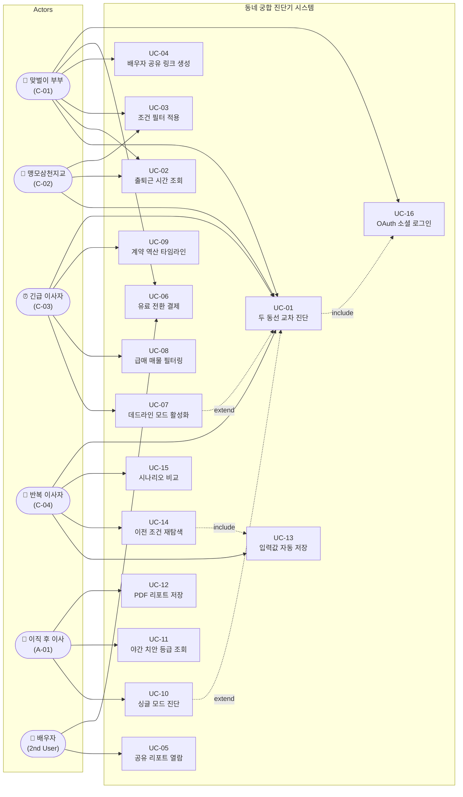

| UseCase ID | UseCase 명 | 관련 REQ-FUNC | 관련 Actor |
| --- | --- | --- | --- |
| UC-01 | 두 동선 교차 진단 | REQ-FUNC-001 ~ 008 | C-01, C-02, C-03, C-04 |
| UC-02 | 출퇴근 시간 조회 | REQ-FUNC-004, 005 | C-01, C-02 |
| UC-03 | 조건 필터 적용 | REQ-FUNC-006 | C-01, C-02 |
| UC-04 | 배우자 공유 링크 생성 | REQ-FUNC-009, 010 | C-01 |
| UC-05 | 공유 리포트 열람 | REQ-FUNC-011, 012 | 배우자 (2nd User) |
| UC-06 | 유료 전환 결제 | REQ-FUNC-013, 014, 030 | C-01, 배우자 |
| UC-07 | 데드라인 모드 활성화 | REQ-FUNC-015, 020 | C-03 |
| UC-08 | 급매 매물 필터링 | REQ-FUNC-016, 017, 019 | C-03 |
| UC-09 | 계약 역산 타임라인 | REQ-FUNC-015, 018 | C-03 |
| UC-10 | 싱글 모드 진단 | REQ-FUNC-021, 024 | A-01 |
| UC-11 | 야간 치안 등급 조회 | REQ-FUNC-022 | A-01 |
| UC-12 | PDF 리포트 저장 | REQ-FUNC-023 | A-01 |
| UC-13 | 입력값 자동 저장 | REQ-FUNC-025 | C-04 |
| UC-14 | 이전 조건 재탐색 | REQ-FUNC-026, 028 | C-04 |
| UC-15 | 시나리오 비교 | REQ-FUNC-027 | C-04 |
| UC-16 | OAuth 소셜 로그인 | REQ-FUNC-029 | 전체 사용자 |

### 6.6 Component Diagram

> 시스템 아키텍처의 주요 컴포넌트와 외부 시스템 간 상호작용을 시각화한다.

```mermaid
flowchart TB
    subgraph Client["🖥️ Client Layer"]
        SPA["웹 애플리케이션\n(SPA — React)"]
        SharedPage["공유 링크 페이지\n(모바일 웹, 비회원)"]
    end

    subgraph API_GW["🔒 API Gateway"]
        GW["API Gateway\nRate Limiter · WAF\nJWT 검증 · 라우팅"]
    end

    subgraph Backend["⚙️ Backend Services"]
        AuthSvc["Auth Service\nOAuth 2.0 · JWT 발급"]
        DiagSvc["Diagnosis Service\n교차 계산 · 스코어링"]
        ShareSvc["Share Service\n공유 링크 생성 · 검증"]
        SearchSvc["Search Service\n저장 · 재탐색"]
        PaymentSvc["Payment Service\n결제 처리 · 웹훅"]
        ReportSvc["Report Service\nPDF 생성 · 리포트 조회"]
        NotifySvc["Notification Service\n푸시 알림 · 이메일"]
    end

    subgraph Engine["🧮 Core Engine"]
        GeoEngine["Geocoding Engine\n주소 → 좌표 변환"]
        ScoreEngine["Scoring Engine\n교집합 산출 · 랭킹"]
        CrawlPipe["급매 크롤링 파이프라인\n4시간 주기 배치"]
        DongMapper["행정동 코드 매핑\n분기 갱신"]
    end

    subgraph DataStore["💾 Data Store"]
        PG[("PostgreSQL\nUSER · DIAGNOSIS\nCANDIDATE_AREA\nPAYMENT 등")]
        Redis[("Redis\nSession · Cache\nAPI 응답 캐시")]
    end

    subgraph External["🌐 External Systems"]
        KakaoAPI["카카오 모빌리티 API\n(1차 교통 데이터)"]
        NaverAPI["네이버 지도 API\n(백업)"]
        MolitAPI["국토교통부\n실거래가 API"]
        PoliceAPI["경찰청\n범죄 통계 API"]
        EduAPI["교육부\n학교 배정 구역"]
        OAuthProv["OAuth Provider\n카카오 · 네이버"]
        TossPG["토스페이먼츠\n결제 PG"]
        ListingSrc["매물 데이터 소스\n직방 · 피터팬"]
    end

    subgraph Observability["📊 Observability"]
        Datadog["Datadog APM\n응답 시간 · 메트릭"]
        Sentry["Sentry\n에러 추적"]
        Amplitude["Amplitude / Mixpanel\n이벤트 추적 · 퍼널"]
    end

    SPA --> GW
    SharedPage --> GW

    GW --> AuthSvc
    GW --> DiagSvc
    GW --> ShareSvc
    GW --> SearchSvc
    GW --> PaymentSvc
    GW --> ReportSvc

    AuthSvc --> OAuthProv
    AuthSvc --> PG

    DiagSvc --> GeoEngine
    DiagSvc --> ScoreEngine
    DiagSvc --> PG
    DiagSvc --> Redis
    GeoEngine --> KakaoAPI
    GeoEngine --> NaverAPI
    ScoreEngine --> KakaoAPI
    ScoreEngine --> NaverAPI
    ScoreEngine --> MolitAPI
    ScoreEngine --> PoliceAPI
    ScoreEngine --> EduAPI

    ShareSvc --> PG
    ShareSvc --> NotifySvc

    SearchSvc --> PG
    SearchSvc --> DongMapper

    PaymentSvc --> TossPG
    PaymentSvc --> PG

    ReportSvc --> PG

    CrawlPipe --> ListingSrc
    CrawlPipe --> PG
    CrawlPipe --> NotifySvc

    Backend --> Datadog
    Backend --> Sentry
    Backend --> Amplitude
```

| 컴포넌트 | 역할 | 관련 REQ |
| --- | --- | --- |
| API Gateway | 인증·Rate Limiting·라우팅 | REQ-NF-022, REQ-FUNC-029 |
| Diagnosis Service | 교차 계산 핵심 로직 | REQ-FUNC-001~008 |
| Scoring Engine | 교집합 산출·후보 랭킹 | REQ-FUNC-003, REQ-NF-001 |
| Share Service | 공유 링크 CRUD | REQ-FUNC-009~014 |
| Payment Service | PG 연동·결제 처리 | REQ-FUNC-030, REQ-NF-025 |
| 급매 크롤링 파이프라인 | 4시간 주기 배치 크롤링 | REQ-FUNC-016, REQ-NF-005 |
| Notification Service | 푸시 알림·이메일 발송 | REQ-FUNC-010, 019 |
| 행정동 코드 매핑 | 법정동 코드 분기 갱신 | REQ-FUNC-028 |

### 6.7 Class Diagram (CLD)

> 시스템의 핵심 도메인 객체(엔터티)와 서비스 클래스 간의 구조·속성·메서드·참조 관계를 표현한다.

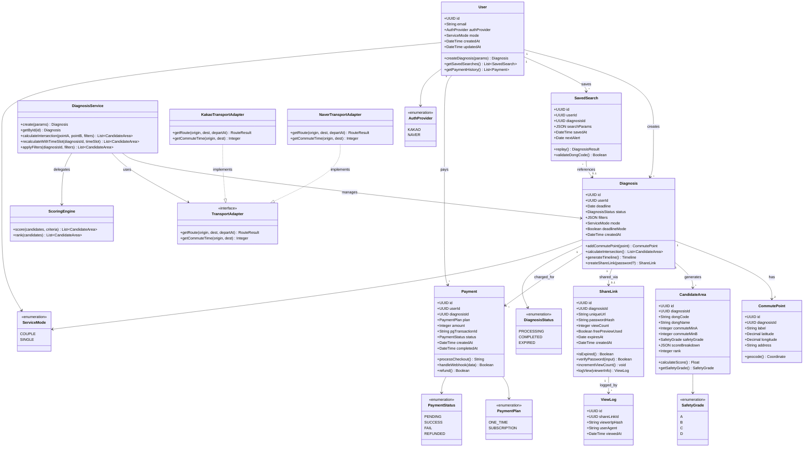

---

> **Software Requirements Specification (SRS)** | Document ID: SRS-001 | Rev 1.1 | 2026-04-15
>
> *본 SRS는 PRD v0.1-rev.2에 기반하여 ISO/IEC/IEEE 29148:2018 표준을 준수하여 작성되었습니다.*
> *모든 요구사항은 REQ-FUNC-xxx / REQ-NF-xxx 형식의 고유 ID를 가진 atomic requirement로 구성되며, Traceability Matrix를 통해 Source Story/KPI와 양방향 추적이 가능합니다.*
> *Rev 1.1: UseCase Diagram, ERD, Component Diagram, Class Diagram 추가 (2026-04-15)*
