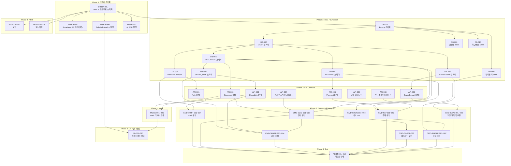

# 개발 태스크(Task) 목록 명세서

**Document ID:** TASK-001
**Source:** SRS-001 Rev 1.0 (2026-04-18)
**작성 기준:** SRS에 명시된 기능적/비기능적 요구사항만을 기반으로 도출
**작성 원칙:** Contract-First → CQRS 분리 → AC→Test 변환 → NFR 추출 + 의존성 매핑

---

## 목차

1. [Step 1. 계약·데이터 명세 태스크 (Contract & Data)](#step-1-계약데이터-명세-태스크)
2. [Step 2. 로직·상태 변경 태스크 (Query / Command)](#step-2-로직상태-변경-태스크)
3. [Step 3. 테스트 태스크 (AC → Test)](#step-3-테스트-태스크)
4. [Step 4. 비기능 제약·인프라 태스크 (NFR)](#step-4-비기능-제약인프라-태스크)
5. [Step 5. UI/UX 프론트엔드 태스크](#step-5-uiux-프론트엔드-태스크)
6. [의존성 그래프](#의존성-그래프)
7. [실행 순서 가이드](#실행-순서-가이드)

---

## Step 1. 계약·데이터 명세 태스크

> **목적:** 백엔드·프론트엔드가 참조할 **단일 진실 공급원(SSOT)**을 먼저 확립한다.
> 모든 후속 Feature 태스크는 이 단계의 산출물(스키마, DTO, Mock)을 import하여 사용한다.

### 1-A. 데이터베이스 스키마

| Task ID | Epic | Feature (기능명) | 관련 SRS 섹션 | 선행 태스크 | 복잡도 |
|---|---|---|---|---|---|
| DB-001 | Data Foundation | Prisma 프로젝트 초기화 및 datasource 설정 (SQLite/Supabase 전환 가능 구조) | §6.2.0 ERD, CON-11 (C-TEC-003) | None | L |
| DB-002 | Data Foundation | USER 테이블 Prisma 스키마 정의 및 마이그레이션 | §6.2.1 USER | DB-001 | L |
| DB-003 | Data Foundation | DIAGNOSIS 테이블 Prisma 스키마 정의 및 마이그레이션 | §6.2.2 DIAGNOSIS | DB-002 | M |
| DB-004 | Data Foundation | SHARE_LINK 테이블 Prisma 스키마 정의 및 마이그레이션 | §6.2.3 SHARE_LINK | DB-003 | L |
| DB-005 | Data Foundation | PAYMENT 테이블 Prisma 스키마 정의 및 마이그레이션 | §6.2.4 PAYMENT | DB-002 | M |
| DB-006 | Data Foundation | SavedSearch 테이블 Prisma 스키마 정의 및 마이그레이션 (입력값 저장용) | §4.1.5, §6.3.5 (SavedSearch create) | DB-002 | L |
| DB-007 | Data Foundation | NextAuth.js Prisma Adapter 스키마 (Account, Session, VerificationToken) 통합 | §6.3.6 (Prisma Adapter), REQ-FUNC-029 | DB-002 | M |
| DB-008 | Data Foundation | 행정동 코드 매핑 Seed 데이터 (법정동 코드 테이블) 적재 | §4.1.5 REQ-FUNC-028, §6.3.5 (DongMap) | DB-001 | M |
| DB-009 | Data Foundation | 경찰청 범죄 통계 캐시 테이블 (CachedPoliceData) 스키마 및 정적 에셋 Seed 적재 | §3.1.1 EXT-04, §6.3.4 (CachedPoliceData), REQ-FUNC-022 | DB-001 | M |
| DB-010 | Data Foundation | 교육부 학교 배정 구역 정적 데이터 (폴리곤 JSON) Seed 적재 | §3.1.1 EXT-05, REQ-FUNC-035 | DB-001 | M |

### 1-B. API 통신 계약 (DTO / 에러 코드)

| Task ID | Epic | Feature (기능명) | 관련 SRS 섹션 | 선행 태스크 | 복잡도 |
|---|---|---|---|---|---|
| API-001 | API Contract | Auth 도메인 DTO 정의 — NextAuth.js 세션 객체, 콜백 타입, Provider 설정 인터페이스 | §6.1 API-07/08, REQ-FUNC-029 | DB-007 | M |
| API-002 | API Contract | Diagnosis 도메인 Request/Response DTO 정의 — createDiagnosis(), GET /api/diagnosis/[id] | §6.1 API-01/02 | DB-003 | M |
| API-003 | API Contract | ShareLink 도메인 Request/Response DTO 정의 — createShareLink(), GET /api/diagnosis/[id]/report | §6.1 API-03/04 | DB-004 | M |
| API-004 | API Contract | Payment 도메인 Request/Response DTO 정의 — initiateCheckout(), POST /api/payment/webhook, 에러 코드 정의 | §6.1 API-09/10 | DB-005 | H |
| API-005 | API Contract | SavedSearch 도메인 Request/Response DTO 정의 — saveSearch(), replaySearch() | §6.1 API-05/06 | DB-006 | M |
| API-006 | API Contract | 공통 에러 코드 체계 정의 (HTTP Status + Application Error Code + 사용자 메시지 매핑) | §4.1 전체 AC | None | M |
| API-007 | API Contract | 카카오 모빌리티 API 클라이언트 인터페이스 정의 (KakaoTransportClient 타입) | §3.1 EXT-01, §6.7 CLD | None | L |
| API-008 | API Contract | 토스페이먼츠 PG 연동 인터페이스 정의 (결제 요청/콜백/서명 검증 타입) | §3.1 EXT-06, §6.1 API-09/10 | None | M |

### 1-C. Mock 데이터

| Task ID | Epic | Feature (기능명) | 관련 SRS 섹션 | 선행 태스크 | 복잡도 |
|---|---|---|---|---|---|
| MOCK-001 | Mock & Fixture | 프론트엔드 UI 개발용 진단 결과 Mock 데이터 (CandidateArea 3곳+ 포함) | §4.1.1 REQ-FUNC-003, §6.1 API-01/02 | API-002 | L |
| MOCK-002 | Mock & Fixture | 공유 링크 열람 Mock 데이터 (유효/만료/비밀번호 설정 시나리오) | §4.1.2 REQ-FUNC-009~014, §6.1 API-03/04 | API-003 | L |
| MOCK-003 | Mock & Fixture | 결제 프로세스 Mock 데이터 (성공/실패/환불 시나리오, PG 웹훅 payload) | §4.1.6 REQ-FUNC-030, §6.1 API-09/10 | API-004 | L |
| MOCK-004 | Mock & Fixture | 카카오 모빌리티 API Mock 응답 데이터 (경로·소요시간·환승 정보) | §3.1 EXT-01, §6.3.1 | API-007 | L |
| MOCK-005 | Mock & Fixture | OAuth 소셜 로그인 Mock 데이터 (카카오/네이버 프로필 응답) | §3.1 EXT-07, §6.3.6 | API-001 | L |

---

## Step 2. 로직·상태 변경 태스크

> **원칙:** 데이터를 읽기만 하는 Query와, DB 상태를 변경하는 Command를 철저히 분리한다.
> 각 태스크는 닫힌 문맥(Closed Context) — 단일 목적에만 집중.

### 2-A. Auth 도메인

| Task ID | Epic | Feature (기능명) | 관련 SRS 섹션 | 선행 태스크 | 복잡도 |
|---|---|---|---|---|---|
| CMD-AUTH-001 | Auth | [Command] NextAuth.js v5 카카오 OAuth Provider 설정 및 소셜 로그인 구현 | §4.1.6 REQ-FUNC-029, §6.3.6 | DB-007, API-001 | H |
| CMD-AUTH-002 | Auth | [Command] NextAuth.js v5 네이버 OAuth Provider 설정 및 소셜 로그인 구현 | §4.1.6 REQ-FUNC-029, §6.3.6 | CMD-AUTH-001 | M |
| CMD-AUTH-003 | Auth | [Command] NextAuth.js 세션 전략 구현 — httpOnly cookie, maxAge 7일, updateAge 15분, CSRF 자동 검증 | §4.2.3 REQ-NF-018 | CMD-AUTH-001 | M |
| CMD-AUTH-004 | Auth | [Command] OAuth 장애 시 게스트 임시 체험 모드 전환 로직 | §3.1.1 EXT-07 우회 전략 | CMD-AUTH-001 | L |

### 2-B. Diagnosis 도메인 (두 동선 교차 진단 — F1)

| Task ID | Epic | Feature (기능명) | 관련 SRS 섹션 | 선행 태스크 | 복잡도 |
|---|---|---|---|---|---|
| CMD-DIAG-001 | Diagnosis | [Command] 클라이언트 주소 Geocoding 연동 — 카카오 Geocoding API 호출 (자동완성) | §4.1.1 REQ-FUNC-001, §6.3.1 | API-007 | M |
| CMD-DIAG-002 | Diagnosis | [Command] 클라이언트 교집합 후보 동네 산출 — Promise.all 병렬 카카오 API 호출 + 교차 연산 | §4.1.1 REQ-FUNC-003, §6.3.1 | CMD-DIAG-001, API-007 | H |
| CMD-DIAG-003 | Diagnosis | [Command] 후보 동네 스코어링 엔진 구현 (ScoringEngine.score/rank) | §6.7 CLD (ScoringEngine) | CMD-DIAG-002 | H |
| CMD-DIAG-004 | Diagnosis | [Command] 진단 결과 서버 저장 — saveDiagnosisResult Server Action (Prisma Diagnosis + CandidateArea) | §6.3.1 (SA → Prisma 저장) | DB-003, API-002, CMD-DIAG-002 | M |
| QRY-DIAG-001 | Diagnosis | [Query] 진단 결과 조회 — GET /api/diagnosis/[id] Route Handler | §6.1 API-02, §3.3 | DB-003, API-002 | L |
| QRY-DIAG-002 | Diagnosis | [Query] 출퇴근 시간 조회 — 후보 동네 탭 시 양쪽 직장까지 예상 소요시간 반환 | §4.1.1 REQ-FUNC-004, REQ-FUNC-005 | CMD-DIAG-002 | M |
| CMD-DIAG-005 | Diagnosis | [Command] 조건 필터 실시간 적용 — 클라이언트 사이드 캐싱 기반 필터링 + 지도 갱신 | §4.1.1 REQ-FUNC-006 | CMD-DIAG-002 | M |
| CMD-DIAG-006 | Diagnosis | [Command] 교통 API 타임아웃 핸들링 — 5초 타임아웃 + 자동 재시도 1회 + Sentry 로그 | §4.1.1 REQ-FUNC-007, §6.3.1 에러 핸들링 | CMD-DIAG-002 | M |
| CMD-DIAG-007 | Diagnosis | [Command] 수도권 커버리지 검증 — 비수도권 주소 입력 차단 로직 | §4.1.6 REQ-FUNC-031, §4.1.4 REQ-FUNC-024 | CMD-DIAG-001 | L |

### 2-C. ShareLink 도메인 (배우자 공유 링크 — F2)

| Task ID | Epic | Feature (기능명) | 관련 SRS 섹션 | 선행 태스크 | 복잡도 |
|---|---|---|---|---|---|
| CMD-SHARE-001 | ShareLink | [Command] 공유 링크 생성 — createShareLink Server Action (UUID v4, 만료 30일, 선택 비밀번호) | §4.1.2 REQ-FUNC-009, §6.3.2 | DB-004, API-003, CMD-DIAG-004 | M |
| QRY-SHARE-001 | ShareLink | [Query] 공유 리포트 SSR 열람 — GET /api/diagnosis/[id]/report Route Handler (토큰 검증 + 무료 미리보기 1곳) | §4.1.2 REQ-FUNC-011, §6.3.2 | DB-004, CMD-SHARE-001 | H |
| CMD-SHARE-002 | ShareLink | [Command] 공유 링크 열람 로그 기록 + viewCount 증가 | §6.3.2 (ViewLog create + view_count 증가) | QRY-SHARE-001 | L |
| CMD-SHARE-003 | ShareLink | [Command] 만료 링크 접근 시 안내 페이지 + 원 사용자 재생성 알림 푸시 발송 | §4.1.2 REQ-FUNC-010, §6.3.2 | QRY-SHARE-001 | M |
| CMD-SHARE-004 | ShareLink | [Command] 공유 링크 비밀번호 검증 로직 (bcrypt 비교) | §6.3.2 비밀번호 설정 플로우, REQ-NF-020 | QRY-SHARE-001 | L |

### 2-D. Payment 도메인 (결제 — F6)

| Task ID | Epic | Feature (기능명) | 관련 SRS 섹션 | 선행 태스크 | 복잡도 |
|---|---|---|---|---|---|
| CMD-PAY-001 | Payment | [Command] 결제 요청 — initiateCheckout Server Action (1회 30,000원 / 월정액 10,000원) | §4.1.6 REQ-FUNC-030, §6.3.6 결제 플로우 | DB-005, API-004, API-008 | H |
| CMD-PAY-002 | Payment | [Command] PG 웹훅 처리 — POST /api/payment/webhook Route Handler (서명 HMAC 검증 + Payment 상태 갱신 + 접근 권한 해금) | §6.1 API-10, §6.3.6 | DB-005, API-004 | H |
| QRY-PAY-001 | Payment | [Query] 결제 이력 조회 — 사용자별 결제 내역 리스트 반환 | §6.7 CLD (User.getPaymentHistory) | DB-005 | L |
| CMD-PAY-003 | Payment | [Command] 결제 PG사 장애 시 에러 모달 노출 + 복구 시 수동 재안내 | §3.1.1 EXT-06 우회 전략 | CMD-PAY-001 | L |

### 2-E. Deadline Mode 도메인 (데드라인 모드 — F3)

| Task ID | Epic | Feature (기능명) | 관련 SRS 섹션 | 선행 태스크 | 복잡도 |
|---|---|---|---|---|---|
| CMD-DL-001 | Deadline Mode | [Command] 데드라인 모드 활성화 — createDiagnosis(deadline_mode=true) + 계약 역산 타임라인 생성 (≥5단계) | §4.1.3 REQ-FUNC-015, §6.3.3 | DB-003, CMD-DIAG-004 | H |
| CMD-DL-002 | Deadline Mode | [Command] 아웃링크 URL 조합 — 교집합 동네 클릭 시 네이버 부동산 검색 URL 파라미터 생성 + 새 창 열기 | §4.1.3 REQ-FUNC-016/017, §3.1 EXT-08 | CMD-DL-001 | L |
| QRY-DL-001 | Deadline Mode | [Query] 교집합 매물 조회 — filterListings Server Action (복합 인덱스 활용 쿼리) | §6.3.3 (SA → Prisma 쿼리) | CMD-DL-001 | M |
| CMD-DL-003 | Deadline Mode | [Command] 급매 매물 0건 시 조건 완화 제안 + 신규 급매 푸시 알림 구독 처리 | §4.1.3 REQ-FUNC-019, §6.3.3 | QRY-DL-001 | M |
| QRY-DL-002 | Deadline Mode | [Query] 30분 요약 — getSummary Server Action (Top 3 매물 카드, 항목 ≥6개/카드) | §4.1.3 REQ-FUNC-018, §6.3.3 | QRY-DL-001 | M |

### 2-F. Single Mode 도메인 (싱글 모드 — F4)

| Task ID | Epic | Feature (기능명) | 관련 SRS 섹션 | 선행 태스크 | 복잡도 |
|---|---|---|---|---|---|
| CMD-SINGLE-001 | Single Mode | [Command] 싱글 모드 진단 — createDiagnosis(mode=single) + 학군·가족 항목 자동 숨김 + 야간 치안/편의시설/카페 레이어 기본 활성 | §4.1.4 REQ-FUNC-021, §6.3.4 | DB-003, DB-009, CMD-DIAG-002 | M |
| QRY-SINGLE-001 | Single Mode | [Query] 야간 안전 등급(A~D) 조회 — CachedPoliceData 기반 범죄 등급 산출 | §4.1.4 REQ-FUNC-022, §6.3.4 | DB-009, CMD-SINGLE-001 | M |
| CMD-SINGLE-002 | Single Mode | [Command] 리포트 저장 — window.print() + CSS @media print 제어 (서버 호출 없음) | §4.1.4 REQ-FUNC-023, §6.3.4 | CMD-SINGLE-001 | L |

### 2-G. SavedSearch 도메인 (입력값 저장·재탐색 — F5)

| Task ID | Epic | Feature (기능명) | 관련 SRS 섹션 | 선행 태스크 | 복잡도 |
|---|---|---|---|---|---|
| CMD-SAVE-001 | SavedSearch | [Command] 입력값 자동 저장 — saveSearch Server Action (세션 종료/앱 종료 시 자동 호출) | §4.1.5 REQ-FUNC-025, §6.3.5 | DB-006, API-005 | M |
| QRY-SAVE-001 | SavedSearch | [Query] 이전 조건 재탐색 — replaySearch Server Action (현재 데이터 재계산 + 과거 비교 뷰 생성) | §4.1.5 REQ-FUNC-026, §6.3.5 | DB-006, CMD-SAVE-001, CMD-DIAG-002 | H |
| CMD-SAVE-002 | SavedSearch | [Command] 행정동 변경 감지 및 자동 매핑 제안 — 법정동 코드 매핑 테이블 활용 | §4.1.5 REQ-FUNC-028, §6.3.5 (DongMap) | DB-008, QRY-SAVE-001 | M |
| CMD-SAVE-003 | SavedSearch | [Command] 시나리오별 동선 변화 비교 화면 생성 (최대 3개 동시) | §4.1.5 REQ-FUNC-027, §6.3.5 | QRY-SAVE-001 | H |

### 2-H. Cron Job 도메인 (데이터 배치 적재)

| Task ID | Epic | Feature (기능명) | 관련 SRS 섹션 | 선행 태스크 | 복잡도 |
|---|---|---|---|---|---|
| CMD-CRON-001 | Batch Jobs | [Command] Vercel Cron Job — 급매 매물 4시간 주기 배치 적재 (/api/cron/crawl-listings) | §6.3.3 (Vercel Cron Job), REQ-NF-005 | DB-003 | H |
| CMD-CRON-002 | Batch Jobs | [Command] Vercel Cron Job — 경찰청 범죄 통계 분기별 배치 갱신 (CachedPoliceData) | §3.1 EXT-04, §6.3.4 | DB-009 | M |

---

## Step 3. 테스트 태스크

> **원칙:** SRS에 명시된 AC(Acceptance Criteria)를 Given/When/Then 기반의 테스트 코드 작성 태스크로 직접 변환.
> 에이전트에게 "이 테스트가 통과할 때까지 로직을 수정하라"고 지시할 수 있는 형태.

| Task ID | Epic | Feature (기능명) | 관련 SRS 섹션 | 선행 태스크 | 복잡도 |
|---|---|---|---|---|---|
| TEST-001 | Test: Diagnosis | [Test] 교차 진단 GWT 시나리오 — 정상 3곳+ 산출(AC-1), 1개 주소만 입력 시 에러(AC-N1), 교집합 0곳 시 완화 제안(AC-N3), 비수도권 차단 | §4.1.1 AC-1/2/3, REQ-FUNC-002/003/008/031 | CMD-DIAG-002, CMD-DIAG-004, CMD-DIAG-007 | H |
| TEST-002 | Test: Diagnosis | [Test] 교통 API 타임아웃 핸들링 — 5초 타임아웃 재시도 성공/실패 시나리오, 무한 로딩 0건 검증 | §4.1.1 REQ-FUNC-007, §6.3.1 에러 핸들링 | CMD-DIAG-006 | M |
| TEST-003 | Test: ShareLink | [Test] 공유 링크 GWT 시나리오 — 생성 ≤500ms(AC-1), 만료 링크 접근 시 개인정보 노출 0건(AC-N1), 무료 미리보기 1곳 후 유료 전환 모달 ≤300ms(AC-N2) | §4.1.2 AC-1/2/3, REQ-FUNC-010/011/014 | CMD-SHARE-001, QRY-SHARE-001, CMD-SHARE-003 | H |
| TEST-004 | Test: ShareLink | [Test] 공유 링크 보안 — UUID v4 entropy ≥128bit 검증, 비밀번호 bcrypt 검증, 비인가 접근 차단 | §4.2.3 REQ-NF-020/021 | CMD-SHARE-001, CMD-SHARE-004 | M |
| TEST-005 | Test: Deadline | [Test] 데드라인 모드 GWT 시나리오 — 타임라인 ≥5단계 생성(AC-1), 과거날짜 차단(AC-N2), 급매 0건 시 완화 제안(AC-N1) | §4.1.3 AC-1/2/3, REQ-FUNC-015/019/020 | CMD-DL-001, CMD-DL-003 | M |
| TEST-006 | Test: SingleMode | [Test] 싱글 모드 GWT 시나리오 — 학군 항목 노출 0건(AC-1), 야간 안전 등급 A~D(AC-2), PDF저장 window.print() 호출(AC-3), 비수도권 차단(AC-N1) | §4.1.4 AC-1/2/3, REQ-FUNC-021/022/023/024 | CMD-SINGLE-001, QRY-SINGLE-001, CMD-SINGLE-002 | M |
| TEST-007 | Test: SavedSearch | [Test] 입력값 저장·재탐색 GWT 시나리오 — 저장 성공률 ≥99.9%(AC-1), 비교 뷰 항목 ≥5개(AC-2), 시나리오 ≤3개(AC-3), 행정동 변경 감지(AC-N1) | §4.1.5 AC-1/2/3, REQ-FUNC-025/026/027/028 | CMD-SAVE-001, QRY-SAVE-001, CMD-SAVE-002, CMD-SAVE-003 | H |
| TEST-008 | Test: Auth | [Test] OAuth 로그인 GWT 시나리오 — 카카오/네이버 로그인 성공, 세션 생성·갱신·만료, CSRF 검증, 게스트 모드 전환 | §4.1.6 REQ-FUNC-029, §4.2.3 REQ-NF-018 | CMD-AUTH-001, CMD-AUTH-002, CMD-AUTH-003, CMD-AUTH-004 | M |
| TEST-009 | Test: Payment | [Test] 결제 GWT 시나리오 — 1회 결제 성공/실패, 구독 성공/실패, 웹훅 서명 위변조 차단, 결제 후 접근 권한 해금 | §4.1.6 REQ-FUNC-030, §6.3.6 결제 플로우 | CMD-PAY-001, CMD-PAY-002 | H |
| TEST-010 | Test: Integration | [Test] E2E 통합 시나리오 — 회원가입→진단→공유→결제→리포트 해금 전체 플로우 (Cypress/Playwright) | §5.1 Traceability 전체 | TEST-001~009 | H |

---

## Step 4. 비기능 제약·인프라 태스크

> **원칙:** SRS §4.2 비기능적 요구사항(보안·성능·가용성·비용·모니터링)에서 추출.

### 4-A. 인프라 및 DevOps

| Task ID | Epic | Feature (기능명) | 관련 SRS 섹션 | 선행 태스크 | 복잡도 |
|---|---|---|---|---|---|
| INFRA-001 | Infra | Next.js 15+ App Router 프로젝트 초기화 + Vercel 배포 파이프라인 구성 (Git Push 자동 배포) | CON-09 (C-TEC-001), CON-15 (C-TEC-007) | None | M |
| INFRA-002 | Infra | Supabase PostgreSQL 프로덕션 DB 프로비저닝 + 환경변수(DATABASE_URL) 설정 | CON-11 (C-TEC-003), §6.2.0 | INFRA-001 | L |
| INFRA-003 | Infra | Vercel Cron Job 스케줄 설정 (vercel.json) — 급매 4시간 주기, 범죄 통계 분기 | §6.3.3, REQ-NF-005 | INFRA-001, CMD-CRON-001 | L |
| INFRA-004 | Infra | Tailwind CSS + shadcn/ui 디자인 시스템 초기 설정 | CON-12 (C-TEC-004) | INFRA-001 | L |
| INFRA-005 | Infra | Vercel AI SDK + Google Gemini API 연동 설정 (환경변수 기반 모델 교체 가능 구조) | CON-13/14 (C-TEC-005/006), §6.6 AI Layer | INFRA-001 | M |

### 4-B. 보안

| Task ID | Epic | Feature (기능명) | 관련 SRS 섹션 | 선행 태스크 | 복잡도 |
|---|---|---|---|---|---|
| SEC-001 | Security | 개인정보(직장 주소·이사 기한) AES-256 암호화 저장 파이프라인 구축 | §4.2.3 REQ-NF-017 | DB-003 | H |
| SEC-002 | Security | Next.js Middleware Rate Limiting — IP당 분당 60req 차단 | §4.2.3 REQ-NF-022, §6.6 Middleware | INFRA-001 | M |
| SEC-003 | Security | OWASP Top 10 DAST 스캔 스크립트 (ZAP) 구성 — Critical/High 0건 목표 | §4.2.3 REQ-NF-019 | INFRA-001 | M |

### 4-C. 모니터링·관측성

| Task ID | Epic | Feature (기능명) | 관련 SRS 섹션 | 선행 태스크 | 복잡도 |
|---|---|---|---|---|---|
| MON-001 | Observability | Sentry 통합 — 에러 추적 + 5xx 5분간 ≥10건 → 슬랙 알림 | §4.2.6 REQ-NF-035, §6.6 Observability | INFRA-001 | M |
| MON-002 | Observability | Vercel Analytics + Sentry Performance 설정 — p95 응답시간 경고 (>목표치 120% → 슬랙) | §4.2.6 REQ-NF-036 | INFRA-001 | M |
| MON-003 | Observability | Amplitude/Mixpanel 이벤트 트래킹 SDK 통합 + 전환 퍼널 이상 감지 (주간 하락 >20%p → PM 알림) | §4.2.6 REQ-NF-038, §4.2.5 전체 KPI | INFRA-001 | M |
| MON-004 | Observability | API 호출량/비용 경고 — Vercel+Supabase 대시보드 일일 80% 초과 시 슬랙 경고 | §4.2.6 REQ-NF-037, §4.2.4 REQ-NF-023/024 | INFRA-001 | L |

---

## Step 5. UI/UX 프론트엔드 태스크

> **원칙:** 백엔드 로직(Step 2)과 분리하여, 각 화면의 UI 컴포넌트 구현을 독립 태스크로 추출.
> Mock 데이터(Step 1-C)를 활용하여 백엔드 완성 전에 병렬 개발 가능.

| Task ID | Epic | Feature (기능명) | 관련 SRS 섹션 | 선행 태스크 | 복잡도 |
|---|---|---|---|---|---|
| UI-001 | UI: Auth | 소셜 로그인 페이지 UI — 카카오/네이버 로그인 버튼 + 게스트 체험 안내 | §6.3.6, REQ-FUNC-029 | INFRA-004, MOCK-005 | L |
| UI-002 | UI: Diagnosis | 주소 입력 화면 UI — 두 직장 주소 자동완성 필드 + 모드 선택(커플/싱글) + 진단 시작 버튼 (2개 입력 시만 활성화) | §4.1.1 REQ-FUNC-001/002, §6.3.1 | INFRA-004, MOCK-001 | M |
| UI-003 | UI: Diagnosis | 진단 결과 지도 시각화 UI — react-kakao-maps-sdk 교집합 후보 동네 마커 + 로딩 스켈레톤 + 에러 토스트 | §4.1.1 REQ-FUNC-003/007/008 | INFRA-004, MOCK-001, MOCK-004 | H |
| UI-004 | UI: Diagnosis | 후보 동네 상세 정보 패널 UI — 출퇴근 시간·교통수단·환승횟수 표시 + 출근 시간대 변경 컨트롤 | §4.1.1 REQ-FUNC-004/005 | UI-003 | M |
| UI-005 | UI: Diagnosis | 조건 필터 UI — 최대 통근 시간 슬라이더·예산 범위·필터 적용 시 실시간 지도 갱신 | §4.1.1 REQ-FUNC-006 | UI-003 | M |
| UI-006 | UI: ShareLink | 공유 링크 생성 버튼 + 클립보드 복사 확인 UI | §4.1.2 REQ-FUNC-009 | INFRA-004, MOCK-002 | L |
| UI-007 | UI: ShareLink | SSR 공유 리포트 페이지 UI — 무료 미리보기 1곳 + 데이터 출처 배지 + OG 메타태그 | §4.1.2 REQ-FUNC-011/012, §6.3.2 | INFRA-004, MOCK-002 | H |
| UI-008 | UI: ShareLink | 유료 전환 유도 모달 UI — 결제 단계 ≤3 + 뒤로가기 복귀 + 이탈 방지 | §4.1.2 REQ-FUNC-013/014 | UI-007 | M |
| UI-009 | UI: Deadline | 데드라인 모드 입력 화면 UI — 날짜 선택기(과거 차단) + 계약 역산 타임라인 카드 | §4.1.3 REQ-FUNC-015/020 | INFRA-004 | M |
| UI-010 | UI: Deadline | 급매 매물 리스트 + 지도 동시 표시 UI — 0건 시 조건 완화 제안 UI + 알림 구독 옵션 | §4.1.3 REQ-FUNC-016/019 | UI-009 | M |
| UI-011 | UI: Deadline | 30분 요약 카드 UI — Top 3 매물 요약 (항목 ≥6개/카드) | §4.1.3 REQ-FUNC-018 | UI-010 | L |
| UI-012 | UI: Single | 싱글 모드 진단 화면 UI — 직장+여가 거점 입력 + 야간 치안/편의시설/카페 레이어 토글 | §4.1.4 REQ-FUNC-021 | INFRA-004 | M |
| UI-013 | UI: Single | 야간 안전 등급 표시 UI + 리포트 저장(print 다이얼로그) 버튼 | §4.1.4 REQ-FUNC-022/023 | UI-012 | L |
| UI-014 | UI: SavedSearch | 이전 탐색 기록 리스트 + 재탐색 버튼 + 과거 vs 현재 비교 뷰 UI | §4.1.5 REQ-FUNC-025/026 | INFRA-004 | M |
| UI-015 | UI: Payment | 결제 화면 UI — 1회/구독 선택 + PG 리디렉션 + 결제 완료/실패 피드백 | §4.1.6 REQ-FUNC-030, §6.3.6 | INFRA-004, MOCK-003 | M |

---

## 의존성 그래프

> 태스크 간 `Blocks` / `Depends on` 관계를 시각화한다.

---

## 실행 순서 가이드

아래는 권장 실행 순서(Critical Path)를 정리한 것이다.

### Wave 1: 기반 구축 (병렬 실행)
| 병렬 트랙 | 포함 태스크 |
|---|---|
| **트랙 A — 인프라** | INFRA-001 → INFRA-002, INFRA-004, INFRA-005 |
| **트랙 B — DB 스키마** | DB-001 → DB-002 ~ DB-010 (전체) |
| **트랙 C — API 계약** | API-006, API-007, API-008 (외부 의존 없음) |

### Wave 2: 계약 완성 + Mock (Wave 1 완료 후)
| 트랙 | 포함 태스크 |
|---|---|
| **트랙 D — DTO 정의** | API-001 ~ API-005 |
| **트랙 E — Mock 생성** | MOCK-001 ~ MOCK-005 |

### Wave 3: 핵심 로직 구현 (병렬 실행)
| 병렬 트랙 | 포함 태스크 |
|---|---|
| **트랙 F — Auth** | CMD-AUTH-001 → CMD-AUTH-002 → CMD-AUTH-003 → CMD-AUTH-004 |
| **트랙 G — 진단 핵심** | CMD-DIAG-001 → CMD-DIAG-002 → CMD-DIAG-003 → CMD-DIAG-004 |
| **트랙 H — UI (병렬)** | UI-001 ~ UI-015 (Mock 데이터 기반, 백엔드와 병렬) |

### Wave 4: 파생 기능 구현 (Wave 3-G 완료 후)
| 트랙 | 포함 태스크 |
|---|---|
| **트랙 I — 공유** | CMD-SHARE-001 ~ CMD-SHARE-004 |
| **트랙 J — 결제** | CMD-PAY-001 ~ CMD-PAY-003 |
| **트랙 K — 데드라인** | CMD-DL-001 ~ CMD-DL-003 |
| **트랙 L — 싱글** | CMD-SINGLE-001 ~ CMD-SINGLE-002 |
| **트랙 M — 저장·재탐색** | CMD-SAVE-001 ~ CMD-SAVE-003 |
| **트랙 N — 배치** | CMD-CRON-001 ~ CMD-CRON-002 |

### Wave 5: 테스트 + NFR (Wave 3~4 완료 후)
| 트랙 | 포함 태스크 |
|---|---|
| **트랙 O — 단위/통합 테스트** | TEST-001 ~ TEST-010 |
| **트랙 P — 보안** | SEC-001 ~ SEC-003 |
| **트랙 Q — 모니터링** | MON-001 ~ MON-004 |

---

## 태스크 요약 통계

| 카테고리 | 태스크 수 | 복잡도 H | 복잡도 M | 복잡도 L |
|---|---|---|---|---|
| Step 1: DB 스키마 | 10 | 0 | 5 | 5 |
| Step 1: API Contract | 8 | 1 | 6 | 1 |
| Step 1: Mock | 5 | 0 | 0 | 5 |
| Step 2: Command | 27 | 7 | 14 | 6 |
| Step 2: Query | 7 | 1 | 4 | 2 |
| Step 3: Test | 10 | 5 | 4 | 1 |
| Step 4: Infra | 5 | 0 | 3 | 2 |
| Step 4: Security | 3 | 1 | 2 | 0 |
| Step 4: Observability | 4 | 0 | 3 | 1 |
| Step 5: UI/UX | 15 | 2 | 9 | 4 |
| **합계** | **94** | **17** | **50** | **27** |

---

> **Software Requirements Specification (SRS)** 기반 개발 태스크 목록 | Source: SRS-001 Rev 1.0
> 
> *본 문서는 SRS에 명시된 요구사항만을 기반으로 도출되었으며, SRS에 없는 기능을 임의 추가하지 않았습니다.*
> *UI/UX 디자인 태스크와 백엔드/인프라 태스크는 별도 섹션(Step 5)으로 분리되어 있습니다.*
