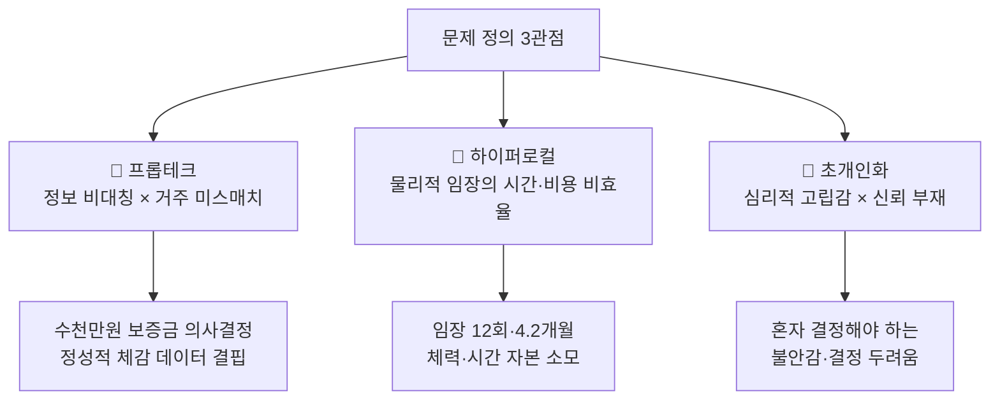
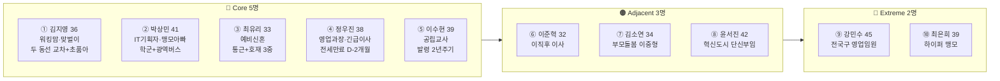
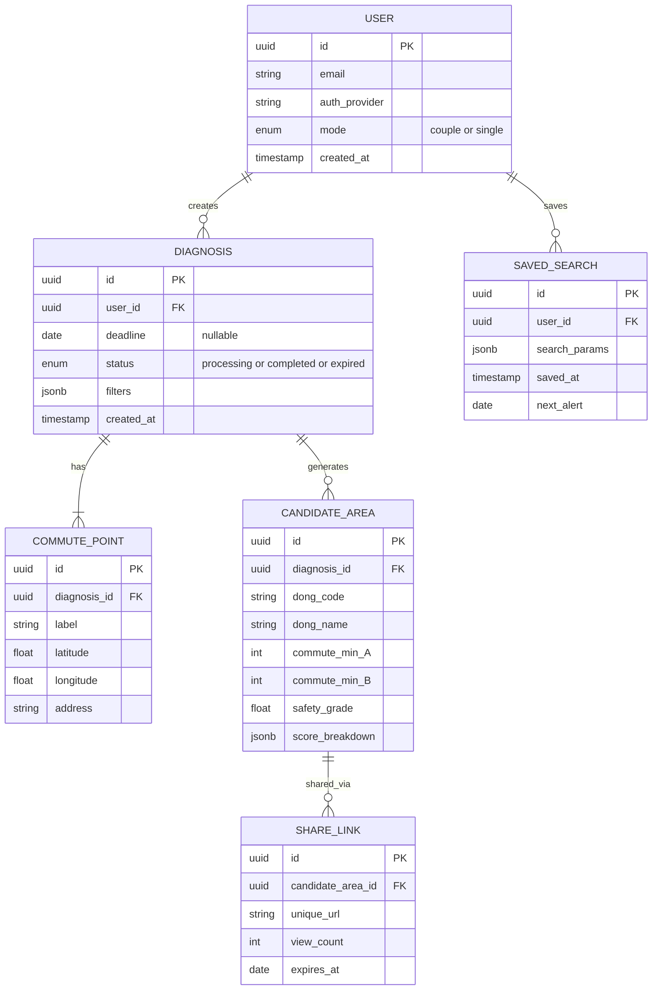
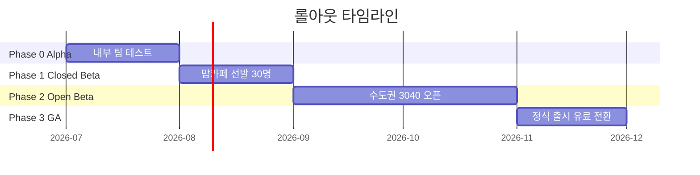

# 내 하루 동선 맞춤 동네 궁합 진단기 — PRD v0.1-rev.3

- **Owner 팀:** Product Squad (PM + Design + Engineering)
- **최종 업데이트:** 2026-04-18
- **리뷰 반영:**
  - rev.1 (2026-04-12): 품질 리뷰 v0.1 — 측정 가능성·검증 가능성 8개 Gap 수정
  - rev.2 (2026-04-12): 최종 검토 — Could 공수 추정 + ADR 3건 추가
  - rev.3 (2026-04-18): SRS Rev 1.5 MVP 축소 반영 — F5 간이 저장·불러오기로 축소, Story 3-5 AC 축소, §5-3 AES-256·ISMS-P 제거, §7-2 Out-of-Scope 3건 추가, §7-3 R4 완화 전략 수정

---

## 1. 개요·목표

### 1-1. 문제 정의 (Pain 지표 포함)

이사를 앞둔 3040 맞벌이 부부·긴급 이사자·반복 이사자가 **두 사람의 출퇴근 동선을 동시에 만족하는 동네를 찾을 도구가 시장에 존재하지 않아** 발생하는 주거 미스매치·탐색 비용 낭비·심리적 고립감 문제를 해결한다.

| **실패 Pain 지표** | **현재 수치 (Baseline)** | **실패 임계치** |
| --- | --- | --- |
| 동네 탐색 기간 | 평균 4.2개월 (14건 인터뷰 실측) | ≥ 3개월 유지 시 서비스 가치 미입증 |
| 오프라인 임장 횟수 | 평균 12회/이사 건 | ≥ 8회 유지 시 디지털 대체 가치 미달 |
| 부부 합의 실패율 | 의사결정 단위가 부부인 경우 70%가 1차 합의 실패 (12/14명 언급) | 공유 링크 사용 후에도 합의 실패율 ≥ 50% |
| 긴급 이사 탐색 시간 | 일 2시간 이상 앱 탐색 (C-03 세그먼트) | ≥ 1시간/일 유지 시 데드라인 모드 가치 미달 |
| 반복 이사 원점 재시작 | 탐색 기간 3주 (매 이사 건마다 기록 소실) | 재탐색 시에도 ≥ 2주 소요 시 저장 기능 실패 |
| 가입 → 유료 전환율 | 시장 평균 SaaS 전환율 2~5% | < 3% 시 BM 성립 불가 |
| 리텐션 (7일) | 유사 서비스 7일 리텐션 약 20% | < 15% 시 핵심 가치 미전달 판정 |

### 1-2. 문제의 3가지 관점

- **관점 1 — 프롭테크:** 대형 플랫폼(네이버부동산·직방)은 정량적 매물 데이터(가격·평수)를 제공하지만, 개인 라이프스타일 맥락을 반영한 체감 데이터(오르막 경사, 야간 소음, 출퇴근 체감 피로도)는 심각하게 결핍
- **관점 2 — 하이퍼로컬:** 동네 실제 인프라 검증을 위한 '미리 살아보기' 수요가 폭증하나, 자본·시간 소모가 막대 (리브애니웨어 180억+ 거래액)
- **관점 3 — 초개인화 큐레이션:** 개인 성향 기반 동네 선택 니즈는 진화하나 취향 기반 B2C 대체 서비스는 블루오션. 유튜브 '동네 브이로그' 대체재 위협 존재

### 1-3. 목표 (Desired Outcome 수치화)

| **목표** | **현재 상태** | **목표 상태** | **달성 기한** | **측정 방법** |
| --- | --- | --- | --- | --- |
| 동네 탐색 시간 단축 | 수작업 2~3시간/회 | ≤ 10분/회 | MVP 출시 후 1개월 | Mixpanel `diagnosis_completed` 이벤트 타임스탬프 차이 (입력 시작 → 결과 확인) |
| 후보 동네 압축 | 24곳 수동 비교 | ≤ 3곳 자동 추천 | MVP 출시 | 서버 로그 `candidate_area_count` 필드 평균값. 주간 대시보드 |
| 오프라인 임장 절감 | 12회/건 | ≤ 3회/건 (75% 절감) | v1 (3개월) | 결제 완료 D+30 후속 설문 "실제 임장 횟수" 문항 (5점 리커트 + 숫자 기입) |
| 부부 합의 소요 시간 | 합의까지 4.2개월 | ≤ 2주 | MVP 출시 후 3개월 | Proxy: `share_link_created` → `payment_completed` 이벤트 간 일수 중앙값 (Amplitude 퍼널) |
| 긴급 이사 탐색 효율 | 일 2시간 | ≤ 30분/일 | MVP 출시 | Mixpanel `daily_session_duration` 데드라인 모드 사용자 세그먼트 평균 |
| 반복 이사 재탐색 | 3주/건 | ≤ 3일/건 | v1 (3개월) | `search_replay` → `diagnosis_completed` 이벤트 간 일수. Amplitude 코호트 |

### 1-4. 성공 지표 (北극성 KPI / 보조 KPI)

| **구분** | **KPI** | **기준선** | **목표값** | **측정 주기** | **측정 도구** | **이벤트/쿼리** |
| --- | --- | --- | --- | --- | --- | --- |
| **🌟 북극성** | **유료 진단 리포트 완료 수 / 주** | 0 | 50건/주 (3개월) → 200건/주 (6개월) | 주간 | Amplitude | `report_paid_completed` count, weekly |
| 보조 1 | 무료 체험 → 유료 전환율 | 2~5% | ≥ 8% | 주간 | Amplitude Funnel | `diagnosis_free_completed` → `payment_success` |
| 보조 2 | 배우자 공유 링크 클릭률 | 0 | ≥ 40% | 주간 | Mixpanel | `share_link_clicked` / `report_generated` |
| 보조 3 | 공유 링크 → 2nd 유저 전환율 | 0 | ≥ 15% | 주간 | Amplitude | `share_link_signup` / `share_link_clicked` |
| 보조 4 | D+7 리텐션 | ~20% | ≥ 25% | 월간 | Amplitude Retention | `session_start` D+7 코호트 |
| 보조 5 | NPS | 30~40 | ≥ 50 | 분기 | Delighted / 인앱 설문 | NPS 설문 (리포트 완료 D+3 트리거) |
| 보조 6 | 평균 탐색 완료 시간 | 2~3h | ≤ 10분 | 주간 | Mixpanel | `diagnosis_started` → `diagnosis_completed` p50 |
| 보조 7 | 긴급 이사 계약 완료율 | 미측정 | ≥ 60% | 월간 | Amplitude + 설문 | Proxy: `deadline_mode_activated` 사용자 D+60 설문 "계약 완료 여부". 응답률 ≥ 30% 확보 시 유효 |

---

## 2. 사용자와 페르소나

### 2-1. 핵심 페르소나 요약

### 2-2. MVP 핵심 타겟 세그먼트

| **세그먼트** | **대표 페르소나** | **핵심 JOB** | **Pain 강도 (AOS)** | **WTP** |
| --- | --- | --- | --- | --- |
| **C-01 맞벌이 부부** | ① 김지영 (36) | 두 동선 교차 + 배우자 합의 | 4.00 | 3~5만원 |
| **C-02 맹모삼천지교** | ② 박상민 (41) | 학군 + 광역버스 착석 통합 | 3.60 | 5만원 |
| **C-03 긴급 이사** | ④ 정우진 (38) | 데드라인 급매 필터링 | 3.80 | **10만원** |
| **C-04 반복 이사** | ⑤ 이수현 (39) | 입력값 저장·재탐색 | 3.12 | 3만원 |
| **A-01 이직 후 이사** | ⑥ 이준혁 (32) | 싱글 모드 간소화 | 3.04 | 3만원 |

### 2-3. 핵심 Pain·Needs 여정 링크

| **세그먼트** | **여정 단계별 핵심 Pain** | **VPS 참조** |
| --- | --- | --- |
| C-01 | 문제인식 → 교집합 도구 부재 / 탐색 → 3앱 분산 / 결제 → 배우자 동의 장벽 | VPS §1-2 CJM ①김지영 |
| C-02 | 문제인식 → 학군+교통 동시 계산 불가 / 탐색 → 착석 실측 9회 / 사용 → 셔틀 데이터 미제공 | VPS §1-2 CJM ②박상민 |
| C-03 | 문제인식 → 기존 탐색 방식 전(全) 무효화 / 탐색 → 교집합 매물 동시 필터 불가 | VPS §1-2 CJM ④정우진 |
| C-04 | 문제인식 → 이전 탐색 기록 소실 / 의사결정 → 미래 시뮬레이션 부재 | VPS §1-2 CJM ⑤이수현 |
| A-01 | 탐색 → 학군·가족 항목이 결과 오염 / 심리 → 혼자 결정해야 하는 고립감 | VPS §1-2 A-01 |

---

## 3. 사용자 스토리와 수용 기준 (AC, Acceptance Criteria)

### Story 3-1: 두 동선 동시 교차 진단

> **As a** 맞벌이 부부 (C-01 김지영),
> **I want** 부부 두 사람의 직장 주소를 한 번에 입력하면 교집합 후보 동네와 예상 출퇴근 시간을 지도로 즉시 시각화,
> **so that** 수작업 2~3시간을 10분 이내로 단축하고 후보 3곳을 추려 부부 합의에 이를 수 있다.

| **AC** | **Given** | **When** | **Then** | **측정 임계치** |
| --- | --- | --- | --- | --- |
| AC-1 | 사용자가 두 개의 직장 주소를 입력한 상태 | "진단 시작" 버튼을 클릭 | 교집합 후보 동네 ≥ 3곳이 지도 위에 시각화된다 | **응답 시간 ≤ 3초** (교통 API 포함), 실패율 < 1% |
| AC-2 | 교집합 결과가 지도에 표시된 상태 | 각 후보를 탭 | 양쪽 직장까지 예상 출퇴근 시간(대중교통·자차)이 표시된다 | **시간 오차 ≤ ±10%** (카카오맵 API 대비) |
| AC-3 | 출근 시간대를 오전 7~9시로 설정 | 시간대 변경 | 출퇴근 시뮬레이션이 해당 시간대 평균 소요시간으로 재계산된다 | **재계산 응답 ≤ 2초**, 시간대별 데이터 커버 ≥ 수도권 85% |
| AC-4 | 후보 동네가 3곳 이상 표시된 상태 | 조건 필터(최대 통근 시간, 예산) 적용 | 조건에 맞지 않는 후보가 실시간 필터링되어 지도가 갱신된다 | **필터 적용 응답 ≤ 1초** |
| AC-N1 | 사용자가 직장 주소를 **1개만** 입력한 상태 | "진단 시작" 클릭 | "두 번째 주소를 입력해 주세요" 인라인 에러 표시. 진단 API 호출 차단 | **에러 표시 ≤ 200ms**, 불완전 요청 서버 도달률 0% |
| AC-N2 | 두 직장 주소 입력 후 진단 시작 | **교통 API 타임아웃** (5초 이상 무응답) | "일시적 오류" 토스트 + 자동 재시도 1회. 재시도 실패 시 "잠시 후 다시 시도" 안내 + 실패 로그 전송 | **재시도 포함 총 응답 ≤ 10초**, 무한 로딩 노출 0건 |
| AC-N3 | 두 직장이 너무 멀리 떨어져 교집합 0곳 | 진단 실행 완료 | "조건을 만족하는 동네가 없습니다. 최대 통근 시간을 늘려보세요" 안내 + 조건 완화 제안 링크 표시 | **0곳 결과 화면 ≤ 1초**, 조건 완화 제안 ≥ 2개 |

---

### Story 3-2: 배우자 설득·공유 링크

> **As a** 맞벌이 부부 (C-01/C-02),
> **I want** 진단 결과를 공유 링크 1개로 배우자에게 즉시 전달하고, 배우자가 무료로 1곳 미리보기를 확인,
> **so that** 별도 앱 설치 없이 배우자가 동일한 데이터를 보고 합의에 도달할 수 있다.

| **AC** | **Given** | **When** | **Then** | **측정 임계치** |
| --- | --- | --- | --- | --- |
| AC-1 | 진단 리포트가 생성 완료된 상태 | "공유 링크 생성" 버튼 클릭 | 고유 URL이 생성되어 클립보드에 복사된다 | **링크 생성 ≤ 500ms**, URL 유효기간 ≥ 30일 |
| AC-2 | 배우자가 공유 링크를 수신한 상태 | 링크 클릭 | 앱 설치 없이 모바일 웹에서 리포트 전체 열람 + 무료 미리보기 1곳 확인 가능 | **페이지 로딩 ≤ 2초** (3G 환경), 비회원 접근 가능 |
| AC-3 | 배우자가 리포트를 열람 중 | 데이터 출처 배지를 탭 | 각 데이터 항목의 출처(공공데이터·API명)와 최종 업데이트 일자가 표시된다 | **출처 투명도 100%**: 모든 수치에 출처 배지 |
| AC-4 | 배우자가 무료 미리보기를 소진한 상태 | 추가 동네 상세 조회 시도 | 유료 전환 유도 화면이 표시된다 | **전환 유도 → 결제 완료까지 ≤ 3단계** |
| AC-N1 | 공유 링크가 만료(30일 초과)된 상태 | 배우자가 링크 클릭 | "이 링크는 만료되었습니다" 안내 + 원 사용자에게 재생성 알림 푸시 | **만료 페이지 로딩 ≤ 1초**, 개인정보 노출 0건 |
| AC-N2 | 비회원이 무료 미리보기 1곳 확인 완료 | 2곳째 동네 접근 시도 | 유료 전환 유도 모달 표시. 뒤로가기 시 원래 리포트로 복귀 (강제 이탈 방지) | **모달 표시 ≤ 300ms**, 모달 노출 후 이탈률 모니터링 (목표 ≤ 50%) |

---

### Story 3-3: 긴급 데드라인 탐색

> **As a** 긴급 이사자 (C-03 정우진),
> **I want** 이사 마감 기한을 입력하면 오늘 급매 매물 중 두 조건(직장 동선 + 유치원 배정) 교집합을 즉시 필터링,
> **so that** D-2개월 내 계약을 완료하고 일일 앱 탐색 시간을 2시간에서 30분으로 줄일 수 있다.

| **AC** | **Given** | **When** | **Then** | **측정 임계치** |
| --- | --- | --- | --- | --- |
| AC-1 | 사용자가 이사 마감일(D-day)을 입력한 상태 | "데드라인 모드" 활성화 | 계약 역산 타임라인(서류 준비·잔금 일정)이 자동 생성된다 | **타임라인 생성 ≤ 2초**, 항목 ≥ 5단계 |
| AC-2 | 데드라인 모드가 활성화된 상태 | 매물 목록 조회 | 오늘 신규 등록 급매 매물이 최상단에 표시되고, 등록 후 경과 시간이 표기된다 | **급매 데이터 지연 ≤ 4시간** (크롤링 주기) |
| AC-3 | 급매 목록이 표시된 상태 | 사용자 조건 필터(직장 동선 + 배정 구역) 적용 | 교집합 매물만 필터링되어 지도 + 리스트 동시 표시 | **교집합 연산 ≤ 1.5초**, 매물 0건 시 인근 확장 자동 제안 |
| AC-4 | 교집합 매물 확인 완료 | "30분 요약" 버튼 클릭 | Top 3 매물의 핵심 정보(통근 시간·가격·배정 학교)가 카드 형태로 요약된다 | **요약 카드당 정보 항목 ≥ 6개** |
| AC-N1 | 데드라인 모드 활성화 상태 | 조건 교집합 급매 매물 **0건** | "현재 조건의 급매가 없습니다" + ① 인근 동 반경 확장 제안, ② 조건 완화 슬라이더, ③ 신규 급매 푸시 알림 구독 옵션 | **0건 안내 + 제안 ≤ 1초**, 알림 구독 전환율 추적 (Mixpanel) |
| AC-N2 | 사용자가 이사 마감일을 **과거 날짜**로 입력 | "데드라인 모드" 활성화 시도 | "마감일은 오늘 이후여야 합니다" 인라인 에러. 달력 UI에서 과거 날짜 선택 불가 | **클라이언트 검증 ≤ 100ms**, 잘못된 날짜 서버 도달률 0% |

---

### Story 3-4: 싱글 모드 간소화 리포트

> **As a** 이직 후 1인 가구 이사자 (A-01 이준혁),
> **I want** 새 직장과 여가 거점 두 곳을 입력하면 야간 치안·라이프스타일 중심으로 학군 항목 없이 후보 동네를 추천,
> **so that** 3일 내 후보 5곳을 추리고 혼자 결정해야 하는 불안감을 60% 줄일 수 있다.

| **AC** | **Given** | **When** | **Then** | **측정 임계치** |
| --- | --- | --- | --- | --- |
| AC-1 | 사용자가 "싱글 모드"를 선택한 상태 | 직장 + 여가 거점 2곳 입력 | 학군·가족 관련 항목이 결과에서 자동 숨김 처리되고, 야간 치안·편의시설·카페 밀집도 레이어가 기본 활성화 | **불필요 항목 노출 0건** |
| AC-2 | 싱글 모드 결과가 표시된 상태 | 후보 동네 탭 | 야간(22~06시) 범죄 발생 건수 기반 안전 등급(A~D)이 표시된다 | **치안 데이터 커버리지 ≥ 수도권 90%**, 데이터 지연 ≤ 분기 |
| AC-3 | 리포트가 생성된 상태 | "리포트 저장" 클릭 | 간소화된 싱글 모드 리포트(A4 1~2쪽 분량)가 PDF로 다운로드된다 | **PDF 생성 ≤ 3초**, 항목: 통근·치안·편의시설·월세 범위 |
| AC-N1 | 싱글 모드에서 여가 거점 주소가 **서비스 커버리지 밖** (예: 제주) | 주소 입력 완료 | "해당 지역은 현재 수도권만 지원됩니다" 안내 + 지원 지역 목록 표시 | **안내 표시 ≤ 500ms**, 커버리지 밖 주소 진단 실행 0건 |

---

### Story 3-5: 간이 저장·불러오기 *(rev.3 축소)*

> **As a** 반복 이사자 (C-04 이수현),
> **I want** 이번 발령지 탐색 조건을 자동 저장하고, 다음 방문 시 불러와 현재 시점으로 재진단,
> **so that** 매번 원점 재시작(3주) 대신 즉시 입력값을 복원하여 탐색을 시작할 수 있다.

| **AC** | **Given** | **When** | **Then** | **측정 임계치** |
| --- | --- | --- | --- | --- |
| AC-1 | 사용자가 진단을 완료한 상태 | 세션 종료 또는 앱 종료 | 입력 조건(주소·필터·시간대)이 자동 저장(best effort)되어 다음 방문 시 복원 가능. 불러온 주소가 geocoding 실패 시 "다시 입력해주세요" 안내 | 복원 시간 ≤ 1초. 저장 실패 시 사용자 미통지 |

---

## 4. 기능 요구사항 (Functional)

### 4-1. MoSCoW 우선순위

> **M**ust / **S**hould / **C**ould / **W**on't (이번 릴리즈)

| **우선순위** | **기능** | **Phase** | **AOS** | **DOS** | **근거 (대안 대비 수치 비교)** |
| --- | --- | --- | --- | --- | --- |
| **M** | 두 주소 입력 → 교집합 지도 시각화 | 🔴 MVP | 4.00 | 4.00 | 시장 내 동시 교차 계산 도구 0개. 기존 수작업 2~3h → 10분 (**12~18× 속도 ↑**). 네이버·직방·카카오 모두 단일 출발지 한정 |
| **M** | 배우자 공유 링크 + 무료 미리보기 1곳 | 🔴 MVP | 3.84 | 3.65 | 기존 카카오톡 스크린샷 공유 대비 **데이터 일관성 100%**. 구현 비용 ≤ 2MD 대비 DOS 3위(3.65). 맘카페 바이럴 K-factor 목표 ≥ 1.2 |
| **M** | 데드라인 모드 (기한 입력 → 급매 실시간 연동 + 계약 역산) | 🔴 MVP | 3.80 | 2.85 | 기존 3앱 병행 탐색 일 2h → **30분/일 (75% ↓)**. 급매 발견 지연 기존 4.3h → 목표 ≤ 4h. 시장 데드라인 모드 보유 서비스 0개 |
| **M** | 싱글 모드 간소화 리포트 (학군 숨김 + 치안·여가 레이어) | 🔴 MVP | 3.20 | 2.46 | 기존 부동산 앱 불필요 항목 노출률 추정 40%+ → **0%**. 리포트 분량: 풀 리포트 A4 5쪽 → 싱글 모드 1~2쪽 (**60~80% 정보 밀도 향상**) |
| **M** | 이전 입력값 자동 저장 + 불러오기 (간이) | 🔴 MVP | 3.60 | 2.64 | 불러오기 후 현재 시점 재진단. 비교 뷰·시나리오 비교는 v1 연기 |
| **S** | 광역버스 착석 가능 노선 · 환승 횟수 표시 | 🟠 v1 | 3.52 | 2.47 | 카카오·네이버 지도도 '착석 가능 여부' 미제공. 독점적 데이터 레이어 |
| **S** | 야간 치안 · 조도 레이어 | 🟠 v1 | 3.60 | 2.10 | 경찰청 공공데이터 기반. 1인 여성 이사자 핵심 니즈 |
| **S** | 계약 후 비상 가이드 콘텐츠 | 🟠 v1 | 2.82 | 1.80 | Anxiety 해소 콘텐츠. 긴급 이사 세그먼트 충성도 강화 |
| **C** | 학교 배정 구역 레이어 + 학원가 밀집도 히트맵 | 🟢 v1.5 | 2.52 | 1.87 | 초등입학 앞둔 부모 핵심 니즈 |
| **C** | 교통 호재 오버레이 (철도 개발 노선) | 🟢 v1.5 | 2.22 | 1.19 | 투자 관점 부가 가치 |
| **C** | 발령 시나리오 복수 입력 (미래 시뮬레이션) | 🟢 v1.5 | 3.01 | 1.54 | 반복 이사 세그먼트 락인 완성 |
| **W** | 복수 목적지 모드 (최대 5개 거점) | 🔵 v2 | 2.96 | 1.49 | 극단 세그먼트 전용 |
| **W** | 학원 셔틀 종점 DB | 🔵 v2 | 4.00 | 1.60 | AOS 최고이나 TAM 0.4 협소. 파트너십 필수 |

### 4-3. Could / Won't 항목 구현 가능성 판단

| **우선순위** | **기능** | **예상 공수** | **1스프린트(2주) 내 가능** | **판단 근거** |
| --- | --- | --- | :---: | --- |
| **C** | 학교 배정 구역 레이어 + 학원가 히트맵 | 5~8 MD | ✅ 가능 | 교육부 공공데이터 폴리곤 렌더링. 기존 지도 레이어 on/off UI 패턴 재사용 |
| **C** | 교통 호재 오버레이 | 3~5 MD | ✅ 가능 | 국토부 노선 데이터 정적 JSON. 기존 지도 오버레이 컴포넌트 확장 |
| **C** | 발령 시나리오 복수 입력 | 8~12 MD | ⚠️ 2스프린트 | 기존 교차 계산 로직 확장 + 비교 뷰 신규 UI. 프론트+백엔드 동시 작업 필요 |
| **W** | 복수 목적지 모드 (최대 5개) | 10~15 MD | ❌ 불가 | 교차 계산 알고리즘 복잡도 O(n²) 증가. 최적화 별도 스프린트 필요 |
| **W** | 학원 셔틀 종점 DB | 15~20 MD | ❌ 불가 | 학원 연합회 파트너십 체결 선행. 데이터 수급 리드타임 ≥ 2개월 |

### 4-2. 삭제 확정

| **기능** | **DOS** | **삭제 근거** |
| --- | --- | --- |
| 추천 리워드 프로그램 | -0.20 | 자발적 바이럴이 이미 발생 중. 공식화 시 자발성 저해 위험 |

---

## 5. 비기능 요구사항 (NFR, Non-Functional Requirement)

### 5-1. 성능

| **항목** | **기준** | **비고** |
| --- | --- | --- |
| 두 동선 교차 계산 응답 | p95 ≤ 3,000 ms | 교통 API 2회 호출 포함 |
| 일반 페이지 로딩 | p95 ≤ 1,500 ms | 3G 모바일 환경 기준 |
| 공유 링크 페이지 로딩 | p95 ≤ 2,000 ms | 비회원·비설치 환경 |
| 필터 적용 / 재계산 | p95 ≤ 1,000 ms | 클라이언트 사이드 캐싱 활용 |
| 급매 데이터 갱신 주기 | ≤ 4시간 | 크롤링 + 알림 파이프라인 |

### 5-2. 신뢰성

| **항목** | **기준** |
| --- | --- |
| 월 가용성 (Uptime) | ≥ 99.5% (월 다운타임 ≤ 3.65시간) |
| 오류율 (5xx 응답) | ≤ 0.5% |
| 데이터 정합성 | 교통 API 시간 오차 ≤ ±10% (카카오맵 기준 교차 검증) |
| 재해 복구 (RTO) | ≤ 4시간 |
| 데이터 백업 (RPO) | ≤ 1시간 |

### 5-3. 보안 / 비용

| **항목** | **기준** | **검증 일정·방법** |
| --- | --- | --- |
| 개인정보 | 직장 주소·이사 기한 등 민감 정보는 Supabase 기본 전송 암호화(TLS/SSL)로 보호. GA 이후 필요 시 추가 암호화 도입 검토 *(rev.3: AES-256·ISMS-P 제거)* | Closed Beta 전 전송 암호화 적용 확인 |
| 인증 | OAuth 2.0 (카카오·네이버 소셜 로그인) + JWT 토큰 | 토큰 만료 15분, 리프레시 7일. Closed Beta 전 인증 플로우 QA 완료 |
| API 비용 | 월 API 호출 비용 ≤ 500만원 | CloudWatch 일간 비용 대시보드. 일 예산 80% 초과 시 슬랙 알림 (§5-4 연동) |
| 인프라 비용 | 월 서버 비용 ≤ 300만원 (MVP 기준) | 월간 FinOps 리뷰. 비용/유료리포트 단가 ≤ 3,000원 목표 |
| 공유 링크 보안 | 비인가 제3자 개인정보 접근 차단 | 링크 URL entropy ≥ 128bit (UUID v4). 열람 비밀번호 옵션. 열람 로그 실시간 알림 |

### 5-4. 모니터링

| **항목** | **도구** | **알림 기준** |
| --- | --- | --- |
| 에러 로그 | Sentry / Datadog | 5xx 에러 5분간 ≥ 10건 → 슬랙 알림 |
| 응답 시간 | Datadog APM | p95 > 목표치 120% → 슬랙 경고 |
| API 호출량 / 비용 | CloudWatch + 커스텀 대시보드 | 일일 호출량 > 예산 80% → 슬랙 경고 |
| 전환 퍼널 | Mixpanel / Amplitude | 유료 전환율 주간 하락 > 20%p → PM 알림 |
| 악성 트래픽 | WAF + Rate Limiter | IP당 분당 60req 초과 → 자동 차단 |

---

## 6. 데이터·인터페이스 개요

### 6-1. 핵심 엔터티

### 6-2. 외부 API 개요

| **API** | **용도** | **입력** | **출력** | **제약** |
| --- | --- | --- | --- | --- |
| 카카오 모빌리티 API | 대중교통 경로·환승·소요시간 | 출발/도착 좌표, 출발 시각 | 경로·소요시간·환승 횟수·도보 거리 | 일 50만 건 (무료 tier), 초과 시 종량제 |
| 국토교통부 실거래가 API | 전·월세 실거래가 | 법정동 코드, 기간 | 거래일·보증금·월세·면적 | 일 1,000건 (OpenAPI) |
| 경찰청 범죄 통계 API | 야간 치안 데이터 | 관할서 코드, 기간 | 범죄 유형별 발생 건수 | 분기 갱신 |
| 교육부 학교 배정 구역 | 초등 배정 구역 좌표 | 시도교육청 코드 | 학교별 배정 구역 폴리곤 | 연 1회 갱신 |

### 6-3. 내부 API 개요

| **Endpoint** | **Method** | **용도** | **입력** | **출력** |
| --- | --- | --- | --- | --- |
| `/api/v1/diagnosis` | POST | 진단 생성 (두 동선 교차 계산) | 주소 2개, 필터 조건 | 후보 동네 리스트 + 스코어 |
| `/api/v1/diagnosis/{id}/share` | POST | 공유 링크 생성 | 진단 ID | 고유 URL |
| `/api/v1/diagnosis/{id}/report` | GET | 리포트 조회 (공유 링크 포함) | 진단 ID, 인증 토큰 | 리포트 JSON/PDF |
| `/api/v1/search/save` | POST | 입력값 저장 | 유저 ID, 검색 조건 | 저장 확인 |
| `/api/v1/search/replay` | POST | 과거 조건 재탐색 | 저장된 검색 ID | 갱신된 결과 + 이전 결과 비교 |

---

## 7. 범위 (In/Out), 리스크·가정·의존성

### 7-1. In Scope (MVP)

| **포함** | **상세** |
| --- | --- |
| 두 동선 교차 진단 | 주소 2개 → 교집합 동네 지도 시각화 + 출퇴근 시간 |
| 배우자 공유 링크 | URL 공유 + 무료 미리보기 1곳 + 데이터 출처 배지 |
| 데드라인 모드 | 이사 기한 입력 → 급매 우선 필터 + 계약 역산 |
| 싱글 모드 | 학군 숨김 + 치안·라이프스타일 레이어 기본 활성화 |

### 7-2. Out of Scope (MVP)

| **제외** | **사유** | **예정 Phase** |
| --- | --- | --- |
| 매물 중개 / 계약 체결 | 부동산 중개업 라이선스 필요. 비적대적 리드 제네레이션 모델 | v1+ |
| 학원 셔틀 종점 DB | TAM 0.4 협소. 학원 연합회 파트너십 필수 | v2 |
| 지방(비수도권) 커버리지 | 교통 API·매물 데이터 커버리지 부족 | v1.5+ |
| 과거 vs 현재 비교 뷰 | 1인 MVP 범위 축소. 비교 UI 복잡도 과다 *(rev.3)* | v1 |
| 시나리오 복수 비교 | 1인 MVP 범위 축소. 다중 시나리오 연산 복잡도 *(rev.3)* | v1.5 |
| 행정동 변경 자동 감지 | 1인 MVP 범위 축소. 분기 갱신 매핑 테이블 유지 비용 *(rev.3)* | v1.5 |

### 7-3. 리스크

| **#** | **리스크** | **정량 임팩트** | **발생 확률** | **트리거 조건** | **완화 전략** |
| --- | --- | --- | --- | --- | --- |
| R1 | **교통 API 정책 변경 / 요금 인상** | 핵심 기능(교차 계산) 100% 중단. 일 매출 전액 영향 | 중 | API 단가 20%↑ 또는 일 호출 한도 50% 축소 공지 시 | 카카오+네이버 이중 연동. 공공데이터 백업. 24h 캐싱 TTL |
| R2 | **급매 크롤링 법적 리스크** | 데드라인 모드 비활성화 → C-03 세그먼트 전체 이탈 (WTP 10만원 손실) | 중 | 크롤링 대상측 cease-and-desist 통지 수신 시 | 직방·피터팬 공식 API 우선 제휴. 병행 크롤링 시 robots.txt 준수 + 법률 검토 |
| R3 | **수도권 외 데이터 커버리지 부족** | 비수도권 유입 시 이탈률 ≥ 90%. NPS ≤ 10 위험 | 높음 | 비수도권 주소 입력 시도 비율 ≥ 전체 15% 도달 시 | MVP는 수도권 집중. 커버리지 안내 UI. 지방 확장은 v1.5+ |
| R4 | **공유 링크 프라이버시 이슈** | 직장 주소 노출 → 개인정보 침해 민원. 벌과금 최대 매출 3% | 낮음 | 공유 링크 비인가 접근 시도 월 ≥ 5건 감지 시 | 링크 만료 30일 + UUID v4 entropy ≥ 128bit만으로 완화. 열람 비밀번호·열람 기록 알림은 GA 이후 도입 검토 *(rev.3: AES-256 제거에 따른 완화 전략 조정)* |
| R5 | **초기 유료 전환율 미달** | 전환율 < 3% 시 월 매출 < 150만원 → BM 지속 불가 | 중 | Open Beta 4주 누적 전환율 < 5% 시 가격/퍼널 피벗 검토 | 무료 미리보기 → 유료 퍼널. 긴급 이사(고WTP) 우선 타겟팅. EXP-3 반영 |

### 7-4. 가정 (Assumptions)

| **#** | **가정** | **검증 방법** |
| --- | --- | --- |
| A1 | 카카오 모빌리티 API 무료 tier로 MVP 트래픽 감당 가능 (일 50만 건) | MVP 출시 전 예상 트래픽 시뮬레이션 |
| A2 | 맘카페·부동산 커뮤니티가 유효한 핵심 획득 채널 | 베타 기간 채널별 CAC 측정 |
| A3 | 3040 부부의 WTP 3~5만원이 유효 | 베타 유저 결제 데이터 실측 |
| A4 | 데이터 출처 배지가 신뢰도 향상에 유의미한 영향 | A/B 테스트: 배지 유/무 → NPS 차이 |

### 7-5. 의존성

| **대상** | **유형** | **상세** |
| --- | --- | --- |
| 카카오 모빌리티 | 외부 API | 대중교통 경로·소요시간 핵심 데이터 제공자 |
| 국토교통부 공공데이터 | 외부 API | 실거래가·건축물대장 |
| 경찰청 공공데이터 | 외부 API | 범죄 통계 (야간 치안 레이어) |
| 결제 PG사 (토스페이먼츠 등) | 외부 서비스 | 유료 리포트 결제 인프라 |

### 7-6. ADR (Architecture Decision Records) — 핵심 설계 결정 기록

#### ADR-001: 1차 교통 데이터 소스로 카카오 모빌리티 API 선택

| 항목 | 내용 |
| --- | --- |
| **Context** | 두 동선 교차 계산의 핵심 데이터(대중교통 경로·소요시간)를 제공하는 API가 필요. 후보: ① 카카오 모빌리티, ② 네이버 지도, ③ 오디세이(ODsay), ④ 공공데이터 포털(TAGO) |
| **Decision** | **카카오 모빌리티 API를 1차 소스로 선택**, 네이버 지도 API를 장애 시 자동 전환 백업으로 병행 연동 |
| **Rationale** | 카카오: 무료 tier 일 50만 건(MVP 충분), 환승 횟수·도보 거리 포함, 카카오 로그인과 생태계 시너지. 네이버: 백업 용도. ODsay: 대중교통 특화이나 자차 경로 미지원. TAGO: 실시간성 부족(배치 갱신) |
| **Consequences** | (+) MVP 비용 0원으로 교통 데이터 확보. (+) 카카오 로그인 연동 시 UX 일관. (−) 카카오 API 정책 종속 리스크(R1). (−) 착석률 데이터는 카카오도 미제공 → v1에서 별도 수집 필요 |
| **Status** | ✅ 채택 (2026-04) |

#### ADR-002: 하이브리드 과금 모델 (1회성 + 월정액) 채택

| 항목 | 내용 |
| --- | --- |
| **Context** | 이사 의사결정 서비스 특성상 사용 빈도가 낮고 비주기적. 순수 구독 / 1회성 / 하이브리드 3가지 모델을 SOM 시뮬레이션으로 비교 |
| **Decision** | **하이브리드 모델 채택** — 첫 진단 30,000원(1회성) + 월정액 10,000원/월(구독 전환 30% 가정) |
| **Rationale** | VPS §Ⅴ-1 SOM 시뮬레이션: 모델 A(1회성) 약 300만원 vs **모델 B(하이브리드) 약 1,680만원** vs 모델 C(순수 구독) 약 2,682만원. 순수 구독(C)이 수치상 최고이나 "이사 무관 기간 이탈률" 높아 현실성 낮음. 하이브리드(B)는 학교 배정·전셋값 변동 등 정보 업데이트 니즈로 구독 명분 확보 |
| **Consequences** | (+) 1회 결제 진입 장벽 낮음. (+) 반복 이사형(C-04) 구독 전환으로 LTV 구조화. (−) 구독 전환율 30% 미달 시 모델 A 대비 열위 → EXP-3에서 가격 탄력성 실측 후 조정. (−) 이사 완료 후 자연 이탈 방지를 위한 "2년 후 재진단 알림" 등 리텐션 장치 필수 |
| **Status** | ✅ 채택 (2026-04). Open Beta EXP-3 결과 반영 후 재검토 |

#### ADR-003: MVP 커버리지를 수도권으로 한정

| 항목 | 내용 |
| --- | --- |
| **Context** | 교통 API·매물 데이터·치안 데이터의 품질·밀도가 지역마다 상이. 전국 커버 시 데이터 정합성 보장 불가 |
| **Decision** | **MVP는 수도권(서울·경기·인천)으로 한정**. 비수도권 주소 입력 시 커버리지 안내 UI 표시 |
| **Rationale** | R3 리스크 분석: 비수도권 유입 시 이탈률 ≥ 90%, NPS ≤ 10 위험. 카카오 API 수도권 정확도 ≥ 90% vs 비수도권 ≤ 60% 추정. 핵심 타겟(3040 맞벌이) 70%+가 수도권 거주(통계청 2023). MVP 단계에서 품질 > 커버리지 전략 |
| **Consequences** | (+) 데이터 정합성 ≥ 85% 보장. (+) QA·고객 지원 범위 축소로 운영 효율. (−) 비수도권 교사·군인(C-04 일부) 대응 불가 → v1.5에서 혁신도시 6곳 우선 확장. (−) 비수도권 주소 입력 비율 ≥ 15% 도달 시 확장 우선순위 상향 트리거(R3) |
| **Status** | ✅ 채택 (2026-04). 비수도권 입력 비율 모니터링 후 v1.5 확장 판단 |

---

## 8. 실험·롤아웃·측정

### 8-1. 롤아웃 계획

| **Phase** | **대상** | **규모** | **기간** | **핵심 측정 항목** |
| --- | --- | --- | --- | --- |
| **Alpha** | 내부 팀 + 지인 | 10명 | 1개월 | 기능 완성도, 크리티컬 버그 수 |
| **Closed Beta** | 맘카페 선발 사용자 | 30명 | 1개월 | 과업 완료율, 평균 탐색 시간, NPS, WTP 실측 |
| **Open Beta** | 수도권 3040 부부 | 300명 | 2개월 | 유료 전환율, 공유 링크 바이럴 계수, D+7 리텐션 |
| **GA** | 전체 오픈 | 목표 1,000명/월 | 지속 | 북극성 KPI, 보조 KPI 전체 |

### 8-2. 실험 설계 (A/B 테스트)

| **실험** | **가설** | **그룹** | **측정 KPI** | **성공 기준** | **α** | **1−β** | **MDE** | **기간** |
| --- | --- | --- | --- | --- | --- | --- | --- | --- |
| **EXP-1: 배우자 공유 링크** | 공유 링크 제공 시 유료 전환율이 높아진다 | A: 공유 링크 활성 / B: 결과만 조회 | 유료 전환율, 2nd 유저 가입률 | A ≥ B × 1.5 | 0.05 | 0.80 | 전환율 절대차 +4%p | 4주 (n=200, 그룹당 110명 권장) |
| **EXP-2: 데드라인 모드 UX** | 타임라인 제공 → 과업 완료율 상승 | A: 타임라인 포함 / B: 필터만 | D-2개월 내 계약 완료율, 일일 사용 시간 | A ≥ 60% | 0.05 | 0.80 | 완료율 절대차 +15%p | 4주 (n=100) |
| **EXP-3: 무료 미리보기 범위** | 1곳 vs 3곳 → 전환율 차이 | A: 1곳 / B: 3곳 | 유료 전환율, NPS | A ≥ B × 1.2 | 0.05 | 0.80 | 전환율 절대차 +3%p | 4주 (n=200) |
| **EXP-4: 데이터 출처 배지** | 출처 배지 → NPS ↑ | A: 배지 O / B: 배지 X | NPS, 리포트 공유율 | A NPS ≥ B + 10p | 0.05 | 0.80 | NPS 절대차 +10p | 4주 (n=200) |

> **검정력 참고:** EXP-1 기준, 기존 전환율 5% 가정 시 n=200(그룹당 100)으로 MDE +4%p를 감지하려면 1−β ≈ 0.78. 80% 확보 위해 그룹당 110명 상향 권장.

### 8-3. 경쟁 대안 대비 벤치마크 계획

| **비교 축** | **기존 대안 (Best)** | **우리 서비스 목표** | **측정 방법** |
| --- | --- | --- | --- |
| **동선 탐색 시간** | 네이버 지도 + 직방 병행 = 수작업 약 2~3시간 | **≤ 10분** (12~18배 단축) | 베타 사용자 과업 완료 시간 실측 (Mixpanel 이벤트) |
| **부부 합의 도달 기간** | 카카오톡 공유 기반 = 평균 4.2개월 | **≤ 2주** (8~12배 단축) | 베타 사용자 설문 + 공유 링크 → 결제 사이클 추적 |
| **오프라인 임장 횟수** | 매물 앱 기반 = 평균 12회/건 | **≤ 3회/건** (75% 절감) | 결제 완료 후 후속 설문 |
| **연간 비용** | 리브애니웨어 단기체류 = 1주 50~80만원 | **1회 진단 3~5만원** (비용 93~96% 절감) | 가격 비교 테이블 LP 표시. 결제 설문 "비교 대안" 항목 |
| **정보 통합도** | 3개 앱 동시 탭 (호갱노노+카카오+직방) | **단일 화면 통합** | SUS(System Usability Scale) 점수 비교 |

---

## 9. 근거 (Proof)

### 9-0. Proof → KPI → 실험 추적 매트릭스

| **Proof (근거)** | **뒷받침하는 KPI** | **후속 검증 실험** | **검증 완료 판정 기준** |
| --- | --- | --- | --- |
| JTBD 14명 전원 "두 동선 교차" 언급 (AOS 4.00) | 🌟 북극성: 유료 리포트 수 / 보조 6: 탐색 시간 | EXP-1 (과업 완료 시간 포함) | 탐색 완료 시간 p50 ≤ 10분 실측 시 검증 완료 |
| 배우자 공유 링크 12/14명 언급, DOS 3.65 | 보조 2: 링크 클릭률 / 보조 3: 2nd 유저 전환율 | EXP-1 | 클릭률 ≥ 40% + 2nd 전환 ≥ 15% 동시 충족 |
| C-03 긴급 이사 WTP 10만원 (INT-07) | 보조 7: D-2개월 내 계약 완료율 | EXP-2 | 긴급 이사 유료 전환율 ≥ 12% + 계약 완료 설문 ≥ 60% |
| TAM-SAM-SOM: SAM 750억+, SOM 하이브리드 1,680만원/1년 | 보조 1: 무료→유료 전환율 | EXP-3 | 전환율 ≥ 8% 실측 시 SOM 모델 가정 유효 |
| 1인 가구 전월세 34% (통계청) | 싱글 모드 리포트 생성 수 (신규 보조 KPI 후보) | GA 후 세그먼트별 분석 | 싱글 모드 리포트 비율 ≥ 전체의 20% |
| AOS/DOS: 추천 리워드 DOS -0.20 | — (삭제 확정) | — | GA 6개월 후 organic K-factor < 1.0 시 리워드 재검토 |

### 9-1. 인터뷰 / 정성 리서치

| **출처** | **규모** | **기간** | **핵심 결과** | **참조** |
| --- | --- | --- | --- | --- |
| JTBD 인터뷰 | 14건 (Core 12 + Adjacent 2) | 2026-03-10 ~ 03-28 | 두 동선 교차 Pain 전원 언급 (AOS 4.00), 배우자 공유 링크 12/14명 언급, 5개 신규 Pain 발굴 | VPS §Ⅱ, §Ⅴ-3 |
| AOS/DOS 분석 | 20개 Pain Point 정량 평가 | 2026-03 | 학원 셔틀 DB AOS 최고(4.00)→DOS 후순위(1.60), 추천 리워드 DOS 유일 음수(-0.20) | VPS §Ⅴ-2 |
| CJM (고객 여정 지도) | 5개 세그먼트 × 5단계 | 2026-03 | 여정 단계별 Pain Point·개선 기회 도출 | VPS §Ⅰ-2 |

### 9-2. 시장 데이터 / 정량 리서치

| **출처** | **데이터** | **수치** |
| --- | --- | --- |
| Precedence Research | 글로벌 프롭테크 TAM | $470억 (2025) → $2,090억 (2035), CAGR 16% |
| 한국프롭테크포럼 | 국내 프롭테크 시장 | 약 2조 3,112억원 (134개사, 전년비 9.1%↑) |
| 국토교통부 | 연간 전·월세 이동 가구 | 수백만 가구 → SAM 750억+ (단가 5만원) |
| 통계청 | 전월세 1인가구 비율 | 34% |
| 여성가족부 가족실태조사 | 30대 부모 방문부양 비율 | 23.8% |
| 통계청 | 연간 이직자 수 | 약 330만 명 (2023) |

### 9-3. WTP (지불 의향) 검증

| **세그먼트** | **WTP** | **직접 발언** | **실험 연결** |
| --- | --- | --- | --- |
| C-01 맞벌이 부부 | 3~5만원 | "입장비보다 싸다" | EXP-3: 무료 미리보기 범위 A/B |
| C-02 맹모삼천지교 | 5만원 | "임장 교통비보다 싸다" | EXP-3: 무료 미리보기 범위 A/B |
| C-03 긴급 이사 | **10만원** | "이 상황이면 10만원도 냈겠다" | EXP-2: 데드라인 모드 UX |
| A-01 이직 후 이사 | 3만원 | — | EXP-3: 무료 미리보기 범위 A/B |

### 9-4. 벤치마크 / 경쟁 분석

| **항목** | **기존 서비스 (Best Case)** | **우리 서비스** | **개선 배수** | **검증 실험** |
| --- | --- | --- | --- | --- |
| **탐색 속도** | 수작업 2~3시간 | 10분 | **12~18× ↑** | EXP-1 과업 완료 시간 (Mixpanel) |
| **탐색 비용** | 리브애니웨어 1주 50~80만원 | 1회 3~5만원 | **비용 93~96% ↓** | 결제 후 설문 비교 대안 |
| **정보 통합도** | 3개 앱 동시 사용 | 단일 화면 | **앱 전환 0회** | SUS 점수 측정 (n=100) |
| **부부 합의 기간** | 4.2개월 | 2주 이내 | **8~12× ↑** | 공유 링크 → 결제 사이클 추적 |

### 9-5. 핵심 증거 인용 (인터뷰 직접 발언)

> **INT-01 이지은 (맞벌이)**
> "저는 여의도인데 남편은 판교잖아요. 네이버 지도로 각자 검색하면 서로 원하는 동네가 달라서… 합의를 못 해요."

> **INT-04 최동훈 (맹모)**
> "착석 가능 노선인지는 직접 타봐야 알아요. 데이터가 아예 없거든요. 중개사 세 명이 다 다른 단지를 추천해서 객관적인 제3자 스코어가 필요해요."

> **INT-07 김준혁 (긴급)**
> "그 날 집주인 연락이랑 발령 문자가 같은 날 왔어요. 진짜 눈앞이 하얘지더라고요. 이 상황이면 10만원도 냈겠어요."

> **INT-10 한수빈 (반복)**
> "2년 전에 이 고민 했었거든요. 그때 뭘 기준으로 골랐는지가 기억이 안 나요."

> **INT-13 류승민 (이직)**
> "치안 점수랑 자전거 도로 있는지가 저한테는 제일 중요해요. 학군 항목이 불필요해요."

---

> **내 하루 동선 맞춤 동네 궁합 진단기** | PRD v0.1-rev.3 | 2026-04-18
>
> *본 PRD는 Value Proposition Sheet (V2 · Rooted)에 기반하여 작성되었으며, 14건 JTBD 인터뷰·AOS/DOS 분석·TAM-SAM-SOM 검증 데이터를 직접 참조합니다.*
> *rev.1: 품질 리뷰 — 측정 가능성·검증 가능성 8개 Gap 수정 (2026-04-12)*
> *rev.2: 최종 검토 — Could 공수 추정 + ADR 3건 추가 (2026-04-12)*
> *rev.3: SRS Rev 1.5 MVP 축소 반영 — F5 간이 저장·불러오기 축소, Story 3-5 AC 축소, AES-256·ISMS-P 제거, Out-of-Scope 3건 추가, R4 완화 전략 조정 (2026-04-18)*
