# Software Requirements Specification (SRS)

**Document ID:** SRS-001
**Revision:** 1.5
**Date:** 2026-04-18
**Standard:** ISO/IEC/IEEE 29148:2018

| 항목 | 내용 |
| --- | --- |
| **제품명** | 내 하루 동선 맞춤 동네 궁합 진단기 |
| **Owner 팀** | Product Squad (PM + Design + Engineering) |
| **Source PRD** | PRD v0.1-rev.2 (2026-04-12) |
| **승인 상태** | Draft |

---

## Rev 1.5 Changelog (2026-04-18)

> **변경 사유:** 3년차 IT기획 퍼블리셔 + 초급 SW 배경의 1인 개발자가 MVP/PMF 검증을 위해 구현 가능한 범위로 스코프를 축소한다. 기술 스택(Next.js + Supabase + Vercel)은 유지.

### 제거 항목

- **REQ-FUNC-026** (이전 조건 재탐색 비교 뷰) — §4.1.5 F5 축소. 비교 뷰는 MVP 이후
- **REQ-FUNC-027** (시나리오 3개 비교) — §4.1.5 F5 축소. 시나리오 비교는 MVP 이후
- **REQ-FUNC-028** (행정동 변경 감지 95%) — §4.1.5 F5 축소. 행정동 매핑 테이블 유지 비용 대비 가치 부족
- **REQ-NF-017** (AES-256 PII 암호화) — §4.2.3. MVP에서 Supabase 기본 전송 암호화(TLS)만 사용
- **REQ-NF-019** (OWASP DAST 스캔) — §4.2.3. MVP/PMF 전 단계에서 외부 보안 감사 불필요
- **API-06** (`replaySearch()`) — §3.3, §6.1. 불러오기는 기존 `createDiagnosis()` 재사용으로 대체
- **UC-14** (이전 조건 재탐색), **UC-15** (시나리오 비교) — §6.5 UseCase Diagram에서 제거
- **TC-026 ~ TC-028** — §5.1 Traceability Matrix에서 제거
- **ERD ViewLog 엔터티** — §6.2 ERD. MVP에서 열람 로그 별도 테이블 불필요
- **ERD DongMap 엔터티** — §6.2 ERD. 행정동 매핑 테이블 제거 (REQ-FUNC-028 제거에 따라)

### 수정 항목

- **REQ-FUNC-025** (입력값 자동 저장) — §4.1.5. 저장 성공률 99.9% → "best effort"로 완화. 복원 실패 시 "다시 입력해주세요" 안내 추가
- **REQ-NF-011** (월간 가용성) — §4.2.2. 기존 "Best Effort" 유지 확인 (변경 없음)
- **REQ-NF-035~038** (운영 알림 임계치) — §4.2.6. Sentry 기본 알림만 유지로 축소. 커스텀 슬랙 연동·Mixpanel/Amplitude 이상 감지 제거
- **§1.2.1 In-Scope** — IS-07 F5 기능 설명을 "간이 저장·불러오기"로 축소 반영
- **§1.2.2 Out-of-Scope** — F5 고급 기능(비교 뷰, 시나리오 비교, 행정동 매핑)을 Out-of-Scope로 이동
- **§1.2.3 Constraints** — 보안·모니터링 제약 완화 반영
- **§3.3 API Overview** — `replaySearch()` 제거, `saveSearch()` 설명 갱신
- **§5 Traceability Matrix** — 제거된 REQ-FUNC/TC 삭제 (ID 공백 유지, 재사용 금지)
- **§6.1 API Endpoint List** — API-06 제거
- **§6.2 ERD** — SavedSearch → 3필드(user_id, search_params, saved_at) 단순화. ViewLog, DongMap 제거
- **§6.3.5 입력값 저장·재탐색 시퀀스** — 간이 저장·불러오기로 전면 재작성
- **§6.5 UseCase Diagram** — UC-14, UC-15 제거
- **§6.6 Component Diagram** — Server Actions에서 `replaySearch` 제거
- **§6.7 Class Diagram** — SavedSearch 클래스 3필드로 단순화

### 추가 항목

- **§1.2.2 Out-of-Scope OS-06~OS-08** — F5 고급 기능을 Out-of-Scope로 명시

---

## 1. Introduction

### 1.1 Purpose

본 SRS는 **"내 하루 동선 맞춤 동네 궁합 진단기"** 서비스의 소프트웨어 요구사항을 정의한다.

이사를 앞둔 3040 맞벌이 부부·긴급 이사자·반복 이사자가 **두 사람의 출퇴근 동선을 동시에 만족하는 동네를 찾을 도구가 시장에 존재하지 않아** 발생하는 다음 문제를 해결한다:

- **주거 미스매치:** 대형 플랫폼(네이버부동산·직방)은 정량적 매물 데이터(가격·평수)만 제공하며, 개인 라이프스타일 맥락 반영 체감 데이터(오르막 경사, 야간 소음, 출퇴근 체감 피로도) 결핍
- **탐색 비용 낭비:** 수작업 동네 탐색 평균 4.2개월, 오프라인 임장 평균 12회/건
- **심리적 고립감:** 부부 합의 실패율 70%(1차 합의), 개인 성향 기반 동네 선택 B2C 서비스 부재

본 문서는 개발팀·QA팀·운영팀이 시스템을 구현·검증·운영하기 위한 유일한 기술 요구사항 원천(Single Source of Truth)으로 사용된다.

### 1.2 Scope

#### 1.2.1 In-Scope (MVP)

| # | 포함 범위 | 상세 |
| --- | --- | --- |
| IS-01 | 두 동선 교차 진단 | 주소 2개 입력 → 교집합 후보 동네 지도 시각화 + 출퇴근 시간 표시 |
| IS-02 | 배우자 공유 링크 | URL 공유 + 무료 미리보기 1곳 + 데이터 출처 배지 |
| IS-03 | 데드라인 모드 | 이사 기한 입력 → 급매 우선 필터 + 계약 역산 타임라인 |
| IS-04 | 싱글 모드 | 학군 숨김 + 야간 치안·라이프스타일 레이어 기본 활성화 간소화 리포트 |
| IS-05 | 서비스 커버리지 | 수도권(서울·경기·인천) 한정 (ADR-003) |
| IS-06 | 인증 | OAuth 2.0 (카카오·네이버 소셜 로그인) |
| IS-07 | 과금 모델 | 하이브리드 — 1회 진단 30,000원 + 월정액 10,000원/월 (ADR-002) |
| IS-08 | 간이 저장·불러오기 | 입력 조건(주소·필터) 자동 저장(best effort) + 불러오기 시 createDiagnosis 재사용 |

#### 1.2.2 Out-of-Scope (MVP)

| # | 제외 범위 | 사유 | 예정 Phase |
| --- | --- | --- | --- |
| OS-01 | 매물 중개 / 계약 체결 | 부동산 중개업 라이선스 필요 | v1+ |
| OS-02 | 학원 셔틀 종점 DB | TAM 0.4 협소, 학원 연합회 파트너십 필수 | v2 |
| OS-03 | 지방(비수도권) 커버리지 | 교통 API·매물 데이터 커버리지 부족 | v1.5+ |
| OS-04 | 복수 목적지 모드 (최대 5개) | 교차 계산 알고리즘 복잡도 O(n²) 증가 | v2 |
| OS-05 | 추천 리워드 프로그램 | DOS -0.20, 자발적 바이럴 저해 위험 | 삭제 확정 |
| OS-06 | 이전 탐색 비교 뷰 (REQ-FUNC-026) | 1인 MVP 범위 축소. 비교 UI 복잡도 과다 | v1.5+ |
| OS-07 | 시나리오 3개 비교 (REQ-FUNC-027) | 1인 MVP 범위 축소. 다중 시나리오 연산 복잡도 | v2 |
| OS-08 | 행정동 변경 감지·매핑 (REQ-FUNC-028) | 1인 MVP 범위 축소. 분기 갱신 매핑 테이블 유지 비용 | v1.5+ |

#### 1.2.3 Constraints (제약사항)

| # | 제약 유형 | 내용 | 근거 |
| --- | --- | --- | --- |
| CON-01 | 기술 | 1차 교통 데이터 소스: 카카오 모빌리티 API, 장애 시 네이버 지도 API 자동 전환 | ADR-001 |
| CON-02 | 사업 | 하이브리드 과금 모델: 1회 30,000원 + 월정액 10,000원/월 | ADR-002 |
| CON-03 | 지역 | MVP 수도권(서울·경기·인천) 한정 | ADR-003 |
| CON-04 | 규제 | 부동산 중개업법에 따라 매물 중개·계약 체결 기능 제외 | OS-01 |
| CON-05 | 비용 | 월 인프라 비용 무료 ~ 10만원 이하, 월 외부 API 호출 비용 ≤ 100만원 | PRD §5-3, C-TEC-007 |
| CON-06 | 데이터 | 급매 크롤링 시 robots.txt 준수 + 법률 검토 필수 | R2 |
| CON-07 | 기술 | 교통 API는 카카오 모빌리티 1종만 사용하며, 장애 시 클라이언트 화면에 단순 에러 모달만 노출한다 | ADR-001 |
| CON-08 | 마케팅 | 핵심 획득 채널(맘카페·부동산 커뮤니티) 변경·차단 시 대체 채널(SEO, SEM, 인플루언서, 오프라인 제휴) 14일 내 전환 운영 계획 수립 필수 | ASM-02 |
| CON-09 | 기술 (스택) | 모든 서비스는 Next.js (App Router) 기반의 단일 풀스택 프레임워크로 구현한다. 프론트엔드와 백엔드를 별도 분리하지 않는다. | C-TEC-001 |
| CON-10 | 기술 (스택) | 서버 측 로직(DB 접근, 외부 API 호출 등)은 Next.js Server Actions 또는 Route Handlers를 사용하여 별도 백엔드 서버 없이 구현한다. | C-TEC-002 |
| CON-11 | 기술 (스택) | 데이터베이스는 Prisma ORM + SQLite(로컬 개발) / Supabase PostgreSQL(프로덕션)을 사용한다. | C-TEC-003 |
| CON-12 | 기술 (스택) | UI/스타일링은 Tailwind CSS + shadcn/ui를 사용하여 일관된 디자인 시스템을 강제한다. | C-TEC-004 |
| CON-13 | 기술 (스택) | LLM 오케스트레이션은 Vercel AI SDK를 사용하여 Next.js 내부에서 직접 구현한다. 별도 Python 서버를 두지 않는다. | C-TEC-005 |
| CON-14 | 기술 (스택) | LLM 호출은 Google Gemini API를 기본으로 사용하며, 환경 변수 설정만으로 모델 교체가 가능하도록 SDK 표준 인터페이스를 준수한다. | C-TEC-006 |
| CON-15 | 기술 (스택) | 배포 및 인프라는 Vercel 플랫폼으로 단일화한다. CI/CD 설정 없이 Git Push만으로 배포 자동화한다. | C-TEC-007 |
| CON-16 | 보안 | MVP 단계에서는 별도 PII 암호화(AES-256)를 적용하지 않으며, Supabase 기본 전송 암호화(TLS/SSL)만 사용한다. GA 이후 필요 시 추가 암호화 도입. | Rev 1.5 변경 |
| CON-17 | 모니터링 | MVP 단계에서는 Sentry 기본 알림만 사용한다. 커스텀 슬랙 연동 알림 임계치, Mixpanel/Amplitude 이상 감지 자동화는 GA 이후 도입. | Rev 1.5 변경 |

#### 1.2.4 Assumptions (가정)

| # | 가정 | 검증 방법 |
| --- | --- | --- |
| ASM-01 | 카카오 모빌리티 API 무료 tier(일 50만 건)로 MVP 트래픽 감당 가능 | MVP 출시 전 예상 트래픽 시뮬레이션 |
| ASM-02 | 맘카페·부동산 커뮤니티가 유효한 핵심 획득 채널. **채널 변경·불가 시 우회 전략:** ① 네이버 카페·블로그 SEO 콘텐츠 마케팅, ② Instagram·YouTube 부동산 인플루언서 협업, ③ 카카오톡 오픈채팅방 타겟 커뮤니티 운영, ④ Google/Naver 검색 광고(SEM), ⑤ 부동산 중개소 제휴 리플릿 배포 | 베타 기간 채널별 CAC 측정. 핵심 채널 차단 시 14일 내 대체 채널 전환. 대체 채널 CAC ≤ 핵심 채널 CAC × 1.5 목표 |
| ASM-03 | 3040 부부의 WTP 3~5만원이 유효 | 베타 유저 결제 데이터 실측 |
| ASM-04 | 데이터 출처 배지가 신뢰도 향상에 유의미한 영향 | A/B 테스트: 배지 유/무 → NPS 차이 (EXP-4) |
| ASM-05 | 모든 외부 API의 사전 캐시/수집 DB가 서비스 품질 저하를 최소화한 우회 운영을 지원 | 분기별 캐시 DB 정합성 검증 (실제 API 응답 대비 오차율 ≤ 15%). 캐시 히트율 모니터링 |

### 1.3 Definitions, Acronyms, Abbreviations

| 용어 | 정의 |
| --- | --- |
| **페르소나 (Persona)** | 제품의 핵심 사용자 유형을 대표하는 가상 인물 프로필 |
| **JTBD (Jobs to be Done)** | 사용자가 특정 상황에서 완수하고자 하는 과업 |
| **AOS (Adjusted Opportunity Score)** | Pain Point의 중요도와 불만족도를 결합한 기회 점수 (1~5 척도) |
| **DOS (Discovered Opportunity Score)** | 솔루션 구현 시 기대되는 효과를 반영한 발견 기회 점수 |
| **MoSCoW** | Must / Should / Could / Won't 우선순위 분류 체계 |
| **교집합 후보 동네** | 두 출퇴근 거점에서 설정 조건(최대 통근 시간·예산) 내 동시 도달 가능한 행정동 |
| **데드라인 모드** | 이사 마감 기한을 입력하면 급매 매물 우선 필터링 + 계약 역산 타임라인을 제공하는 모드 |
| **싱글 모드** | 1인 가구 대상으로 학군·가족 항목을 숨기고 야간 치안·편의시설·카페 밀집도 레이어를 기본 활성화하는 모드 |
| **공유 링크** | 진단 결과를 비회원 배우자에게 전달하기 위한 고유 URL (유효기간 30일) |
| **WTP (Willingness to Pay)** | 사용자의 서비스 지불 의향 금액 |
| **북극성 KPI** | 서비스의 핵심 성공을 판단하는 단일 최상위 지표 (유료 진단 리포트 완료 수/주) |
| **CJM (Customer Journey Map)** | 고객 여정 지도 — 사용자의 서비스 이용 단계별 경험 매핑 |
| **SUS (System Usability Scale)** | 시스템 사용성 척도 — 표준화된 사용성 평가 점수 |
| **K-factor** | 바이럴 계수 — 기존 사용자 1명이 유입시키는 신규 사용자 수 |
| **NPS (Net Promoter Score)** | 순추천 고객 지수 — 서비스 추천 의향을 -100~100으로 측정 |
| **RPO (Recovery Point Objective)** | 재해 복구 시 허용 가능한 최대 데이터 손실 시간 |
| **RTO (Recovery Time Objective)** | 재해 발생 후 서비스 복구까지 허용 가능한 최대 시간 |
| **ADR (Architecture Decision Record)** | 아키텍처 설계 결정 사항과 근거를 기록한 문서 |

### 1.4 References

| ID | 문서명 | 버전/일자 | 비고 |
| --- | --- | --- | --- |
| REF-01 | PRD: 내 하루 동선 맞춤 동네 궁합 진단기 | v0.1-rev.2 (2026-04-12) | 본 SRS의 유일한 비즈니스·기능 요구 원천. JTBD 인터뷰 14건(PRD §9-1), AOS/DOS 분석 20개 Pain Point(PRD §9-1), CJM 5세그먼트×5단계(PRD §2-3), TAM-SAM-SOM(PRD §9-2), WTP 검증(PRD §9-3), 벤치마크(PRD §9-4) 등 모든 근거 데이터를 직접 포함 |
| REF-02 | ISO/IEC/IEEE 29148:2018 | 2018 | 본 SRS 작성 표준 |

> **참고:** 아래 시장 데이터는 PRD §9-2에 직접 수록되어 있으며, 원출처를 부기한다.

| 원출처 | 데이터 | PRD 인용 위치 |
| --- | --- | --- |
| Precedence Research (2025) | 글로벌 프롭테크 TAM $470억 → $2,090억 (CAGR 16%) | PRD §9-2 |
| 한국프롭테크포럼 (2025) | 국내 약 2조 3,112억원 (134개사) | PRD §9-2 |
| 국토교통부 전·월세 통계 (2023) | SAM 750억+ 산출 근거 | PRD §9-2 |
| 통계청 — 1인 가구 전월세 비율 (2023) | 34%, 싱글 모드 근거 | PRD §9-2 |
| 여성가족부 가족실태조사 (2023) | 30대 부모 방문부양 비율 23.8% | PRD §9-2 |
| 통계청 — 연간 이직자 수 (2023) | 약 330만 명 | PRD §9-2 |

---

## 2. Stakeholders

| # | 역할 (Role) | 대표 페르소나 | 책임 (Responsibility) | 관심사 (Interest) |
| --- | --- | --- | --- | --- |
| STK-01 | **맞벌이 부부 사용자 (C-01)** | ①김지영 (36, 워킹맘) | 두 직장 주소를 입력하고 교집합 후보 동네를 확인, 배우자와 결과를 공유하여 합의 도출 | 수작업 탐색 시간 2~3h→10분 단축, 부부 합의 기간 4.2개월→2주, 오프라인 임장 12회→3회 |
| STK-02 | **맹모삼천지교 사용자 (C-02)** | ②박상민 (41, IT기획자) | 학군 + 광역버스 착석 통합 조건으로 진단 수행, 리포트 기반 의사결정 | 학군+교통 동시 계산, 착석 가능 노선 정보, 객관적 제3자 스코어 |
| STK-03 | **긴급 이사 사용자 (C-03)** | ④정우진 (38, 영업과장) | 이사 마감 기한 입력 후 데드라인 모드로 급매 필터링, 계약 역산 타임라인 활용 | 일일 앱 탐색 시간 2h→30분, D-2개월 내 계약 완료, 급매 실시간 연동 |
| STK-04 | **반복 이사 사용자 (C-04)** | ⑤이수현 (39, 공립교사) | 이전 탐색 조건 저장 후 불러오기로 새 진단 수행 | 매 이사 건 원점 재시작(3주) → 입력값 불러와 즉시 진단 |
| STK-05 | **이직 후 이사 사용자 (A-01)** | ⑥이준혁 (32, 이직자) | 싱글 모드로 학군 없이 야간 치안·라이프스타일 중심 추천 확인 | 불필요 항목(학군) 제거, 3일 내 후보 5곳 추림, 혼자 결정 불안감 60% 감소 |
| STK-06 | **배우자 (2nd User)** | 공유 링크 수신자 | 공유 링크를 통해 진단 결과 열람, 무료 미리보기 확인 후 유료 전환 의사결정 참여 | 앱 설치 없이 모바일 웹 열람, 동일 데이터 기반 합의 |
| STK-07 | **Product Manager** | — | PRD 기반 기능 정의, 실험 설계, KPI 모니터링, 우선순위 조정 | 북극성 KPI 달성, 유료 전환율 ≥ 8%, NPS ≥ 50 |
| STK-08 | **Engineering Team** | — | 시스템 설계·구현·배포, API 연동, 성능 최적화 | 기술 제약 준수, p95 응답 목표 달성, 코드 품질 |
| STK-09 | **QA Team** | — | 기능·비기능 요구사항 검증, AC 기반 테스트 케이스 작성·실행 | 테스트 커버리지, 크리티컬 버그 0건 출시 |
| STK-10 | **운영/DevOps Team** | — | 인프라 운영, 모니터링, 장애 대응, FinOps | SLA ≥ 99.5%, RTO ≤ 4h, 월 비용 한도 준수 |

---

## 3. System Context and Interfaces

### 3.1 External Systems

| # | 외부 시스템 | 유형 | 용도 | 입력 | 출력 | 제약 |
| --- | --- | --- | --- | --- | --- | --- |
| EXT-01 | 카카오 모빌리티 API | 외부 API | 대중교통 경로·환승·소요시간 | 출발/도착 좌표, 출발 시각 | 경로·소요시간·환승 횟수·도보 거리 | 일 50만 건 (무료 tier), 초과 시 종량제 |
| EXT-03 | 국토교통부 실거래가 API | 공공 API | 전·월세 실거래가 | 법정동 코드, 기간 | 거래일·보증금·월세·면적 | 일 1,000건 (OpenAPI) |
| EXT-04 | 경찰청 범죄 통계 API | 공공 API | 야간 치안 데이터 | 관할서 코드, 기간 | 범죄 유형별 발생 건수 | 분기 갱신 |
| EXT-05 | 교육부 학교 배정 구역 | 공공 API | 초등 배정 구역 좌표 | 시도교육청 코드 | 학교별 배정 구역 폴리곤 | 연 1회 갱신 |
| EXT-06 | 결제 PG사 (토스페이먼츠) | 외부 서비스 | 유료 리포트 결제 처리 | 결제 요청 정보 | 결제 결과·트랜잭션 ID | PCI-DSS 준수 |
| EXT-07 | OAuth Provider (카카오/네이버) | 외부 서비스 | 소셜 로그인 인증 | OAuth 인증 요청 | 액세스 토큰·사용자 프로필 | OAuth 2.0 표준 |
| EXT-08 | 매물 데이터 소스 (네이버 부동산 등) | 외부 링크 | 조건 파라미터 결합 이동 (아웃링크방식) | 지역코드, 필터조건 | 외부 브라우저 새 창 열기 | 크롤링 폐기 및 아웃링크 연동 대체 |

#### 3.1.1 외부 시스템 장애 시 우회 전략

> 외부 시스템 장애 시 개발 복잡도를 낮추기 위해 다중 폴백 및 캐시 DB 구성을 제거하고 단순 에러 모달 안내만을 노출합니다. 

| # | 외부 시스템 | 장애 시 우회 로직 / 방안 |
| --- | --- | --- |
| EXT-01 | 카카오 모빌리티 API | 클라이언트 브라우저 상 "일시적 네트워크 지연" 토스트 알림 후 Retry 허용 |
| EXT-03 | 국토교통부 실거래가 | 장애 시 데이터 블랭크 처리 (우회하지 않음) |
| EXT-04 | 경찰청 범죄 통계 | 앱 내 정적 파일 에셋으로 대체 활용 |
| EXT-05 | 교육부 학교 배정 구역 | 앱 내 정적 파일 에셋으로 대체 활용 |
| EXT-06 | 결제 PG사 (토스페이먼츠) | 결제 처리 중 모달 노출 후 복구 시 수동 재안내 안내 |
| EXT-07 | OAuth Provider | 장애 시 로컬 게스트 임시 체험 모드로 전환 |
| EXT-08 | 매물 데이터 소스 | 아웃링크이므로 시스템 가용성에 영향 없음 (외부 장애 시 안내) |

> **우회 설계 원칙:**
> 1. **단순화 최우선**: 복잡한 서버 자동 폴백과 캐시 DB 파이프라인을 MVP에서는 제외합니다.
> 2. **Graceful Degradation**: 핵심 기능(결제, 지도API) 외 외부 데이터가 누락되더라도 서비스를 숏다운하지 않고 진행하게 만듭니다.

### 3.2 Client Applications

| # | 클라이언트 | 플랫폼 | 기술 스택 | 설명 |
| --- | --- | --- | --- | --- |
| CLT-01 | 웹 애플리케이션 (Next.js App Router) | 모바일 웹 + 데스크톱 웹 | Next.js 15+ (RSC), Tailwind CSS, shadcn/ui (C-TEC-001, 004) | 회원용 메인 서비스. SSR/RSC 기반 진단·리포트·저장·결제 전체 기능 |
| CLT-02 | 공유 링크 페이지 (Dynamic Route) | 모바일 웹 (비회원) | Next.js SSR + Dynamic Route | 비회원 배우자 대상. 앱 설치 없이 리포트 열람 + 무료 미리보기 1곳 |

### 3.3 API Overview

> **구현 원칙 (C-TEC-001, C-TEC-002):** 모든 API는 Next.js App Router 내부에서 **Server Actions** 또는 **Route Handlers**로 구현한다. 별도 백엔드 서버를 두지 않는다. 인증은 **NextAuth.js (Auth.js v5)**를 사용하며, 세션 기반으로 관리한다.

| # | Endpoint / Action | 용도 | 구현 방식 | 인증 |
| --- | --- | --- | --- | --- |
| API-01 | `createDiagnosis()` | 진단 생성 (두 동선 교차 계산) | Server Action | NextAuth Session |
| API-02 | `GET /api/diagnosis/[id]` | 진단 결과 조회 | Route Handler | NextAuth Session |
| API-03 | `createShareLink()` | 공유 링크 생성 | Server Action | NextAuth Session |
| API-04 | `GET /api/diagnosis/[id]/report` | 리포트 조회 (공유 링크 포함) | Route Handler (SSR) | Session 또는 공유 토큰 |
| API-05 | `saveSearch()` | 입력값 저장 (best effort) | Server Action | NextAuth Session |
| API-07 | `/api/auth/[...nextauth]` | OAuth 소셜 로그인 (NextAuth.js) | NextAuth Route Handler | — |
| API-08 | *(NextAuth 내장)* | 세션 자동 갱신 | NextAuth Built-in | 자동 |
| API-09 | `initiateCheckout()` | 결제 요청 | Server Action | NextAuth Session |
| API-10 | `POST /api/payment/webhook` | PG사 결제 결과 콜백 | Route Handler | 서명 검증 |

### 3.4 Interaction Sequences (핵심 시퀀스 다이어그램)

#### 3.4.1 두 동선 교차 진단 핵심 플로우

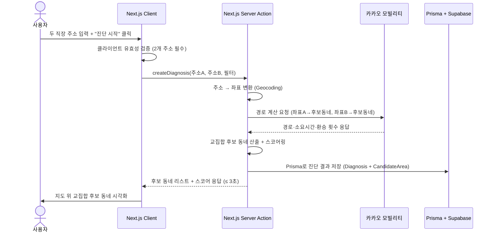

#### 3.4.2 배우자 공유 링크 핵심 플로우

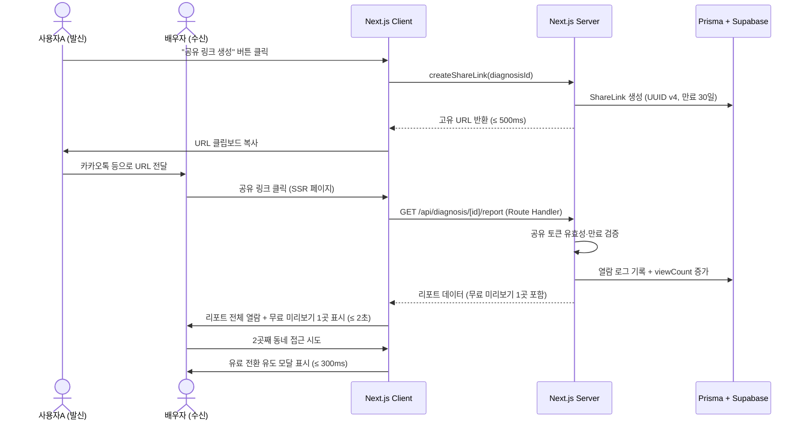

#### 3.4.3 데드라인 모드 핵심 플로우

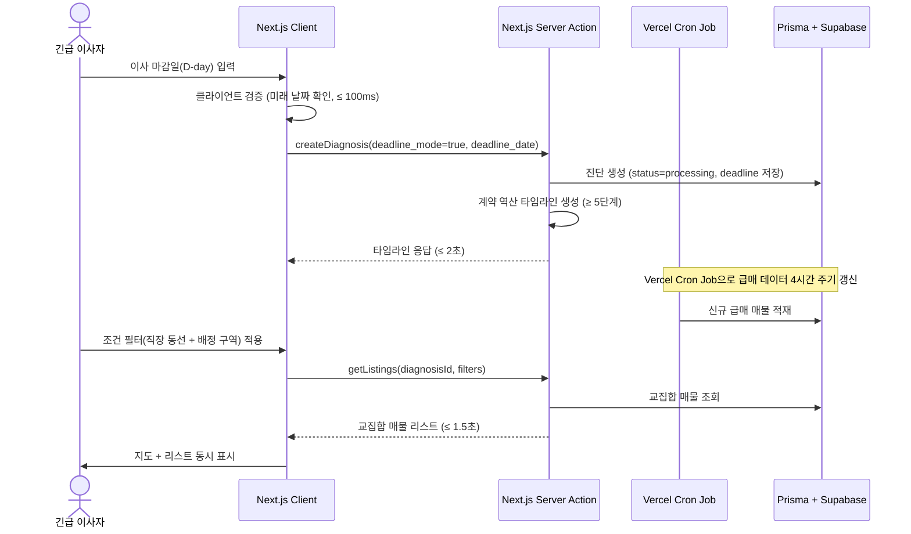

---

## 4. Specific Requirements

### 4.1 Functional Requirements

> **범례:** Source = PRD 사용자 스토리/기능 번호, Priority = MoSCoW, AC = Acceptance Criteria (Given/When/Then)

#### 4.1.1 F1: 두 동선 교차 진단 (Source: Story 3-1, F1)

| ID | 요구사항 | Priority | Source |
| --- | --- | --- | --- |
| **REQ-FUNC-001** | 시스템은 사용자가 두 개의 직장 주소를 입력할 수 있는 인터페이스를 제공해야 한다. 각 주소 입력 필드는 자동완성(Geocoding) 기능을 포함해야 한다. | Must | Story 3-1 |
| **REQ-FUNC-002** | 시스템은 두 개의 직장 주소가 모두 입력된 경우에만 "진단 시작" 버튼을 활성화해야 한다. 주소가 1개만 입력된 상태에서 "진단 시작" 클릭 시 "두 번째 주소를 입력해 주세요" 인라인 에러를 200ms 이내에 표시하고, 진단 API 호출을 차단해야 한다. 불완전 요청의 서버 도달률은 0%여야 한다. | Must | Story 3-1, AC-N1 |
| **REQ-FUNC-003** | 시스템은 두 직장 주소를 기반으로 교집합 후보 동네를 3곳 이상 산출하고, 지도 위에 시각화해야 한다. Vercel 무료 티어의 10초 Timeout을 방지하기 위해, 외부 교통 API 반복 호출 연산과 교차 연산 로직은 Next.js 서버(Server Action)가 아닌, 사용자 브라우저(Client Component) 내부에서 비동기 병렬 구조(Promise.all)로 처리해야 한다. | Must | Story 3-1, AC-1 |
| **REQ-FUNC-004** | 시스템은 각 후보 동네를 탭했을 때 양쪽 직장까지의 예상 출퇴근 시간(대중교통·자차)을 표시해야 한다. 카카오맵 API 대비 시간 오차는 ±10% 이내여야 한다. | Must | Story 3-1, AC-2 |
| **REQ-FUNC-005** | 시스템은 출근 시간대(오전 7~9시 범위)를 변경했을 때 해당 시간대 평균 소요시간으로 출퇴근 시뮬레이션을 재계산해야 한다. 재계산 응답은 p95 ≤ 2,000ms이며, 시간대별 데이터 커버리지는 수도권 85% 이상이어야 한다. | Must | Story 3-1, AC-3 |
| **REQ-FUNC-006** | 시스템은 조건 필터(최대 통근 시간, 예산)를 적용했을 때 조건에 맞지 않는 후보를 실시간 필터링하고 지도를 갱신해야 한다. 필터 적용 응답은 p95 ≤ 1,000ms여야 한다. | Must | Story 3-1, AC-4 |
| **REQ-FUNC-007** | 시스템은 교통 API 타임아웃(5초 이상 무응답) 발생 시 "일시적 오류" 토스트를 표시하고 자동 재시도 1회를 수행해야 한다. 재시도 실패 시 "잠시 후 다시 시도해 주세요" 안내를 표시하고 실패 로그를 전송해야 한다. 재시도 포함 총 응답은 10초 이내이며, 무한 로딩 노출은 0건이어야 한다. | Must | Story 3-1, AC-N2 |
| **REQ-FUNC-008** | 시스템은 두 직장 간 거리로 인해 교집합 후보가 0곳인 경우 "조건을 만족하는 동네가 없습니다. 최대 통근 시간을 늘려보세요" 안내를 1초 이내에 표시하고, 조건 완화 제안을 2개 이상 제공해야 한다. | Must | Story 3-1, AC-N3 |

**REQ-FUNC-003 Acceptance Criteria:**

| AC | Given | When | Then |
| --- | --- | --- | --- |
| AC-1 | 사용자가 두 개의 직장 주소(수도권 내)를 입력 완료 | "진단 시작" 버튼 클릭 | 교집합 후보 동네 ≥ 3곳이 지도 위에 시각화된다. 응답 시간 ≤ 3초, 실패율 < 1% |
| AC-2 | 교집합 결과가 지도에 표시된 상태 | 각 후보 동네를 탭 | 양쪽 직장까지 예상 출퇴근 시간(대중교통·자차) 표시. 시간 오차 ≤ ±10% |
| AC-3 | 출근 시간대를 오전 7~9시로 설정 | 시간대 변경 | 해당 시간대 평균 소요시간으로 재계산. 재계산 응답 ≤ 2초 |

---

#### 4.1.2 F2: 배우자 공유 링크 (Source: Story 3-2, F2)

| ID | 요구사항 | Priority | Source |
| --- | --- | --- | --- |
| **REQ-FUNC-009** | 시스템은 진단 리포트 생성 완료 후 "공유 링크 생성" 버튼을 제공해야 하며, 클릭 시 고유 URL(UUID v4, entropy ≥ 128bit)을 생성하여 클립보드에 복사해야 한다. 링크 생성 응답 시간은 500ms 이내여야 한다. | Must | Story 3-2, AC-1 |
| **REQ-FUNC-010** | 공유 링크의 유효기간은 생성일로부터 30일 이상이어야 한다. 만료된 링크 접근 시 "이 링크는 만료되었습니다" 안내 페이지를 1초 이내에 로딩하고, 원 사용자에게 재생성 알림 푸시를 발송해야 한다. 만료된 링크에서 개인정보 노출은 0건이어야 한다. | Must | Story 3-2, AC-N1 |
| **REQ-FUNC-011** | 배우자(비회원)가 공유 링크를 클릭하면 앱 설치 없이 모바일 웹에서 리포트 전체를 열람하고 무료 미리보기 1곳을 확인할 수 있어야 한다. 3G 환경 기준 페이지 로딩 시간은 p95 ≤ 2,000ms여야 한다. | Must | Story 3-2, AC-2 |
| **REQ-FUNC-012** | 시스템은 리포트 내 모든 데이터 항목에 출처 배지(공공데이터·API명)와 최종 업데이트 일자를 표시해야 한다. 출처 투명도는 100%(모든 수치에 출처 배지 부착)여야 한다. | Must | Story 3-2, AC-3 |
| **REQ-FUNC-013** | 비회원이 무료 미리보기 1곳을 소진한 후 추가 동네 상세 조회를 시도하면, 유료 전환 유도 화면을 표시해야 한다. 전환 유도부터 결제 완료까지 단계 수는 3단계 이하여야 한다. | Must | Story 3-2, AC-4 |
| **REQ-FUNC-014** | 비회원이 무료 미리보기 소진 후 2곳째 동네 접근 시도 시, 유료 전환 유도 모달을 300ms 이내에 표시해야 한다. 뒤로가기 시 원래 리포트로 복귀하며, 강제 이탈을 방지해야 한다. 모달 노출 후 이탈률은 50% 이하를 목표로 모니터링해야 한다. | Must | Story 3-2, AC-N2 |

**REQ-FUNC-009 Acceptance Criteria:**

| AC | Given | When | Then |
| --- | --- | --- | --- |
| AC-1 | 진단 리포트가 생성 완료된 상태 | "공유 링크 생성" 버튼 클릭 | 고유 URL이 생성되어 클립보드에 복사. 생성 ≤ 500ms, 유효기간 ≥ 30일 |
| AC-2 | 배우자가 공유 링크를 수신 | 링크 클릭 | 앱 설치 없이 모바일 웹에서 리포트 열람 + 무료 미리보기 1곳. 로딩 ≤ 2초 (3G) |
| AC-3 | 배우자가 리포트 열람 중 | 데이터 출처 배지 탭 | 출처(공공데이터·API명) + 최종 업데이트 일자 표시. 출처 투명도 100% |

---

#### 4.1.3 F3: 데드라인 모드 (Source: Story 3-3, F3)

| ID | 요구사항 | Priority | Source |
| --- | --- | --- | --- |
| **REQ-FUNC-015** | 시스템은 사용자가 이사 마감일(D-day)을 입력하고 "데드라인 모드"를 활성화할 수 있는 인터페이스를 제공해야 한다. 활성화 시 계약 역산 타임라인(서류 준비·잔금 일정 등 5단계 이상)을 2초 이내에 자동 생성해야 한다. | Must | Story 3-3, AC-1 |
| **REQ-FUNC-016** | 시스템은 데드라인 모드에서 교집합 동네를 클릭하면 해당 조건을 네이버 부동산 검색 URL 파라미터로 조합하여 아웃링크로 새 창을 연다. (직접 크롤링 대체) | Must | Story 3-3, AC-2 |
| **REQ-FUNC-017** | (조정됨) 매물 직접 필터링 배제 - 아웃링크를 통한 조건 위임으로 대체 | Must | Story 3-3, AC-3 |
| **REQ-FUNC-018** | 시스템은 "30분 요약" 버튼 클릭 시 Top 3 매물의 핵심 정보(통근 시간·가격·배정 학교 등)를 카드 형태로 요약해야 한다. 요약 카드당 정보 항목은 6개 이상이어야 한다. | Must | Story 3-3, AC-4 |
| **REQ-FUNC-019** | 시스템은 데드라인 모드에서 교집합 급매 매물이 0건인 경우, "현재 조건의 급매가 없습니다" 안내와 함께 ① 인근 동 반경 확장 제안, ② 조건 완화 슬라이더, ③ 신규 급매 푸시 알림 구독 옵션을 1초 이내에 표시해야 한다. 알림 구독 전환율을 Mixpanel로 추적해야 한다. | Must | Story 3-3, AC-N1 |
| **REQ-FUNC-020** | 시스템은 사용자가 이사 마감일을 과거 날짜로 입력한 경우, 달력 UI에서 과거 날짜 선택을 차단하고 "마감일은 오늘 이후여야 합니다" 인라인 에러를 100ms 이내에 표시해야 한다. 잘못된 날짜의 서버 도달률은 0%여야 한다. | Must | Story 3-3, AC-N2 |

**REQ-FUNC-015 Acceptance Criteria:**

| AC | Given | When | Then |
| --- | --- | --- | --- |
| AC-1 | 사용자가 이사 마감일(미래 날짜) 입력 완료 | "데드라인 모드" 활성화 | 계약 역산 타임라인 자동 생성 (≥ 5단계). 생성 ≤ 2초 |
| AC-2 | 데드라인 모드 활성화 상태 | 매물 목록 조회 | 당일 신규 급매 최상단 + 경과 시간 표기. 데이터 지연 ≤ 4시간 |
| AC-3 | 급매 목록 표시 상태 | 조건 필터(직장 동선 + 배정 구역) 적용 | 교집합 매물만 지도 + 리스트 동시 표시. 연산 ≤ 1.5초 |

---

#### 4.1.4 F4: 싱글 모드 간소화 리포트 (Source: Story 3-4, F4)

| ID | 요구사항 | Priority | Source |
| --- | --- | --- | --- |
| **REQ-FUNC-021** | 시스템은 "싱글 모드" 선택 시 직장 + 여가 거점 2곳을 입력할 수 있는 인터페이스를 제공해야 한다. 입력 완료 시 학군·가족 관련 항목을 결과에서 자동 숨김 처리하고, 야간 치안·편의시설·카페 밀집도 레이어를 기본 활성화해야 한다. 불필요 항목 노출은 0건이어야 한다. | Must | Story 3-4, AC-1 |
| **REQ-FUNC-022** | 시스템은 싱글 모드 후보 동네 탭 시 야간(22~06시) 범죄 발생 건수 기반 안전 등급(A~D)을 표시해야 한다. 치안 데이터 커버리지는 수도권 90% 이상이며, 데이터 지연은 분기 이내여야 한다. | Must | Story 3-4, AC-2 |
| **REQ-FUNC-023** | 시스템은 싱글 모드 리포트 "리포트 저장" 클릭 시 클라이언트 브라우저의 기본 window.print() 메서드 호출과 CSS @media print 제어를 통해 PDF 저장을 안내한다. | Must | Story 3-4, AC-3 |
| **REQ-FUNC-024** | 시스템은 싱글 모드에서 여가 거점 주소가 서비스 커버리지 밖(비수도권)인 경우, "해당 지역은 현재 수도권만 지원됩니다" 안내를 500ms 이내에 표시하고 지원 지역 목록을 제공해야 한다. 커버리지 밖 주소로의 진단 실행은 0건이어야 한다. | Must | Story 3-4, AC-N1 |

**REQ-FUNC-021 Acceptance Criteria:**

| AC | Given | When | Then |
| --- | --- | --- | --- |
| AC-1 | 사용자가 "싱글 모드" 선택 | 직장 + 여가 거점 2곳 입력 완료 | 학군·가족 항목 자동 숨김, 야간 치안·편의시설·카페 밀집도 레이어 기본 활성화. 불필요 항목 노출 0건 |
| AC-2 | 싱글 모드 결과 표시 상태 | 후보 동네 탭 | 야간 안전 등급(A~D) 표시. 커버리지 ≥ 수도권 90% |
| AC-3 | 리포트 생성 완료 | "리포트 저장" 클릭 | PDF 다운로드 (A4 1~2쪽). 생성 ≤ 3초 |

---

#### 4.1.5 F5: 간이 저장·불러오기 (Source: Story 3-5, F5) *(Rev 1.5 축소)*

> **Rev 1.5 변경:** F5를 "간이 저장·불러오기"로 축소. 비교 뷰(REQ-FUNC-026), 시나리오 비교(REQ-FUNC-027), 행정동 변경 감지(REQ-FUNC-028)를 제거한다. 불러오기는 기존 `createDiagnosis()` API를 재사용하며, geocoding 실패 시 "다시 입력해주세요" 안내만 제공한다.

| ID | 요구사항 | Priority | Source |
| --- | --- | --- | --- |
| **REQ-FUNC-025** | 시스템은 사용자가 진단을 완료하고 세션 종료 또는 앱 종료 시 입력 조건(주소·필터·시간대)을 자동 저장해야 한다. 저장은 best effort로 처리하며 실패 시 사용자에게 알리지 않는다. 다음 방문 시 복원 시간은 1초 이내여야 하며, 불러온 주소가 geocoding 실패 시 "주소를 다시 입력해주세요" 안내를 표시한다. | Should | Story 3-5, AC-1 |

**REQ-FUNC-025 Acceptance Criteria:**

| AC | Given | When | Then |
| --- | --- | --- | --- |
| AC-1 | 사용자가 진단 완료 상태 | 세션 종료 또는 앱 종료 | 입력 조건 자동 저장 (best effort). 복원 ≤ 1초 |
| AC-2 | 이전 저장 기록 존재 | "이전 조건 불러오기" 클릭 | 저장된 주소·필터로 `createDiagnosis()` 재호출. geocoding 실패 시 "주소를 다시 입력해주세요" 안내 |

---

#### 4.1.6 F6: 추가 Must 기능 — 인증·결제

| ID | 요구사항 | Priority | Source |
| --- | --- | --- | --- |
| **REQ-FUNC-029** | 시스템은 NextAuth.js v5 기반 카카오·네이버 소셜 로그인을 지원해야 한다. 세션 전략은 httpOnly cookie 기반으로 maxAge 7일, updateAge 15분을 적용하여 JWT 자체 발급 없이 인증을 처리한다. | Must | PRD §5-3, C-TEC-001 |
| **REQ-FUNC-030** | 시스템은 유료 리포트 결제를 처리해야 한다. 1회 진단 30,000원 결제와 월정액 10,000원/월 구독을 지원해야 한다. 결제 PG사(토스페이먼츠) 연동으로 결제 성공/실패를 처리해야 한다. | Must | ADR-002 |
| **REQ-FUNC-031** | 시스템은 수도권(서울·경기·인천) 외 주소 입력 시 서비스 커버리지 안내 UI를 표시하고 진단 실행을 차단해야 한다. | Must | ADR-003 |

---

#### 4.1.7 Should/Could 기능 요약

| ID | 요구사항 | Priority | Source |
| --- | --- | --- | --- |
| **REQ-FUNC-032** | 시스템은 광역버스 착석 가능 노선 및 환승 횟수를 후보 동네 상세 정보에 표시해야 한다. | Should | PRD §4-1 (S) |
| **REQ-FUNC-033** | 시스템은 야간 치안 등급 외 조도 레이어를 지도에 오버레이해야 한다. 경찰청 공공데이터 기반으로 분기 갱신해야 한다. | Should | PRD §4-1 (S) |
| **REQ-FUNC-034** | 시스템은 계약 후 비상 가이드 콘텐츠(체크리스트·긴급 연락처)를 긴급 이사 세그먼트에게 제공해야 한다. | Should | PRD §4-1 (S) |
| **REQ-FUNC-035** | 시스템은 학교 배정 구역 레이어와 학원가 밀집도 히트맵을 지도에 오버레이해야 한다. 교육부 공공데이터 폴리곤 기반으로 렌더링해야 한다. | Could | PRD §4-1 (C) |
| **REQ-FUNC-036** | 시스템은 교통 호재 오버레이(철도 개발 노선)를 지도에 표시해야 한다. 국토부 노선 데이터 정적 JSON 기반이어야 한다. | Could | PRD §4-1 (C) |
| **REQ-FUNC-037** | 시스템은 발령 시나리오를 복수 입력하여 미래 시뮬레이션 비교를 수행할 수 있어야 한다. 기존 교차 계산 로직 확장 + 비교 뷰 UI를 포함해야 한다. | Could | PRD §4-1 (C) |

---

### 4.2 Non-Functional Requirements

#### 4.2.1 성능 (Performance)

| ID | 요구사항 | 측정 기준 | 측정 방법 | Source |
| --- | --- | --- | --- | --- |
| **REQ-NF-001** | 두 동선 교차 계산 응답 시간 | p95 ≤ 8,000ms (클라이언트 API 콜 기준) | Vercel Analytics + Sentry Performance p95 메트릭 | PRD §5-1, Story 3-1 AC-1 |
| **REQ-NF-002** | 일반 페이지 로딩 시간 | p95 ≤ 1,500ms (3G 모바일 환경 기준) | Lighthouse/WebPageTest + Vercel Speed Insights | PRD §5-1 |
| **REQ-NF-003** | 공유 링크 페이지 로딩 시간 | p95 ≤ 2,000ms (비회원·비설치 환경, 3G) | Lighthouse/WebPageTest + Vercel Speed Insights | PRD §5-1, Story 3-2 AC-2 |
| **REQ-NF-004** | 필터 적용 / 재계산 응답 시간 | p95 ≤ 1,000ms (클라이언트 사이드 캐싱 활용) | Vercel Analytics + 클라이언트 로그 | PRD §5-1, Story 3-1 AC-4 |
| **REQ-NF-005** | 급매 데이터 갱신 주기 | ≤ 4시간 (Vercel Cron Job + 알림 파이프라인) | Vercel Cron Job 실행 로그 | PRD §5-1, Story 3-3 AC-2 |
| **REQ-NF-006** | 공유 링크 생성 응답 시간 | ≤ 500ms | Vercel Analytics | Story 3-2 AC-1 |
| **REQ-NF-007** | 교집합 매물 연산 응답 시간 (데드라인 모드) | p95 ≤ 1,500ms | Vercel Analytics | Story 3-3 AC-3 |
| **REQ-NF-008** | 평균 탐색 완료 시간 | p50 ≤ 10분 (`diagnosis_started` → `diagnosis_completed`) | Mixpanel 이벤트 타임스탬프 차이 | PRD §1-3, 보조 KPI 6 |
| **REQ-NF-010** | PDF 리포트 저장 응답 시간 | ≤ 1초 (window.print() 클라이언트 호출) | 클라이언트 로그 | Story 3-4 AC-3 |

#### 4.2.2 가용성 및 신뢰성 (Availability & Reliability)

| ID | 요구사항 | 측정 기준 | 측정 방법 | Source |
| --- | --- | --- | --- | --- |
| **REQ-NF-011** | 월간 서비스 가용성 (Uptime) | Best Effort 지원 (무료 티어 제약 수용) | Vercel Status + Sentry Uptime 모니터링 | PRD §5-2 |
| **REQ-NF-012** | 서버 오류율 (5xx 응답) | ≤ 0.5% | Sentry 에러 비율 | PRD §5-2 |
| **REQ-NF-013** | 데이터 정합성 (교통 시간 오차) | ≤ ±10% (카카오맵 기준 교차 검증) | 주간 샘플링 교차 검증 (100건) | PRD §5-2, Story 3-1 AC-2 |

| **REQ-NF-016** | 입력값 자동 저장 성공률 | Best effort (저장 실패 시 무시, 사용자 미통지) | 서버 로그 저장 실패 비율 모니터링 | Story 3-5 AC-1 |

#### 4.2.3 보안 (Security)

| ID | 요구사항 | 측정 기준 | 측정 방법 | Source |
| --- | --- | --- | --- | --- |
| **REQ-NF-018** | 인증 세션 보안 | NextAuth.js httpOnly cookie 기반 세션 (maxAge 7일, updateAge 15분). sameSite strict 적용. CSRF 토큰 자동 검증 | 인증 플로우 QA, Closed Beta 전 완료 | PRD §5-3, C-TEC-001 |
| **REQ-NF-020** | 공유 링크 보안 | URL entropy ≥ 128bit (UUID v4), 열람 비밀번호 옵션, 열람 로그 실시간 알림 | 보안 감사 체크리스트 | PRD §5-3 |
| **REQ-NF-021** | 비인가 제3자 공유 링크 개인정보 접근 차단 | 비인가 접근 시 개인정보 노출 0건 | 침투 테스트 | PRD §5-3, Story 3-2 AC-N1 |
| **REQ-NF-022** | 악성 트래픽 차단 | IP당 분당 60req 초과 시 자동 차단 (WAF + Rate Limiter) | WAF 로그 분석 | PRD §5-4 |

#### 4.2.4 비용 (Cost)

| ID | 요구사항 | 측정 기준 | 측정 방법 | Source |
| --- | --- | --- | --- | --- |
| **REQ-NF-023** | 월 외부 API 호출 비용 | ≤ 100만원 | Vercel Dashboard + Supabase Dashboard 비용 모니터링. 일 예산 80% 초과 시 슬랙 알림 | PRD §5-3, C-TEC-007 |
| **REQ-NF-024** | 월 인프라 비용 (MVP 기준) | 무료 ~ 10만원 이하 | 월간 FinOps 리뷰 | PRD §5-3, C-TEC-007 |
| **REQ-NF-025** | 유료 리포트 단위 처리 비용 | ≤ 3,000원/건 | 비용/유료리포트 수 산출 | PRD §5-3 |

#### 4.2.5 비즈니스 지표 (KPI-Driven NFR)

| ID | 요구사항 | 측정 기준 | 측정 주기 | 측정 도구 | Source |
| --- | --- | --- | --- | --- | --- |
| **REQ-NF-026** | 북극성 KPI — 유료 진단 리포트 완료 수 | 50건/주 (3개월) → 200건/주 (6개월) | 주간 | Amplitude `report_paid_completed` | PRD §1-4 |
| **REQ-NF-027** | 무료 체험 → 유료 전환율 | ≥ 8% | 주간 | Amplitude Funnel `diagnosis_free_completed` → `payment_success` | PRD §1-4 보조 1 |
| **REQ-NF-028** | 배우자 공유 링크 클릭률 | ≥ 40% (`share_link_clicked` / `report_generated`) | 주간 | Mixpanel | PRD §1-4 보조 2 |
| **REQ-NF-029** | 공유 링크 → 2nd 유저 전환율 | ≥ 15% (`share_link_signup` / `share_link_clicked`) | 주간 | Amplitude | PRD §1-4 보조 3 |
| **REQ-NF-030** | D+7 리텐션 | ≥ 25% | 월간 | Amplitude Retention `session_start` D+7 코호트 | PRD §1-4 보조 4 |
| **REQ-NF-031** | NPS | ≥ 50 | 분기 | Delighted / 인앱 설문 (리포트 완료 D+3 트리거) | PRD §1-4 보조 5 |
| **REQ-NF-032** | 긴급 이사 계약 완료율 | ≥ 60% | 월간 | `deadline_mode_activated` 사용자 D+60 설문 (응답률 ≥ 30% 확보 시 유효) | PRD §1-4 보조 7 |
| **REQ-NF-033** | 후보 동네 압축 | ≤ 3곳 자동 추천 | 주간 | 서버 로그 `candidate_area_count` 필드 평균값 | PRD §1-3 |
| **REQ-NF-034** | 긴급 이사 일일 탐색 시간 | ≤ 30분/일 (데드라인 모드 사용자) | 주간 | Mixpanel `daily_session_duration` 세그먼트 평균 | PRD §1-3 |

#### 4.2.6 운영·모니터링 (Operational Monitoring) *(Rev 1.5 축소)*

> **Rev 1.5 변경:** MVP 단계에서는 Sentry 기본 알림만 사용한다. 커스텀 슬랙 연동 임계치, Mixpanel/Amplitude 기반 이상 감지 자동화는 GA 이후 도입한다.

| ID | 요구사항 | 측정 기준 | 도구 | Source |
| --- | --- | --- | --- | --- |
| **REQ-NF-035** | 에러 로그 알림 | Sentry 기본 알림 설정 사용 (커스텀 슬랙 임계치 제거) | Sentry (Vercel 통합) | PRD §5-4 |
| **REQ-NF-036** | 응답 시간 모니터링 | Sentry Performance 기본 대시보드로 수동 확인 (자동 슬랙 경고 제거) | Sentry Performance | PRD §5-4 |
| **REQ-NF-037** | API 호출량/비용 확인 | Vercel/Supabase 대시보드 수동 확인 (자동 슬랙 경고 제거) | Vercel Dashboard + Supabase Dashboard | PRD §5-4 |
| **REQ-NF-038** | 전환 퍼널 확인 | Mixpanel/Amplitude 대시보드 수동 확인 (자동 PM 알림 제거) | Mixpanel / Amplitude | PRD §5-4 |

#### 4.2.7 Scalability & Maintainability

| ID | 요구사항 | 측정 기준 | Source |
| --- | --- | --- | --- |

| **REQ-NF-041** | 시스템은 v1.5 지방 확장 시 지역 코드 추가만으로 커버리지를 확장할 수 있는 설계여야 한다. Prisma schema + 시드 데이터만 추가하면 된다. | 신규 지역 추가 시 코드 변경 ≤ 설정 파일 + 데이터 적재 | ADR-003 |

---

## 5. Traceability Matrix

### 5.1 Story ↔ Requirement ID ↔ Test Case ID

| Story ID | Story 요약 | Requirement IDs | Test Case IDs |
| --- | --- | --- | --- |
| **Story 3-1** | 두 동선 동시 교차 진단 | REQ-FUNC-001 ~ REQ-FUNC-008 | TC-001 ~ TC-008 |
| **Story 3-2** | 배우자 설득·공유 링크 | REQ-FUNC-009 ~ REQ-FUNC-014 | TC-009 ~ TC-014 |
| **Story 3-3** | 긴급 데드라인 탐색 | REQ-FUNC-015 ~ REQ-FUNC-020 | TC-015 ~ TC-020 |
| **Story 3-4** | 싱글 모드 간소화 리포트 | REQ-FUNC-021 ~ REQ-FUNC-024 | TC-021 ~ TC-024 |
| **Story 3-5** | 간이 저장·불러오기 *(Rev 1.5 축소)* | REQ-FUNC-025 *(026~028 제거)* | TC-025 *(TC-026~028 제거)* |
| — | 인증·결제 | REQ-FUNC-029 ~ REQ-FUNC-031 | TC-029 ~ TC-031 |
| — | Should/Could 기능 | REQ-FUNC-032 ~ REQ-FUNC-037 | TC-032 ~ TC-037 |

### 5.2 PRD 기능(F) ↔ Requirement ID 상세 매핑

| PRD 기능 | MoSCoW | Requirement IDs |
| --- | --- | --- |
| F1: 두 주소 입력 → 교집합 지도 시각화 | Must | REQ-FUNC-001 ~ 008, REQ-NF-001, 004, 008 |
| F2: 배우자 공유 링크 + 무료 미리보기 1곳 | Must | REQ-FUNC-009 ~ 014, REQ-NF-003, 006, 020, 021, 028, 029 |
| F3: 데드라인 모드 | Must | REQ-FUNC-015 ~ 020, REQ-NF-005, 007, 034 |
| F4: 싱글 모드 간소화 리포트 | Must | REQ-FUNC-021 ~ 024, REQ-NF-010 |
| F5: 간이 저장·불러오기 *(Rev 1.5 축소)* | Should | REQ-FUNC-025 *(026~028 제거)*, REQ-NF-016 |
| F6: 광역버스 착석 가능 노선 | Should | REQ-FUNC-032 |
| F7: 야간 치안·조도 레이어 | Should | REQ-FUNC-033 |
| F8: 계약 후 비상 가이드 | Should | REQ-FUNC-034 |
| F9: 학교 배정 구역 레이어 | Could | REQ-FUNC-035 |
| F10: 교통 호재 오버레이 | Could | REQ-FUNC-036 |
| F11: 발령 시나리오 복수 입력 | Could | REQ-FUNC-037 |

### 5.3 KPI ↔ Requirement ID 매핑

| KPI | Requirement IDs |
| --- | --- |
| 🌟 유료 진단 리포트 완료 수/주 | REQ-NF-026, REQ-FUNC-030 |
| 무료→유료 전환율 ≥ 8% | REQ-NF-027, REQ-FUNC-013, 014 |
| 배우자 공유 링크 클릭률 ≥ 40% | REQ-NF-028, REQ-FUNC-009, 011 |
| 2nd 유저 전환율 ≥ 15% | REQ-NF-029, REQ-FUNC-011, 013 |
| D+7 리텐션 ≥ 25% | REQ-NF-030 |
| NPS ≥ 50 | REQ-NF-031, REQ-FUNC-012 |
| 탐색 완료 시간 p50 ≤ 10분 | REQ-NF-008, REQ-FUNC-003 ~ 006 |
| 긴급 이사 계약 완료율 ≥ 60% | REQ-NF-032, REQ-FUNC-015 ~ 019 |

### 5.4 Risk ↔ Requirement ID 매핑

| Risk ID | Risk 요약 | 관련 Requirement IDs |
| --- | --- | --- |
| R1 | 교통 API 정책 변경/요금 인상 | REQ-NF-040, REQ-NF-023 |
| R2 | 급매 크롤링 법적 리스크 | REQ-FUNC-016, CON-06 |
| R3 | 수도권 외 데이터 커버리지 부족 | REQ-FUNC-024, 031, REQ-NF-041 |
| R4 | 공유 링크 프라이버시 이슈 | REQ-NF-020, 021, REQ-FUNC-010 |
| R5 | 초기 유료 전환율 미달 | REQ-NF-027, REQ-FUNC-013, 014 |

---

## 6. Appendix

### 6.1 API Endpoint List

| # | Method | Endpoint / Action | 설명 | 요청 Body (주요 필드) | 응답 Body (주요 필드) | 구현 방식 | 인증 | 응답 시간 목표 |
| --- | --- | --- | --- | --- | --- | --- | --- | --- |
| API-01 | POST | `createDiagnosis()` | 진단 생성 (두 동선 교차 계산) | `address_a`: string, `address_b`: string, `filters`: object, `mode`: enum(couple\|single), `deadline_date`: date(nullable) | `diagnosis_id`: uuid, `candidates`: array[CandidateArea], `timeline`: object(nullable) | Server Action | NextAuth Session | p95 ≤ 3,000ms |
| API-02 | GET | `/api/diagnosis/[id]` | 진단 결과 조회 | — | `diagnosis`: Diagnosis, `candidates`: array[CandidateArea] | Route Handler | NextAuth Session | p95 ≤ 1,500ms |
| API-03 | POST | `createShareLink()` | 공유 링크 생성 | `diagnosis_id`: uuid, `password`: string(optional) | `share_url`: string, `expires_at`: date | Server Action | NextAuth Session | ≤ 500ms |
| API-04 | GET | `/api/diagnosis/[id]/report` | 리포트 조회 | Query: `token`: string(공유 토큰) | `report`: Report, `sources`: array[DataSource] | Route Handler (SSR) | Session 또는 공유 토큰 | p95 ≤ 2,000ms |
| API-05 | POST | `saveSearch()` | 입력값 저장 (best effort) | `user_id`: uuid, `search_params`: object | `saved_search_id`: uuid, `saved_at`: timestamp | Server Action | NextAuth Session | ≤ 500ms |
| API-07 | GET/POST | `/api/auth/[...nextauth]` | OAuth 소셜 로그인 (NextAuth.js) | `provider`: enum(kakao\|naver) — NextAuth 자동 처리 | `session`: Session, `user`: UserProfile | NextAuth Route Handler | — | ≤ 1,000ms |
| API-08 | — | *(NextAuth 내장 세션 관리)* | 세션 자동 갱신 | NextAuth가 자동 처리 | NextAuth가 자동 처리 | NextAuth Built-in | 자동 | — |
| API-09 | POST | `initiateCheckout()` | 결제 요청 | `diagnosis_id`: uuid, `plan`: enum(one_time\|subscription), `amount`: int | `payment_id`: string, `checkout_url`: string | Server Action | NextAuth Session | ≤ 1,000ms |
| API-10 | POST | `/api/payment/webhook` | PG사 결제 콜백 | `transaction_id`: string, `status`: enum(success\|fail), `signature`: string | `ack`: boolean | Route Handler | 서명 검증 | ≤ 500ms |

### 6.2 Entity & Data Model

#### 6.2.0 ERD (Entity Relationship Diagram)

> **구현 기술 (C-TEC-003):** 아래 ERD는 **Prisma ORM** 스키마로 정의하며, 로컬 개발 시 **SQLite**, 프로덕션 배포 시 **Supabase PostgreSQL**을 데이터소스로 사용한다. Prisma의 `datasource` 설정에서 환경 변수(`DATABASE_URL`)만 변경하면 DB 전환이 가능하다.

> **Rev 1.5 변경:** SavedSearch를 3필드(user_id, search_params, saved_at)로 단순화. ViewLog, DongMap 엔터티를 제거.

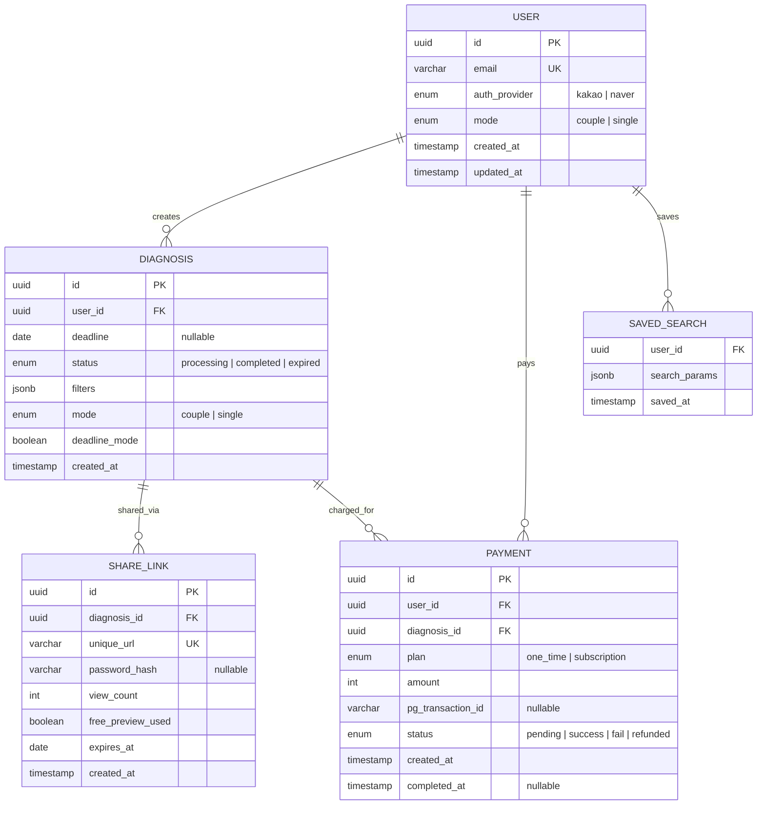

#### 6.2.1 USER

| 필드명 | 타입 | 제약조건 | 설명 |
| --- | --- | --- | --- |
| `id` | UUID | PK, NOT NULL | 사용자 고유 식별자 |
| `email` | VARCHAR(255) | UNIQUE, NOT NULL | 사용자 이메일 |
| `auth_provider` | ENUM('kakao', 'naver') | NOT NULL | OAuth 인증 제공자 |
| `mode` | ENUM('couple', 'single') | NOT NULL, DEFAULT 'couple' | 서비스 모드 (커플/싱글) |
| `created_at` | TIMESTAMP | NOT NULL, DEFAULT NOW() | 계정 생성일시 |
| `updated_at` | TIMESTAMP | NOT NULL | 최종 수정일시 |

#### 6.2.2 DIAGNOSIS

| 필드명 | 타입 | 제약조건 | 설명 |
| --- | --- | --- | --- |
| `id` | UUID | PK, NOT NULL | 진단 고유 식별자 |
| `user_id` | UUID | FK → USER.id, NOT NULL | 진단 수행 사용자 |
| `deadline` | DATE | NULLABLE | 이사 마감 기한 (데드라인 모드 시 필수) |
| `status` | ENUM('processing', 'completed', 'expired') | NOT NULL, DEFAULT 'processing' | 진단 상태 |
| `filters` | JSONB | NOT NULL | 적용된 필터 조건 (최대 통근 시간, 예산, 시간대 등) |
| `mode` | ENUM('couple', 'single') | NOT NULL | 진단 모드 |
| `deadline_mode` | BOOLEAN | NOT NULL, DEFAULT FALSE | 데드라인 모드 활성화 여부 |
| `created_at` | TIMESTAMP | NOT NULL, DEFAULT NOW() | 진단 생성일시 |

#### 6.2.3 SHARE_LINK

| 필드명 | 타입 | 제약조건 | 설명 |
| --- | --- | --- | --- |
| `id` | UUID | PK, NOT NULL | 공유 링크 고유 식별자 |
| `diagnosis_id` | UUID | FK → DIAGNOSIS.id, NOT NULL | 공유 대상 진단 |
| `unique_url` | VARCHAR(255) | UNIQUE, NOT NULL | 고유 URL (UUID v4, entropy ≥ 128bit) |
| `password_hash` | VARCHAR(255) | NULLABLE | 열람 비밀번호 해시 (선택 설정) |
| `view_count` | INTEGER | NOT NULL, DEFAULT 0 | 열람 횟수 |
| `free_preview_used` | BOOLEAN | NOT NULL, DEFAULT FALSE | 무료 미리보기 사용 여부 |
| `expires_at` | DATE | NOT NULL | 만료일 (생성일 + 30일) |
| `created_at` | TIMESTAMP | NOT NULL, DEFAULT NOW() | 생성일시 |

#### 6.2.4 PAYMENT

| 필드명 | 타입 | 제약조건 | 설명 |
| --- | --- | --- | --- |
| `id` | UUID | PK, NOT NULL | 결제 고유 식별자 |
| `user_id` | UUID | FK → USER.id, NOT NULL | 결제 사용자 |
| `diagnosis_id` | UUID | FK → DIAGNOSIS.id, NOT NULL | 결제 대상 진단 |
| `plan` | ENUM('one_time', 'subscription') | NOT NULL | 결제 플랜 |
| `amount` | INTEGER | NOT NULL | 결제 금액 (원) |
| `pg_transaction_id` | VARCHAR(100) | NULLABLE | PG사 트랜잭션 ID |
| `status` | ENUM('pending', 'success', 'fail', 'refunded') | NOT NULL, DEFAULT 'pending' | 결제 상태 |
| `created_at` | TIMESTAMP | NOT NULL, DEFAULT NOW() | 결제 요청일시 |
| `completed_at` | TIMESTAMP | NULLABLE | 결제 완료일시 |

#### 6.2.5 SAVED_SEARCH *(Rev 1.5 단순화)*

> **Rev 1.5 변경:** 3필드로 단순화. 사용자당 최신 1건만 유지 (UPSERT).

| 필드명 | 타입 | 제약조건 | 설명 |
| --- | --- | --- | --- |
| `user_id` | UUID | FK → USER.id, PK (UNIQUE) | 저장 사용자 (사용자당 1건) |
| `search_params` | JSONB | NOT NULL | 저장된 검색 조건 (주소·필터·시간대 등) |
| `saved_at` | TIMESTAMP | NOT NULL, DEFAULT NOW() | 저장일시 |

### 6.3 Detailed Interaction Models (상세 시퀀스 다이어그램)

#### 6.3.1 두 동선 교차 진단 — 상세 플로우 (정상 + 에러 핸들링)

> **v0.3 변경사항 (REQ-FUNC-003):** Vercel 무료 티어 10초 Serverless Timeout을 회피하기 위해, 외부 교통 API 반복 호출과 교차 연산을 **Client Component에서 비동기 병렬(Promise.all)로 직접 처리**하도록 변경하였다. Server Action은 Geocoding·커버리지 검증·결과 저장만 담당한다.

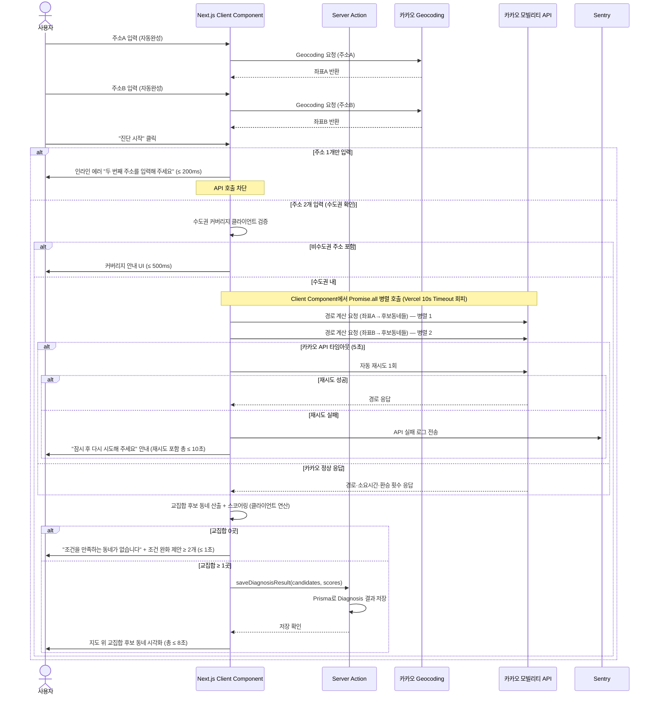

#### 6.3.2 배우자 공유 링크 — 상세 플로우

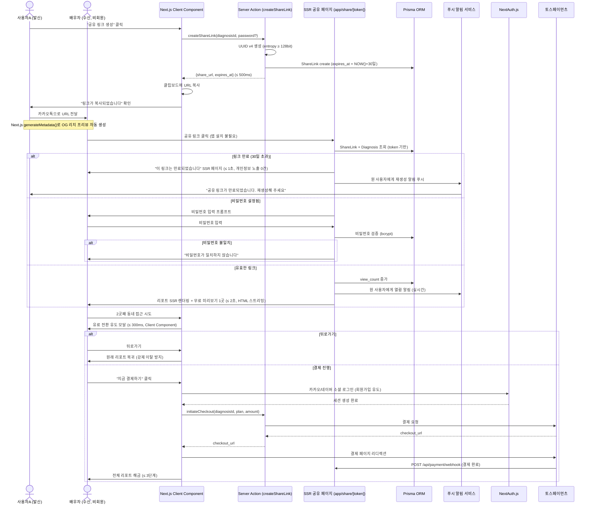

#### 6.3.3 데드라인 모드 — 상세 플로우

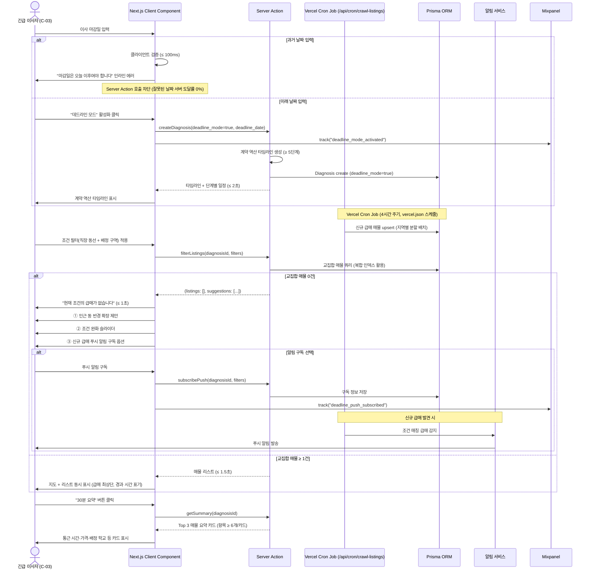

#### 6.3.4 싱글 모드 — 상세 플로우

> **v0.3 변경사항 (REQ-FUNC-023):** PDF 서버 사이드 생성(`@react-pdf/renderer`)을 제거하고, 브라우저 내장 `window.print()` + CSS `@media print` 제어로 대체하였다.

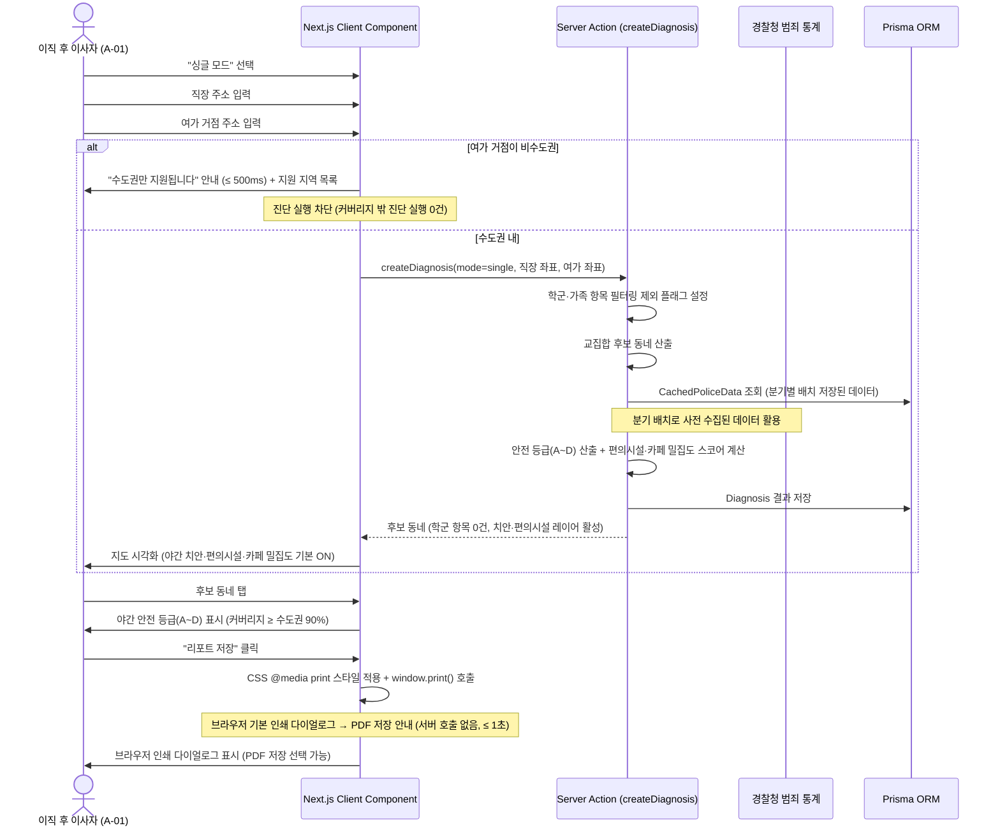

#### 6.3.5 간이 저장·불러오기 — 상세 플로우 *(Rev 1.5 전면 재작성)*

> **Rev 1.5 변경:** 비교 뷰, 시나리오 비교, 행정동 매핑 검증을 모두 제거. 저장은 best effort, 불러오기는 `createDiagnosis()` 재사용.

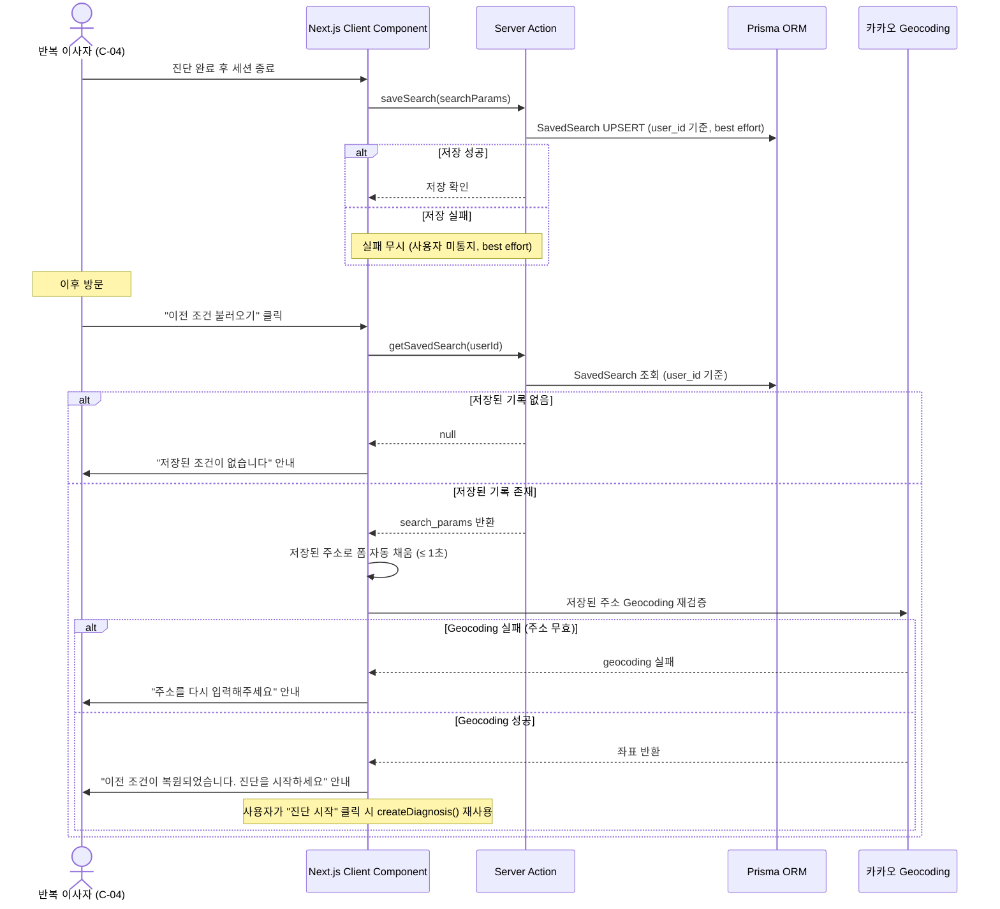

#### 6.3.6 인증·결제 — 상세 플로우

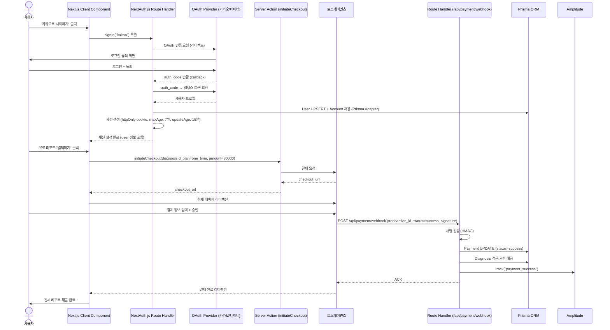

### 6.4 Validation Plan (검증 계획)

> PRD §8 실험·롤아웃·측정에서 파생

#### 6.4.1 롤아웃 단계

| Phase | 대상 | 규모 | 기간 | 핵심 측정 항목 |
| --- | --- | --- | --- | --- |
| **Alpha** | 내부 팀 + 지인 | 10명 | 1개월 (2026-07) | 기능 완성도, 크리티컬 버그 수 |
| **Closed Beta** | 맘카페 선발 사용자 | 30명 | 1개월 (2026-08) | 과업 완료율, 평균 탐색 시간, NPS, WTP 실측 |
| **Open Beta** | 수도권 3040 부부 | 300명 | 2개월 (2026-09~10) | 유료 전환율, 공유 링크 바이럴 계수, D+7 리텐션 |
| **GA** | 전체 오픈 | 목표 1,000명/월 | 2026-11~ | 북극성 KPI, 보조 KPI 전체 |

#### 6.4.2 A/B 실험 설계

| 실험 ID | 가설 | 그룹 | 측정 KPI | 성공 기준 | α | 1−β | MDE | 기간 |
| --- | --- | --- | --- | --- | --- | --- | --- | --- |
| **EXP-1** | 공유 링크 → 유료 전환율 ↑ | A: 공유 링크 활성 / B: 결과만 조회 | 유료 전환율, 2nd 유저 가입률 | A ≥ B × 1.5 | 0.05 | 0.80 | +4%p | 4주 (n=200, 그룹당 110명) |
| **EXP-2** | 타임라인 → 과업 완료율 ↑ | A: 타임라인 포함 / B: 필터만 | D-2개월 계약 완료율, 일일 사용 시간 | A ≥ 60% | 0.05 | 0.80 | +15%p | 4주 (n=100) |
| **EXP-3** | 미리보기 1곳 vs 3곳 → 전환율 차이 | A: 1곳 / B: 3곳 | 유료 전환율, NPS | A ≥ B × 1.2 | 0.05 | 0.80 | +3%p | 4주 (n=200) |
| **EXP-4** | 출처 배지 → NPS ↑ | A: 배지 O / B: 배지 X | NPS, 리포트 공유율 | A NPS ≥ B + 10p | 0.05 | 0.80 | +10p | 4주 (n=200) |

### 6.5 UseCase Diagram

> 시스템의 핵심 액터와 기능(UseCase) 간 관계를 시각화한다. 각 UseCase는 Section 4.1의 REQ-FUNC에 대응된다.
>
> **Rev 1.5 변경:** UC-14(이전 조건 재탐색), UC-15(시나리오 비교) 제거. UC-13(입력값 자동 저장)은 "간이 저장·불러오기"로 축소 반영.

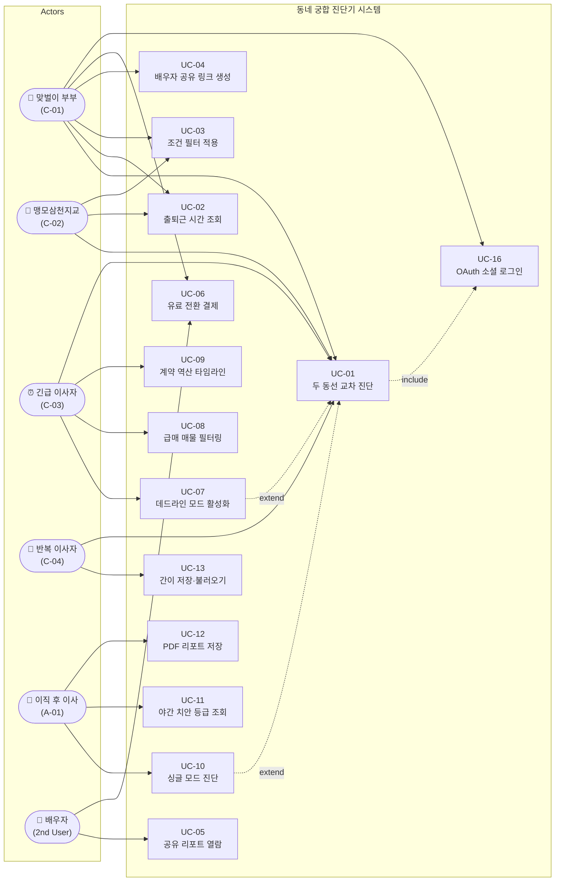

| UseCase ID | UseCase 명 | 관련 REQ-FUNC | 관련 Actor |
| --- | --- | --- | --- |
| UC-01 | 두 동선 교차 진단 | REQ-FUNC-001 ~ 008 | C-01, C-02, C-03, C-04 |
| UC-02 | 출퇴근 시간 조회 | REQ-FUNC-004, 005 | C-01, C-02 |
| UC-03 | 조건 필터 적용 | REQ-FUNC-006 | C-01, C-02 |
| UC-04 | 배우자 공유 링크 생성 | REQ-FUNC-009, 010 | C-01 |
| UC-05 | 공유 리포트 열람 | REQ-FUNC-011, 012 | 배우자 (2nd User) |
| UC-06 | 유료 전환 결제 | REQ-FUNC-013, 014, 030 | C-01, 배우자 |
| UC-07 | 데드라인 모드 활성화 | REQ-FUNC-015, 020 | C-03 |
| UC-08 | 급매 매물 필터링 | REQ-FUNC-016, 017, 019 | C-03 |
| UC-09 | 계약 역산 타임라인 | REQ-FUNC-015, 018 | C-03 |
| UC-10 | 싱글 모드 진단 | REQ-FUNC-021, 024 | A-01 |
| UC-11 | 야간 치안 등급 조회 | REQ-FUNC-022 | A-01 |
| UC-12 | PDF 리포트 저장 | REQ-FUNC-023 | A-01 |
| UC-13 | 간이 저장·불러오기 *(Rev 1.5 축소)* | REQ-FUNC-025 | C-04 |
| UC-16 | OAuth 소셜 로그인 | REQ-FUNC-029 | 전체 사용자 |

### 6.6 Component Diagram

> 시스템 아키텍처는 **Next.js App Router 단일 풀스택 애플리케이션 (C-TEC-001~007)** 으로 구성된다. 별도 백엔드 서버, API Gateway, Redis를 두지 않으며, Vercel 플랫폼에서 배포·운영한다.

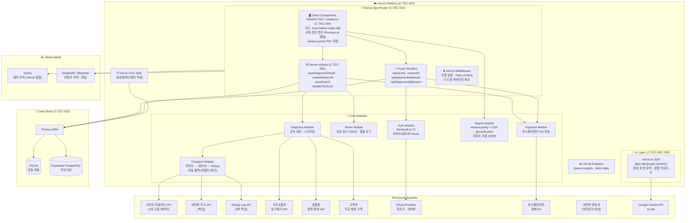

| 컴포넌트 | 역할 | 관련 REQ |
| --- | --- | --- |
| Next.js Middleware | 인증·Rate Limiting·라우팅 (별도 API Gateway 없이 Next.js 내장) | REQ-NF-022, REQ-FUNC-029 |
| Diagnosis Module (Client Component + Server Action) | 교차 계산 핵심 로직 (Client에서 API 병렬 호출 → Server Action으로 결과 저장) | REQ-FUNC-001~008 |
| Transport API (카카오 모빌리티) | 교통 API 1종 직접 호출 (Client Component에서 fetch) | REQ-FUNC-003 |
| Share Module (Server Action) | 공유 링크 CRUD | REQ-FUNC-009~014 |
| Payment Module | PG 연동·결제 처리 (Server Action + Route Handler) | REQ-FUNC-030, REQ-NF-025 |
| Report Module | 리포트 조회 (SSR) + window.print() PDF 저장 (클라이언트) | REQ-FUNC-023, REQ-NF-010 |
| Auth Module (NextAuth.js) | OAuth 소셜 로그인·세션 관리 | REQ-FUNC-029 |
| Vercel Cron Jobs | 공공데이터 배치 적재 (급매 크롤링은 아웃링크로 대체) | REQ-NF-005 |
| AI Layer (Vercel AI SDK + Gemini) | 동네 추천 요약·맞춤 인사이트 생성 | C-TEC-005, C-TEC-006 |
| Prisma ORM | DB 접근 추상화 (SQLite ↔ Supabase PostgreSQL) | C-TEC-003 |

### 6.7 Class Diagram (CLD)

> 시스템의 핵심 도메인 객체(엔터티)와 서비스 클래스 간의 구조·속성·메서드·참조 관계를 표현한다.

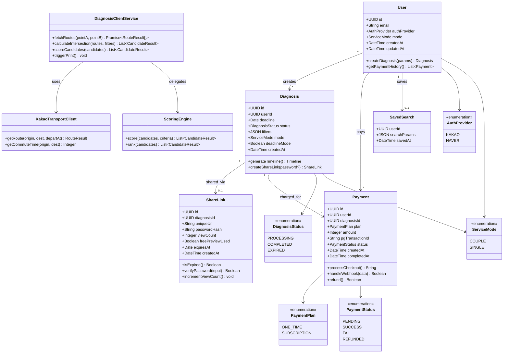

---

> **Software Requirements Specification (SRS)** | Document ID: SRS-001 | Rev 1.5 | 2026-04-18
>
> *본 SRS는 PRD v0.1-rev.2에 기반하여 ISO/IEC/IEEE 29148:2018 표준을 준수하여 작성되었습니다.*
> *모든 요구사항은 REQ-FUNC-xxx / REQ-NF-xxx 형식의 고유 ID를 가진 atomic requirement로 구성되며, Traceability Matrix를 통해 Source Story/KPI와 양방향 추적이 가능합니다.*
> *Rev 1.1: UseCase Diagram, ERD, Component Diagram, Class Diagram 추가 (2026-04-15)*
> *Rev 1.2: Next.js App Router 단일 풀스택 아키텍처(C-TEC-001~007) 정렬 — Constraints, API Overview, NFR, API Endpoint List, Component Diagram 전면 재작성 (2026-04-16)*
> *Rev 1.3: 상세 시퀀스 다이어그램 6건 전면 재작성 (Server Action/Route Handler/Prisma/NextAuth 체계), REQ-FUNC-029 NextAuth 세션 전략 전환, REQ-NF-018 httpOnly cookie 보안 갱신, Transport Adapter 4단계 폴백(카카오→네이버→ODsay→CachedRoute DB) 반영, PDF 생성 @react-pdf/renderer 명시 (2026-04-16)*
> *Rev 1.4: 내부 정합성 검수 — 6.3.1 교차 진단 시퀀스를 Client Component 병렬 호출로 재작성(REQ-FUNC-003 정렬), 6.3.4 싱글 모드 시퀀스 window.print() 전환(REQ-FUNC-023 정렬), 6.6 Component Diagram Report Module·Cron Jobs·Route Handlers 갱신, 6.7 Class Diagram ERD 4엔터티 정렬(CommutePoint·CandidateArea·SavedSearch·ViewLog 제거), REQ-NF-010 window.print() 반영 (2026-04-18)*
> *Rev 1.5: 1인 초급 개발자 MVP 스코프 축소 — F5→간이 저장·불러오기 축소(REQ-FUNC-026~028·replaySearch 제거), NFR 완화(REQ-NF-017 AES-256·REQ-NF-019 DAST 제거, REQ-NF-035~038 Sentry 기본 알림 축소), ERD SavedSearch 3필드 단순화·ViewLog·DongMap 제거, §1.2 In/Out-of-Scope 재정렬, Traceability Matrix 갱신 (2026-04-18)*
