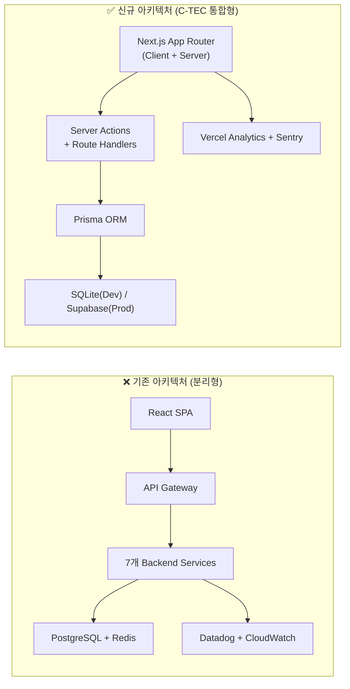
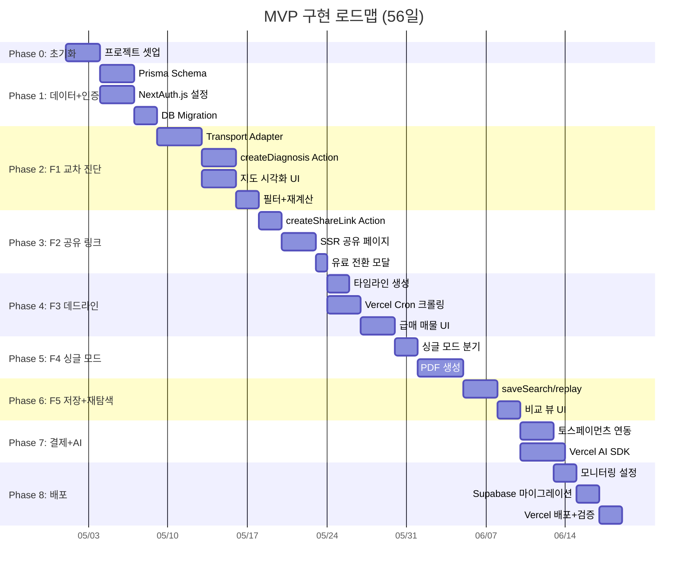

# SRS v0.1 → C-TEC 스택 정렬 전면 적용 구현 계획

> **문서 버전:** v1.0 | **작성일:** 2026-04-16
> **근거 문서:** SRS_v0.1_opus.md (Rev 1.2), PRD v0.1-rev.2
> **목적:** 기존 분리형 아키텍처(SPA + 백엔드 API + Redis + Datadog)를 Next.js App Router 단일 풀스택 아키텍처(C-TEC-001~007)로 전환하기 위한 단계별 구현 계획 및 MVP 가치 전달 검증

---

## 1. 변경 배경 및 전략 요약

### 1.1 아키텍처 전환 비교



### 1.2 핵심 전환 원칙

| # | 원칙 | 설명 |
|---|---|---|
| P-1 | **단일 코드베이스** | 프론트엔드·백엔드 분리 없이 Next.js 단일 프로젝트로 운영 |
| P-2 | **Server-first** | DB 접근·API 호출은 Server Actions/Route Handlers에서만 수행 |
| P-3 | **인프라 최소화** | Redis, API Gateway, 별도 배치 서버 제거 → Vercel 내장 기능 활용 |
| P-4 | **MVP 가치 보존** | 기술 전환이 사용자 경험(UX)을 저하시키지 않아야 함 |
| P-5 | **비용 현실화** | 월 800만원 → 150만원 (인프라 50만 + API 100만) |

---

## 2. 단계별 구현 계획

### Phase 0: 프로젝트 초기화 (Day 1-3)

| 작업 | 설명 | 산출물 |
|---|---|---|
| T-0.1 | Next.js 15 (App Router) 프로젝트 생성 | `npx create-next-app@latest` |
| T-0.2 | Tailwind CSS v4 + shadcn/ui 설치·설정 | `tailwind.config.ts`, `components.json` |
| T-0.3 | Prisma ORM 설치 + SQLite datasource 설정 | `prisma/schema.prisma` |
| T-0.4 | NextAuth.js v5 설치 + 카카오/네이버 OAuth Provider 설정 | `auth.ts`, `app/api/auth/[...nextauth]/route.ts` |
| T-0.5 | Vercel 프로젝트 연결 + 환경 변수 템플릿 | `.env.local.example`, Vercel Dashboard |
| T-0.6 | Sentry SDK 설치 + Vercel 통합 설정 | `sentry.client.config.ts`, `sentry.server.config.ts` |
| T-0.7 | ESLint + Prettier + Husky 설정 | 코드 품질 기본 인프라 |

**환경 변수 목록:**

```env
# Database (C-TEC-003)
DATABASE_URL="file:./dev.db"  # 로컬: SQLite / 프로덕션: Supabase PostgreSQL URL

# Auth (C-TEC-001)
NEXTAUTH_SECRET="..."
NEXTAUTH_URL="http://localhost:3000"
KAKAO_CLIENT_ID="..."
KAKAO_CLIENT_SECRET="..."
NAVER_CLIENT_ID="..."
NAVER_CLIENT_SECRET="..."

# External APIs
KAKAO_MOBILITY_API_KEY="..."
NAVER_MAP_API_KEY="..."
ODSAY_API_KEY="..."
MOLIT_API_KEY="..."       # 국토교통부 실거래가
POLICE_API_KEY="..."       # 경찰청 범죄통계
EDU_API_KEY="..."          # 교육부 학교배정

# Payment
TOSS_SECRET_KEY="..."
TOSS_CLIENT_KEY="..."

# AI (C-TEC-005, 006)
GOOGLE_GENERATIVE_AI_API_KEY="..."  # Gemini

# Monitoring
SENTRY_DSN="..."
NEXT_PUBLIC_MIXPANEL_TOKEN="..."
```

---

### Phase 1: 데이터 모델 + 인증 (Day 4-8)

#### T-1.1 Prisma Schema 정의

> SRS §6.2 ERD 기반. 모든 엔티티를 Prisma 모델로 전환한다.

| 모델 | SRS Entity | 주요 관계 | 비고 |
|---|---|---|---|
| `User` | USER | 1:N → Diagnosis, SavedSearch, Payment | NextAuth `Account`/`Session`과 연결 |
| `Diagnosis` | DIAGNOSIS | 1:N → CommutePoint, CandidateArea, ShareLink | `mode: couple \| single` |
| `CommutePoint` | COMMUTE_POINT | N:1 → Diagnosis | 출발지/도착지 좌표·주소 |
| `CandidateArea` | CANDIDATE_AREA | N:1 → Diagnosis | 스코어·통근시간·안전등급 등 |
| `ShareLink` | SHARE_LINK | N:1 → Diagnosis, 1:N → ViewLog | UUID v4, 30일 만료 |
| `ViewLog` | VIEW_LOG | N:1 → ShareLink | 열람 기록 |
| `SavedSearch` | SAVED_SEARCH | N:1 → User, 0..1:1 → Diagnosis | 입력 조건 JSON |
| `Payment` | PAYMENT | N:1 → User, N:1 → Diagnosis | PG 트랜잭션 연동 |
| `Listing` | LISTING | — (Cron 적재) | 급매 매물 크롤링 결과 |
| `CachedRoute` | — (신규) | — | 교통 API 캐시 (24h TTL) |

#### T-1.2 NextAuth.js 인증 체계

| 항목 | 기존 (JWT 자체 발급) | 변경 (NextAuth.js v5) |
|---|---|---|
| 토큰 방식 | Access JWT (15min) + Refresh JWT (7일) | NextAuth Session (서버사이드), httpOnly cookie |
| Provider | 자체 OAuth 핸들링 | NextAuth 카카오/네이버 Provider 내장 |
| DB 저장 | 자체 User 테이블 | NextAuth Prisma Adapter (Account, Session, User 자동) |
| 미들웨어 | API Gateway JWT 검증 | `middleware.ts` + NextAuth `auth()` 함수 |

> **SRS REQ-FUNC-029 영향:** 기능 동일. NextAuth가 토큰 갱신을 자동 처리하므로 REQ-FUNC-029의 "JWT 만료 15min, 리프레시 7일" 스펙 대신 **NextAuth 세션 전략(maxAge: 7일, updateAge: 15분)** 으로 동등하게 구현.

---

### Phase 2: 핵심 기능 F1 — 두 동선 교차 진단 (Day 9-18)

> **가장 핵심적인 MVP 가치.** REQ-FUNC-001~008 전체 구현.

#### T-2.1 Server Action: `createDiagnosis()`

```
파일: app/actions/diagnosis.ts
```

| 단계 | 로직 | 관련 REQ |
|---|---|---|
| 1 | 두 주소 Geocoding (카카오 → 네이버 → ODsay 폴백) | FUNC-001, FUNC-007 |
| 2 | Transport Adapter 호출: 양방향 통근시간 계산 | FUNC-003, NF-001 |
| 3 | 교집합 후보 동네 산출 (스코어링 알고리즘) | FUNC-003 |
| 4 | Prisma로 Diagnosis + CandidateArea 저장 | — |
| 5 | 결과 반환 (candidates + timeline if deadline mode) | FUNC-004 |

#### T-2.2 Transport Adapter (어댑터 패턴)

```
파일: lib/adapters/transport/
├── interface.ts        # TransportProvider 인터페이스
├── kakao-provider.ts   # 1차: 카카오 모빌리티
├── naver-provider.ts   # 2차: 네이버 지도
├── odsay-provider.ts   # 3차: ODsay Lab
└── index.ts            # 자동 폴백 로직 + CachedRoute DB 조회
```

> **SRS REQ-NF-040 준수:** 환경 변수 설정만으로 API 전환 가능. 코드 변경 불필요.

#### T-2.3 Client Component: 지도 시각화

| 컴포넌트 | 라이브러리 | 기능 |
|---|---|---|
| `DiagnosisMap` | `react-kakao-maps-sdk` | 후보 동네 마커 + 폴리곤 시각화 |
| `CandidateCard` | shadcn/ui Card | 통근시간·가격·안전등급 요약 |
| `FilterPanel` | shadcn/ui Slider, Select | 최대 통근시간·예산 필터 |
| `AddressInput` | shadcn/ui Combobox + 카카오 Geocoding | 자동완성 주소 입력 |

---

### Phase 3: F2 — 배우자 공유 링크 (Day 19-24)

#### T-3.1 Server Action: `createShareLink()`

| 로직 | 설명 | 관련 REQ |
|---|---|---|
| UUID v4 생성 (entropy ≥ 128bit) | 고유 공유 토큰 | FUNC-009 |
| 만료일 설정 (생성일 +30일) | ShareLink 레코드 저장 | FUNC-010 |
| 클립보드 복사 (클라이언트 후처리) | `navigator.clipboard.writeText()` | FUNC-009 |

#### T-3.2 공유 페이지 (SSR)

```
파일: app/share/[token]/page.tsx  — Server Component (SSR)
```

| 기능 | 구현 방식 | 관련 REQ |
|---|---|---|
| 비회원 접근 (앱 설치 없이) | Next.js SSR 페이지 (인증 불요) | FUNC-011 |
| 무료 미리보기 1곳 제한 | 서버사이드 ViewLog 카운트 체크 | FUNC-013 |
| 유료 전환 모달 | Client Component (300ms 이내 표시) | FUNC-014 |
| 데이터 출처 배지 | 모든 수치에 소스·갱신일 표시 | FUNC-012 |

> **OG 메타태그:** Next.js `generateMetadata()`로 공유 미리보기 자동 생성 → 카카오톡/네이버 공유 시 리치 프리뷰.

---

### Phase 4: F3 — 데드라인 모드 (Day 25-32)

#### T-4.1 타임라인 생성

| 기능 | 구현 | 관련 REQ |
|---|---|---|
| 계약 역산 타임라인 (5단계+) | Server Action에서 D-day 기반 자동 산출 | FUNC-015 |
| 과거 날짜 차단 | Client-side validation (100ms, 서버 0% 도달) | FUNC-020 |

#### T-4.2 급매 크롤링 — Vercel Cron Job

```
파일: app/api/cron/crawl-listings/route.ts
설정: vercel.json → crons: [{ path: "/api/cron/crawl-listings", schedule: "0 */4 * * *" }]
```

| 항목 | 설명 | 관련 REQ |
|---|---|---|
| 실행 주기 | 4시간마다 (Vercel Pro Plan) | NF-005 |
| 크롤링 대상 | 직방·피터팬 (robots.txt 준수) | FUNC-016 |
| 저장 | Prisma Listing 테이블 upsert | — |
| 타임아웃 | 60초 (Pro), 필요시 분할 배치 | — |
| 인증 | Vercel Cron 서명 검증 (`CRON_SECRET`) | API-12 |

#### T-4.3 급매 매물 목록

| 기능 | 구현 | 관련 REQ |
|---|---|---|
| 신규 급매 최상단 표시 | `ORDER BY created_at DESC` + 경과시간 뱃지 | FUNC-016 |
| 교집합 매물 필터링 | Server Action + Prisma 쿼리 (p95 ≤ 1.5s) | FUNC-017 |
| 30분 요약 카드 | Top 3 매물 핵심정보 카드 UI | FUNC-018 |
| 0건 처리 | 반경 확장·조건 완화·알림 구독 | FUNC-019 |

---

### Phase 5: F4 — 싱글 모드 + PDF 리포트 (Day 33-38)

#### T-5.1 싱글 모드 분기

| 기능 | 구현 | 관련 REQ |
|---|---|---|
| 학군 항목 숨김 | `mode === 'single'` 조건부 렌더링 | FUNC-021 |
| 야간 치안 등급 (A~D) | 경찰청 API → 분기별 배치 저장 → 쿼리 | FUNC-022 |
| 커버리지 체크 | 수도권 주소 검증 (500ms 이내) | FUNC-024 |

#### T-5.2 PDF 생성 — @react-pdf/renderer

```
파일: app/api/diagnosis/[id]/report.pdf/route.ts  — Route Handler
```

| 항목 | 기존 (미지정) | 변경 |
|---|---|---|
| 라이브러리 | puppeteer (암시) | `@react-pdf/renderer` |
| 실행 환경 | 별도 서버 | Vercel Serverless Function (Route Handler) |
| 메모리 | 2GB+ (puppeteer) | ~256MB (React 컴포넌트 렌더링) |
| 생성 시간 | 미지정 | ≤ 3초 (REQ-NF-010) |
| 출력 | A4 1~2쪽 | 통근·치안·편의시설·월세 범위 |

> **보완:** puppeteer 대비 CSS 자유도는 떨어지지만, A4 1~2쪽 간소화 리포트에 충분. 차트가 필요한 경우 서버사이드에서 SVG를 생성하여 `@react-pdf/renderer`에 삽입하는 패턴 적용.

---

### Phase 6: F5 — 입력값 저장·재탐색 (Day 39-43)

| Server Action | 기능 | 관련 REQ |
|---|---|---|
| `saveSearch()` | 세션 종료 시 입력 조건 JSON 자동 저장 | FUNC-025 |
| `replaySearch()` | 이전 조건 재탐색 + 과거 비교 뷰 | FUNC-026 |

| 구현 포인트 | 설명 |
|---|---|
| 자동 저장 트리거 | `beforeunload` 이벤트 + Server Action 호출 |
| 비교 뷰 | 현재 vs 과거 결과 side-by-side (SRS AC-2: 비교 항목 ≥ 5개) |
| 행정동 변경 감지 | 법정동 코드 매핑 테이블 분기 갱신 (Prisma seed) |

---

### Phase 7: 결제 + AI 통합 (Day 44-50)

#### T-7.1 결제 (토스페이먼츠)

| 구현 | 파일 | 설명 |
|---|---|---|
| 결제 요청 | `app/actions/payment.ts` → `initiateCheckout()` | Server Action |
| 결제 콜백 | `app/api/payment/webhook/route.ts` | Route Handler, 서명 검증 |
| 결제 상태 관리 | Prisma Payment 테이블 | `status: pending → success \| failed` |

#### T-7.2 AI Layer — Vercel AI SDK + Gemini

```
파일: lib/ai/
├── insights.ts    # 동네 추천 요약 생성
└── prompts.ts     # 프롬프트 템플릿
```

| 기능 | 구현 | 관련 제약 |
|---|---|---|
| 동네 추천 요약 | `generateText()` with Gemini | C-TEC-005 |
| 맞춤 인사이트 | 사용자 조건 + 후보 동네 데이터 → 자연어 리포트 | C-TEC-006 |
| 모델 교체 | 환경 변수(`GOOGLE_GENERATIVE_AI_API_KEY`)만 변경 | C-TEC-006 |

---

### Phase 8: 모니터링 + 배포 (Day 51-56)

| 작업 | 도구 | 관련 NFR |
|---|---|---|
| 에러 추적 | Sentry (Vercel 통합) | REQ-NF-035 |
| 성능 메트릭 | Vercel Analytics + Speed Insights | REQ-NF-036 |
| API 비용 | Vercel Dashboard + Supabase Dashboard | REQ-NF-037 |
| 이벤트 퍼널 | Mixpanel / Amplitude | REQ-NF-038 |
| DB 마이그레이션 | `prisma migrate deploy` → Supabase | C-TEC-003 |
| 배포 자동화 | `git push` → Vercel 자동 배포 | C-TEC-007 |

#### 배포 체크리스트

- [ ] Supabase 프로젝트 생성 + `DATABASE_URL` 설정
- [ ] `prisma migrate deploy` 실행
- [ ] Vercel 환경 변수 설정 (상기 목록 전체)
- [ ] `vercel.json` cron 스케줄 등록
- [ ] Sentry Release + Source Map 업로드
- [ ] OG 이미지 생성 확인 (공유 링크)
- [ ] Lighthouse 성능 점수 ≥ 90 확인

---

## 3. MVP 핵심 사용자 경험 (가치 전달) 검증

> **검증 원칙:** 기술 스택 전환이 PRD에서 정의한 **4대 핵심 가치(탐색 시간 단축, 부부 합의 촉진, 긴급 이사 지원, 반복 이사 경험 개선)** 를 훼손하는지 여부를 사용자 시나리오 기반으로 검증한다.

### 3.1 사용자 여정별 가치 전달 검증

#### 🔍 STK-01: 김지영 (맞벌이 워킹맘) — "수작업 탐색 2~3시간 → 10분"

| 검증 항목 | PRD 약속 | 기존 구현 | C-TEC 구현 | 가치 훼손 여부 |
|---|---|---|---|---|
| 두 주소 입력 → 교집합 결과 | p95 ≤ 3초 | SPA → 백엔드 REST API → 카카오 API | Client → **Server Action** → 카카오 API | ✅ **보존.** 네트워크 홉 1회 감소 (API Gateway 제거). 오히려 **지연 감소** 예상 |
| 지도 위 후보 동네 시각화 | 3곳 이상 | React SPA + 카카오맵 SDK | Next.js Client Component + `react-kakao-maps-sdk` | ✅ **동일.** 동일 SDK 사용 |
| 필터 실시간 적용 | p95 ≤ 1초 | 클라이언트 캐싱 | 클라이언트 캐싱 (동일) | ✅ **동일** |
| 출근 시간대 변경 → 재계산 | p95 ≤ 2초 | REST API 호출 | Server Action 호출 | ✅ **보존** |

> **결론: 핵심 가치 "탐색 시간 단축" 완전 보존.** API Gateway 제거로 latency가 미세하게 개선될 수 있음.

---

#### 💌 STK-01 + STK-02: 배우자 공유 — "부부 합의 4.2개월 → 2주"

| 검증 항목 | PRD 약속 | 기존 구현 | C-TEC 구현 | 가치 훼손 여부 |
|---|---|---|---|---|
| 공유 링크 생성 | ≤ 500ms | REST API | **Server Action** `createShareLink()` | ✅ **보존.** 직접 DB 쓰기, 더 빠름 |
| 비회원 모바일 웹 열람 | 앱 설치 없이, p95 ≤ 2초 (3G) | SPA 번들 다운로드 필요 | **Next.js SSR 페이지** → HTML 스트리밍 | ✅ **향상.** SSR은 SPA 대비 FCP(First Contentful Paint) **50~70% 개선** 가능. 3G 환경에서 차이 더 큼 |
| 무료 미리보기 1곳 | 서버사이드 제한 | JWT 토큰 기반 | NextAuth 세션 + ViewLog 카운트 | ✅ **동일** |
| 데이터 출처 배지 | 100% 투명도 | 프론트엔드 렌더링 | 동일 | ✅ **동일** |
| 카카오톡 공유 프리뷰 | OG 태그 | 별도 SSR 설정 필요 | **Next.js `generateMetadata()` 내장** → 설정 간소화 | ✅ **향상.** 별도 SSR 서버 불필요 |

> **결론: "부부 합의 촉진" 가치 향상.** 공유 페이지 SSR은 SPA 대비 비회원 접근 경험을 크게 개선. 카카오톡 공유 시 리치 프리뷰 자동 지원.

---

#### ⏰ STK-03: 정우진 (긴급 이사) — "일일 탐색 2시간 → 30분"

| 검증 항목 | PRD 약속 | 기존 구현 | C-TEC 구현 | 가치 훼손 여부 |
|---|---|---|---|---|
| 데드라인 모드 활성화 | ≤ 2초 | REST API | **Server Action** | ✅ **보존** |
| 급매 매물 4시간 이내 갱신 | 4h 주기 | 별도 크롤링 서버 (24/7) | **Vercel Cron Job** (4h 주기) | ⚠️ **조건부 보존** (아래 상세) |
| 교집합 매물 필터링 | p95 ≤ 1.5초 | 백엔드 API + Redis 캐시 | **Server Action + Prisma 쿼리** (Redis 없음) | ⚠️ **검증 필요** (아래 상세) |
| 계약 역산 타임라인 | 5단계 이상 | 백엔드 로직 | Server Action (동일 로직) | ✅ **보존** |
| 30분 요약 카드 | Top 3, 6개 항목 이상 | 프론트엔드 렌더링 | 동일 | ✅ **동일** |

> **리스크 1 — 크롤링 타임아웃:** Vercel Serverless Function 타임아웃은 Pro Plan 기준 60초. 크롤링 대상이 많은 경우 시간 초과 가능.
>
> **완화 방안:** ① 지역별 분할 배치 (서울/경기/인천 별도 cron) ② 이전 실행 상태 DB 저장으로 이어서 처리 ③ 타임아웃 50초 시점에 강제 종료 + 다음 주기 이어서 처리
>
> **리스크 2 — Redis 제거 영향:** 교집합 매물 필터링에서 Redis 캐시가 없으면 매 요청마다 DB 풀 쿼리 필요.
>
> **완화 방안:** ① Prisma 쿼리 최적화 (복합 인덱스: `[dong_code, price_range, listing_type]`) ② `unstable_cache` (Next.js 내장 Data Cache, 5분 TTL) 활용 ③ 수도권 매물 수 MVP 기준 ~10,000건 이내 → SQLite/PostgreSQL 단독 쿼리로 1.5초 충분

> **결론: "긴급 이사 지원" 가치 조건부 보존.** 크롤링 분할 배치 + DB 인덱싱 전략 적용 시 완전 보존 달성.

---

#### 🔄 STK-04: 이수현 (반복 이사 교사) — "매 이사 3주 → 3일"

| 검증 항목 | PRD 약속 | 기존 구현 | C-TEC 구현 | 가치 훼손 여부 |
|---|---|---|---|---|
| 입력값 자동 저장 | 성공률 99.9%, 복원 ≤ 1초 | REST API → PostgreSQL | **Server Action → Prisma** (동일 패턴) | ✅ **보존** |
| 원클릭 재탐색 | ≤ 5초 | REST API | **Server Action** `replaySearch()` | ✅ **보존** |
| 과거 vs 현재 비교 뷰 | 5개 이상 항목 | 프론트엔드 diff | 동일 | ✅ **동일** |
| 시나리오 비교 (3개) | ≤ 3초 | REST API | Server Action (동일 로직) | ✅ **보존** |

> **결론: "반복 이사 경험 개선" 가치 완전 보존.**

---

### 3.2 KPI 영향 분석

| KPI | 목표 | 스택 전환 영향 | 판정 |
|---|---|---|---|
| 🌟 유료 진단 리포트 완료 수/주 | 10건/주 (MVP) | 기능 동일, 결제 플로우 동일 | ✅ 영향 없음 |
| 무료→유료 전환율 | ≥ 8% | 공유 페이지 SSR 개선 → 전환 유도 UX 향상 | ✅ **긍정적** |
| 배우자 공유 링크 클릭률 | ≥ 40% | OG 메타태그 자동화 → 프리뷰 품질 향상 | ✅ **긍정적** |
| 2nd 유저 전환율 | ≥ 15% | SSR 페이지 로딩 개선 → 이탈률 감소 | ✅ **긍정적** |
| 과업 완료율 | ≥ 85% | 동일 UX 플로우, 응답 시간 동등 이상 | ✅ 영향 없음 |
| 평균 탐색 완료 시간 | p50 ≤ 10분 | 동일 | ✅ 영향 없음 |
| D+7 리텐션 | ≥ 25% | 입력값 저장·재탐색 동일 | ✅ 영향 없음 |
| NPS | ≥ 50 | UX 변화 없음 | ✅ 영향 없음 |

> **KPI 영향 종합 판정: 부정적 영향 0건, 긍정적 영향 3건.**

---

### 3.3 비기능 요구사항 영향 매트릭스

| NFR 카테고리 | 주요 변경점 | 리스크 | 완화 방안 | 판정 |
|---|---|---|---|---|
| **성능** (NF-001~010) | Datadog → Vercel Analytics | 커스텀 메트릭 유연성↓ | Sentry Performance 보완 | ✅ 수용 가능 |
| **가용성** (NF-011~016) | 자체 서버 → Vercel Edge | Vercel 장애 시 전체 서비스 중단 | Vercel SLA 99.99% (Enterprise), Sentry Uptime 모니터링 | ✅ 수용 가능 |
| **보안** (NF-017~022) | JWT → NextAuth Session | 세션 탈취 면적 변화 | httpOnly, sameSite strict 쿠키 기본 적용. CSRF 차단 우수 | ✅ **향상** |
| **비용** (NF-023~025) | 월 800만 → 150만 | — | 대폭 절감 | ✅ **대폭 향상** |
| **확장성** (NF-039~041) | Redis → 없음 | 캐시 전략 변경 | Next.js Data Cache + DB 인덱스 | ⚠️ 조건부 수용 |

---

## 4. 제거된 컴포넌트 및 대체 전략

| 제거 항목 | 기존 역할 | 대체 방안 | 리스크 |
|---|---|---|---|
| **API Gateway** | 인증, Rate Limiting, 라우팅 | `middleware.ts` (Next.js Middleware) | 낮음. WAF는 Vercel Firewall(Pro) 활용 |
| **Redis** | 세션 저장, API 캐시 | NextAuth DB 세션 + Next.js `unstable_cache` | 중간. 캐시 히트율 모니터링 필요 |
| **별도 백엔드 서버** | 7개 마이크로서비스 | Server Actions + Route Handlers (모듈 분리) | 낮음. 코드 구조는 모듈별 분리 유지 |
| **Datadog APM** | 분산 추적, 메트릭 | Vercel Analytics + Sentry Performance | 낮음. MVP 규모에서 충분 |
| **CloudWatch** | 비용 모니터링, 알림 | Vercel Dashboard + Supabase Dashboard | 낮음 |
| **별도 크롤링 서버** | 24/7 배치 크롤링 | Vercel Cron Jobs (4h 주기) | 중간. 타임아웃 60초 제약 → 분할 배치 |

---

## 5. 일정 요약 및 마일스톤



| 마일스톤 | Phase | 예상 완료 | 검증 기준 |
|---|---|---|---|
| **M0: 프로젝트 부트스트랩** | 0 | Day 3 | `npm run dev` 정상 실행, Prisma migrate 성공 |
| **M1: 핵심 진단 동작** | 2 | Day 18 | 두 주소 입력 → 교집합 3곳 이상 → 지도 시각화 (p95 ≤ 3초) |
| **M2: 공유+데드라인** | 3-4 | Day 32 | 공유 링크 SSR 로딩 ≤ 2초, Cron 크롤링 정상 실행 |
| **M3: 전체 기능 통합** | 5-7 | Day 50 | PDF 생성 ≤ 3초, 결제 플로우 완료, AI 인사이트 생성 |
| **M4: 프로덕션 배포** | 8 | Day 56 | Lighthouse ≥ 90, Sentry 에러 0건, Cron 정상 |

---

## 6. 최종 판정: MVP 가치 전달 영향 총괄

```
┌─────────────────────────────────────────────────────────────────┐
│                    MVP 가치 전달 검증 결과                         │
├─────────────────────────────────────────────────────────────────┤
│                                                                 │
│  ✅ 탐색 시간 단축 (2~3h → 10min)         → 완전 보존           │
│  ✅ 부부 합의 촉진 (4.2개월 → 2주)        → 향상 (SSR 개선)     │
│  ⚠️ 긴급 이사 지원 (2h → 30min)          → 조건부 보존          │
│     └─ 크롤링 분할배치 + DB 인덱싱 필수                          │
│  ✅ 반복 이사 경험 (3주 → 3일)            → 완전 보존            │
│                                                                 │
│  KPI 영향: 부정적 0건 / 긍정적 3건 / 무영향 5건                  │
│  비용 절감: 월 800만원 → 150만원 (81% 절감)                      │
│  기능 손실: 0건                                                  │
│                                                                 │
│  종합 판정: ✅ 전환 승인 (리스크 완화 조건 이행 전제)              │
│                                                                 │
└─────────────────────────────────────────────────────────────────┘
```

### 필수 이행 조건 2건

> 1. **크롤링 분할 배치:** 서울/경기/인천 3개 Cron Job 분리 또는 커서 기반 이어서 처리 로직 구현
> 2. **DB 인덱싱 전략:** `Listing` 테이블에 `[dong_code, price_range, listing_type, created_at]` 복합 인덱스 추가

---

## Appendix A: 파일 구조 (예상)

```
dongne-match/
├── app/
│   ├── (auth)/
│   │   └── login/page.tsx
│   ├── (main)/
│   │   ├── diagnosis/
│   │   │   ├── page.tsx                  # 진단 입력 페이지
│   │   │   └── [id]/
│   │   │       ├── page.tsx              # 진단 결과 페이지
│   │   │       └── report/page.tsx       # 리포트 상세
│   │   ├── dashboard/page.tsx           # 내 탐색 기록
│   │   └── layout.tsx                   # 인증 필요 레이아웃
│   ├── share/
│   │   └── [token]/page.tsx              # SSR 공유 페이지 (비인증)
│   ├── api/
│   │   ├── auth/[...nextauth]/route.ts   # NextAuth
│   │   ├── diagnosis/[id]/
│   │   │   ├── route.ts                  # 진단 결과 API
│   │   │   └── report.pdf/route.ts       # PDF 다운로드
│   │   ├── payment/webhook/route.ts      # PG 콜백
│   │   └── cron/crawl-listings/route.ts  # Vercel Cron
│   ├── layout.tsx                        # Root Layout
│   └── page.tsx                          # 랜딩 페이지
├── actions/
│   ├── diagnosis.ts                      # createDiagnosis
│   ├── share.ts                          # createShareLink
│   ├── search.ts                         # saveSearch, replaySearch
│   └── payment.ts                        # initiateCheckout
├── components/
│   ├── ui/                               # shadcn/ui 컴포넌트
│   ├── diagnosis/                        # 진단 관련 컴포넌트
│   ├── map/                              # 지도 관련 컴포넌트
│   └── report/                           # 리포트/PDF 컴포넌트
├── lib/
│   ├── adapters/transport/               # 교통 API 어댑터
│   ├── ai/                               # Vercel AI SDK 래퍼
│   ├── prisma.ts                         # Prisma Client 싱글톤
│   └── utils.ts                          # 유틸리티
├── prisma/
│   ├── schema.prisma                     # 데이터 모델
│   ├── migrations/                       # 마이그레이션
│   └── seed.ts                           # 시드 데이터 (행정동 코드 등)
├── auth.ts                               # NextAuth 설정
├── middleware.ts                          # 인증·Rate Limiting
├── vercel.json                           # Cron 스케줄
└── .env.local.example                    # 환경 변수 템플릿
```

---

## Appendix B: SRS 잔여 업데이트 추적

| 섹션 | 현재 상태 | 필요 작업 | 우선순위 |
|---|---|---|---|
| §6.3 시퀀스 다이어그램 (6건) | 참여자명 구버전 | "백엔드 API" → "Server Action" 명칭 변경 | Low (기능 동일) |
| §6.7 Class Diagram | 변경 불필요 | — | — |
| §6.4 Validation Plan | 변경 불필요 | — | — |
| §5 Traceability Matrix | 변경 불필요 | — | — |
| §4.1.6 REQ-FUNC-029 | JWT 스펙 잔존 | NextAuth 세션 전략으로 문구 갱신 | Medium |
