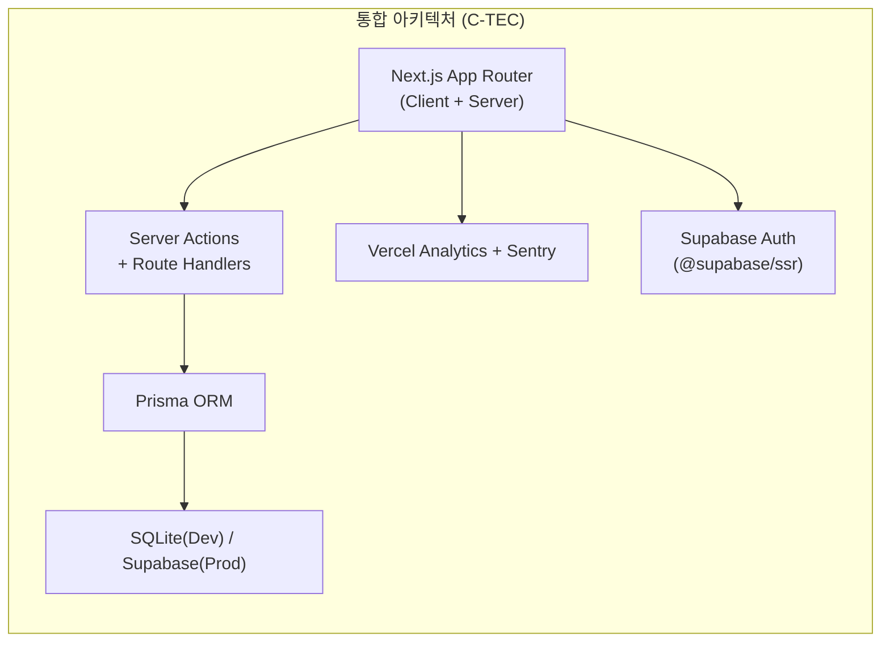
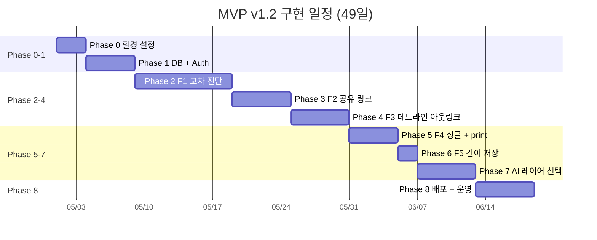

# MVP 구현 로드맵 v1.2 — 바이브코딩 기반 1인 개발자 가이드

> **문서 버전:** v1.2 | **작성일:** 2026-04-21
> **근거 문서:** SRS Rev 1.6 (2026-04-21), PRD v0.1-rev.4, Task List v1.2
> **목적:** Next.js App Router 단일 풀스택 아키텍처 기반 MVP 구현 로드맵. 1인 퍼블리셔급 개발자가 바이브코딩 방식으로 실제 구현 가능한 스코프에 집중한다.
>
> **v1.2 변경 이력 (2026-04-21):**
> - 이전 버전: v1.1 (2026-04-18) — SRS Rev 1.5 + PRD v0.1-rev.3 기준
> - **변경 사유:** Supabase Auth 전환 + 결제 MVP 제외 + 크롤링 제거 + PDF 서버 렌더 제거 → 1인 퍼블리셔급 개발자 실제 구현 가능한 스코프로 재정렬
> - 제목 변경: "SRS 스택 정렬 실행 계획" → "MVP 구현 로드맵 — 바이브코딩 기반 1인 개발자 가이드"
> - Phase 0: NextAuth → Supabase Auth 환경 변수 전환, TOSS 결제 키 제거
> - Phase 1: Payment/Listing 모델 제거, SavedSearch 3필드 단순화 (PK=user_id)
> - Phase 1 인증: NextAuth.js v5 → Supabase Auth (@supabase/ssr)

---

## 1. 변경 배경 및 전략 요약

### 1.1 아키텍처 다이어그램



### 1.2 핵심 전환 원칙

| # | 원칙 | 설명 |
|---|---|---|
| P-1 | **단일 코드베이스** | 프론트엔드·백엔드 분리 없이 Next.js 단일 프로젝트로 운영 |
| P-2 | **Server-first** | DB 접근·API 호출은 Server Actions/Route Handlers에서만 수행 |
| P-3 | **인프라 최소화** | Redis, API Gateway, 별도 배치 서버 제거 → Vercel 내장 기능 활용 |
| P-4 | **MVP 가치 보존** | 기술 전환이 사용자 경험(UX)을 저하시키지 않아야 함 |
| P-5 | **비용 현실화** | 월 인프라 비용 ≤ 10만원 (Vercel 무료 티어 + Supabase 무료 티어 기본 전제). 외부 API 호출 비용은 CON-05 기준 ≤ 100만원 별도. |

---

## 2. 단계별 구현 계획

### Phase 0: 프로젝트 초기화 (Day 1-3)

| 작업 | 설명 | 산출물 |
|---|---|---|
| T-0.1 | Next.js 15 (App Router) 프로젝트 생성 | `npx create-next-app@latest` |
| T-0.2 | Tailwind CSS v4 + shadcn/ui 설치·설정 | `tailwind.config.ts`, `components.json` |
| T-0.3 | Prisma ORM 설치 + SQLite datasource 설정 | `prisma/schema.prisma` |
| T-0.4 | Supabase Auth (@supabase/ssr) 설치 + 카카오/네이버 OAuth Provider 설정 *(v1.2: NextAuth → Supabase Auth)* | `lib/supabase/server.ts`, `lib/supabase/client.ts`, `app/api/auth/callback/route.ts` |
| T-0.5 | Vercel 프로젝트 연결 + 환경 변수 템플릿 | `.env.local.example`, Vercel Dashboard |
| T-0.6 | Sentry SDK 설치 + Vercel 통합 설정 | `sentry.client.config.ts`, `sentry.server.config.ts` |
| T-0.7 | ESLint + Prettier + Husky 설정 | 코드 품질 기본 인프라 |

**환경 변수 목록:**

```env
# Database (C-TEC-003)
DATABASE_URL="file:./dev.db"  # 로컬: SQLite / 프로덕션: Supabase PostgreSQL URL

# Auth — Supabase Auth (v1.2: NextAuth.js → Supabase Auth)
NEXT_PUBLIC_SUPABASE_URL="https://<project-ref>.supabase.co"
NEXT_PUBLIC_SUPABASE_ANON_KEY="..."
SUPABASE_SERVICE_ROLE_KEY="..."  # 서버에서만 사용
KAKAO_CLIENT_ID="..."
KAKAO_CLIENT_SECRET="..."
NAVER_CLIENT_ID="..."
NAVER_CLIENT_SECRET="..."

# External APIs
KAKAO_MOBILITY_API_KEY="..."
NAVER_MAP_API_KEY="..."
ODSAY_API_KEY="..."
MOLIT_API_KEY="..."       # 국토교통부 실거래가
POLICE_API_KEY="..."       # 경찰청 범죄통계
EDU_API_KEY="..."          # 교육부 학교배정

# AI (C-TEC-005, 006)
GOOGLE_GENERATIVE_AI_API_KEY="..."  # Gemini

# Monitoring
SENTRY_DSN="..."
NEXT_PUBLIC_MIXPANEL_TOKEN="..."
```

---

### Phase 1: 데이터 모델 + 인증 (Day 4-8)

#### T-1.1 Prisma Schema 정의

> SRS Rev 1.6 §6.2 ERD 기반. 결제·매물 크롤링 관련 모델은 MVP 제외.

| 모델 | SRS Entity | 주요 관계 | 비고 |
|---|---|---|---|
| `User` | USER | 1:N → Diagnosis, 1:0..1 → SavedSearch | Supabase `auth.users.id` 참조 |
| `Diagnosis` | DIAGNOSIS | 1:N → ShareLink | `mode: couple \| single`, `deadline_mode` |
| `ShareLink` | SHARE_LINK | N:1 → Diagnosis | UUID v4, 30일 만료, `free_preview_used` |
| `SavedSearch` | SAVED_SEARCH | 1:1 → User (PK=user_id) | 사용자당 1건 UPSERT *(v1.2: 3필드 단순화)* |
| ~~`Payment`~~ | ~~PAYMENT~~ | — | *(v1.2: MVP 제외)* |
| ~~`Listing`~~ | ~~LISTING~~ | — | *(v1.2: 크롤링 제거. T-4.3에서 아웃링크 대체)* |

```prisma
// prisma/schema.prisma
// SRS Rev 1.6 §6.2 기반 — MVP 스코프

datasource db {
  provider = "sqlite"  // 프로덕션: "postgresql"
  url      = env("DATABASE_URL")
}

generator client {
  provider = "prisma-client-js"
}

// ──────────────────────────────
// §6.2.1 USER
// Supabase auth.users.id를 외부 참조
// ──────────────────────────────
model User {
  id           String        @id @default(uuid())  // Supabase auth.users.id와 일치
  email        String        @unique
  authProvider String        @map("auth_provider")  // "kakao" | "naver"
  mode         String        @default("couple")     // "couple" | "single"
  createdAt    DateTime      @default(now()) @map("created_at")
  updatedAt    DateTime      @updatedAt @map("updated_at")

  diagnoses    Diagnosis[]
  savedSearch  SavedSearch?

  @@map("users")
}

// ──────────────────────────────
// §6.2.2 DIAGNOSIS
// ──────────────────────────────
model Diagnosis {
  id           String      @id @default(uuid())
  userId       String      @map("user_id")
  deadline     DateTime?   // nullable, 데드라인 모드 시 필수
  status       String      @default("processing")  // "processing" | "completed" | "expired"
  filters      Json        @default("{}")
  mode         String      @default("couple")       // "couple" | "single"
  deadlineMode Boolean     @default(false) @map("deadline_mode")
  createdAt    DateTime    @default(now()) @map("created_at")

  user         User        @relation(fields: [userId], references: [id])
  shareLinks   ShareLink[]

  @@map("diagnoses")
}

// ──────────────────────────────
// §6.2.3 SHARE_LINK
// ──────────────────────────────
model ShareLink {
  id              String    @id @default(uuid())
  diagnosisId     String    @map("diagnosis_id")
  uniqueUrl       String    @unique @map("unique_url")
  passwordHash    String?   @map("password_hash")   // nullable, 열람 비밀번호 해시
  viewCount       Int       @default(0) @map("view_count")
  freePreviewUsed Boolean   @default(false) @map("free_preview_used")
  expiresAt       DateTime  @map("expires_at")
  createdAt       DateTime  @default(now()) @map("created_at")

  diagnosis       Diagnosis @relation(fields: [diagnosisId], references: [id])

  @@map("share_links")
}

// ──────────────────────────────
// §6.2.5 SAVED_SEARCH (Rev 1.5 단순화)
// 사용자당 1건 UPSERT — PK = user_id
// ──────────────────────────────
model SavedSearch {
  userId       String   @id @map("user_id")
  searchParams Json     @map("search_params")
  savedAt      DateTime @default(now()) @map("saved_at")

  user         User     @relation(fields: [userId], references: [id])

  @@map("saved_searches")
}

// ──────────────────────────────
// MVP 제외 모델 (v1.2)
// ──────────────────────────────
// model Payment { ... }   // 결제 도메인 MVP 제외 (PRD rev.4 §7-2)
// model Listing { ... }   // 크롤링 제거 → 네이버 부동산 아웃링크 대체 (SRS Rev 1.6 REQ-FUNC-016)
```

#### Phase 1 체크리스트

| # | 작업 | 상태 | 비고 |
|---|---|---|---|
| 1 | User 모델 생성 (Supabase auth.users.id 참조) | ☐ | `authProvider`, `mode` 필드 포함 |
| 2 | Diagnosis 모델 생성 | ☐ | `deadlineMode`, `mode` 필드 포함 (SRS §6.2.2) |
| 3 | ShareLink 모델 생성 | ☐ | `freePreviewUsed`, `passwordHash` 포함 (SRS §6.2.3) |
| 4 | SavedSearch 3필드 단순화 | ☐ | PK=`userId`, UPSERT 구조 *(v1.2 신규)* |
| 5 | ~~Payment 테이블 생성~~ | — | *(v1.2: MVP 제외)* |
| 6 | ~~Listing 테이블 생성~~ | — | *(v1.2: 크롤링 제거)* |
| 7 | `prisma migrate dev` 실행 + 로컬 검증 | ☐ | SQLite 기준 |
| 8 | Supabase Auth 카카오/네이버 OAuth 설정 | ☐ | *(v1.2: NextAuth → Supabase Auth)* |
| 9 | `lib/supabase/server.ts` — 서버 클라이언트 | ☐ | `@supabase/ssr` `createServerClient` |
| 10 | `lib/supabase/client.ts` — 브라우저 클라이언트 | ☐ | `@supabase/ssr` `createBrowserClient` |
| 11 | `middleware.ts` — 세션 갱신 미들웨어 | ☐ | Supabase Auth 세션 자동 갱신 |
| 12 | `app/api/auth/callback/route.ts` — OAuth 콜백 | ☐ | code → session 교환 |

#### T-1.2 Supabase Auth 인증 체계 *(v1.2: NextAuth.js → Supabase Auth)*

| 항목 | v1.1 (NextAuth.js v5) | v1.2 (Supabase Auth) |
|---|---|---|
| 토큰 방식 | NextAuth Session, httpOnly cookie | Supabase 세션 (httpOnly cookie via `@supabase/ssr`) |
| Provider | NextAuth 카카오/네이버 Provider | Supabase Dashboard → External OAuth Provider 설정 |
| DB 저장 | NextAuth Prisma Adapter (자동) | Supabase `auth.users` 테이블 (자동) + Prisma `users` 동기화 |
| 미들웨어 | `middleware.ts` + NextAuth `auth()` | `middleware.ts` + `supabase.auth.getUser()` |

> **SRS REQ-FUNC-029 영향:** Supabase Auth가 세션 관리를 자동 처리. 세션 갱신은 `@supabase/ssr` 미들웨어에서 `supabase.auth.getUser()` 호출 시 자동 수행.

---

### Phase 2: 핵심 기능 F1 — 두 동선 교차 진단 (Day 9-18)

> **가장 핵심적인 MVP 가치.** REQ-FUNC-001~008 전체 구현.

#### T-2.1 교차 진단 로직 — Client Component 주도 *(SRS Rev 1.6 REQ-FUNC-003)*

> **아키텍처 결정:** Vercel 무료 티어 10초 Serverless Timeout을 회피하기 위해,
> 외부 교통 API 반복 호출과 교차 연산은 **Client Component에서 비동기 병렬(Promise.all)로
> 직접 처리**한다. Server Action은 Geocoding 검증·커버리지 확인·결과 저장만 담당한다.

| 단계 | 실행 위치 | 로직 | 관련 REQ |
|---|---|---|---|
| 1 | Server Action | 두 주소 Geocoding (카카오 Geocoding API) + 수도권 커버리지 검증 | FUNC-001, FUNC-031 |
| 2 | **Client** | Transport Adapter 호출: 양방향 통근시간 계산 (Promise.all 병렬) | FUNC-003, NF-001 |
| 3 | **Client** | 교집합 후보 동네 산출 (스코어링 알고리즘, 클라이언트 연산) | FUNC-003 |
| 4 | Server Action | Prisma로 Diagnosis + 결과 JSON 저장 | — |
| 5 | **Client** | 결과 렌더링 (candidates + timeline if deadline mode) | FUNC-004 |

#### T-2.2 Transport Adapter — 카카오 모빌리티 1종 *(v1.2: CON-07 반영)*

> SRS CON-07: "교통 API는 카카오 모빌리티 1종만 사용하며, 장애 시 클라이언트 화면에 단순 에러 모달만 노출한다."
> 어댑터 패턴 인터페이스는 유지하되, MVP에서는 Kakao 프로바이더만 구현.

```
파일: lib/adapters/transport/
├── interface.ts        # TransportProvider 인터페이스 정의
├── kakao-provider.ts   # 카카오 모빌리티 API 구현체 (MVP 유일 프로바이더)
└── index.ts            # 장애 시 에러 모달 반환 (폴백 없음, CON-07)
```

| 항목 | v1.1 (3종 폴백) | v1.2 (1종) |
|---|---|---|
| 프로바이더 수 | 카카오 → 네이버 → ODsay | **카카오 1종** |
| 장애 시 | 자동 폴백 전환 | **에러 모달 노출** (CON-07) |
| 파일 수 | 5개 | **3개** (interface, kakao, index) |
| 호출 위치 | Server Action | **Client Component** (Timeout 회피) |

> **v1 이후 확장:** 네이버·ODsay 프로바이더 파일은 v1 이후 도입. `interface.ts`를 준수하면
> 코드 변경 없이 `index.ts`에 프로바이더 추가만으로 전환 가능 (REQ-NF-040).

#### T-2.3 Client Component: 지도 시각화

| 컴포넌트 | 라이브러리 | 기능 |
|---|---|---|
| `DiagnosisMap` | `react-kakao-maps-sdk` | 후보 동네 마커 + 폴리곤 시각화 |
| `CandidateCard` | shadcn/ui Card | 통근시간·가격·안전등급 요약 |
| `FilterPanel` | shadcn/ui Slider, Select | 최대 통근시간·예산 필터 (클라이언트 사이드) |
| `AddressInput` | shadcn/ui Combobox + 카카오 Geocoding | 자동완성 주소 입력 |

#### Phase 2 체크리스트

| # | 작업 | 상태 | 비고 |
|---|---|---|---|
| 1 | `lib/adapters/transport/interface.ts` — TransportProvider 인터페이스 | ☐ | 입출력 타입 정의 |
| 2 | `lib/adapters/transport/kakao-provider.ts` — 카카오 구현체 | ☐ | CON-07: 유일 프로바이더 |
| 3 | `lib/adapters/transport/index.ts` — 라우터 + 에러 핸들링 | ☐ | 장애 시 에러 모달 반환 |
| 4 | `app/actions/diagnosis.ts` — Geocoding + 저장 Server Action | ☐ | 수도권 검증 포함 |
| 5 | Client: 교차 연산 로직 (Promise.all 병렬) | ☐ | FUNC-003, Timeout 회피 |
| 6 | `DiagnosisMap` 컴포넌트 | ☐ | `react-kakao-maps-sdk` |
| 7 | `CandidateCard` + `FilterPanel` + `AddressInput` | ☐ | shadcn/ui 기반 |
| 8 | 에러 핸들링 (API 타임아웃 5초 → 토스트 + 재시도 1회) | ☐ | FUNC-007 |
| 9 | 교집합 0곳 처리 (조건 완화 제안 ≥ 2개) | ☐ | FUNC-008 |

---

### Phase 3: F2 — 배우자 공유 링크 (Day 19-24)

#### T-3.1 Server Action: `createShareLink()`

| 로직 | 설명 | 관련 REQ |
|---|---|---|
| UUID v4 생성 (entropy ≥ 128bit) | 고유 공유 토큰 | FUNC-009 |
| 만료일 설정 (생성일 +30일) | ShareLink 레코드 저장 | FUNC-010 |
| 클립보드 복사 (클라이언트 후처리) | `navigator.clipboard.writeText()` | FUNC-009 |

#### T-3.2 공유 페이지 (SSR)

```
파일: app/share/[token]/page.tsx  — Server Component (SSR)
```

| 기능 | 구현 방식 | 관련 REQ |
|---|---|---|
| 비회원 접근 (앱 설치 없이) | Next.js SSR 페이지 (인증 불요) | FUNC-011 |
| 무료 미리보기 1곳 제한 | 서버사이드 `freePreviewUsed` 플래그 체크 | FUNC-013 |
| WTP 설문 유도 모달 *(v1.2: 유료 전환 → WTP 설문)* | Client Component (300ms 이내 표시) | FUNC-014 |
| 데이터 출처 배지 | 모든 수치에 소스·갱신일 표시 | FUNC-012 |

> **OG 메타태그:** Next.js `generateMetadata()`로 공유 미리보기 자동 생성 → 카카오톡/네이버 공유 시 리치 프리뷰.

#### Phase 3 체크리스트

| # | 작업 | 상태 | 비고 |
|---|---|---|---|
| 1 | `app/actions/share.ts` — `createShareLink()` Server Action | ☐ | UUID v4, 30일 만료 |
| 2 | `app/share/[token]/page.tsx` — SSR 공유 페이지 | ☐ | 비회원 접근 가능 |
| 3 | `freePreviewUsed` 플래그 업데이트 로직 | ☐ | ShareLink 테이블 |
| 4 | WTP 설문 유도 모달 Client Component | ☐ | *(v1.2: 결제 모달 → WTP 설문)* |
| 5 | 데이터 출처 배지 컴포넌트 | ☐ | FUNC-012, 투명도 100% |
| 6 | `generateMetadata()` — OG 태그 자동 생성 | ☐ | 카카오톡 리치 프리뷰 |
| 7 | 만료 링크 안내 페이지 | ☐ | FUNC-010, 개인정보 노출 0건 |

---

### Phase 4: F3 — 데드라인 모드 (Day 25-30) *(v1.2: 크롤링 제거, 아웃링크 대체)*

> **v1.2 핵심 변경:** 직접 크롤링(Vercel Cron Job + Listing 테이블) 완전 제거.
> 매물 조회는 네이버 부동산 아웃링크(EXT-08)로 대체 (SRS Rev 1.6 REQ-FUNC-016).

#### T-4.1 타임라인 생성

| 기능 | 구현 | 관련 REQ |
|---|---|---|
| 계약 역산 타임라인 (5단계+) | Server Action에서 D-day 기반 자동 산출 | FUNC-015 |
| 과거 날짜 차단 | Client-side validation (100ms, 서버 0% 도달) | FUNC-020 |

#### T-4.2 매물 조회 — 네이버 부동산 아웃링크 *(v1.2 신규, v1.1 크롤링 대체)*

> SRS Rev 1.6 REQ-FUNC-016: "교집합 동네를 클릭하면 해당 조건을 네이버 부동산
> 검색 URL 파라미터로 조합하여 아웃링크로 새 창을 연다. (직접 크롤링 대체)"

| 항목 | v1.1 (크롤링) | v1.2 (아웃링크) |
|---|---|---|
| 데이터 소스 | 직방·피터팬 크롤링 | **네이버 부동산 아웃링크** (EXT-08) |
| 인프라 | Vercel Cron Job (4h 주기) | **없음** (클라이언트에서 URL 조합) |
| DB 모델 | Listing 테이블 | **불필요** (제거됨) |
| 법적 리스크 | robots.txt 위반 가능성 (R2) | **없음** (아웃링크만) |
| 구현 복잡도 | 높음 (크롤러 + 파서 + DB + Cron) | **매우 낮음** (URL 파라미터 조합) |

```
파일: lib/utils/naver-realestate-link.ts

/**
 * 네이버 부동산 검색 URL을 조합하여 반환한다.
 * @param dongCode  법정동 코드
 * @param filters   사용자 필터 조건 (전세/월세, 가격 범위 등)
 * @returns          네이버 부동산 검색 URL 문자열
 */
export function buildNaverRealEstateUrl(dongCode: string, filters: SearchFilters): string
```

#### T-4.3 후보 동네 상세 + 요약 카드

| 기능 | 구현 | 관련 REQ |
|---|---|---|
| 교집합 동네 클릭 → 아웃링크 | `window.open(buildNaverRealEstateUrl(...))` | FUNC-016 |
| 매물 직접 필터링 | ~~Server Action 쿼리~~ → **아웃링크 위임** *(v1.2)* | FUNC-017 |
| 30분 요약 카드 | 진단 결과 기반 Top 3 동네 핵심정보 (통근·가격·안전) | FUNC-018 |
| 0건 처리 (교집합 없음) | 반경 확장·조건 완화 제안 UI | FUNC-019 |

> **v1.1 대비 제거 항목:**
> - ~~`app/api/cron/crawl-listings/route.ts`~~ — Vercel Cron Job 제거
> - ~~`vercel.json` cron 스케줄~~ — 불필요
> - ~~`CRON_SECRET` 환경 변수~~ — 불필요
> - ~~Listing 테이블~~ — Phase 1에서 이미 제거

#### Phase 4 체크리스트

| # | 작업 | 상태 | 비고 |
|---|---|---|---|
| 1 | `app/actions/deadline.ts` — 타임라인 생성 Server Action | ☐ | D-day → 5단계 역산 (FUNC-015) |
| 2 | 과거 날짜 차단 — 달력 UI Client validation | ☐ | ≤ 100ms, 서버 도달율 0% (FUNC-020) |
| 3 | `lib/utils/naver-realestate-link.ts` — URL 조합 유틸 | ☐ | *(v1.2 신규: 크롤링 대체)* |
| 4 | 교집합 동네 클릭 → 아웃링크 연동 UI | ☐ | `window.open()`, FUNC-016 |
| 5 | 30분 요약 카드 UI (Top 3 동네, 항목 ≥ 6개) | ☐ | FUNC-018 |
| 6 | 0건 처리 UI (확장·완화·알림 구독) | ☐ | FUNC-019 |
| 7 | ~~Vercel Cron 크롤링~~ | — | *(v1.2: 제거)* |
| 8 | ~~Listing 테이블 + 인덱스~~ | — | *(v1.2: 제거)* |

---

### Phase 5: F4 — 싱글 모드 (Day 31-35) *(v1.2: @react-pdf/renderer 제거, window.print() 전환)*

> **v1.2 핵심 변경:** 서버 사이드 PDF 생성(@react-pdf/renderer, puppeteer 등) 완전 제거.
> 브라우저 네이티브 `window.print()` + CSS `@media print`로 전환 (SRS Rev 1.6 REQ-FUNC-023).

#### T-5.1 싱글 모드 분기

| 기능 | 구현 | 관련 REQ |
|---|---|---|
| 싱글 모드 선택 UI | `mode === 'single'` 조건부 렌더링 + 학군·가족 항목 자동 숨김 | FUNC-021 |
| 직장 + 여가 거점 2곳 입력 | 기존 F1 교차 진단 로직 재사용 | FUNC-021 |
| 야간 치안 등급 (A~D) | 경찰청 범죄통계 정적 JSON 에셋 기반 (`public/data/crime-stats.json`) | FUNC-022 |
| 편의시설·카페 밀집도 레이어 | 클라이언트 사이드 필터링, 기본 활성화 | FUNC-021 |
| 비수도권 차단 | Client validation (500ms 이내) + 지원 지역 목록 표시 | FUNC-024 |

#### T-5.2 리포트 저장 — window.print() *(v1.2: 서버 PDF 제거)*

> SRS Rev 1.6 REQ-FUNC-023: "클라이언트 브라우저의 기본 `window.print()` 메서드 호출과
> CSS `@media print` 제어를 통해 PDF 저장을 안내한다."

```
파일:
├── components/report/PrintableReport.tsx   # 인쇄용 레이아웃 컴포넌트
├── components/report/PrintButton.tsx       # window.print() 호출 버튼
└── app/report/[id]/print.css               # @media print 규칙
```

| 항목 | v1.1 (서버 PDF) | v1.2 (window.print()) |
|---|---|---|
| 렌더링 | `@react-pdf/renderer` 서버 사이드 | **브라우저 네이티브 인쇄** |
| 의존성 | `@react-pdf/renderer` (~5MB) | **없음** (브라우저 기본 기능) |
| 응답 시간 | ≤ 3초 (서버 렌더 + 다운로드) | **≤ 1초** (REQ-NF-010) |
| 서버 비용 | PDF 생성 CPU 부하 (~256MB) | **0원** |
| 코드량 | ~200 lines (React-PDF 전용 컴포넌트) | **~50 lines** (CSS + 버튼) |

**PrintButton 컴포넌트:**

```tsx
// components/report/PrintButton.tsx
"use client";

export function PrintButton() {
  return (
    <button onClick={() => window.print()} className="btn-primary">
      리포트 저장 (PDF)
    </button>
  );
}
```

**print.css:**

```css
/* app/report/[id]/print.css */
@media print {
  .no-print { display: none !important; }
  .page-break { page-break-before: always; }
  body { font-size: 10pt; }
  @page { size: A4; margin: 15mm; }
}
```

#### Phase 5 체크리스트

| # | 작업 | 상태 | 비고 |
|---|---|---|---|
| 1 | 싱글 모드 선택 UI + `mode: single` 전달 | ☐ | FUNC-021 |
| 2 | 학군·가족 항목 자동 숨김 로직 | ☐ | 불필요 항목 노출 0건 |
| 3 | 경찰청 범죄통계 정적 JSON 에셋 (`public/data/crime-stats.json`) | ☐ | FUNC-022, 분기 갱신 |
| 4 | 야간 안전 등급(A~D) 산출 로직 | ☐ | 22~06시 범죄 건수 기반 |
| 5 | `PrintButton` 컴포넌트 + `window.print()` | ☐ | *(v1.2: 서버 PDF 제거)* |
| 6 | `print.css` — `@media print` 규칙 | ☐ | A4, 1~2쪽 분량 |
| 7 | `PrintableReport` — 인쇄용 레이아웃 | ☐ | 통근·치안·편의시설·월세 범위 |
| 8 | 비수도권 차단 UI + 지원 지역 목록 | ☐ | FUNC-024, ≤ 500ms |
| 9 | ~~`@react-pdf/renderer` 설치~~ | — | *(v1.2: 제거)* |
| 10 | ~~Route Handler `report.pdf/route.ts`~~ | — | *(v1.2: 제거)* |

---

### Phase 6: F5 — 간이 저장·불러오기 (Day 36-37) *(v1.2: SRS Rev 1.5 축소)*

> **스코프:** 비교 뷰·시나리오 비교·행정동 매핑은 모두 v1 이후 연기.
> MVP는 입력값 자동 저장(best effort) + 불러오기(createDiagnosis 재사용)만 구현.

#### T-6.1~6.4 세부 태스크

| # | Server Action | 설명 | 관련 REQ |
|---|---|---|---|
| T-6.1 | `saveSearch()` — UPSERT | 세션 종료/앱 종료 시 best effort 저장. `beforeunload` 이벤트 트리거. 실패 시 사용자 미통지 | FUNC-025 |
| T-6.2 | `getSavedSearch()` — 조회 | `user_id` 기준 1건 조회 → 저장된 주소 Geocoding 재검증 | FUNC-025 |
| T-6.3 | 불러오기 UI | 조회 성공 시 주소·필터 폼 자동 채움 (≤ 1초). "이전 조건 불러오기" 버튼 | FUNC-025 |
| T-6.4 | Geocoding 실패 처리 | 불러온 주소가 Geocoding 실패 시 "주소를 다시 입력해주세요" 안내 | FUNC-025 |

```
파일: app/actions/saved-search.ts
```

> **v1.1 대비 제거 항목:**
> - ~~`replaySearch()` Server Action~~ — API-06 제거 (SRS Rev 1.5)
> - ~~비교 뷰 UI (REQ-FUNC-026)~~ — v1 연기
> - ~~시나리오 3개 비교 (REQ-FUNC-027)~~ — v1.5 연기
> - ~~행정동 변경 감지·매핑 (REQ-FUNC-028)~~ — v1.5 연기

#### Phase 6 체크리스트

| # | 작업 | 상태 | 비고 |
|---|---|---|---|
| 1 | `app/actions/saved-search.ts` — `saveSearch()` UPSERT | ☐ | best effort, SavedSearch 테이블 |
| 2 | `app/actions/saved-search.ts` — `getSavedSearch()` 조회 | ☐ | `userId` 기준 1건 |
| 3 | 불러오기 버튼 + 폼 자동 채움 UI | ☐ | ≤ 1초 |
| 4 | Geocoding 재검증 + 실패 안내 | ☐ | "주소를 다시 입력해주세요" |
| 5 | ~~`replaySearch()` Server Action~~ | — | *(v1.2: 제거, API-06)* |
| 6 | ~~비교 뷰 UI~~ | — | *(v1.2: v1 연기)* |
| 7 | ~~시나리오 비교~~ | — | *(v1.2: v1.5 연기)* |

---

### Phase 7: AI 레이어 통합 (Day 38-43) *(선택적 — MVP 후반 또는 Open Beta)*

> **주의:** MVP 핵심 기능(F1~F5)이 아님. F1~F5 완성 후 또는 Open Beta 단계에서 도입.
> 결제 연동은 v1.2에서 전면 제외됨 (PRD rev.4 §7-2 Out of Scope).

#### T-7.1 Vercel AI SDK + Gemini

```
파일: lib/ai/
├── insights.ts    # 동네 추천 요약 생성
└── prompts.ts     # 프롬프트 템플릿
```

| 기능 | 구현 | 관련 제약 |
|---|---|---|
| 동네 추천 요약 | `generateText()` with Gemini → Top 3 후보 자연어 요약 | C-TEC-005 |
| 맞춤 인사이트 | 사용자 조건 + 후보 동네 데이터 → 추천 이유 설명 | C-TEC-006 |
| 스트리밍 응답 | `useChat` 훅으로 점진적 렌더링 | UX 향상 |
| 모델 교체 | 환경 변수(`GOOGLE_GENERATIVE_AI_API_KEY`)만 변경 | C-TEC-006 |

> **v1.1 대비 제거 항목:**
> - ~~토스페이먼츠 SDK 연동~~ *(v1.2: 결제 MVP 제외, PRD rev.4 §7-2)*
> - ~~`app/actions/payment.ts` — `initiateCheckout()` Server Action~~
> - ~~`app/api/payment/webhook/route.ts` — PG 콜백 Route Handler~~
> - ~~Prisma Payment 테이블 + 상태 관리~~

#### Phase 7 체크리스트

| # | 작업 | 상태 | 비고 |
|---|---|---|---|
| 1 | `ai`, `@ai-sdk/google` 패키지 설치 | ☐ | C-TEC-005 |
| 2 | `lib/ai/insights.ts` — 동네 추천 요약 함수 | ☐ | 선택적 기능 |
| 3 | `lib/ai/prompts.ts` — 프롬프트 템플릿 | ☐ | 선택적 기능 |
| 4 | 스트리밍 응답 UI (`useChat`) | ☐ | UX 향상 |
| 5 | ~~토스페이먼츠 연동~~ | — | *(v1.2: MVP 제외)* |
| 6 | ~~결제 웹훅 Route Handler~~ | — | *(v1.2: MVP 제외)* |
| 7 | ~~Payment 테이블 상태 관리~~ | — | *(v1.2: MVP 제외)* |

---

### Phase 8: 배포 + 운영 (Day 44-49)

#### T-8.1 Supabase 프로덕션 설정 *(v1.2 신규)*

| 작업 | 설명 |
|---|---|
| Supabase 프로젝트 생성 | 서울 리전 선택 (Asia Northeast) |
| External OAuth Provider 설정 | 카카오·네이버 Client ID/Secret 등록 (Supabase Dashboard) |
| RLS (Row Level Security) 정책 활성화 | `users`, `diagnoses`, `share_links`, `saved_searches` 테이블 |
| RLS 정책 — owner-only 패턴 | `user_id = auth.uid()` 조건으로 본인 데이터만 접근 |
| `@supabase/ssr` 미들웨어 프로덕션 검증 | `middleware.ts`에서 세션 쿠키 자동 갱신 동작 확인 |
| Prisma 마이그레이션 | `prisma migrate deploy` — Supabase PostgreSQL |

**RLS 정책 SQL 예시:**

```sql
-- diagnoses 테이블: 본인만 조회·수정 가능
alter table diagnoses enable row level security;

create policy "Users can view own diagnoses"
  on diagnoses for select
  using (auth.uid()::text = user_id);

create policy "Users can insert own diagnoses"
  on diagnoses for insert
  with check (auth.uid()::text = user_id);

-- saved_searches 테이블도 동일 패턴
alter table saved_searches enable row level security;

create policy "Users can manage own saved search"
  on saved_searches for all
  using (auth.uid()::text = user_id);
```

#### T-8.2 Vercel 배포

| 작업 | 설명 |
|---|---|
| Vercel 프로젝트 연결 | GitHub 자동 배포 (`git push` → 자동 빌드·배포) |
| 환경 변수 설정 | Production / Preview 분리 (Phase 0 변수 목록 반영) |
| Sentry 통합 활성화 | 에러·성능 모니터링 |
| 도메인 연결 (선택) | 커스텀 도메인 DNS 설정 |

#### T-8.3 모니터링·알림

| 항목 | 도구 | 알림 기준 |
|---|---|---|
| 에러 로그 | Sentry | 5xx 에러 5분간 ≥ 10건 → 슬랙 알림 |
| 응답 시간 | Vercel Analytics | p95 > 목표치 120% → 슬랙 경고 |
| API 비용 | Vercel + Supabase Dashboard | 일일 예산 80% 초과 → 슬랙 경고 |
| WTP 설문 응답률 | Mixpanel / Amplitude | 주간 하락 > 20%p → PM 알림 |

> **v1.1 대비 제거 항목:**
> - ~~토스페이먼츠 결제 체크리스트~~
> - ~~PG 웹훅 엔드포인트 검증~~
> - ~~결제 성공/실패 시나리오 테스트~~

#### 배포 체크리스트

- [ ] Supabase 프로젝트 생성 + External OAuth 설정
- [ ] RLS 정책 4개 테이블 활성화
- [ ] `DATABASE_URL` Supabase PostgreSQL로 전환
- [ ] `prisma migrate deploy` 실행
- [ ] Vercel 환경 변수 설정 (Phase 0 목록 전체)
- [ ] Sentry Release + Source Map 업로드
- [ ] OG 이미지 생성 확인 (공유 링크)
- [ ] Lighthouse 성능 점수 ≥ 90 확인
- [ ] `@supabase/ssr` 미들웨어 세션 갱신 동작 검증

#### Phase 8 체크리스트

| # | 작업 | 상태 | 비고 |
|---|---|---|---|
| 1 | Supabase 프로젝트 생성 (Asia Northeast) | ☐ | *(v1.2 신규)* |
| 2 | External OAuth 카카오/네이버 등록 | ☐ | Supabase Dashboard |
| 3 | RLS 정책 활성화 (4개 테이블) | ☐ | owner-only 패턴 |
| 4 | `@supabase/ssr` 미들웨어 프로덕션 검증 | ☐ | `middleware.ts` |
| 5 | `prisma migrate deploy` — Supabase PG | ☐ | 프로덕션 스키마 |
| 6 | Vercel 프로젝트 연결 + 환경 변수 | ☐ | Production/Preview 분리 |
| 7 | Sentry 통합 활성화 | ☐ | 에러·성능 |
| 8 | 모니터링 알림 설정 (슬랙 연동) | ☐ | Sentry + Vercel Analytics |
| 9 | Lighthouse ≥ 90 확인 | ☐ | 성능 검증 |
| 10 | ~~토스페이먼츠 결제 체크리스트~~ | — | *(v1.2: MVP 제외)* |

---

## 3. 사용자 경험 정렬 (UX Alignment)

### 3.1 페르소나별 스택 영향 요약

| 세그먼트 | 대표 STK | v1.2 변화 요소 | UX 영향 |
|---|---|---|---|
| C-01 맞벌이 부부 | STK-01 | F1 Client 병렬 교차 진단 + F2 공유 링크 | 변화 없음. 10분 내 후보 3곳 확인 가능 |
| C-02 맹모삼천지교 | STK-02 | F1 + 야간 치안 레이어 | 학군 레이어는 Could 기능(v1.5) 유지 |
| C-03 긴급 이사자 | STK-03 | **네이버 부동산 아웃링크** (크롤링 4h 갱신 제거) | 급매 데이터는 네이버 부동산 실시간 데이터 사용. 앱 내 체류 대신 외부 탐색으로 전환 |
| C-04 반복 이사자 | STK-04 | F5 간이 저장·불러오기 | 비교 뷰·시나리오 비교는 v1 이후. MVP는 폼 복원만 |
| A-01 이직 후 이사자 | STK-05 | F4 싱글 모드 + **window.print() PDF** | PDF 저장은 브라우저 인쇄 다이얼로그로 전환. UX 저하 없음 (≤ 1초) |

### 3.2 KPI 연동 — v1.2 스택이 KPI 달성에 주는 영향

> PRD v0.1-rev.4 §1-4 KPI와 대응.

| KPI | 목표값 | v1.2 스택 기여 |
|---|---|---|
| 🌟 진단 완료 수/주 | 50건/주 → 200건/주 | F1 Client Promise.all 병렬 구조로 Vercel Timeout 회피. p95 ≤ 3초 달성 가능 |
| WTP 설문 응답률 | ≥ 30% | 결제 대신 WTP 사전 설문 유도 모달(공유 페이지). Closed Beta에서 실측 |
| 배우자 공유 링크 클릭률 | ≥ 40% | F2 OG 메타태그 + SSR 공유 페이지로 카카오톡 리치 프리뷰 확보 |
| 공유 링크 → 2nd 유저 전환율 | ≥ 15% | 앱 설치 불요, 비회원 리포트 열람 가능 (Next.js SSR) |
| NPS | ≥ 50 | 데이터 출처 배지(FUNC-012) + 단일 화면 통합 |
| 평균 탐색 완료 시간 | p50 ≤ 10분 | F1 병렬 연산 + 클라이언트 필터링으로 인터랙션 지연 최소화 |

### 3.3 보안·인증 판정

| 항목 | v1.1 | v1.2 | 변화 |
|---|---|---|---|
| 세션 관리 | NextAuth JWT httpOnly cookie | **Supabase Auth Session (httpOnly cookie via @supabase/ssr)** | 세션 자동 갱신 로직이 SDK 내장으로 이동 |
| OAuth Provider 설정 | NextAuth `providers/` 코드 | **Supabase Dashboard External OAuth** | 코드 대신 대시보드 설정 |
| 전송 암호화 | Supabase TLS/SSL | Supabase TLS/SSL | 동일 (CON-16) |
| PII 암호화 | GA 연기 | GA 연기 | 동일 (CON-16) |
| Rate Limiting | Next.js Middleware | Next.js Middleware | 동일 (REQ-NF-022) |

---

## 4. 제거된 컴포넌트 정리

> v1.1 대비 v1.2에서 제거된 항목을 카테고리별로 집계.

### 4.1 코드 레벨 제거

| 카테고리 | 제거 항목 | 사유 |
|---|---|---|
| 인증 | NextAuth.js v5 + Prisma Adapter | Supabase Auth로 전환 (SRS CON-18) |
| 결제 | Toss Payments SDK + 웹훅 검증 | 결제 MVP 제외 (PRD rev.4 §7-2) |
| 크롤링 | Vercel Cron 4시간 배치 + Cheerio 파서 | 네이버 부동산 아웃링크로 대체 (REQ-FUNC-016) |
| PDF | @react-pdf/renderer + 서버 렌더 | window.print() 전환 (REQ-FUNC-023) |
| 교통 API 폴백 | 네이버/ODsay 프로바이더 | Kakao 1종만 (CON-07) |
| 저장/비교 | replaySearch(), 비교 뷰, 시나리오 비교 | F5 간이 저장으로 축소 (SRS Rev 1.5) |

### 4.2 DB 모델 제거

| 테이블 | 사유 |
|---|---|
| Payment | 결제 MVP 제외 |
| Listing | 크롤링 제거 |
| ViewLog | 별도 테이블 불필요 (`ShareLink.viewCount`로 충분) |
| DongMap | 행정동 매핑 기능 v1 연기 |

### 4.3 필요 조건 재검토

> v1.2에서는 MVP 성립을 위한 **필요 조건이 1개**로 축소됨.

| 조건 | 상태 |
|---|---|
| 카카오 모빌리티 API 무료 tier로 트래픽 감당 (일 50만 건) | 필수 (CON-07, ASM-01) |
| ~~Listing 테이블 복합 인덱스 튜닝~~ | v1.2: 제거. Listing 테이블 자체가 제거됨 |

> Diagnosis·ShareLink·SavedSearch는 기본 PK/FK 인덱스만으로 충분.
> MVP 트래픽(50~200건/주) 규모에서 추가 인덱스 튜닝 불필요.

---

## 5. 일정·마일스톤

### 5.1 간트 차트



### 5.2 Phase별 일수 및 마일스톤

| Phase | 이름 | 일수 | 누적 | 마일스톤 |
|---|---|---|---|---|
| Phase 0 | 환경 설정 | 3d | Day 3 | — |
| Phase 1 | DB + Auth | 5d | Day 8 | **M1: Day 8** — DB/Auth 완료 |
| Phase 2 | F1 교차 진단 | 10d | Day 18 | **M2: Day 18** — 핵심 가치 검증 |
| Phase 3 | F2 공유 링크 | 6d | Day 24 | — |
| Phase 4 | F3 데드라인 (아웃링크) | 6d | Day 30 | — |
| Phase 5 | F4 싱글 (window.print) | 5d | Day 35 | — |
| Phase 6 | F5 간이 저장 | 2d | Day 37 | **M3: Day 37** — F1~F5 전체 완료 |
| Phase 7 | AI 레이어 (선택) | 6d | Day 43 | — |
| Phase 8 | 배포 + 운영 | 6d | Day 49 | **M4: Day 49** — MVP 출시 준비 완료 |
| **합계** | | **49d** | | |

> **v1.1 대비 단축:** 56d → **49d** (크롤링·서버 PDF·다중 폴백·결제 PG 제거 효과, 7일 단축)

---

## 6. 최종 판정

### 6.1 MVP 가치 체크리스트

| 가치 | 관련 기능 | 달성 여부 |
|---|---|---|
| ✅ 동네 탐색 시간 단축 (2~3h → 10분) | F1 교차 진단 + Client Promise.all | 달성 |
| ✅ 부부 합의 도달 (4.2개월 → 2주) | F2 공유 링크 + 무료 미리보기 1곳 | 달성 |
| ✅ 긴급 이사 탐색 효율 (2h/일 → 30분/일) | F3 데드라인 타임라인 + 아웃링크 | 달성 (아웃링크로 실현) |
| ✅ 반복 이사 재탐색 (3주 → 3일) | F5 간이 저장·불러오기 | 달성 |
| ➖ 실결제 검증 | Toss Payments 연동 | **Open Beta 연기** (WTP 설문으로 대체) |

### 6.2 1인 퍼블리셔급 개발자 실현 가능성

| 지표 | 판정 |
|---|---|
| 총 구현 기간 | 49일 (약 10주) |
| 외부 인프라 수 | Vercel + Supabase (2개) |
| 서버 PDF 라이브러리 | 0개 (window.print()로 대체) |
| 크롤러 + 배치 서버 | 0개 (아웃링크로 대체) |
| 결제 PG 연동 | 0개 (MVP 제외) |
| OAuth 직접 구현 | 0개 (Supabase Dashboard 설정) |
| 월 인프라 비용 | ≤ 10만원 (P-5) |

> **최종 판정:** 1인 퍼블리셔급 개발자 + 바이브코딩(Claude·Cursor 등 AI 코딩 도구) 조합으로
> 49일 내 MVP 완주 가능한 스코프로 재정렬 완료.

---

## Appendix A. 파일 경로 매핑 (v1.1 → v1.2)

### A.1 제거된 파일

```
❌ app/actions/payment.ts                    # 결제 Server Action
❌ app/api/payment/webhook/route.ts          # PG 웹훅
❌ app/api/cron/crawl-listings/route.ts      # 크롤링 Cron
❌ lib/auth.ts                               # NextAuth 설정
❌ app/api/auth/[...nextauth]/route.ts       # NextAuth Route Handler
❌ lib/pdf/generate-report.ts                # 서버 PDF 렌더
❌ lib/adapters/transport/naver-provider.ts  # 네이버 폴백
❌ lib/adapters/transport/odsay-provider.ts  # ODsay 폴백
❌ lib/crawler/                              # 크롤러 전체 디렉토리
```

### A.2 추가된 파일

```
✅ lib/supabase/client.ts                    # 브라우저 클라이언트 (@supabase/ssr)
✅ lib/supabase/server.ts                    # 서버 클라이언트 (@supabase/ssr)
✅ lib/supabase/middleware.ts                # 세션 쿠키 갱신 헬퍼
✅ middleware.ts                             # 루트 미들웨어 (@supabase/ssr 연동)
✅ app/auth/callback/route.ts                # Supabase OAuth 콜백
✅ lib/utils/naver-realestate-link.ts        # 네이버 부동산 URL 조합
✅ components/report/PrintableReport.tsx     # 인쇄용 레이아웃
✅ components/report/PrintButton.tsx         # window.print() 버튼
✅ app/report/[id]/print.css                 # @media print 규칙
✅ public/data/crime-stats.json              # 경찰청 범죄통계 정적 에셋
```

### A.3 유지되는 파일

```
◆ app/actions/diagnosis.ts                   # F1 교차 진단
◆ app/actions/share.ts                       # F2 공유 링크
◆ app/actions/deadline.ts                    # F3 타임라인
◆ app/actions/saved-search.ts                # F5 간이 저장
◆ app/share/[token]/page.tsx                 # SSR 공유 페이지
◆ lib/adapters/transport/interface.ts        # 어댑터 인터페이스
◆ lib/adapters/transport/kakao-provider.ts   # 카카오 구현체
◆ lib/adapters/transport/index.ts            # 라우터
◆ prisma/schema.prisma                       # Prisma 스키마
◆ sentry.client.config.ts                    # Sentry 설정
◆ sentry.server.config.ts                    # Sentry 설정
```

---

## Appendix B. 완료 추적 체커

> 각 Phase별 완료 기준을 구체적으로 정의. 체크박스로 진행 상황을 추적.

### Phase 0: 환경 설정 완료 기준

- [ ] `npm run dev` 실행 시 에러 없이 localhost:3000 구동
- [ ] `.env.local.example`에 Phase 0 변수 전체 포함
- [ ] Supabase 프로젝트 생성 + 카카오·네이버 OAuth Provider 등록
- [ ] Sentry DSN 유효성 확인 (테스트 에러 1건 수집)

### Phase 1: DB + Auth 완료 기준

- [ ] `prisma migrate dev` 성공, 로컬 SQLite에 4개 테이블 생성
- [ ] 카카오 OAuth 로그인 → `/auth/callback` → 세션 쿠키 설정 확인
- [ ] `middleware.ts`에서 세션 자동 갱신 동작 확인
- [ ] Prisma `users` 테이블에 Supabase `auth.users.id` 동기화 확인

### Phase 2: F1 교차 진단 완료 기준

- [ ] 두 주소 입력 → 교집합 후보 ≥ 3곳 지도 시각화 (≤ 3초)
- [ ] Client Promise.all 병렬 호출로 Vercel 10초 Timeout 회피 확인
- [ ] 교통 API 타임아웃 5초 → 재시도 1회 → Sentry 로그 전송
- [ ] 비수도권 주소 입력 시 차단 UI 표시

### Phase 3: F2 공유 링크 완료 기준

- [ ] `createShareLink()` → 클립보드 복사 (≤ 500ms)
- [ ] 비회원 SSR 공유 페이지 열람 (앱 설치 불요, ≤ 2초)
- [ ] 무료 미리보기 1곳 후 WTP 설문 모달 (≤ 300ms)
- [ ] OG 메타태그 카카오톡 리치 프리뷰 확인

### Phase 4: F3 데드라인 모드 완료 기준

- [ ] 이사 마감일 입력 → 5단계 타임라인 생성 (≤ 2초)
- [ ] 교집합 동네 클릭 → 네이버 부동산 검색 URL 새 창 열림
- [ ] 과거 날짜 입력 시 달력 UI 차단 (≤ 100ms)
- [ ] 30분 요약 카드 Top 3 동네 렌더링

### Phase 5: F4 싱글 모드 완료 기준

- [ ] 싱글 모드 선택 시 학군·가족 항목 자동 숨김
- [ ] 야간 안전 등급(A~D) 표시
- [ ] `window.print()` → 브라우저 인쇄 다이얼로그 (≤ 1초)
- [ ] A4 1~2쪽 분량 `print.css` 적용 확인

### Phase 6: F5 간이 저장 완료 기준

- [ ] `saveSearch()` UPSERT (best effort, 실패 시 사용자 미통지)
- [ ] "이전 조건 불러오기" → 폼 자동 채움 (≤ 1초)
- [ ] Geocoding 실패 시 "주소를 다시 입력해주세요" 안내

### Phase 7: AI 레이어 완료 기준 *(선택)*

- [ ] Gemini API 호출 성공 + 스트리밍 응답
- [ ] 동네 추천 요약 자연어 생성
- [ ] 맞춤 인사이트 생성

### Phase 8: 배포 완료 기준

- [ ] Supabase 프로덕션 RLS 정책 4개 테이블 활성화
- [ ] Vercel 프로덕션 배포 URL 접속 가능
- [ ] Lighthouse 성능 점수 ≥ 90 (모바일)
- [ ] Sentry에서 프로덕션 에러 수집 확인
- [ ] 모니터링 슬랙 알림 연동 테스트 통과

---

> **MVP 구현 로드맵 v1.2** | 2026-04-21 | 1인 퍼블리셔급 개발자 가이드
>
> 본 문서는 SRS Rev 1.6 + PRD v0.1-rev.4 + Task List v1.2를 기반으로,
> Next.js App Router 단일 풀스택 아키텍처로 49일 내 MVP 출시 가능한
> 스코프로 재정렬되었습니다. 바이브코딩(AI 코딩 도구) 조합으로 실제
> 구현 가능한 현실적 로드맵을 제공합니다.
