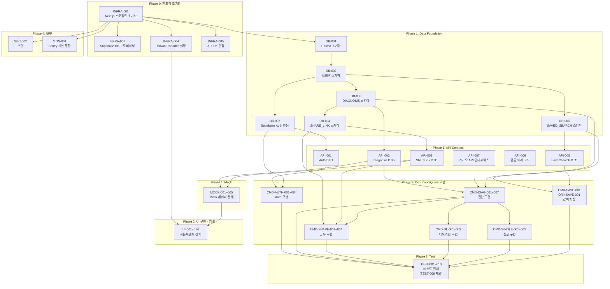

# 개발 태스크(Task) 목록 명세서

**Document ID:** TASK-001
**Source:** SRS-001 Rev 1.6 (2026-04-18)
**작성 기준:** SRS에 명시된 기능적/비기능적 요구사항만을 기반으로 도출
**작성 원칙:** Contract-First → CQRS 분리 → AC→Test 변환 → NFR 추출 + 의존성 매핑

---

## v1.1 변경 이력 (2026-04-18)

> **변경 사유:** SRS Rev 1.5 MVP 스코프 축소에 따라 태스크 목록을 재정렬한다.

### 제거된 태스크

| Task ID | 기능명 | 제거 사유 |
|---|---|---|
| DB-008 | 행정동 코드 매핑 Seed 데이터 | REQ-FUNC-028 제거 (행정동 변경 감지 삭제) |
| DB-009 | 경찰청 범죄 통계 캐시 테이블 Seed | Could 기능용, v1으로 연기. 정적 에셋은 앱 내 JSON으로 대체 |
| DB-010 | 교육부 학교 배정 구역 Seed | Could 기능(REQ-FUNC-035)용, v1으로 연기 |
| CMD-SAVE-002 | 행정동 변경 감지 및 자동 매핑 | REQ-FUNC-028 제거 |
| CMD-SAVE-003 | 시나리오별 동선 변화 비교 | REQ-FUNC-027 제거 |
| CMD-CRON-001 | 급매 매물 4시간 주기 배치 적재 | MVP 단계 크롤링 제거 |
| CMD-CRON-002 | 경찰청 범죄 통계 분기별 배치 갱신 | MVP 단계 배치 제거, 정적 에셋 대체 |
| SEC-001 | AES-256 PII 암호화 | REQ-NF-017 제거, Supabase TLS만 사용 |
| SEC-003 | OWASP DAST 스캔 | REQ-NF-019 제거 |
| MON-002 | Vercel Analytics + Sentry Performance p95 슬랙 경고 | Sentry 기본 알림만 유지 |
| MON-003 | Amplitude/Mixpanel 이벤트 트래킹 + 전환 퍼널 이상 감지 | Sentry 기본 알림만 유지 |
| MON-004 | API 호출량/비용 슬랙 경고 | Sentry 기본 알림만 유지 |

### 수정된 태스크

| Task ID | 변경 내용 |
|---|---|
| QRY-SAVE-001 | 재계산 로직·비교 뷰 제거 → "저장된 값을 입력 폼에 채우기"만 남김 |
| API-005 | `replaySearch()` DTO 제거, `saveSearch()` + `getSavedSearch()` 만 유지 |
| TEST-007 | AC-1(저장 best effort) 시나리오만 남기고 AC-2/3/N1 제거 |
| INFRA-003 | Cron Job 설정 제거 (CMD-CRON 전체 삭제에 따라) |
| CMD-SINGLE-001 | DB-009 의존성 제거, 정적 JSON 에셋 직접 참조로 변경 |
| QRY-SINGLE-001 | DB-009 의존성 제거, 정적 JSON 에셋 기반으로 변경 |
| UI-014 | 비교 뷰 제거 → "이전 조건 불러오기 버튼 + 폼 자동 채움" UI로 축소 |

---

## v1.2 변경 이력 (2026-04-18)

> **변경 사유:** SRS Rev 1.6 반영 — Auth 스택 Supabase Auth 전환 + 결제 도메인 MVP 제외

### 제거된 태스크

| Task ID | 기능명 | 제거 사유 |
|---|---|---|
| DB-005 | PAYMENT 테이블 Prisma 스키마 | SRS Rev 1.6 결제 도메인 MVP 제외에 따라 |
| API-004 | Payment 도메인 DTO | SRS Rev 1.6 결제 도메인 MVP 제외에 따라 |
| API-008 | 토스페이먼츠 PG 연동 인터페이스 | SRS Rev 1.6 결제 도메인 MVP 제외에 따라 |
| MOCK-003 | 결제 프로세스 Mock 데이터 | SRS Rev 1.6 결제 도메인 MVP 제외에 따라 |
| CMD-PAY-001 | 결제 요청 initiateCheckout | SRS Rev 1.6 결제 도메인 MVP 제외에 따라 |
| CMD-PAY-002 | PG 웹훅 처리 | SRS Rev 1.6 결제 도메인 MVP 제외에 따라 |
| CMD-PAY-003 | PG사 장애 에러 모달 | SRS Rev 1.6 결제 도메인 MVP 제외에 따라 |
| QRY-PAY-001 | 결제 이력 조회 | SRS Rev 1.6 결제 도메인 MVP 제외에 따라 |
| TEST-009 | 결제 GWT 시나리오 | SRS Rev 1.6 결제 도메인 MVP 제외에 따라 |
| UI-015 | 결제 화면 UI | SRS Rev 1.6 결제 도메인 MVP 제외에 따라 |

### 수정된 태스크

| Task ID | 변경 내용 |
|---|---|
| CMD-AUTH-001 | NextAuth.js v5 카카오 OAuth → Supabase Auth 카카오 OAuth Provider 설정 |
| CMD-AUTH-002 | NextAuth.js v5 네이버 OAuth → Supabase Auth 네이버 OAuth Provider 설정 |
| CMD-AUTH-003 | NextAuth.js 세션 전략 → Supabase Auth 세션 전략 (@supabase/ssr) |
| DB-007 | NextAuth.js Prisma Adapter → Supabase Auth 연동 USER 스키마 정렬, 복잡도 M→L |
| API-001 | NextAuth.js 세션 객체 → Supabase Session 객체, @supabase/ssr 타입 |
| MOCK-005 | NextAuth 언급 → Supabase Auth 치환 |
| TEST-008 | NextAuth 세션 → Supabase Auth 세션, CSRF 검증 제거 |
| UI-001 | Supabase Auth signInWithOAuth() 호출 구현 방식 주석 추가 |
| TEST-010 | "회원가입→진단→공유→결제→리포트 해금" → "회원가입→진단→공유→리포트 열람" |

---

## v1.3 변경 이력 (2026-04-22)

> **변경 사유:** AI 에이전트가 미작성 태스크 5개를 선별하여 GitHub Issue 상세 명세를 작성하는 워크플로우를 지원하기 위한 메타데이터 보강.

### 추가된 메타데이터

| 항목 | 설명 |
|---|---|
| Issue 상태 컬럼 | 모든 Step 1~5 태스크 표에 `Issue 상태` 컬럼 추가 (초기값: `⬜ 미작성`) |
| 참조 문서 경로 테이블 | 문서 상단에 `📁 참조 문서 경로` 섹션 신설 |
| AC 요약 인라인 | Step 2~3 태스크에 `↳ AC:` 서브필드 추가 |
| NFR 매핑 주석 | Step 2 Command/Query 중 해당 태스크에 `↳ NFR:` 서브필드 추가 |
| 미작성 태스크 조회 가이드 | 문서 맨 끝에 AI Agent 전용 조회 가이드 섹션 신설 |

### 변경 원칙

- 기존 태스크의 Task ID, Epic, Feature 본문, 복잡도, 선행 태스크 값은 변경하지 않음
- 태스크 총 개수 73개 유지 (증감 없음)
- AC 요약/NFR 매핑은 기존 태스크 파일과 SRS 참조 표현에서 추론 가능한 범위에서만 수행

---

## 📁 참조 문서 경로

> ⚠️ 실제 레포 구조에 맞춰 조정 필요

| 논리 참조 | 실제 파일 경로 |
|---|---|
| SRS 원본 | `/plans/05_SRS_v1.6.md` |
| ERD | SRS 원본 §6.2.0 ERD 섹션 내 인라인 (별도 파일 없음) |
| API 명세 | SRS 원본 §6.1 API Endpoint List 섹션 내 인라인 (별도 파일 없음) |
| 시퀀스 다이어그램 | SRS 원본 §6.3 Detailed Interaction Models 섹션 내 인라인 (별도 파일 없음) |
| 태스크 목록 | `/TASKS/06_TASK_LIST_v1.3.md` (본 문서) |
| Issue 상세 명세 출력 | `/docs/issues/{TASK_ID}.md` (작성 시 생성) |

---

## 목차

1. [Step 1. 계약·데이터 명세 태스크 (Contract & Data)](#step-1-계약데이터-명세-태스크)
2. [Step 2. 로직·상태 변경 태스크 (Query / Command)](#step-2-로직상태-변경-태스크)
3. [Step 3. 테스트 태스크 (AC → Test)](#step-3-테스트-태스크)
4. [Step 4. 비기능 제약·인프라 태스크 (NFR)](#step-4-비기능-제약인프라-태스크)
5. [Step 5. UI/UX 프론트엔드 태스크](#step-5-uiux-프론트엔드-태스크)
6. [의존성 그래프](#의존성-그래프)
7. [실행 순서 가이드](#실행-순서-가이드)

---

## Step 1. 계약·데이터 명세 태스크

> **목적:** 백엔드·프론트엔드가 참조할 **단일 진실 공급원(SSOT)**을 먼저 확립한다.
> 모든 후속 Feature 태스크는 이 단계의 산출물(스키마, DTO, Mock)을 import하여 사용한다.

### 1-A. 데이터베이스 스키마

| Task ID | Epic | Feature (기능명) | 관련 SRS 섹션 | 선행 태스크 | 복잡도 | Issue 상태 |
|---|---|---|---|---|---|---|
| DB-001 | Data Foundation | Prisma 프로젝트 초기화 및 datasource 설정 (SQLite/Supabase 전환 가능 구조) | §6.2.0 ERD, CON-11 (C-TEC-003) | None | L | ✅ 작성완료 (TASKS/issues/DB-001.md) |
| DB-002 | Data Foundation | USER 테이블 Prisma 스키마 정의 및 마이그레이션 | §6.2.1 USER | DB-001 | L | ✅ 작성완료 (TASKS/issues/DB-002.md) |
| DB-003 | Data Foundation | DIAGNOSIS 테이블 Prisma 스키마 정의 및 마이그레이션 | §6.2.2 DIAGNOSIS | DB-002 | M | ✅ 작성완료 (TASKS/issues/DB-003.md) |
| DB-004 | Data Foundation | SHARE_LINK 테이블 Prisma 스키마 정의 및 마이그레이션 | §6.2.3 SHARE_LINK | DB-003 | L | ✅ 작성완료 (TASKS/issues/DB-004.md) |
| DB-006 | Data Foundation | SAVED_SEARCH 테이블 Prisma 스키마 정의 및 마이그레이션 (user_id, search_params, saved_at 3필드) | §6.2.5 SAVED_SEARCH (Rev 1.5 단순화) | DB-002 | L | ✅ 작성완료 (TASKS/issues/DB-006.md) |
| DB-007 | Data Foundation | Supabase Auth 연동 USER 스키마 정렬 — Supabase Auth는 auth.users 테이블을 자동 관리하므로 별도 Adapter 불필요. 애플리케이션 USER 테이블은 auth.users.id를 FK로 참조하는 구조로 정의. | §6.2.1 USER, REQ-FUNC-029, CON-18 | DB-002 | L | ✅ 작성완료 (TASKS/issues/DB-007.md) |

### 1-B. API 통신 계약 (DTO / 에러 코드)

| Task ID | Epic | Feature (기능명) | 관련 SRS 섹션 | 선행 태스크 | 복잡도 | Issue 상태 |
|---|---|---|---|---|---|---|
| API-001 | API Contract | Auth 도메인 DTO 정의 — Supabase Session 객체, @supabase/ssr 타입, External OAuth Provider 설정 인터페이스 | §6.1 API-07, REQ-FUNC-029 | DB-007 | M | ✅ 작성완료 (TASKS/issues/API-001.md) |
| API-002 | API Contract | Diagnosis 도메인 Request/Response DTO 정의 — createDiagnosis(), GET /api/diagnosis/[id] | §6.1 API-01/02 | DB-003 | M | ✅ 작성완료 (TASKS/issues/API-002.md) |
| API-003 | API Contract | ShareLink 도메인 Request/Response DTO 정의 — createShareLink(), GET /api/diagnosis/[id]/report | §6.1 API-03/04 | DB-004 | M | ✅ 작성완료 (TASKS/issues/API-003.md) |
| API-005 | API Contract | SavedSearch 도메인 Request/Response DTO 정의 — saveSearch(), getSavedSearch() *(Rev 1.1: replaySearch 제거)* | §6.1 API-05 | DB-006 | L | ✅ 작성완료 (TASKS/issues/API-005.md) |
| API-006 | API Contract | 공통 에러 코드 체계 정의 (HTTP Status + Application Error Code + 사용자 메시지 매핑) | §4.1 전체 AC | None | M | ✅ 작성완료 (TASKS/issues/API-006.md) |
| API-007 | API Contract | 카카오 모빌리티 API 클라이언트 인터페이스 정의 (KakaoTransportClient 타입) | §3.1 EXT-01, §6.7 CLD | None | L | ✅ 작성완료 (TASKS/issues/API-007.md) |

### 1-C. Mock 데이터

| Task ID | Epic | Feature (기능명) | 관련 SRS 섹션 | 선행 태스크 | 복잡도 | Issue 상태 |
|---|---|---|---|---|---|---|
| MOCK-001 | Mock & Fixture | 프론트엔드 UI 개발용 진단 결과 Mock 데이터 (CandidateArea 3곳+ 포함) | §4.1.1 REQ-FUNC-003, §6.1 API-01/02 | API-002 | L | ✅ 작성완료 (TASKS/issues/MOCK-001.md) |
| MOCK-002 | Mock & Fixture | 공유 링크 열람 Mock 데이터 (유효/만료/비밀번호 설정 시나리오) | §4.1.2 REQ-FUNC-009~014, §6.1 API-03/04 | API-003 | L | ✅ 작성완료 (TASKS/issues/MOCK-002.md) |
| MOCK-004 | Mock & Fixture | 카카오 모빌리티 API Mock 응답 데이터 (경로·소요시간·환승 정보) | §3.1 EXT-01, §6.3.1 | API-007 | L | ✅ 작성완료 (TASKS/issues/MOCK-004.md) |
| MOCK-005 | Mock & Fixture | OAuth 소셜 로그인 Mock 데이터 (카카오/네이버 프로필 응답, Supabase Auth 세션 객체) | §3.1 EXT-07, §6.3.6 | API-001 | L | ✅ 작성완료 (TASKS/issues/MOCK-005.md) |

---

## Step 2. 로직·상태 변경 태스크

> **원칙:** 데이터를 읽기만 하는 Query와, DB 상태를 변경하는 Command를 철저히 분리한다.
> 각 태스크는 닫힌 문맥(Closed Context) — 단일 목적에만 집중.

### 2-A. Auth 도메인

| Task ID | Epic | Feature (기능명) | 관련 SRS 섹션 | 선행 태스크 | 복잡도 | Issue 상태 |
|---|---|---|---|---|---|---|
| CMD-AUTH-001 | Auth | [Command] Supabase Auth 카카오 OAuth Provider 설정 (Supabase 대시보드 External OAuth 구성 + @supabase/ssr 클라이언트 연동) ↳ AC: Supabase Auth 카카오 OAuth 연동 완료, signInWithOAuth() 호출 시 인증 흐름 정상 동작 ↳ NFR: Supabase Auth httpOnly cookie (REQ-NF-018), Sentry 에러 추적 (REQ-NF-035) | §4.1.6 REQ-FUNC-029, §6.3.6 | DB-007, API-001 | H | ✅ 작성완료 (TASKS/issues/CMD-AUTH-001.md) |
| CMD-AUTH-002 | Auth | [Command] Supabase Auth 네이버 OAuth Provider 설정 (Supabase 대시보드 External OAuth 구성 + @supabase/ssr 클라이언트 연동) ↳ AC: 네이버 OAuth Provider 설정 완료, 카카오와 동일한 인증 흐름 정상 동작 | §4.1.6 REQ-FUNC-029, §6.3.6 | CMD-AUTH-001 | M | ✅ 작성완료 (TASKS/issues/CMD-AUTH-002.md) |
| CMD-AUTH-003 | Auth | [Command] Supabase Auth 세션 전략 구현 — @supabase/ssr httpOnly cookie, Supabase 기본값 사용 ↳ AC: httpOnly cookie 기반 세션 유지, sameSite strict 적용 확인 ↳ NFR: sameSite strict (REQ-NF-018), Sentry 에러 추적 (REQ-NF-035) | §4.2.3 REQ-NF-018 | CMD-AUTH-001 | M | ✅ 작성완료 (TASKS/issues/CMD-AUTH-003.md) |
| CMD-AUTH-004 | Auth | [Command] OAuth 장애 시 게스트 임시 체험 모드 전환 로직 ↳ AC: OAuth 장애 시 게스트 모드 전환, 제한된 기능 체험 가능 | §3.1.1 EXT-07 우회 전략 | CMD-AUTH-001 | L | ✅ 작성완료 (TASKS/issues/CMD-AUTH-004.md) |

### 2-B. Diagnosis 도메인 (두 동선 교차 진단 — F1)

| Task ID | Epic | Feature (기능명) | 관련 SRS 섹션 | 선행 태스크 | 복잡도 | Issue 상태 |
|---|---|---|---|---|---|---|
| CMD-DIAG-001 | Diagnosis | [Command] 클라이언트 주소 Geocoding 연동 — 카카오 Geocoding API 호출 (자동완성) ↳ AC: 주소 입력 시 자동완성 목록 표시, 선택 시 좌표 변환 완료 | §4.1.1 REQ-FUNC-001, §6.3.1 | API-007 | M | ✅ 작성완료 (TASKS/issues/CMD-DIAG-001.md) |
| CMD-DIAG-002 | Diagnosis | [Command] 클라이언트 교집합 후보 동네 산출 — Promise.all 병렬 카카오 API 호출 + 교차 연산 ↳ AC: 교집합 후보 동네 ≥3곳 산출, 응답 ≤3초, 실패율 <1% ↳ NFR: 교차 계산 p95 ≤8,000ms (REQ-NF-001), Sentry 에러 추적 (REQ-NF-035) | §4.1.1 REQ-FUNC-003, §6.3.1 | CMD-DIAG-001, API-007 | H | ✅ 작성완료 (TASKS/issues/CMD-DIAG-002.md) |
| CMD-DIAG-003 | Diagnosis | [Command] 후보 동네 스코어링 엔진 구현 (ScoringEngine.score/rank) ↳ AC: (SRS §6.7 CLD 재조회 필요 — 스코어링 기준 상세 미정) | §6.7 CLD (ScoringEngine) | CMD-DIAG-002 | H | ✅ 작성완료 (TASKS/issues/CMD-DIAG-003.md) |
| CMD-DIAG-004 | Diagnosis | [Command] 진단 결과 서버 저장 — saveDiagnosisResult Server Action (Prisma Diagnosis + CandidateArea) ↳ AC: 진단 결과 Prisma 저장 성공, Diagnosis+CandidateArea 정합성 보장 ↳ NFR: Sentry 에러 추적 (REQ-NF-035) | §6.3.1 (SA → Prisma 저장) | DB-003, API-002, CMD-DIAG-002 | M | ✅ 작성완료 (TASKS/issues/CMD-DIAG-004.md) |
| QRY-DIAG-001 | Diagnosis | [Query] 진단 결과 조회 — GET /api/diagnosis/[id] Route Handler ↳ AC: GET /api/diagnosis/[id] 응답 p95 ≤1,500ms, 권한 없는 접근 차단 | §6.1 API-02, §3.3 | DB-003, API-002 | L | ✅ 작성완료 (TASKS/issues/QRY-DIAG-001.md) |
| QRY-DIAG-002 | Diagnosis | [Query] 출퇴근 시간 조회 — 후보 동네 탭 시 양쪽 직장까지 예상 소요시간 반환 ↳ AC: 후보 동네 탭 시 양쪽 출퇴근 시간 표시, 카카오맵 대비 오차 ≤±10% | §4.1.1 REQ-FUNC-004, REQ-FUNC-005 | CMD-DIAG-002 | M | ✅ 작성완료 (TASKS/issues/QRY-DIAG-002.md) |
| CMD-DIAG-005 | Diagnosis | [Command] 조건 필터 실시간 적용 — 클라이언트 사이드 캐싱 기반 필터링 + 지도 갱신 ↳ AC: 필터 적용 시 실시간 지도 갱신, 응답 p95 ≤1,000ms ↳ NFR: 필터 응답 p95 ≤1,000ms (REQ-NF-004) | §4.1.1 REQ-FUNC-006 | CMD-DIAG-002 | M | ✅ 작성완료 (TASKS/issues/CMD-DIAG-005.md) |
| CMD-DIAG-006 | Diagnosis | [Command] 교통 API 타임아웃 핸들링 — 5초 타임아웃 + 자동 재시도 1회 + Sentry 로그 ↳ AC: 5초 타임아웃 후 자동 재시도 1회, 재시도 실패 시 Sentry 로그 + 안내 표시, 무한 로딩 0건 ↳ NFR: 타임아웃 5초 + 재시도 (REQ-NF-001), Sentry 에러 추적 (REQ-NF-035) | §4.1.1 REQ-FUNC-007, §6.3.1 에러 핸들링 | CMD-DIAG-002 | M | ✅ 작성완료 (TASKS/issues/CMD-DIAG-006.md) |
| CMD-DIAG-007 | Diagnosis | [Command] 수도권 커버리지 검증 — 비수도권 주소 입력 차단 로직 ↳ AC: 비수도권 주소 입력 시 차단 + 안내 UI 표시, 비수도권 진단 실행 0건 | §4.1.6 REQ-FUNC-031, §4.1.4 REQ-FUNC-024 | CMD-DIAG-001 | L | ✅ 작성완료 (TASKS/issues/CMD-DIAG-007.md) |

### 2-C. ShareLink 도메인 (배우자 공유 링크 — F2)

| Task ID | Epic | Feature (기능명) | 관련 SRS 섹션 | 선행 태스크 | 복잡도 | Issue 상태 |
|---|---|---|---|---|---|---|
| CMD-SHARE-001 | ShareLink | [Command] 공유 링크 생성 — createShareLink Server Action (UUID v4, 만료 30일, 선택 비밀번호) ↳ AC: 링크 생성 ≤500ms, UUID v4 entropy ≥128bit, 만료 30일 ↳ NFR: 응답 ≤500ms (REQ-NF-006), bcrypt 비밀번호 해싱 (REQ-NF-020), Sentry 에러 추적 (REQ-NF-035) | §4.1.2 REQ-FUNC-009, §6.3.2 | DB-004, API-003, CMD-DIAG-004 | M | ✅ 작성완료 (`TASKS/issues/CMD-SHARE-001.md`) |
| QRY-SHARE-001 | ShareLink | [Query] 공유 리포트 SSR 열람 — GET /api/diagnosis/[id]/report Route Handler (토큰 검증 + 무료 미리보기 1곳) ↳ AC: SSR 렌더링 ≤2초(3G), 무료 미리보기 1곳, 만료 링크 시 개인정보 노출 0건 ↳ NFR: SSR 로딩 p95 ≤2,000ms (REQ-NF-003), 비인가 접근 차단 (REQ-NF-021) | §4.1.2 REQ-FUNC-011, §6.3.2 | DB-004, CMD-SHARE-001 | H | ✅ 작성완료 (`TASKS/issues/QRY-SHARE-001.md`) |
| CMD-SHARE-002 | ShareLink | [Command] 공유 링크 열람 시 viewCount 증가 ↳ AC: 열람 시 viewCount 정확히 1 증가 | §6.3.2 (view_count 증가) | QRY-SHARE-001 | L | ✅ 작성완료 (`TASKS/issues/CMD-SHARE-002.md`) |
| CMD-SHARE-003 | ShareLink | [Command] 만료 링크 접근 시 안내 페이지 + 원 사용자 재생성 알림 푸시 발송 ↳ AC: 만료 링크 접근 시 안내 페이지 ≤1초, 원 사용자에게 재생성 알림 발송 ↳ NFR: 만료 링크 개인정보 노출 0건 (REQ-NF-021), Sentry 에러 추적 (REQ-NF-035) | §4.1.2 REQ-FUNC-010, §6.3.2 | QRY-SHARE-001 | M | ✅ 작성완료 (`TASKS/issues/CMD-SHARE-003.md`) |
| CMD-SHARE-004 | ShareLink | [Command] 공유 링크 비밀번호 검증 로직 (bcrypt 비교) ↳ AC: bcrypt 비밀번호 검증, 불일치 시 접근 차단 ↳ NFR: bcrypt 비밀번호 검증 (REQ-NF-020), 비인가 접근 차단 (REQ-NF-021) | §6.3.2 비밀번호 설정 플로우, REQ-NF-020 | QRY-SHARE-001 | L | ✅ 작성완료 (`TASKS/issues/CMD-SHARE-004.md`) |

### 2-E. Deadline Mode 도메인 (데드라인 모드 — F3)

| Task ID | Epic | Feature (기능명) | 관련 SRS 섹션 | 선행 태스크 | 복잡도 | Issue 상태 |
|---|---|---|---|---|---|---|
| CMD-DL-001 | Deadline Mode | [Command] 데드라인 모드 활성화 — createDiagnosis(deadline_mode=true) + 계약 역산 타임라인 생성 (≥5단계) ↳ AC: 계약 역산 타임라인 ≥5단계 생성, 응답 ≤2초 ↳ NFR: 타임라인 생성 ≤2초 (REQ-NF-001), Sentry 에러 추적 (REQ-NF-035) | §4.1.3 REQ-FUNC-015, §6.3.3 | DB-003, CMD-DIAG-004 | H | ✅ 작성완료 (TASKS/issues/CMD-DL-001.md) |
| CMD-DL-002 | Deadline Mode | [Command] 아웃링크 URL 조합 — 교집합 동네 클릭 시 네이버 부동산 검색 URL 파라미터 생성 + 새 창 열기 ↳ AC: 네이버 부동산 검색 URL 파라미터 정확 조합, 새 창 열기 동작 | §4.1.3 REQ-FUNC-016/017, §3.1 EXT-08 | CMD-DL-001 | L | ✅ 작성완료 (TASKS/issues/CMD-DL-002.md) |
| QRY-DL-001 | Deadline Mode | [Query] 교집합 매물 조회 — filterListings Server Action (복합 인덱스 활용 쿼리) ↳ AC: 교집합 매물 쿼리 응답 p95 ≤1,500ms, 복합 인덱스 활용 ↳ NFR: 교집합 매물 연산 p95 ≤1,500ms (REQ-NF-007) | §6.3.3 (SA → Prisma 쿼리) | CMD-DL-001 | M | ✅ 작성완료 (TASKS/issues/QRY-DL-001.md) |
| CMD-DL-003 | Deadline Mode | [Command] 급매 매물 0건 시 조건 완화 제안 + 신규 급매 푸시 알림 구독 처리 ↳ AC: 급매 0건 시 조건 완화 제안 ≤1초, 푸시 알림 구독 처리 ↳ NFR: Sentry 에러 추적 (REQ-NF-035) | §4.1.3 REQ-FUNC-019, §6.3.3 | QRY-DL-001 | M | ✅ 작성완료 (TASKS/issues/CMD-DL-003.md) |
| QRY-DL-002 | Deadline Mode | [Query] 30분 요약 — getSummary Server Action (Top 3 매물 카드, 항목 ≥6개/카드) ↳ AC: Top 3 매물 요약 카드, 항목 ≥6개/카드 | §4.1.3 REQ-FUNC-018, §6.3.3 | QRY-DL-001 | M | ✅ 작성완료 (TASKS/issues/QRY-DL-002.md) |

### 2-F. Single Mode 도메인 (싱글 모드 — F4)

| Task ID | Epic | Feature (기능명) | 관련 SRS 섹션 | 선행 태스크 | 복잡도 | Issue 상태 |
|---|---|---|---|---|---|---|
| CMD-SINGLE-001 | Single Mode | [Command] 싱글 모드 진단 — createDiagnosis(mode=single) + 학군·가족 항목 자동 숨김 + 야간 치안/편의시설/카페 레이어 기본 활성. 범죄 통계는 앱 내 정적 JSON 에셋 참조 ↳ AC: 학군·가족 항목 노출 0건, 야간 치안/편의시설/카페 레이어 기본 활성 ↳ NFR: Sentry 에러 추적 (REQ-NF-035) | §4.1.4 REQ-FUNC-021, §6.3.4 | DB-003, CMD-DIAG-002 | M | ✅ 작성완료 (TASKS/issues/CMD-SINGLE-001.md) |
| QRY-SINGLE-001 | Single Mode | [Query] 야간 안전 등급(A~D) 조회 — 앱 내 정적 JSON 에셋 기반 범죄 등급 산출 ↳ AC: 야간 안전 등급 A~D 표시, 커버리지 ≥수도권 90% | §4.1.4 REQ-FUNC-022, §6.3.4 | CMD-SINGLE-001 | M | ✅ 작성완료 (TASKS/issues/QRY-SINGLE-001.md) |
| CMD-SINGLE-002 | Single Mode | [Command] 리포트 저장 — window.print() + CSS @media print 제어 (서버 호출 없음) ↳ AC: window.print() 호출 + CSS @media print 제어, 서버 호출 없음 ↳ NFR: PDF 저장 ≤1초 (REQ-NF-010) | §4.1.4 REQ-FUNC-023, §6.3.4 | CMD-SINGLE-001 | L | ✅ 작성완료 (TASKS/issues/CMD-SINGLE-002.md) |

### 2-G. SavedSearch 도메인 (간이 저장·불러오기 — F5) *(Rev 1.1 축소)*

| Task ID | Epic | Feature (기능명) | 관련 SRS 섹션 | 선행 태스크 | 복잡도 | Issue 상태 |
|---|---|---|---|---|---|---|
| CMD-SAVE-001 | SavedSearch | [Command] 입력값 자동 저장 — saveSearch Server Action (세션 종료/앱 종료 시 best effort UPSERT) ↳ AC: best effort UPSERT, 저장 실패 시 사용자 미통지 ↳ NFR: 저장 best effort (REQ-NF-016), Sentry 에러 추적 (REQ-NF-035) | §4.1.5 REQ-FUNC-025, §6.3.5 | DB-006, API-005 | M | ✅ 작성완료 (TASKS/issues/CMD-SAVE-001.md) |
| QRY-SAVE-001 | SavedSearch | [Query] 저장된 조건 불러오기 — getSavedSearch Server Action (저장된 값을 입력 폼에 채우기 + geocoding 실패 시 "다시 입력해주세요" 안내) *(Rev 1.1: 재계산·비교 뷰 제거)* ↳ AC: 복원 ≤1초, geocoding 실패 시 "다시 입력해주세요" 안내 | §4.1.5 REQ-FUNC-025, §6.3.5 | DB-006, CMD-SAVE-001 | L | ✅ 작성완료 (TASKS/issues/QRY-SAVE-001.md) |

---

## Step 3. 테스트 태스크

> **원칙:** SRS에 명시된 AC(Acceptance Criteria)를 Given/When/Then 기반의 테스트 코드 작성 태스크로 직접 변환.
> 에이전트에게 "이 테스트가 통과할 때까지 로직을 수정하라"고 지시할 수 있는 형태.

| Task ID | Epic | Feature (기능명) | 관련 SRS 섹션 | 선행 태스크 | 복잡도 | Issue 상태 |
|---|---|---|---|---|---|---|
| TEST-001 | Test: Diagnosis | [Test] 교차 진단 GWT 시나리오 — 정상 3곳+ 산출(AC-1), 1개 주소만 입력 시 에러(AC-N1), 교집합 0곳 시 완화 제안(AC-N3), 비수도권 차단 ↳ AC: 정상 3곳+ 산출 검증, 1개 주소 에러 검증, 0곳 완화 제안 검증, 비수도권 차단 검증 | §4.1.1 AC-1/2/3, REQ-FUNC-002/003/008/031 | CMD-DIAG-002, CMD-DIAG-004, CMD-DIAG-007 | H | ✅ 작성완료 |
| TEST-002 | Test: Diagnosis | [Test] 교통 API 타임아웃 핸들링 — 5초 타임아웃 재시도 성공/실패 시나리오, 무한 로딩 0건 검증 ↳ AC: 5초 타임아웃 재시도 성공/실패 시나리오, 무한 로딩 0건 검증 | §4.1.1 REQ-FUNC-007, §6.3.1 에러 핸들링 | CMD-DIAG-006 | M | ✅ 작성완료 |
| TEST-003 | Test: ShareLink | [Test] 공유 링크 GWT 시나리오 — 생성 ≤500ms(AC-1), 만료 링크 접근 시 개인정보 노출 0건(AC-N1), 무료 미리보기 1곳 후 유료 전환 모달 ≤300ms(AC-N2) ↳ AC: 생성 ≤500ms, 만료 링크 개인정보 0건, 유료 전환 모달 ≤300ms | §4.1.2 AC-1/2/3, REQ-FUNC-010/011/014 | CMD-SHARE-001, QRY-SHARE-001, CMD-SHARE-003 | H | ✅ 작성완료 |
| TEST-004 | Test: ShareLink | [Test] 공유 링크 보안 — UUID v4 entropy ≥128bit 검증, 비밀번호 bcrypt 검증, 비인가 접근 차단 ↳ AC: UUID v4 entropy ≥128bit, bcrypt 검증, 비인가 접근 차단 | §4.2.3 REQ-NF-020/021 | CMD-SHARE-001, CMD-SHARE-004 | M | ✅ 작성완료 |
| TEST-005 | Test: Deadline | [Test] 데드라인 모드 GWT 시나리오 — 타임라인 ≥5단계 생성(AC-1), 과거날짜 차단(AC-N2), 급매 0건 시 완화 제안(AC-N1) ↳ AC: 타임라인 ≥5단계, 과거날짜 차단, 급매 0건 완화 제안 | §4.1.3 AC-1/2/3, REQ-FUNC-015/019/020 | CMD-DL-001, CMD-DL-003 | M | ✅ 작성완료 |
| TEST-006 | Test: SingleMode | [Test] 싱글 모드 GWT 시나리오 — 학군 항목 노출 0건(AC-1), 야간 안전 등급 A~D(AC-2), PDF저장 window.print() 호출(AC-3), 비수도권 차단(AC-N1) ↳ AC: 학군 노출 0건, 야간 등급 A~D, window.print() 호출, 비수도권 차단 | §4.1.4 AC-1/2/3, REQ-FUNC-021/022/023/024 | CMD-SINGLE-001, QRY-SINGLE-001, CMD-SINGLE-002 | M | ✅ 작성완료 |
| TEST-007 | Test: SavedSearch | [Test] 간이 저장 시나리오 — 저장 best effort 동작 검증(AC-1), geocoding 실패 시 "다시 입력해주세요" 안내 표시 *(Rev 1.1: AC-2/3/N1 제거)* ↳ AC: best effort 저장 동작 검증, geocoding 실패 시 안내 표시 | §4.1.5 AC-1, REQ-FUNC-025 | CMD-SAVE-001, QRY-SAVE-001 | L | ✅ 작성완료 (TASKS/issues/TEST-007.md) |
| TEST-008 | Test: Auth | [Test] OAuth 로그인 GWT 시나리오 — 카카오/네이버 로그인 성공, Supabase Auth 세션 생성·리프레시 토큰 자동 갱신·만료, 게스트 모드 전환 ↳ AC: 카카오/네이버 로그인 성공, Supabase 세션 생성·갱신·만료, 게스트 전환 | §4.1.6 REQ-FUNC-029, §4.2.3 REQ-NF-018 | CMD-AUTH-001, CMD-AUTH-002, CMD-AUTH-003, CMD-AUTH-004 | M | ✅ 작성완료 (TASKS/issues/TEST-008.md) |
| TEST-010 | Test: Integration | [Test] E2E 통합 시나리오 — 회원가입→진단→공유→리포트 열람 전체 플로우 (Cypress/Playwright) ↳ AC: 회원가입→진단→공유→리포트 열람 전체 플로우 통과 | §5.1 Traceability 전체 | TEST-001~008 | H | ✅ 작성완료 (TASKS/issues/TEST-010.md) |

---

## Step 4. 비기능 제약·인프라 태스크

> **원칙:** SRS §4.2 비기능적 요구사항(보안·성능·가용성·비용·모니터링)에서 추출.

### 4-A. 인프라 및 DevOps

| Task ID | Epic | Feature (기능명) | 관련 SRS 섹션 | 선행 태스크 | 복잡도 | Issue 상태 |
|---|---|---|---|---|---|---|
| INFRA-001 | Infra | Next.js 15+ App Router 프로젝트 초기화 + Vercel 배포 파이프라인 구성 (Git Push 자동 배포) | CON-09 (C-TEC-001), CON-15 (C-TEC-007) | None | M | ✅ 작성완료 (TASKS/issues/INFRA-001.md) |
| INFRA-002 | Infra | Supabase PostgreSQL 프로덕션 DB 프로비저닝 + 환경변수(DATABASE_URL) 설정 | CON-11 (C-TEC-003), §6.2.0 | INFRA-001 | L | ✅ 작성완료 (TASKS/issues/INFRA-002.md) |
| INFRA-004 | Infra | Tailwind CSS + shadcn/ui 디자인 시스템 초기 설정 | CON-12 (C-TEC-004) | INFRA-001 | L | ✅ 작성완료 (TASKS/issues/INFRA-004.md) |
| INFRA-005 | Infra | Vercel AI SDK + Google Gemini API 연동 설정 (환경변수 기반 모델 교체 가능 구조) | CON-13/14 (C-TEC-005/006), §6.6 AI Layer | INFRA-001 | M | ✅ 작성완료 (TASKS/issues/INFRA-005.md) |

### 4-B. 보안

| Task ID | Epic | Feature (기능명) | 관련 SRS 섹션 | 선행 태스크 | 복잡도 | Issue 상태 |
|---|---|---|---|---|---|---|
| SEC-002 | Security | Next.js Middleware Rate Limiting — IP당 분당 60req 차단 | §4.2.3 REQ-NF-022, §6.6 Middleware | INFRA-001 | M | ✅ 작성완료 (TASKS/issues/SEC-002.md) |

### 4-C. 모니터링·관측성

| Task ID | Epic | Feature (기능명) | 관련 SRS 섹션 | 선행 태스크 | 복잡도 | Issue 상태 |
|---|---|---|---|---|---|---|
| MON-001 | Observability | Sentry 기본 통합 — 에러 추적 + Sentry 기본 알림 설정 (커스텀 슬랙 임계치 제거) | §4.2.6 REQ-NF-035, §6.6 Observability, CON-17 | INFRA-001 | M | ✅ 작성완료 (TASKS/issues/MON-001.md) |

---

## Step 5. UI/UX 프론트엔드 태스크

> **원칙:** 백엔드 로직(Step 2)과 분리하여, 각 화면의 UI 컴포넌트 구현을 독립 태스크로 추출.
> Mock 데이터(Step 1-C)를 활용하여 백엔드 완성 전에 병렬 개발 가능.

| Task ID | Epic | Feature (기능명) | 관련 SRS 섹션 | 선행 태스크 | 복잡도 | Issue 상태 |
|---|---|---|---|---|---|---|
| UI-001 | UI: Auth | 소셜 로그인 페이지 UI — 카카오/네이버 로그인 버튼 + 게스트 체험 안내 (Supabase Auth signInWithOAuth() 호출) | §6.3.6, REQ-FUNC-029 | INFRA-004, MOCK-005 | L | ✅ 작성완료 (TASKS/issues/UI-001.md) |
| UI-002 | UI: Diagnosis | 주소 입력 화면 UI — 두 직장 주소 자동완성 필드 + 모드 선택(커플/싱글) + 진단 시작 버튼 (2개 입력 시만 활성화) | §4.1.1 REQ-FUNC-001/002, §6.3.1 | INFRA-004, MOCK-001 | M | ✅ 작성완료 (TASKS/issues/UI-002.md) |
| UI-003 | UI: Diagnosis | 진단 결과 지도 시각화 UI — react-kakao-maps-sdk 교집합 후보 동네 마커 + 로딩 스켈레톤 + 에러 토스트 | §4.1.1 REQ-FUNC-003/007/008 | INFRA-004, MOCK-001, MOCK-004 | H | ✅ 작성완료 (TASKS/issues/UI-003.md) |
| UI-004 | UI: Diagnosis | 후보 동네 상세 정보 패널 UI — 출퇴근 시간·교통수단·환승횟수 표시 + 출근 시간대 변경 컨트롤 | §4.1.1 REQ-FUNC-004/005 | UI-003 | M | ✅ 작성완료 (TASKS/issues/UI-004.md) |
| UI-005 | UI: Diagnosis | 조건 필터 UI — 최대 통근 시간 슬라이더·예산 범위·필터 적용 시 실시간 지도 갱신 | §4.1.1 REQ-FUNC-006 | UI-003 | M | ✅ 작성완료 (TASKS/issues/UI-005.md) |
| UI-006 | UI: ShareLink | 공유 링크 생성 버튼 + 클립보드 복사 확인 UI | §4.1.2 REQ-FUNC-009 | INFRA-004, MOCK-002 | L | ✅ 작성완료 (TASKS/issues/UI-006.md) |
| UI-007 | UI: ShareLink | SSR 공유 리포트 페이지 UI — 무료 미리보기 1곳 + 데이터 출처 배지 + OG 메타태그 | §4.1.2 REQ-FUNC-011/012, §6.3.2 | INFRA-004, MOCK-002 | H | ✅ 작성완료 (TASKS/issues/UI-007.md) |
| UI-008 | UI: ShareLink | 회원가입 유도 모달 UI — 뒤로가기 복귀 + 이탈 방지 *(v1.3: 결제→회원가입 유도로 분기 B 해석)* | §4.1.2 REQ-FUNC-013/014 | UI-007 | M | ✅ 작성완료 (TASKS/issues/UI-008.md) |
| UI-009 | UI: Deadline | 데드라인 모드 입력 화면 UI — 날짜 선택기(과거 차단) + 계약 역산 타임라인 카드 | §4.1.3 REQ-FUNC-015/020 | INFRA-004 | M | ✅ 작성완료 (TASKS/issues/UI-009.md) |
| UI-010 | UI: Deadline | 급매 매물 리스트 + 지도 동시 표시 UI — 0건 시 조건 완화 제안 UI + 알림 구독 옵션 | §4.1.3 REQ-FUNC-016/019 | UI-009 | M | ✅ 작성완료 (TASKS/issues/UI-010.md) |
| UI-011 | UI: Deadline | 30분 요약 카드 UI — Top 3 매물 요약 (항목 ≥6개/카드) | §4.1.3 REQ-FUNC-018 | UI-010 | L | ✅ 작성완료 |
| UI-012 | UI: Single | 싱글 모드 진단 화면 UI — 직장+여가 거점 입력 + 야간 치안/편의시설/카페 레이어 토글 | §4.1.4 REQ-FUNC-021 | INFRA-004 | M | ✅ 작성완료 |
| UI-013 | UI: Single | 야간 안전 등급 표시 UI + 리포트 저장(print 다이얼로그) 버튼 | §4.1.4 REQ-FUNC-022/023 | UI-012 | L | ✅ 작성완료 |
| UI-014 | UI: SavedSearch | 이전 조건 불러오기 버튼 + 폼 자동 채움 UI *(Rev 1.1: 비교 뷰 제거)* | §4.1.5 REQ-FUNC-025 | INFRA-004 | L | ✅ 작성완료 |

---

## 의존성 그래프

> 태스크 간 `Blocks` / `Depends on` 관계를 시각화한다.

---

## 실행 순서 가이드

아래는 권장 실행 순서(Critical Path)를 정리한 것이다.

### Wave 1: 기반 구축 (병렬 실행)
| 병렬 트랙 | 포함 태스크 |
|---|---|
| **트랙 A — 인프라** | INFRA-001 → INFRA-002, INFRA-004, INFRA-005 |
| **트랙 B — DB 스키마** | DB-001 → DB-002 ~ DB-007 |
| **트랙 C — API 계약** | API-006, API-007 (외부 의존 없음) |

### Wave 2: 계약 완성 + Mock (Wave 1 완료 후)
| 트랙 | 포함 태스크 |
|---|---|
| **트랙 D — DTO 정의** | API-001 ~ API-005 |
| **트랙 E — Mock 생성** | MOCK-001 ~ MOCK-005 |

### Wave 3: 핵심 로직 구현 (병렬 실행)
| 병렬 트랙 | 포함 태스크 |
|---|---|
| **트랙 F — Auth** | CMD-AUTH-001 → CMD-AUTH-002 → CMD-AUTH-003 → CMD-AUTH-004 |
| **트랙 G — 진단 핵심** | CMD-DIAG-001 → CMD-DIAG-002 → CMD-DIAG-003 → CMD-DIAG-004 |
| **트랙 H — UI (병렬)** | UI-001 ~ UI-014 (Mock 데이터 기반, 백엔드와 병렬) |

### Wave 4: 파생 기능 구현 (Wave 3-G 완료 후)
| 트랙 | 포함 태스크 |
|---|---|
| **트랙 I — 공유** | CMD-SHARE-001 ~ CMD-SHARE-004 |
| **트랙 K — 데드라인** | CMD-DL-001 ~ CMD-DL-003 |
| **트랙 L — 싱글** | CMD-SINGLE-001 ~ CMD-SINGLE-002 |
| **트랙 M — 간이 저장** | CMD-SAVE-001, QRY-SAVE-001 |

### Wave 5: 테스트 + NFR (Wave 3~4 완료 후)
| 트랙 | 포함 태스크 |
|---|---|
| **트랙 O — 단위/통합 테스트** | TEST-001 ~ TEST-010 |
| **트랙 P — 보안** | SEC-002 |
| **트랙 Q — 모니터링** | MON-001 |

---

## 태스크 요약 통계

| 카테고리 | 태스크 수 | 복잡도 H | 복잡도 M | 복잡도 L |
|---|---|---|---|---|
| Step 1: DB 스키마 | 6 | 0 | 1 | 5 |
| Step 1: API Contract | 6 | 0 | 4 | 2 |
| Step 1: Mock | 4 | 0 | 0 | 4 |
| Step 2: Command | 21 | 4 | 11 | 6 |
| Step 2: Query | 7 | 1 | 4 | 2 |
| Step 3: Test | 9 | 3 | 5 | 1 |
| Step 4: Infra | 4 | 0 | 2 | 2 |
| Step 4: Security | 1 | 0 | 1 | 0 |
| Step 4: Observability | 1 | 0 | 1 | 0 |
| Step 5: UI/UX | 14 | 2 | 7 | 5 |
| **합계** | **73** | **10** | **36** | **27** |

---

## 🔍 미작성 태스크 조회 가이드 (AI Agent 전용)

> **AI Agent 지시사항:** GitHub Issue 상세 명세 작성 태스크 수행 시 다음 절차를 따를 것.

### 1. 미작성 태스크 필터링
Step 1~5의 모든 표에서 `Issue 상태` 컬럼이 `⬜ 미작성`인 태스크를 추출한다.

### 2. 우선순위 선별 기준
다음 기준의 우선순위에 따라 5개를 선별한다:
1. **선행 태스크가 이미 작성완료된 태스크** 우선
2. **의존성 그래프 상 Critical Path** 상의 태스크 우선 (Wave 1 → Wave 5 순)
3. **복잡도 L → M → H** 순 (작은 단위부터 점진적 진행)
4. **같은 Epic 내 인접 태스크** 묶음 선호 (문맥 재사용 효율)

### 3. 작성 후 상태 업데이트
Issue 명세 작성 완료 시 해당 태스크의 `Issue 상태`를 반드시 다음으로 업데이트:
`✅ 작성완료 (/docs/issues/{TASK_ID}.md)`

### 4. 작성 완료 태스크 로그
아래 표에 작성 완료 이력을 기록한다:

| 작성일 | Task ID | 작성자 | Issue 파일 경로 |
|---|---|---|---|
| _예시: 2026-04-22_ | _DB-001_ | _Agent-A_ | _/docs/issues/DB-001.md_ |
| 2026-04-25 | DB-007 | AI Agent | TASKS/issues/DB-007.md |
| 2026-04-25 | DB-006 | AI Agent | TASKS/issues/DB-006.md |
| 2026-04-25 | API-001 | AI Agent | TASKS/issues/API-001.md |
| 2026-04-25 | API-002 | AI Agent | TASKS/issues/API-002.md |
| 2026-04-25 | API-003 | AI Agent | TASKS/issues/API-003.md |
| 2026-04-25 | MOCK-001 | AI Agent | TASKS/issues/MOCK-001.md |
| 2026-04-25 | MOCK-002 | AI Agent | TASKS/issues/MOCK-002.md |
| 2026-04-25 | MOCK-004 | AI Agent | TASKS/issues/MOCK-004.md |
| 2026-04-25 | MOCK-005 | AI Agent | TASKS/issues/MOCK-005.md |
| 2026-04-25 | API-005 | AI Agent | TASKS/issues/API-005.md |
| 2026-04-25 | CMD-AUTH-001 | AI Agent | TASKS/issues/CMD-AUTH-001.md |
| 2026-04-25 | CMD-AUTH-002 | AI Agent | TASKS/issues/CMD-AUTH-002.md |
| 2026-04-25 | CMD-AUTH-003 | AI Agent | TASKS/issues/CMD-AUTH-003.md |
| 2026-04-25 | CMD-AUTH-004 | AI Agent | TASKS/issues/CMD-AUTH-004.md |
| 2026-04-25 | API-007 | AI Agent | TASKS/issues/API-007.md |
| 2026-04-25 | DB-003 | AI Agent | TASKS/issues/DB-003.md |
| 2026-04-25 | CMD-DIAG-001 | AI Agent | TASKS/issues/CMD-DIAG-001.md |
| 2026-04-25 | CMD-DIAG-002 | AI Agent | TASKS/issues/CMD-DIAG-002.md |
| 2026-04-25 | CMD-DIAG-004 | AI Agent | TASKS/issues/CMD-DIAG-004.md |
| 2026-04-25 | QRY-DIAG-001 | AI Agent | TASKS/issues/QRY-DIAG-001.md |
| 2026-04-25 | INFRA-002 | AI Agent | TASKS/issues/INFRA-002.md |
| 2026-04-25 | INFRA-004 | AI Agent | TASKS/issues/INFRA-004.md |
| 2026-04-25 | INFRA-005 | AI Agent | TASKS/issues/INFRA-005.md |
| 2026-04-25 | SEC-002 | AI Agent | TASKS/issues/SEC-002.md |
| 2026-04-25 | MON-001 | AI Agent | TASKS/issues/MON-001.md |
| 2026-04-25 | UI-001 | AI Agent | TASKS/issues/UI-001.md |
| 2026-04-25 | UI-002 | AI Agent | TASKS/issues/UI-002.md |
| 2026-04-25 | UI-003 | AI Agent | TASKS/issues/UI-003.md |
| 2026-04-25 | UI-004 | AI Agent | TASKS/issues/UI-004.md |
| 2026-04-25 | UI-005 | AI Agent | TASKS/issues/UI-005.md |
| 2026-04-25 | UI-006 | AI Agent | TASKS/issues/UI-006.md |
| 2026-04-25 | UI-007 | AI Agent | TASKS/issues/UI-007.md |
| 2026-04-25 | UI-008 | AI Agent | TASKS/issues/UI-008.md |
| 2026-04-25 | CMD-DL-001 | AI Agent | TASKS/issues/CMD-DL-001.md |
| 2026-04-25 | QRY-DL-001 | AI Agent | TASKS/issues/QRY-DL-001.md |
| 2026-04-25 | CMD-DL-002 | AI Agent | TASKS/issues/CMD-DL-002.md |
| 2026-04-25 | CMD-DL-003 | AI Agent | TASKS/issues/CMD-DL-003.md |
| 2026-04-25 | QRY-DL-002 | AI Agent | TASKS/issues/QRY-DL-002.md |
| 2026-04-25 | UI-009 | AI Agent | TASKS/issues/UI-009.md |
| 2026-04-25 | UI-010 | AI Agent | TASKS/issues/UI-010.md |
| 2026-04-25 | CMD-SAVE-001 | AI Agent | TASKS/issues/CMD-SAVE-001.md |
| 2026-04-25 | QRY-SAVE-001 | AI Agent | TASKS/issues/QRY-SAVE-001.md |
| 2026-04-25 | CMD-SINGLE-001 | AI Agent | TASKS/issues/CMD-SINGLE-001.md |
| 2026-04-25 | QRY-SINGLE-001 | AI Agent | TASKS/issues/QRY-SINGLE-001.md |
| 2026-04-25 | CMD-SINGLE-002 | AI Agent | TASKS/issues/CMD-SINGLE-002.md |
| 2026-04-26 | TEST-002 | AI Agent | TASKS/issues/TEST-002.md |
| 2026-04-26 | TEST-003 | AI Agent | TASKS/issues/TEST-003.md |
| 2026-04-26 | TEST-004 | AI Agent | TASKS/issues/TEST-004.md |
| 2026-04-26 | TEST-005 | AI Agent | TASKS/issues/TEST-005.md |
| 2026-04-26 | TEST-006 | AI Agent | TASKS/issues/TEST-006.md |
| 2026-04-26 | TEST-007 | AI Agent | TASKS/issues/TEST-007.md |
| 2026-04-26 | TEST-008 | AI Agent | TASKS/issues/TEST-008.md |
| 2026-04-26 | TEST-010 | AI Agent | TASKS/issues/TEST-010.md |

---

> **Issue 상태 규약:**
> - `⬜ 미작성` — 아직 GitHub Issue 상세 명세가 작성되지 않음
> - `🟨 작성중` — 현재 진행 중
> - `✅ 작성완료 (#이슈번호 또는 파일경로)` — 상세 명세 작성 완료

---

> **Software Requirements Specification (SRS)** 기반 개발 태스크 목록 | Source: SRS-001 Rev 1.6
> 
> *본 문서는 SRS에 명시된 요구사항만을 기반으로 도출되었으며, SRS에 없는 기능을 임의 추가하지 않았습니다.*
> *UI/UX 디자인 태스크와 백엔드/인프라 태스크는 별도 섹션(Step 5)으로 분리되어 있습니다.*
> *v1.1: SRS Rev 1.5 MVP 스코프 축소 반영 — 12개 태스크 제거, 7개 태스크 수정 (94건 → 79건)*
> *v1.2: SRS Rev 1.6 반영 — Auth 스택 Supabase Auth 전환, Payment 도메인 전체 제거 (10개 태스크 제거, 9개 태스크 수정)*
> *v1.3: AI Agent 워크플로우 지원 메타데이터 보강 — Issue 상태 컬럼 추가(73개), AC 요약 인라인(37개), NFR 매핑(16개), 미작성 태스크 조회 가이드 섹션 신설 (2026-04-22)*
