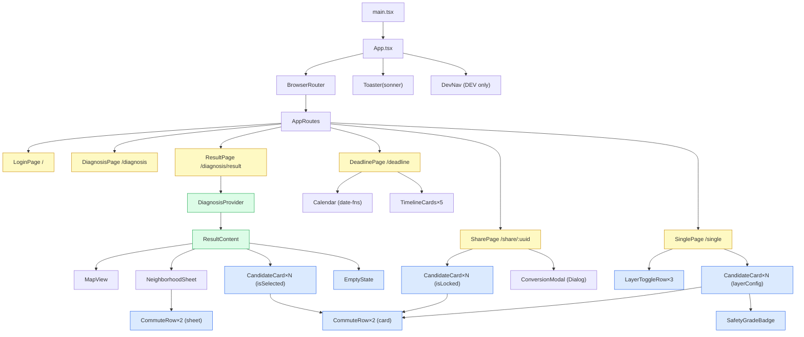
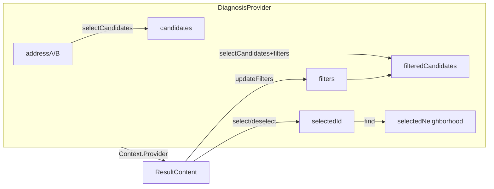

# COMPONENT_STRUCTURE.md — 컴포넌트 구조 현황 및 분석

> **기준일:** 2026-04-27 (리팩토링 완료 후)

---

## 1. 컴포넌트 계층 차트



**범례:** 🔵 공유 컴포넌트 · 🟡 페이지 · 🟢 Context

---

## 2. 공유 컴포넌트 사용 현황

| 컴포넌트 | 사용처 | props 분기 키 |
|---------|-------|--------------|
| `CandidateCard` | Result · Share · Single | `isSelected / isLocked / layerConfig` |
| `CommuteRow` | CandidateCard · NeighborhoodSheet | `variant: 'card' \| 'sheet'` |
| `SafetyGradeBadge` | CandidateCard (Single) | `grade: A\|B\|C\|D` |
| `EmptyState` | ResultPage | `onRelaxTime / onRelaxBudget` |
| `LayerToggleRow` | SinglePage ×3 | `checked / onCheckedChange` |

---

## 3. DiagnosisContext 상태 흐름



---

## 4. 파일 구조

```
src/
├── app/
│   ├── App.tsx
│   ├── routes.tsx
│   ├── context/
│   │   └── DiagnosisContext.tsx   ← 신규
│   ├── components/
│   │   ├── shared/                ← 신규 (5개)
│   │   │   ├── CandidateCard.tsx
│   │   │   ├── CommuteRow.tsx
│   │   │   ├── SafetyGradeBadge.tsx
│   │   │   ├── EmptyState.tsx
│   │   │   └── LayerToggleRow.tsx
│   │   ├── MapView.tsx
│   │   ├── NeighborhoodSheet.tsx
│   │   └── DevNav.tsx
│   └── pages/ (6개 페이지)
└── lib/
    ├── types/neighborhood.ts      ← 신규 (타입 SSOT)
    └── mocks/candidates.ts
```

---

## 5. 코드 규모 비교

| 파일 | 전 (줄) | 후 (줄) | 변화 |
|------|---------|---------|------|
| `ResultPage.tsx` | 207 | 145 | −62 (−30%) |
| `SharePage.tsx` | 132 | 95 | −37 (−28%) |
| `SinglePage.tsx` | 212 | 150 | −62 (−29%) |
| `NeighborhoodSheet.tsx` | 83 | 72 | −11 (−13%) |
| 신규 shared/* (5개) | — | +220 | +220 |
| 신규 Context | — | +90 | +90 |
| 신규 타입 파일 | — | +100 | +100 |

> 총 줄 수는 증가했으나 **중복 제거 ~130줄**, 재사용성·테스트 가능성 대폭 향상.

---

## 6. 완료된 개선 vs 남은 개선

### ✅ 완료

| 항목 | 방법 |
|------|------|
| CandidateCard 중복 (×3) | `shared/CandidateCard.tsx` 추출 |
| CommuteRow 중복 (×2) | `shared/CommuteRow.tsx` 추출 |
| Props Drilling (3단계) | `DiagnosisContext` 도입 |
| 타입 분산 선언 | `lib/types/neighborhood.ts` SSOT |
| DevNav 프로덕션 포함 | `import.meta.env.DEV` 가드 |
| SharePage URL 버그 | Demo fallback + 배너 |
| SinglePage 알고리즘 버그 | `(직장, 여가거점1)` 분리 |

### 🔶 남은 개선 (실 서비스 연동 시)

| 항목 | 우선순위 |
|------|---------|
| `MapView` → react-kakao-maps-sdk 교체 | P0 |
| 주소 입력 → 카카오 주소 검색 API | P0 |
| 공유 UUID → 서버 파라미터 복원 | P2 |
| 싱글 모드 → N개 여가 거점 가중 계산 | P2 |
| 테스트 코드 (TEST-001~010) | P2 |
