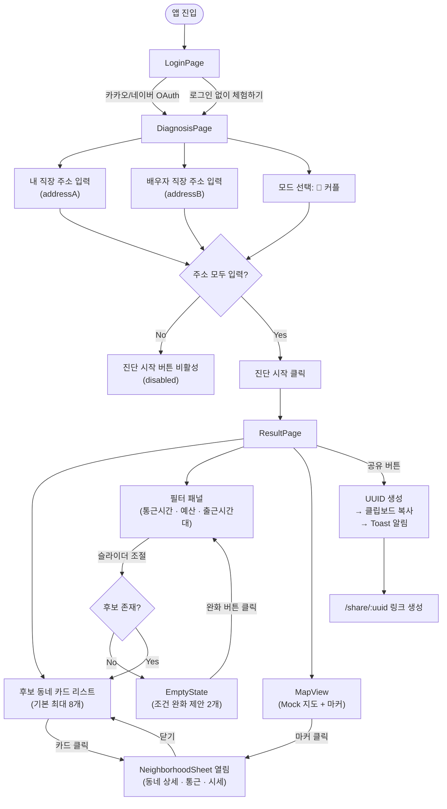
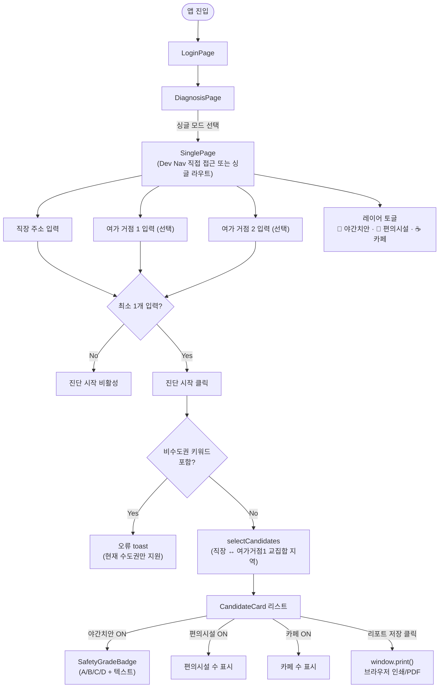
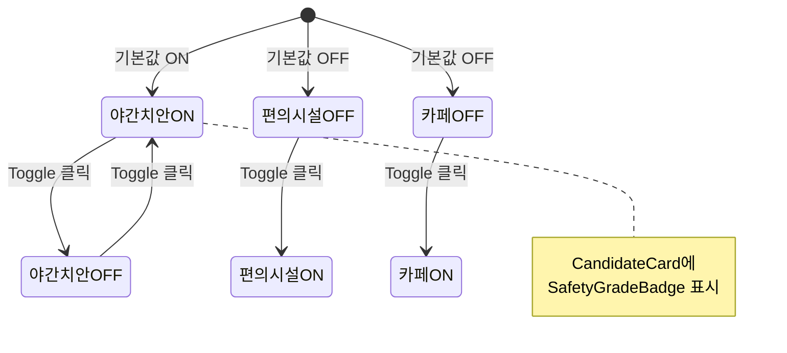
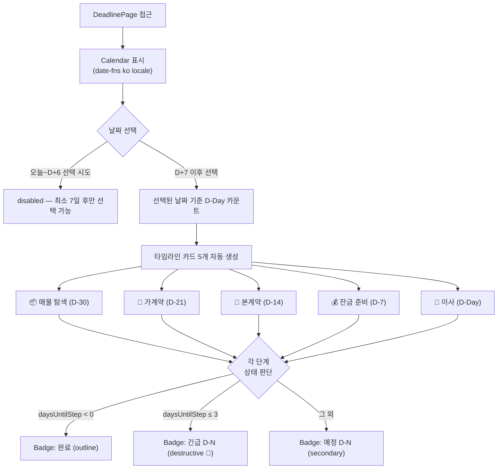
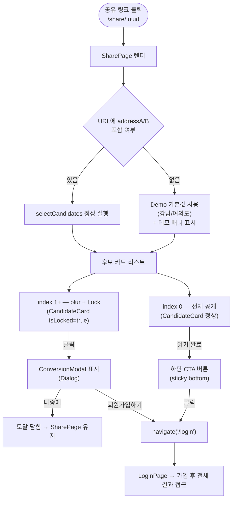
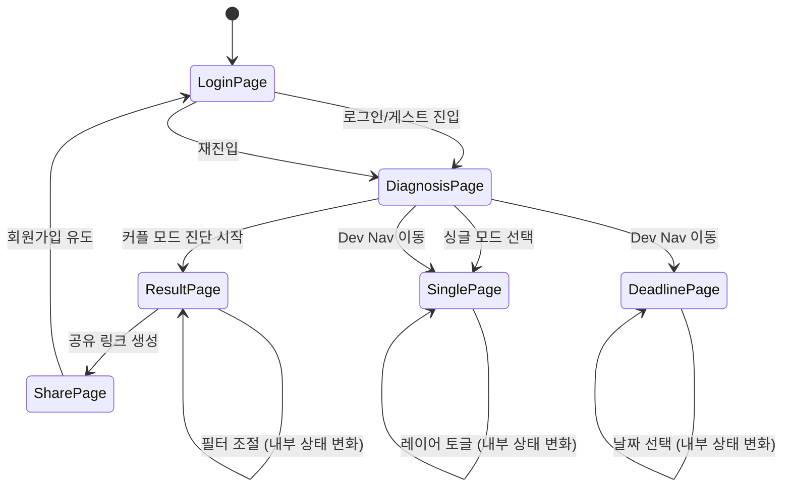

# UX_FLOW.md — 핵심 UX 시나리오

> **대상 프로토타입:** `Ondayuiprototypefigma`  
> **기반 기획:** `firebase-ui-prompt.md` · SRS v1.6  
> **작성일:** 2026-04-27

---

## 페르소나

| 페르소나 | 설명 | 주요 사용 모드 |
|---------|------|--------------|
| **박지현 (30, 직장인)** | 남자친구와 함께 이사할 동네를 찾는 커플 | 커플 모드 |
| **김민수 (27, 1인 가구)** | 직장 + 주말 카페 거점 근처로 이사 희망 | 싱글 모드 |
| **이수진 (35, 기혼)** | 계약 만료 전 신속 이사 계획 수립 필요 | 마감일 모드 |
| **공유 링크 수신자** | 지인에게 공유받은 진단 결과를 보는 비회원 | 공유 리포트 |

---

## 시나리오 1 — 커플 모드 (메인 플로우)

### 목표
두 직장의 중간 지점 기준으로 커플이 함께 살기 적합한 동네를 찾는다.

### 흐름도



### 주요 인터랙션 포인트

| 단계 | 컴포넌트 | UX 고려사항 |
|------|----------|------------|
| 주소 입력 | `Input` | 자동완성 미구현 (실 서비스에서 카카오 주소 검색 API 연동 필요) |
| 이전 조건 불러오기 | `Button` | Mock 하드코딩 값 사용 (실 서비스: localStorage/서버 저장) |
| 필터 조절 | `Slider` × 2 | 실시간 반응, debounce 없음 (후보 수 변화 즉시 표시) |
| 마커 클릭 | `MapView` | 카드 클릭과 동일한 `select(id)` 호출로 Sheet 동기화 |
| Sheet 표시 위치 | `NeighborhoodSheet` | 모바일: 하단 슬라이드 업 / 데스크탑(md+): 우측 400px |

---

## 시나리오 2 — 싱글 모드

### 목표
1인 가구가 직장 + 여가 거점(카페·운동 등)을 모두 고려해 동네를 찾는다.

### 흐름도



### 레이어 토글 UX



---

## 시나리오 3 — 마감일 모드

### 목표
이사 계약 만료일이 정해진 사용자가 역산 타임라인으로 준비 일정을 확인한다.

### 흐름도



### 상태 배지 시각적 구분

| 상태 | 조건 | 배지 variant | 색상 |
|------|------|-------------|------|
| 완료 | 해당 일자 지남 | `outline` | 회색 |
| 긴급 | D-3 이내 | `destructive` | 빨강 |
| 예정 | 그 외 | `secondary` | 회색 |

---

## 시나리오 4 — 공유 링크 유입 (비회원 전환 플로우)

### 목표
공유받은 링크로 진입한 비회원이 첫 번째 후보 동네를 확인하고, 추가 정보를 보기 위해 회원가입을 유도한다.

### 흐름도



### 전환 퍼널

```
공유 링크 클릭 (100%)
    ↓
SharePage 접속 (100%)
    ↓
1번 카드 열람 (100%)
    ↓
잠금 카드 클릭 / CTA 클릭 (전환 관심도 측정 포인트)
    ↓
모달 → 회원가입 클릭 (전환율 목표 지점)
    ↓
LoginPage → 가입 완료 → ResultPage (최종 전환)
```

---

## 전체 페이지 상태 전이도



---

## UX 개선 사항 (실 서비스 연동 시)

| 항목 | 현재 (프로토타입) | 개선 방향 |
|------|-----------------|----------|
| 주소 입력 | 자유 텍스트 | 카카오 주소 검색 API (자동완성 + 지도 PIN) |
| 이전 조건 불러오기 | 하드코딩 Mock | Supabase DB 또는 localStorage 연동 |
| 지도 | SVG Mock | react-kakao-maps-sdk 실제 지도 |
| 공유 링크 | UUID + URL query | UUID → 서버 파라미터 복원 (Supabase) |
| 회원 상태 | 없음 (바이패스) | Supabase Auth (Google/Kakao OAuth) |
| 싱글 모드 | 단일 교집합 계산 | 직장+여가거점 N개 가중 중심점 계산 |
