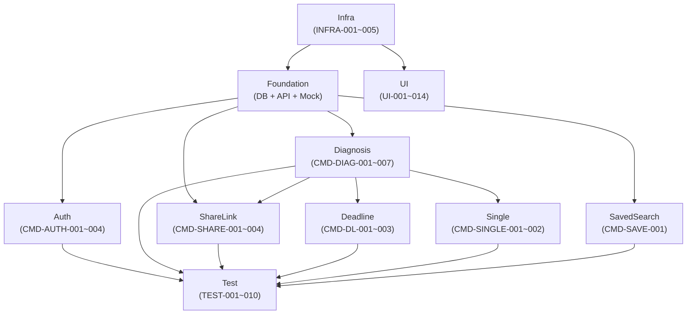

# 도메인 간 의존성 (Domain Dependencies)

## 정의

10개 도메인 간의 의존성 관계와 핵심 unblock 경로를 정리한 페이지. Critical Path 분석과 병렬 실행 계획의 근거.

## 의존성 다이어그램



## 핵심 의존성 6가지

| # | 의존성 | Unblock 대상 | 우선순위 |
|---|---|---|---|
| 1 | **INFRA-005** (Vercel AI SDK 설정) | CMD-DIAG-003 (AI 스코어링) | 🔴 Critical |
| 2 | **INFRA-004** (shadcn/ui 디자인 시스템) | UI-001~014 (14개 UI 태스크 전체) | 🔴 Critical |
| 3 | **SEC-002** (Rate Limiting) | CMD-SHARE-004 마이그레이션 follow-up | 🟡 Medium |
| 4 | **DB-001** (Prisma 초기화) | DB-002~007 전체 스키마 (출발점) | 🔴 Critical |
| 5 | **API-006** (공통 에러 코드) | API-001~005 + adaptLegacyMap() | 🟡 Medium |
| 6 | **CMD-DIAG-002 ↔ CMD-DIAG-006** | 병렬 호출에 타임아웃 정책 적용 (보강 관계) | 🟡 Medium |

## Critical Path

```
INFRA-001 → DB-001 → DB-002 → DB-003 → API-002 → CMD-DIAG-001 → CMD-DIAG-002 → CMD-DIAG-004 → CMD-SHARE-001 → TEST-001
```

## 병렬 실행 가능 트랙

| 트랙 | 내용 | 선행 조건 |
|---|---|---|
| UI 전체 | UI-001~014 | INFRA-004, MOCK-001~005 |
| Auth | CMD-AUTH-001~004 | DB-007, API-001 |
| 보안/모니터링 | SEC-002, MON-001 | INFRA-001 |
| AI | INFRA-005 → CMD-DIAG-003 | INFRA-001 |

## 관련 페이지

- Concepts: [[task-domains-overview]], [[srs-v1.6-changes]], [[architecture-patterns]]
- Sources: [[src-task-list]], [[src-implementation-plan]]
- Domains: [[domain-foundation]], [[domain-infra]], [[domain-auth]], [[domain-diagnosis]], [[domain-sharelink]], [[domain-deadline]], [[domain-single]], [[domain-savedsearch]], [[domain-ui]], [[domain-test]]
