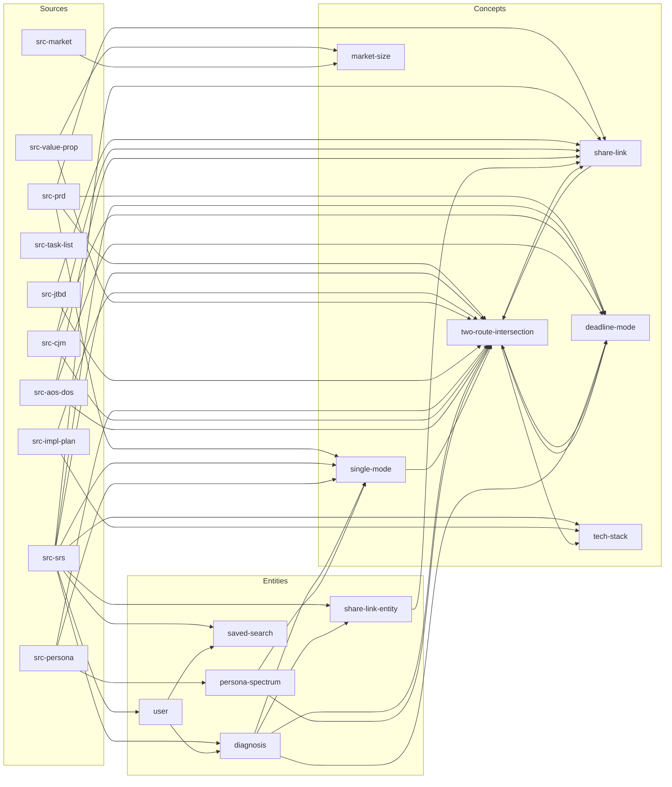

# Wiki 지식베이스 Ingest 완료 보고서

> **프로젝트:** 동네궁합진단기 (my-동네궁합진단기-workbase)
> **작업일:** 2026-04-23
> **방법론:** [llm-wiki.md](file:///Users/mihee/기획개발강의/my-동네궁합진단기-workbase/llm-wiki.md) 기반

---

## 📊 구축 결과 요약

| 카테고리 | 페이지 수 | 상세 |
|---|---|---|
| **Meta** | 4 | `_schema.md`, `index.md`, `log.md`, `overview.md` |
| **Sources** | 13 | 원본 13개 문서 → 13개 요약 페이지 (✅13) |
| **Entities** | 5 | User, Diagnosis, ShareLink, SavedSearch, PersonaSpectrum |
| **Concepts** | 6 | F1 교차진단, F2 공유링크, F3 데드라인, F4 싱글, 기술스택, 시장규모 |
| **총 페이지** | **28** | |

---

## 🏗️ 디렉토리 구조

```
wiki/
├── _schema.md              ← Wiki 운영 규칙 (LLM 에이전트 지침)
├── index.md                ← 전체 카탈로그 (Query 진입점)
├── log.md                  ← 시간순 이력
├── overview.md             ← 프로젝트 한 페이지 요약
│
├── sources/                ← 원본 문서 요약 (13개)
│   ├── src-prd.md
│   ├── src-srs.md
│   ├── src-task-list.md
│   ├── src-implementation-plan.md
│   ├── src-value-proposition.md
│   ├── src-jtbd.md
│   ├── src-market-analysis.md
│   ├── src-persona.md
│   ├── src-cjm.md
│   ├── src-aos-dos.md
│   ├── src-problem-definition.md
│   ├── src-competitor-analysis.md
│   └── src-ksf.md
│
├── entities/               ← 도메인 엔터티 (5개)
│   ├── user.md
│   ├── diagnosis.md
│   ├── share-link-entity.md
│   ├── saved-search.md
│   └── persona-spectrum.md
│
└── concepts/               ← 비즈니스·기술 개념 (6개)
    ├── two-route-intersection.md   ← F1 핵심 (AOS 4.00)
    ├── share-link.md               ← F2 바이럴 루프
    ├── deadline-mode.md            ← F3 긴급 이사
    ├── single-mode.md              ← F4 싱글
    ├── tech-stack.md               ← Next.js + Supabase + Vercel
    └── market-size.md              ← TAM-SAM-SOM
```

---

## 🔗 페이지 간 교차 참조 네트워크



---

## ⚠️ 발견된 이슈

| # | 이슈 | 영향 | 조치 |
|---|---|---|---|
| 1 | `1_porters-foreces.md` 원본 미완성 | Porter's 5 Forces 분석 부재 | ✅ 폐기 처리 (2026-04-23) → `src-problem-definition.md`에 통합 |
| 2 | `3_value-chain.md` 원본 미완성 | 가치 사슬 분석 부재 | ✅ 폐기 처리 (2026-04-23) → `src-ksf.md`에 통합 |
| 3 | `saved-search-concept.md` 누락 | F5 간이 저장 concept 페이지 미생성 | 다음 Lint 시 추가 |

---

## 🔜 다음 단계 (추천)

> [!TIP]
> 아래 작업들은 `_schema.md`의 워크플로우에 따라 LLM 에이전트에게 지시하면 자동 수행됩니다.

1. **Lint 패스** — 교차 참조 누락, 고아 페이지, 페이지 간 모순 검사
2. **F5 Concept 페이지 추가** — `concepts/saved-search-concept.md`
4. **Obsidian 연동** — wiki 폴더를 Obsidian vault로 열면 `[[링크]]`와 Graph View 즉시 활용 가능
